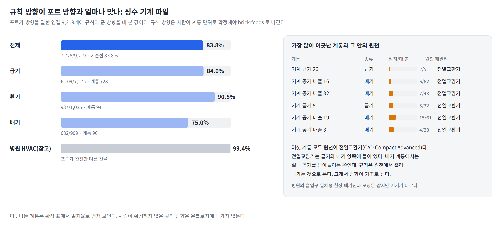
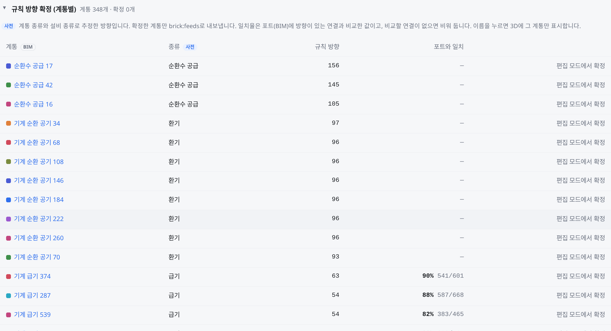
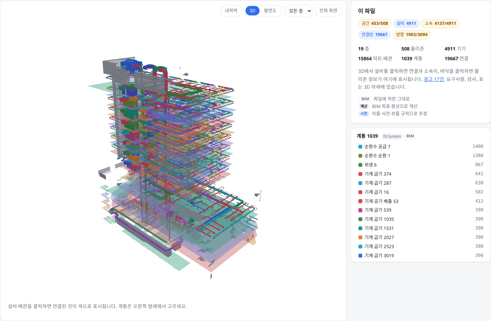
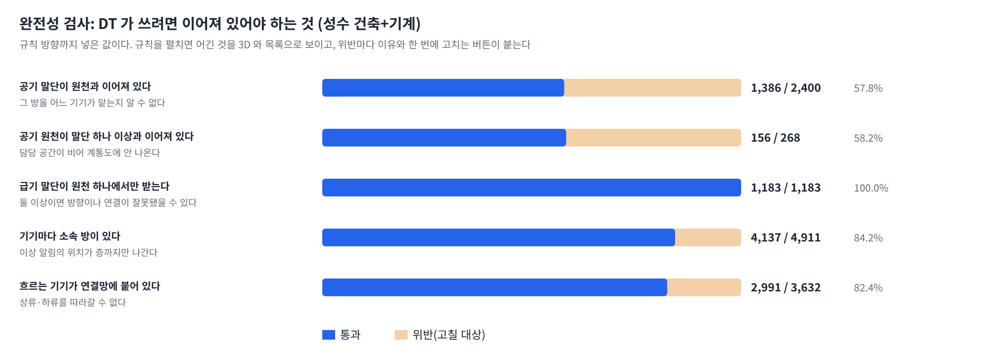
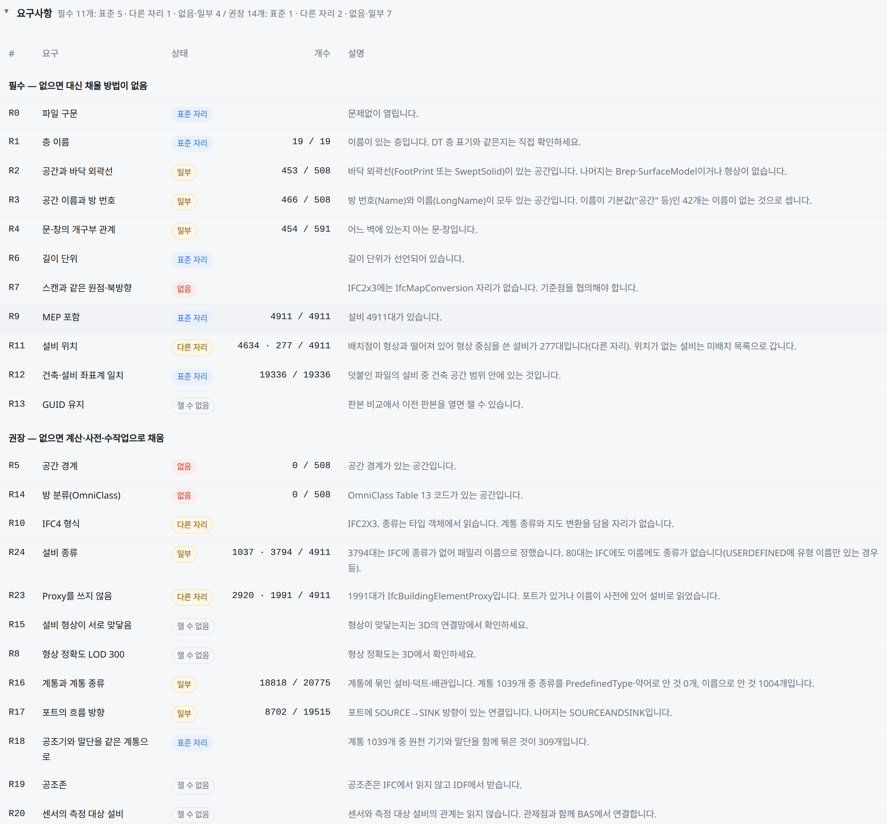
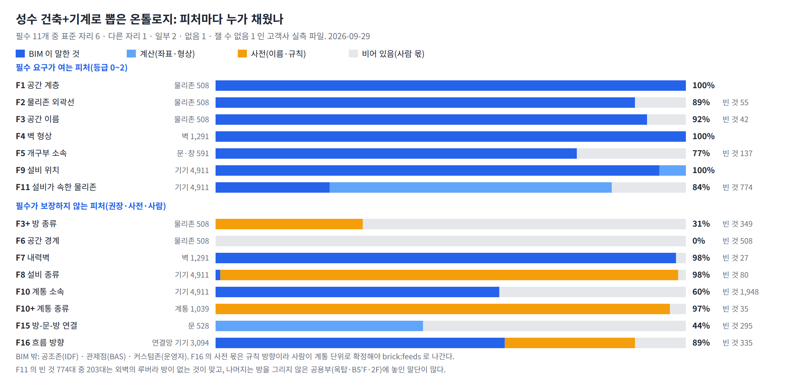
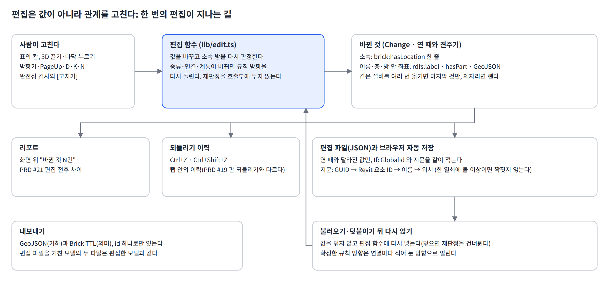
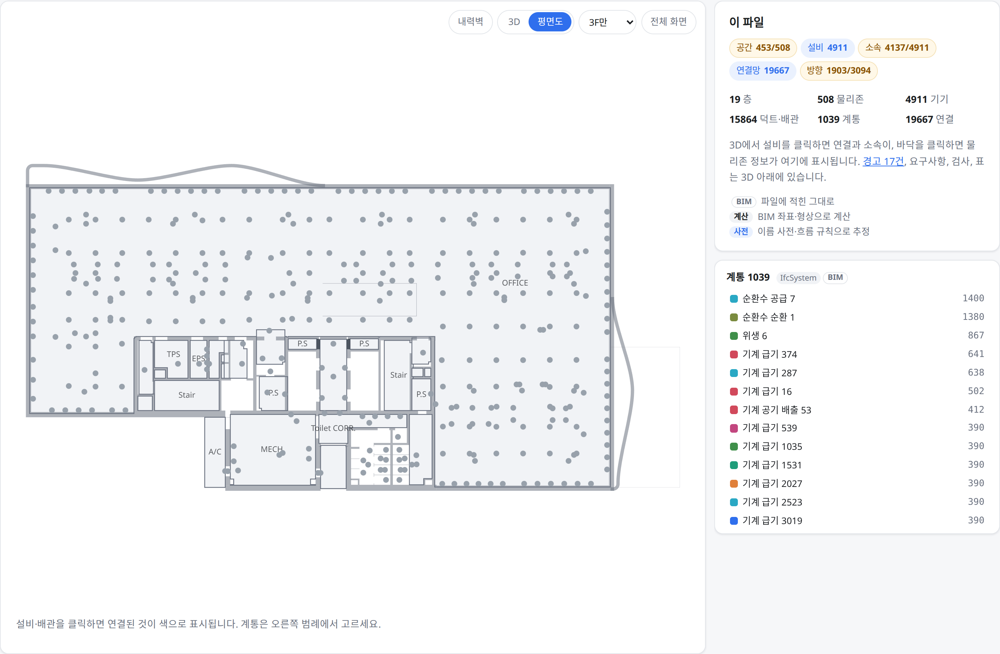
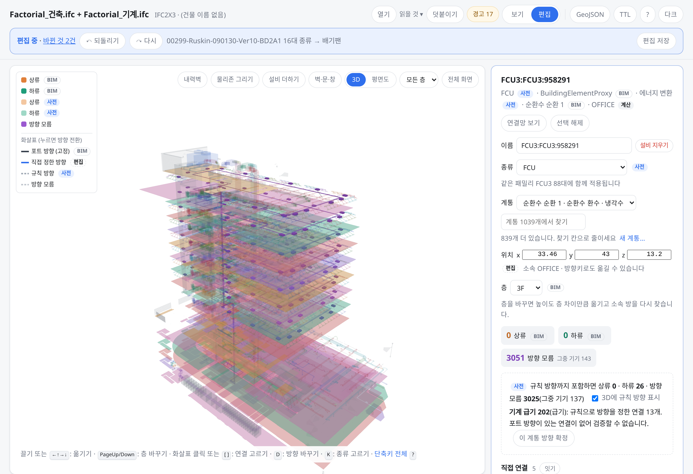
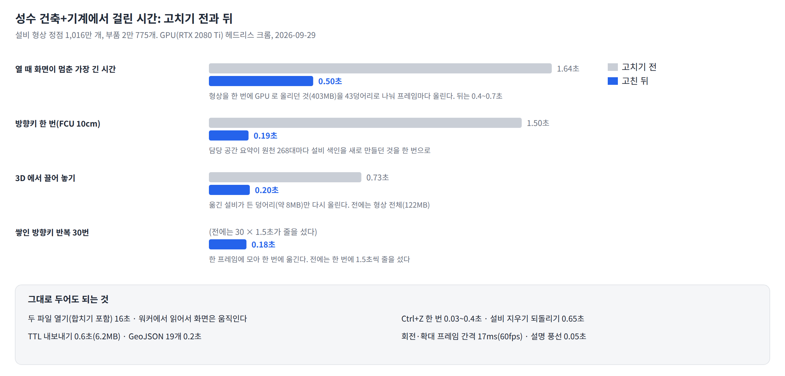

# BIM으로 DT 온톨로지를 어디까지 만들 수 있나

기준일: 2026-09-29 · 관련 문서: PRD_011 정본 [`docs/prd/PRD_011.md`](prd/PRD_011.md)(이 문서의 PRD 기능 번호 #1~#26은 그
3장 Epic 색인을, 티켓은 `prd/features/` 를 가리킨다) · PM 공유용 요약: `docs/pm-brief.md`

이 문서는 세 가지 질문에 답한다.

1. DT가 쓰려면 온톨로지에 무엇이 있어야 하는가(피처 F1~F16, 2장)
2. 그중 BIM에서 실제로 얻을 수 있는 것은 어디까지이고, 나머지는 어디서 채우는가(실측·등급·출처, 3장)
3. 이를 위해 고객사 BIM에 최소한 무엇이 들어 있어야 하는가(요구사항 R0~R24, 4장)

여기에 만든 온톨로지를 고치는 편집 기능(6장)이 더해진다. 피처의 절반은 BIM에서 나오지 않고, BIM에서 나온 것도
현장과 다를 수 있기 때문이다.

**등급표와 요구사항은 이 문서에만 둔다.** 문서의 수치는 모두 이 저장소의 코드로 다시 측정할 수 있다(부록 B).
파일별 상세 실측은 `docs/ifc-coverage.md`에, 참고 문헌은 부록 E에 있다.

---

## 0. 요약

1. **공간 골격은 BIM만으로 만들어진다.** 층, 물리존, 외곽선, 면적, 이름, 벽·문·창, 공간 경계가 실제 모델에서 모두 나온다.
2. **설비가 어느 방에 있는지(F11)는 계산으로 구한다.** 건축 파일에는 설비가 없고 설비 파일에는 방이 없다. 두 파일을
   합친 뒤 좌표로 판정하며, 합치려면 두 파일의 층 이름과 좌표계가 같아야 한다.
3. **종류는 사전으로 채운다.** 설비·계통·방의 종류가 BIM의 표준 위치에 적혀 있는 경우가 드물다. 그래서 도메인 지식을
   담은 이름 사전으로 채우고, 사전으로도 알 수 없는 것은 사람이 정한다.
4. **흐름 방향은 포트에 적혀 있을 때만 확실하다.** 적혀 있지 않으면 계통과 설비의 종류로 방향을 추정하되(규칙 방향),
   사람이 확정한 것만 내보낸다.
5. **공조존과 관제점은 BIM에서 나오지 않는다.** IFC에 담을 자리는 있지만 실제 파일은 비어 있었다. 공조존은 IDF에서,
   관제점은 BAS에서 받는다.

**고객사 BIM에 요구할 항목은 필수 11개, 권장 14개다**(4장). 필수 항목은 등급 0~2, 즉 탐색기 트리·3D Map·이상 알림의
발생 위치에 필요하고, 빠지면 우리가 복원할 수 없는 것이다. **고객사 BIM은 대부분 등급 1~3에 그칠 것으로 본다**(3.5).

**필수를 지킨 BIM으로 뽑으면 공간 골격과 설비의 위치·소속(F1~F5, F9, F11)은 사람 손 없이 채워진다**(3.9). 필수를 일부만
지킨 고객사 파일(성수: 필수 11개 중 표준 자리 6개)에서도 이 피처들이 77~100% 자동으로 채워졌다. 빈 곳은 필수를 덜 지킨
몫(외곽선 없는 방 55개, 기본 이름 "공간" 42개, 벽에 걸리지 않은 문·창 137개)과 방을 그리지 않은 공용부의 설비(571대)다.
종류·계통·흐름 방향은 필수가 보장하지 않는다. 종류는 사전이 대부분 채우지만(설비 98%, 계통 97%, 방 31%), 흐름 방향은 포트가
말한 62% 밖의 28%를 사람이 확정해야 온톨로지에 들어간다.

주간보고 W39의 질문에 대한 답은 다음과 같다.

- BIM 스펙은 4장의 필수·권장 표다. PRD #6의 ①~⑦과 어떻게 대응하는지는 4.5에 정리했다.
- 1안(고객사가 다시 올리도록 유도)과 2안(에디터로 보완) 중 하나를 고르지 않는다. **빠진 정보의 종류에 따라 나눈다**(4.4).

---

## 1. BIM과 IFC 기초

### 1.1 용어

BIM, Revit, IFC, MEP, Level, 공유 좌표, LOD는 PRD_011의 용어집([`prd/glossary.md`](prd/glossary.md))과 기획 문서 「고객사 대상 BIM 요구사항 정의」 3장을 따른다.

| 용어 | 이 문서에서의 뜻 |
|---|---|
| IFC 엔티티 | IFC 파일 안의 객체 종류. `IfcSpace`(방), `IfcWall`(벽)처럼 `Ifc`로 시작한다 |
| GlobalId(GUID) | 객체마다 붙는 22자 식별자. 새로 만드는 온톨로지의 id로 그대로 쓴다(기존 온톨로지 id와의 대응은 5장) |
| 물리존 | `IfcSpace` 하나. PRD의 물리존과 같은 뜻이다 |
| 설비 · 기기 · 도관 | 설비는 `IfcDistributionElement` 아래의 모든 요소다. 그중 덕트·배관 구간과 이음쇠가 도관이고, 나머지가 기기다 |
| 계통 | 공조기 → 덕트 → 토출구처럼 하나의 흐름으로 묶인 설비의 집합(`IfcSystem`) |
| 포트 | 설비 끝에 달린 접속구(`IfcDistributionPort`). 포트 두 개가 이어진 것이 연결 하나다 |
| 온톨로지 | 공간·설비·관제점 사이의 관계를 담은 그래프. Brick 어휘로 Turtle(TTL) 파일에 쓴다 |

### 1.2 IFC 파일의 생김새

IFC 파일은 텍스트 파일이다. **한 줄이 객체 하나이고, 객체 사이의 관계도 한 줄짜리 객체로 적힌다.** Revit·ArchiCAD 같은
저작 도구가 이 파일을 내보내고, 우리는 web-ifc로 읽어 객체 그래프로 복원한다.


*그림 1. AC20-FZK-Haus 파일의 실제 줄(왼쪽)과 거기서 복원한 구조(오른쪽)*

공간은 프로젝트 > 대지 > 건물 > 층 > 방의 계층을 이룬다. **층과 방은 분해 관계(`IfcRelAggregates`)로, 층과 벽·문·창은
포함 관계(`IfcRelContainedInSpatialStructure`)로 묶인다.** 똑같이 "층에 속한다"는 뜻인데 관계가 두 가지라서, 한쪽만
읽으면 절반이 빠진다.

### 1.3 분야별로 파일이 나뉜다

**같은 건물이라도 건축 모델과 설비(MEP) 모델은 따로 만든다.** 건축 파일에는 층·방·벽은 있지만 설비가 없다. 설비
파일에는 설비·계통·포트는 있지만 방이 없거나, 있더라도 건축 방을 복사한 것이다. 공개 BIM 네 개를 확인해 보니 두 개는
설비가 하나도 없었고, 나머지 두 개의 설비는 타월 디스펜서·거울·소화기함이었다. **"BIM이 있다"가 "설비 정보도 있다"를
뜻하지는 않는다.**


*그림 2. 건축 파일과 설비 파일을 합쳐야 설비가 속한 물리존(F11)을 알 수 있다*

**같은 방이 두 번 들어 있는 경우도 흔하다.** Revit 설비 파일은 건축 Room의 복사본과 MEP Space를 함께 내보낸다
(Duplex MEP는 42개 중 20쌍). 건축 파일에도 이름 붙은 방마다 기본 이름("공간")으로 된 복사본이 하나씩 더 있는 경우가
있었다(성수 425개). 에디터는 파일을 열 때 외곽선이 같으면서 이름이나 방 번호로 보아 같은 방인 쌍, 또는 한쪽 이름이
기본 이름인 쌍을 하나로 합친다. 외곽선만 같은 경우는 합치지 않는다. 병원의 지붕 `R-Roof`와 `R-AT1 Roof`는 외곽선이
같지만 서로 다른 공간이다.

### 1.4 방의 외곽선과 좌표

물리존의 바닥 외곽선을 **어떤 표현 형식으로 저장하는지는 저작 도구마다 다르다.**

| 표현 형식 | 사용하는 도구 | 우리가 읽는가 |
|---|---|---|
| `FootPrint`(바닥 윤곽선) | ArchiCAD | 읽는다 |
| `Body/SweptSolid`(바닥 단면을 위로 밀어 올린 입체) | Revit | 읽는다. 단면이 곧 바닥 외곽선이다 |
| `Body/Brep`, `SurfaceModel` | 일부 | 읽지 않는다 |
| 형상 표현 없음 | COBie 교환 판본 | 읽을 것이 없다 |

좌표는 부모 객체를 기준으로 한 상대 좌표라서, 배치 사슬(`IfcLocalPlacement`)을 끝까지 따라가야 절대 좌표를 얻는다.
길이 단위도 파일마다 달라서(미터·밀리미터·피트) 파일에 선언된 단위(`IfcUnitAssignment`)로 환산한다. **둘 중 하나라도
틀리면 오류 없이 결과만 틀린다.** 방이 모두 원점에 겹치거나 좌표가 1,000배로 커질 뿐이다.

### 1.5 역할, 포트, 계통, 종류

**역할.** 설비가 소스인지, 싱크인지, 도관인지는 IFC 클래스 계층만 보고도 알 수 있다. 모든 설비 요소가 이 중 하나에
속하므로, 포트나 계통 정보가 없어도 역할은 알 수 있다. 그리고 **설비의 대부분은 기기가 아니라 도관이다.**


*그림 3. IFC 클래스 계층이 곧 역할 분류다. Duplex MEP의 설비 926개 중 785개(85%)가 도관이다*

**포트와 흐름 방향.** 포트마다 `FlowDirection` 값이 있다. 한쪽이 SOURCE이고 다른 쪽이 SINK이면 흐름 방향을 알 수 있다.
양쪽 모두 `SOURCEANDSINK`이면 이어져 있다는 것만 알 수 있다.


*그림 4. 포트에 방향이 있는 경우, 중간 포트가 SOURCEANDSINK인 경우, 포트가 없는 경우*

**계통.** `IfcSystem`이 설비를 계통으로 묶는다. Revit은 `IfcSystem` 대신 `System Name` 속성만 남기기도 한다.

**종류와 IFC 버전.** IFC4는 `IfcAirTerminal`처럼 구체적인 클래스로 설비 종류를 나타낸다. IFC2x3에서는 개체가
`IfcFlowTerminal` 같은 추상 클래스로만 나오지만, 개체에 연결된 **타입 객체**(`IfcAirTerminalType`)에 구체 클래스와
`PredefinedType`이 들어 있다. 다만 Revit은 값을 모르면 USERDEFINED로 두고 유형 이름(`150 mm`)만 적기 때문에, 타입
객체만으로 종류를 모두 알 수는 없다.

**속성(Pset).** 표준 속성 세트 이름(`Pset_WallCommon.LoadBearing` 등)이 정해져 있지만, 실측한 Revit 파일은 모두
`PSet_Revit_*` 같은 비표준 이름으로 내보냈다.

### 1.6 우리가 내보내는 것

**기하와 의미를 두 파일로 나눠 내보내고, 같은 id(IfcGlobalId) 하나로 연결한다.** GeoJSON에는 물리존 외곽선, 벽·문·창,
설비 좌표가 들어가고, Brick TTL에는 공간 계층, 설비 소속, 흐름 연결이 들어간다. TTL에는 좌표를 넣지 않는다(이유는 부록 C).


*그림 5. 임포트 → 검토·편집 → GeoJSON(기하)과 Brick TTL(의미)*

TTL에서 쓰는 술어는 `brick:hasPart`, `brick:hasLocation`, `brick:feeds`, `brick:hasPoint` 네 가지다. 기존 SR 온톨로지가
이 네 가지만 쓰기 때문에, DT 쪽 파서(`ieum-pipeline`의 `ttl.go`)가 읽을 수 있도록 맞췄다. 용량만은 양의 종류에 따라 술어를
따로 둔다(4.6). 내보낸 파일은 표준 Turtle 파서(rdflib)와 GeoJSON 검사를 통과했다(2026-09-25).

---

## 2. DT가 온톨로지에서 필요로 하는 것: 피처 F1~F16

DT 화면이 무엇을 묻는지 적어 보면, 온톨로지가 어떤 관계를 갖고 있어야 하는지가 나온다. 그 관계를 BIM에서 얻을 수
있는지가 3장의 내용이다.

| 사용처 | 질문 | 필요한 관계 |
|---|---|---|
| 이상 알림 | 이 설비는 어디에 있는가 | 설비 → 물리존 |
| 탐색기 트리 | 건물은 어떤 구조인가 | 사이트 → 건물 → 층 → 물리존 |
| 3D Map | 이 공간을 어떻게 그리는가 | 물리존의 외곽선과 높이 |
| 계통도 | 이 공조기가 담당하는 공간은 어디인가 | 설비 → 계통 → 공조존 |
| AI Agent | 회의실 온도는 몇 도인가 | 공간 이름 → 설비 → 관제점 |
| 로봇 관제 | 이 경로로 지나갈 수 있는가 | 벽·문·창의 통과 가능 여부 |

**피처의 절반은 건축 BIM이 아닌 곳에서 온다.**


*그림 6. 피처 16개를 출처별로 나눈 것*

| # | 피처 | 관계·속성 | 출처 |
|---|---|---|---|
| F1 | 공간 계층 | `brick:hasPart` (사이트 > 건물 > 층 > 물리존) | BIM |
| F2 | 물리존 기하 | 외곽선 다각형, 면적 | BIM |
| F3 | 공간 이름 | `rdfs:label`, 방 번호 | BIM |
| F4 | 벽·문·창 형상 | 위치, 두께, 개구부 치수 | BIM |
| F5 | 개구부 소속 | 문·창이 어느 벽에 나 있는가 | BIM |
| F6 | 공간 경계 | 물리존을 둘러싼 부재 | BIM |
| F7 | 내력벽 | `loadBearing` | BIM(속성을 기입한 경우에만) |
| F8 | 설비 목록 | 종류, 이름, 용량 | BIM(MEP를 포함한 경우에만) |
| F9 | 설비 위치 | x·y·z | BIM(MEP를 포함한 경우에만) |
| F10 | 계통 | 공조기 → 덕트 → 토출구 | BIM(MEP를 포함한 경우에만) |
| F11 | 설비가 속한 물리존 | `brick:hasLocation` | **계산으로 만든다** |
| F12 | 공조존 | `brick:HVAC_Zone`, 담당 관계 | IDF. IFC에 자리(`IfcZone`)는 있지만 실제 값이 없다 |
| F13 | 관제점 | `brick:hasPoint` | BAS. 센서 장치 자체는 BIM에 있을 수 있다 |
| F14 | 커스텀존 | 운영자가 지정하는 다각형 | 사용자 |
| F15 | 로봇 통과 여부 | 문은 통과 가능, 창과 벽은 불가. 방-문-방 연결 | F4·F6에서 파생 |
| F16 | 설비 연결(상류·하류) | `brick:feeds` | BIM(포트에 흐름 방향이 있을 때만). 없으면 규칙으로 추정하고 사람이 확정한다 |

**이 과제의 핵심은 F11이다.** BIM에는 설비의 좌표와 물리존의 외곽선은 있지만 "이 공조기는 회의실에 있다"는 정보는 없다.
F11이 없으면 이상 알림에 발생 위치를 표시할 수 없고, 탐색기 트리에 설비를 걸 수 없다.

**F12·F13은 "IFC에 없는" 정보가 아니라 "IFC에 자리는 있지만 실제 파일에서 비어 있는" 정보다.** 공조존은 `IfcZone`·
`IfcSpatialZone`이나 Revit의 `VentilationZoneName`에 담을 수 있지만, 실측 파일에는 템플릿 기본값만 들어 있었다. 관제점
ID는 BAS가 관리한다. 고객사에 요구하면 일부는 BIM에서 받을 수도 있다(R19·R20).

---

## 3. BIM에서 실제로 얻을 수 있는 것

### 3.1 규격, 임포터, 실제 파일

IFC 규격이 담을 수 있는 것, 우리 임포터가 읽는 것, 실제 파일에 들어 있는 것은 서로 다르다. 실측 열은 따로 밝히지
않으면 AC20-FZK-Haus의 값이다.

| 피처 | IFC4 규격 | 현재 임포터 | 실측 |
|---|---|---|---|
| F1 공간 계층 | `IfcBuildingStorey`, `IfcSpace` | 읽는다 | 층 2, 물리존 7 |
| F2 물리존 기하 | `FootPrint` 또는 `Body` | `FootPrint`·`Body/SweptSolid`를 읽는다 | 7개 모두 |
| F3 공간 이름 | `Name`, `LongName` | 읽는다 | 7개 모두 |
| F4 벽·문·창 | `IfcWall`, `IfcDoor`, `IfcWindow`와 형상 | 벽의 평면 외곽선과 문·창 위치를 읽는다 | 벽 13, 문 5, 창 11 |
| F5 개구부 소속 | `IfcRelVoidsElement`, `IfcRelFillsElement` | 읽는다 | 16개 모두 |
| F6 공간 경계 | `IfcRelSpaceBoundary` | 읽는다 | 경계면 66개 |
| F7 내력벽 | `Pset_WallCommon.LoadBearing` | 읽는다 | **0/13. 속성 자체가 없다** |
| F8~F10 설비·계통 | `IfcDistributionElement`, `IfcSystem` | 읽는다 | **0**(건축 파일) |
| F11 설비 소속 | 규격에 없다 | 계산한다 | 해당 없음 |
| F12 공조존 | `IfcZone`, `IfcSpatialZone`. **자리는 있다** | IDF에서 읽는다 | 없음. Duplex에는 템플릿 기본값만 있다 |
| F13 관제점 | 센서는 `IfcSensor`. 관제점 ID는 **IFC에 없다** | 센서를 설비로 읽는다 | ifc4Mep 센서 7개, 설비와 잇는 관계 0 |


*그림 7. AC20-FZK-Haus를 연 3D 화면. 두 층의 물리존 외곽선이 제자리에 놓인다*

**공간 골격은 BIM만으로 충분하다. 설비는 파일에 들어 있어야 읽을 수 있는데, 실제로는 대부분 빠져 있다.** 이것이 가장
큰 제약이다.

### 3.2 건축 모델과 설비 모델은 따로 온다

| 모델 | 스키마 | 물리존 | 설비 | 계통 | 포트 |
|---|---|---|---|---|---|
| AC20-FZK-Haus | IFC4 | 7 | 0 | 0 | 0 |
| C20-Institute | IFC4 | 82 | 0 | 0 | 0 |
| Office_A | IFC2x3 | 99 | 31 | 0 | 0 |
| dental_clinic | IFC2x3 | 269 | 102 | 0 | 0 |
| **ifc4Mep** | **IFC4** | 0 | **2,202** | **37** | **4,232** |
| Duplex COBie | IFC2x3 | 22 | 133 | **10** | 0 |
| Duplex HVAC | IFC2x3 | 1 | 498 | 0 | **970** |
| Duplex MEP | IFC2x3 | 42(**같은 방 21개가 두 번씩**) | 926 | 0 | 0 |

- **물리존과 설비가 둘 다 많은 파일이 없다.** F11을 만들려면 두 파일을 합쳐야 하고, 두 파일이 같은 좌표계를 써야 한다.
- **계통 정보가 든 파일은 드물다.** Duplex는 COBie 판본에만 계통이 있었다. 고객사에 "IFC에 MEP 포함"만 요구하지 말고
  계통 정보도 함께 요구해야 한다.
- **포트가 있으면 연결은 알 수 있지만, 방향까지 알 수 있는 것은 아니다**(3.4).

#### 합치기: 층 이름, 방 번호, 좌표계

**층은 GUID가 아니라 이름으로 맞춘다.** 같은 건물이라도 건축 판본과 설비 판본의 층 GlobalId가 서로 다르다. 방은 방
번호로 맞추고, 건축 판본에서 외곽선이 없는 방은 설비 판본에서 번호가 같은 방의 외곽선을 가져온다. BIM에 이미 적힌
소속은 합칠 때 다시 판정하지 않는다. 좌표로 다시 판정하면 Duplex의 말단 105대 중 41대가 소속을 잃는다.

| 합친 파일 | 합치기 전 | 합친 뒤 |
|---|---|---|
| Duplex 건축 + HVAC | 물리존 1, **기기 40대 모두 소속 없음** | 물리존 21, **기기 40대 모두 소속 있음** |
| Duplex 건축 + MEP | 물리존 42(**같은 방이 두 번씩**) | 물리존 21, BIM에 적힌 소속 167건 유지 |
| FZK-Haus + ifc4Mep(다른 건물) | 해당 없음 | 설비의 2%만 겹쳐 **"좌표계가 다르다"고 경고** |


*그림 8. Duplex 건축 판본에 HVAC 판본을 덧붙인 3D 화면. 설비가 건축 모델의 방 안에 놓인다*

셋째 줄이 R12(건축과 설비가 같은 좌표계)의 근거다. **서로 다른 건물을 합쳐도 오류가 나지 않고, 층끼리 짝도 지어진다.**
좌표가 얼마나 겹치는지 따로 재지 않으면, 설비가 모두 소속 없음으로 나오는 결과만 보고는 원인을 알 수 없다.

**배치점을 좌표로 그대로 믿지 않는다.** Revit이 IFC2x3로 내보낸 덕트 구간은 배치점이 층 원점에 있고 형상만 제자리에
있다(Duplex HVAC 231개 모두). 배치점으로 판정하면 원점이 들어 있는 방에 덕트가 모두 몰린다. 그래서 배치점이 자기 형상에서
0.5m 넘게 떨어져 있으면 형상의 중심을 좌표로 쓰고, 몇 대를 보정했는지 경고로 남긴다.

### 3.3 설비 소속(F11)은 얼마나 정확한가

Duplex MEP에는 설비 167대가 `IfcSpace`에 직접 연결되어 있다. 이 값을 가린 채 좌표만으로 판정하고, 결과를 원래 값과 비교했다.


*그림 9. 좌표가 외곽선 안에 드는지로 판정하고, 외곽선에서 5cm 안에 있는 설비는 가장 가까운 방에 넣는다*

| 판정 방법 | 맞음 | 어느 방에도 들지 않음 | 다른 방 |
|---|---|---|---|
| 점이 외곽선 안에 드는가 | 122(**73.1%**) | 43 | 2 |
| + 외곽선에서 5cm 안이면 가장 가까운 방 | 160(**95.8%**) | 5 | 2 |

**빠진 43대는 벽에 붙은 설비다.** 콘센트와 스위치의 좌표가 정확히 벽면, 곧 방 외곽선 위에 있다. 여유 거리를 30cm까지
넓혀도 "다른 방"은 2대 그대로이고, 5cm를 넘어서면 맞는 수가 더 늘지 않는다. 더 넓히면 비교할 기준값이 없는 벽 속 배관만
방에 들어간다. 병원 건축+HVAC는 BIM에 적힌 소속 2,216건과 비교해 97.4%가 맞았다.

**같은 층의 물리존끼리 겹치기도 한다.** 병원 건축에는 이런 쌍이 52개, Duplex 건축에는 7개 있었다. 큰 대기실 안에 접수대가
들어 있는 식이며, 원본 모델이 그렇게 되어 있다. 겹친 자리에 있는 설비는 **가장 작은 방**에 넣는다. 가진 파일 모두에서
목록의 첫 방을 고를 때보다 BIM에 적힌 소속과 더 잘 맞았다(병원 건축+MEP 584 대 563). 겹침에 대한 경고는 띄우지 않는다.
원래 있던 겹침과 사람이 편집하다 만든 겹침을 구별할 수 없기 때문이다.

**좌표가 없는 설비를 `0,0,0`으로 채우지 않는다.** 그러면 "위치를 모른다"가 "원점에 있다"로 바뀌어, 원점 근처 물리존에
잘못 소속된다. 좌표가 없는 설비는 미배치 목록에 남겨 두고 사람이 배치한다(E6).

### 3.4 연결과 흐름 방향(F16)

설비가 이어져 있다는 것과 **어느 쪽으로 흐르는지**는 다른 문제다(그림 4).

| 모델 | 포트 | 연결 | 방향을 아는 연결 |
|---|---|---|---|
| ifc4Mep(IFC4) | 4,232 | 1,995 | **1,995(100%)** |
| Duplex HVAC(IFC2x3) | 970 | 485 | **190(39%)** |
| Duplex MEP(IFC2x3) | 0 | 0 | 해당 없음 |

Duplex HVAC에서 나머지 61%의 방향을 알 수 없는 것은 Revit이 피팅과 덕트의 포트를 `SOURCEANDSINK`로 내보내기 때문이다.
그래서 요구사항은 "포트를 넣어 달라"가 아니라 "포트에 흐름 방향을 넣어 달라"이다. 그리고 **연결마다 한쪽 포트에만
방향이 있으면 충분하다.** 한쪽이 SOURCE이면 반대쪽은 SINK일 수밖에 없다(Lilis 2025). 포트를 요소에 연결하는 관계는
IFC2x3에서는 `IfcRelConnectsPortToElement`, IFC4에서는 `IfcRelNests`다. 한쪽만 읽으면 다른 버전 파일에서 연결이 0개가 된다.

#### 포트가 없으면 형상으로 추정하고, 방향은 비워 둔다

Duplex MEP에는 포트도 `IfcSystem`도 없다. 대신 Revit의 `System Name` 속성이 남아 있고, 배관 끝의 메시 꼭짓점이 5mm
안에서 맞닿는다. 같은 계통끼리만 이으면 연결 690개가 나온다.


*그림 10. Duplex MEP를 연 3D 화면. 계통별로 색을 나눴다. 포트가 없어서 방향은 알 수 없다*

- **정확도**: 포트 정보가 완전한 ifc4Mep에서 포트를 가리고 형상으로만 추정해 보면 **정밀도 79.5%, 재현율 75.8%**다(5mm
  기준). 허용 거리를 넓히면 재현율은 오르고 정밀도는 떨어진다. **틀린 관계가 들어가는 것이 빠지는 것보다 나쁘므로 5mm를
  유지한다.** 자세한 표는 `docs/ifc-coverage.md` §4.1에 있다.
- **연결하지 못한 설비는 이유를 나눠서 알린다.** 같은 계통의 상대가 50mm 안에 있으면 판정 오차 문제이고(2차 결손,
  "판정 기준을 조정하겠다"), 주변에 아무것도 없으면 이음 부재가 모델에 없는 것이다(1차 결손, "모델을 다시 그려 달라").
  Duplex MEP에서 연결이 없는 설비 141대는 각각 119대와 22대로 나뉜다. 이 구분이 4.4의 1안·2안으로 이어진다.
- **흐름이 없는 기기는 형상으로 잇지 않는다.** 조명·콘센트·감지기·비치품은 닿아도 공기·물이 지나가지 않는다. 넣어 두면
  붙어 있는 조명끼리, 천장에서 조명과 디퓨저가 "연결"로 잡힌다(병원 MEP 283개). 포트가 있는 파일 셋을 정답지로 재면 빼도
  재현율·정밀도가 그대로다. 그래서 위 141대에는 흐름 없는 기기 83대(콘센트 47 · 조명 30 · 연기감지기 6)가 들어 있지 않다(그 전에는 224대 중 121대·103대였다).
- **추정한 연결에는 방향을 붙이지 않는다.** 연결마다 출처(`port`/`geometry`)를 기록하고, 방향이 없는 연결은
  `brick:feeds`로 내보내지 않는다. 방향을 임의로 붙여 내보내면, 온톨로지를 쓰는 쪽은 BIM에 원래 있던 것과 우리가 추정한
  것을 구별할 수 없다.
- **역할(소스·싱크)을 따라 경로를 찾아 방향을 주는 방법은 우리 파일에서 통하지 않았다.** 소스와 싱크가 같은 연결망에
  함께 들어 있는 경우가 하나도 없었다. 보일러와 펌프가 배관망과 형상상 맞닿아 있지 않았기 때문이다.

#### DT가 받는 것은 연결 수가 아니라 기기 수로 센다

덕트와 배관은 `fso:` 어휘로 내보내기 때문에 DT 쪽 파서가 엔티티로 읽지 않는다. 그래서 기기마다 **덕트·배관을 건너뛴
하류 기기**를 함께 적는다. "공조기 feeds VAV"처럼 기기끼리 잇는 Brick의 관례와도 같다. 건너뛸 때는 포트에 방향이 적힌
연결만 따라간다.


*그림 11. ifc4Mep에서 냉수 밸브 하나를 고르면, 포트에 적힌 방향을 따라 하류 108개가 칠해진다*

| 파일 | 연결 기준 방향 | **기기 기준 방향** | 이유 |
|---|---|---|---|
| ifc4Mep | 1,995/1,995(100%) | **37/103** | 난방·오수처럼 원천 기기(보일러·펌프)가 모델에 없는 배관망이 있다 |
| Duplex HVAC | 190/485(39%) | **0/26** | 방향이 이어지다가 모두 중간의 `SOURCEANDSINK` 포트에서 끊긴다 |
| Duplex MEP | 0/785 | **0/31** | 포트가 없다 |

**연결 수로 말하면 DT가 실제로 받는 것을 부풀리게 된다.** Duplex HVAC는 "39%"처럼 보이지만, "이 토출구는 어느 공조기
담당인가"에 답할 수 있는 기기는 하나도 없다. R17이 **원천 기기에서 말단까지 끊기지 않고 이어질 것**을 요구하는 이유다.

#### Proxy로 내보낸 설비

Revit은 IFC 클래스를 지정하지 않은 패밀리를 `IfcBuildingElementProxy`로 내보낸다. 성수 기계 파일에서는 FCU, 공조기,
지열 히트펌프, 디퓨저, 댐퍼가 모두 Proxy였다. 그래서 **포트로 배관망에 연결된 Proxy와 이름이 설비 종류 사전에 있는
Proxy만** 설비로 읽고, 종류는 패밀리 이름을 사전에 비춰 정한다. 이렇게 하자 성수에서 포트만으로 방향을 아는 기기가
413/1,361에서 1,903/2,929로 늘었다. 어디까지나 우회책이므로, 고객사에는 IFC 클래스를 지정해 내보내 달라고 요청한다(R23).

#### 규칙 방향: 계통·설비 종류로 추정하고, 사람이 확정한 것만 내보낸다

포트가 `SOURCEANDSINK`뿐인 연결도 방향을 정할 근거가 두 가지 있다. **계통 종류**는 매체와 방향을 알려 준다. 급기는
원천에서 나가고, 환기·배기는 원천으로 들어온다. **설비 종류**는 원천이 어디인지 알려 준다. 공기는 공조기·FCU·전열교환기·팬,
물은 히트펌프·보일러·냉동기가 원천이다. 원천에서 덕트·배관을 따라가며 가까운 쪽에서 먼 쪽으로 방향을 준다. 실제 파일에
맞춰 보면서 규칙을 세 가지 보완했다.

- Revit은 급기 계통을 가지마다 따로 만든다(성수 753개). 그래서 원천을 계통 밖에서도 찾는다.
- 원천에서 외부 루버로 가는 가지는 루버의 종류(외기·배기)로 방향을 정한다.
- 덕트 유형 이름과 계통 종류가 서로 다른 방향을 가리키면 방향을 정하지 않고 충돌로 집계한다(성수 227개).

규칙이 맞는지는 **포트에 이미 방향이 적힌 연결에 같은 규칙을 적용해 비교하는** 방식으로 확인한다.

| 파일 | 규칙으로 방향을 준 연결 | 포트 방향과 비교한 연결 | 일치율 | 기기 기준 방향(포트만 → 포트+규칙) |
|---|---|---|---|---|
| 성수 기계 | 5,457 | 9,219 | **83.8%**(급기 84.0 · 환기 90.5 · 배기 75.0) | 1,903/2,929 → **2,759/2,929** |
| ifc4Mep | 0 | 36 | 88.9% | 37/103 → 37/103 |
| Duplex MEP | 328 | 0(포트 없음) | 측정 불가 | 0/31 → 23/31 |
| 병원 건축+HVAC | 0 | 3,694 | 99.35% | — |



*그림 12. 성수 기계 파일에서 규칙 방향이 포트 방향과 일치하는 비율*

**규칙이 틀리는 곳은 파악해 두었다.** 급기 덕트와 배기 덕트에 모두 연결된 전열교환기(성수 배기 일치율 75%의 원인)와
흡입구가 붙은 천장형 배기팬(병원 배기 계통 6개, 연결 21개가 정반대)은, 규칙이 가정하는 "원천에서 흘러 나간다"와 반대로
공기를 받아들인다. 규칙을 고치면 여러 파일의 수치가 함께 움직이므로 성수·병원·Duplex를 모두 비교하면서 고친다.

**규칙 방향은 BIM에 적힌 방향과 따로 보관하고, 사람이 계통 단위로 확정한 것만 `brick:feeds`로 내보낸다.** 확정 버튼 옆에는
그 계통에서 규칙이 포트 방향과 몇 % 일치했는지를 판단 근거로 보여 준다. 규칙이 틀렸거나 규칙이 적용되지 않은 곳은 사람이
연결 하나하나의 방향을 정한다. 사람이 정한 방향은 규칙보다 우선하고, 따로 확정하지 않아도 내보낸다. 포트에 적힌 방향은
고칠 수 없다. 순환수 환수와 급탕은 원천을 찾지 못해 아직 규칙이 적용되지 않는다.



*그림 13. 성수의 규칙 방향 확정 표. 계통마다 규칙으로 방향을 준 연결 수와 포트 방향과의 일치율을 보고 확정한다*

### 3.5 등급: "이 BIM으로는 여기까지 됩니다"

고객사 파일을 받았을 때 결과를 한 줄로 설명하기 위한 표다. 위 등급은 아래 등급을 전제로 한다. 0+와 4+는 해당 등급에
옆으로 덧붙는 확장이다.

| 등급 | 이름 | 온톨로지에 추가되는 것 | DT에서 할 수 있게 되는 것 |
|---|---|---|---|
| 0 | 공간 골격 | 층, 방 외곽선, 벽·문·창 | 3D 지도, 탐색기 트리 |
| 0+ | 공간 의미 | 방 종류, 방-문-방 연결 | "회의실" 검색, 로봇 경로 |
| 1 | 설비 목록 | 설비와 좌표 | 3D에 설비 표시 |
| 2 | 설비 소속 | "이 설비는 회의실에 있다" | 이상 알림의 **발생 위치**, 탐색기 트리의 설비 |
| 3 | 계통·연결망 | "이 설비들은 같은 배관에 연결되어 있다"(방향은 모름) | 계통별로 묶어 보기 |
| 4 | 흐름 방향 | "공조기에서 이 토출구로 흐른다" | **"이 토출구는 어느 공조기 담당인가"**, 상류·하류 추적 |
| 4+ | 담당 공간 | "이 공조기가 급기를 보내는 방" | 계통도의 담당 공간. 포트·사람이 정한 방향·확정한 규칙 방향으로 이어진 것만 `brick:feeds`로 내보내고, 확정 전 규칙 방향으로만 닿는 방은 화면에만 보인다 |
| 5 | 운영 | 공조존, 관제점 | 계통도, 실시간 값. BIM 밖(IDF·BAS)에서 받는다 |

**등급 0~2는 "어디에 무엇이 있는가", 등급 3·4는 "무엇이 무엇과 연결되어 있는가", 등급 5는 BIM이 아닌 곳에서 받아야 하는
정보다.** 고객사에 필수로 요구하는 범위는 등급 0·1·2다(4장).


*그림 14. 등급 0~5와 각 등급에 도달한 샘플*

| 등급 | 필요한 IFC | 도달한 샘플 |
|---|---|---|
| **0** | `IfcBuildingStorey`, `IfcSpace`(FootPrint 또는 SweptSolid), 벽·개구부, 배치 사슬, 단위 선언 | AC20, Duplex 건축, 병원 건축, 성수 건축 |
| **0+** | 방 분류(OmniClass Table 13), 문이 포함된 `IfcRelSpaceBoundary` | 방 종류는 이름과 OmniClass 코드로 읽는다(병원 건축 173/269). 방-문-방 연결은 공간 경계가 없으면 좌표로 찾는다 |
| **1** | `IfcDistributionElement`와 형상 위에 놓인 배치점 | Duplex MEP·HVAC, ifc4Mep, 병원, 성수 |
| **2** | `IfcSpace`가 같은 파일에 있거나, 다른 파일이면 **같은 좌표계와 같은 층 이름** | Duplex MEP(기기 141/141), Duplex 건축+HVAC(40/40), 병원, 성수 |
| **3** | `IfcSystem` 또는 Revit `System Name`, 서로 맞닿은 솔리드 | Duplex MEP(연결 783) |
| **4** | 포트와 SOURCE/SINK, 원천 기기에서 말단까지 끊기지 않는 연결 | ifc4Mep(기기 37/103), 병원 HVAC, 성수(포트만으로 65%) |
| **4+** | 공조기와 말단을 **함께** 묶은 `IfcSystem`, 그리고 등급 2 | 계통 정보만으로 도달한 파일은 없다. 흐름 방향이 있으면 원천에서 말단까지 따라가 근사한다(성수 공기 원천 268대 중 포트만으로 46대, 규칙 포함 156대) |
| **5** | IDF·gbXML·BAS. IFC 자리(`IfcZone`, `IfcRelFlowControlElements`)는 **실측 값이 0** | 공조존은 IDF에서 읽는다(5장). 관제점은 없다 |

**고객사 BIM은 대부분 등급 1~3에 그칠 것으로 본다.** 등급 4는 포트를 신경 써서 내보낸 파일에서만 나왔다.

에디터의 파일 목록은 파일마다 이 등급을 미리 측정해 보여 준다. 앱이 파일을 열 때와 같은 임포터로 측정하므로, 목록의
숫자와 파일을 열었을 때의 숫자가 같다.


*그림 15. 파일 목록의 등급 표시. 공간 · 설비 · 소속 · 연결망 · 방향(흐름 방향을 아는 기기의 비율)*

### 3.6 확장할 수 있지만 아직 하지 않은 것

IFC에 담을 자리가 있는지, 실제 파일이 채워 두었는지, 우리 코드가 읽는지를 나눠 적는다. **온톨로지에서 쓰는 술어가
네 가지뿐이므로**(5장), 클래스를 늘리는 확장은 부담이 없지만 새 술어가 필요한 확장은 `ieum-pipeline`과 먼저 맞춰야 한다.

| 확장 | DT의 사용처 | IFC의 자리 | 실측 | 현재 | 내보내는 곳 |
|---|---|---|---|---|---|
| 방 종류 | Agent의 "회의실", 탐색기 | OmniClass Table 13(Revit은 `Category Code` 속성) | 병원 건축 269/269, Duplex 21/21, AC20 0/7 | 이름 사전 → OmniClass 코드 순으로 정한다. 병원 173/269, 성수 159/508 | TTL 클래스 |
| 방-문-방 연결 | 로봇 경로, 피난 | 문이 포함된 `IfcRelSpaceBoundary` | Duplex 건축 9/14, 성수 0 | 공간 경계가 없으면 문 양쪽의 방을 좌표로 찾는다(공간 경계와 비교해 18/19 일치). 층 사이는 BIM 계단(IfcStair)의 진입·종료 지점이 드는 두 방을 먼저 잇고(`vertical-object.ts`, ADR-0033), 계단이 없는 계단실·승강로는 바로 위층의 같은 종류 방과 바닥이 절반 넘게 겹치고 양쪽이 서로를 가장 많이 겹친 후보로 고르면 잇는다(`vertical.ts`, ADR-0032). 병원 계단실·승강로 7개 중 6개, 성수 32개 중 27개 | GeoJSON 문의 `connects`, 물리존의 `verticalConnects`, 계단의 `kind: "vertical"` |
| 벽·문·창 위치 | 3D Map, 로봇 | `ObjectPlacement`와 형상 | 확인한 파일 모두 있음 | 형상에서 읽는다. 파일을 열 때 피처별로 끌 수 있다(끄면 "읽지 않음"으로 표시) | GeoJSON |
| 설비 종류 | 이상 알림 분류, Agent | 클래스·`PredefinedType`(IFC2x3은 타입 객체) | IFC에 종류가 적힌 기기: 병원 HVAC 327/668, ifc4Mep 178/308 | 이름 사전 → IFC에 적힌 종류 순으로 정한다 | TTL 클래스 |
| 계통 종류·유체 | 계통도(냉수·온수·급수) | `System Type`, `IfcSystem`의 `PredefinedType`·ObjectType | Duplex MEP 811/926, 성수 계통 모두 | 급기·환기·배기·외기·순환수·급탕·급수·소화·냉매·증기·응축수·지열수를 구분해 규칙 방향과 계통 클래스에 쓴다. 냉매 계통은 규칙 방향을 정하지 않는다. 유체는 `PredefinedType` → 이름 → 원천 기기 순으로 정한다 | TTL 계통 클래스 |
| 자산 정보 | 자산 관리 | COBie 속성(시리얼·보증·수명) | Duplex MEP 926/926 | 읽지 않는다 | 자산 대장 또는 새 술어. 정해야 한다 |
| 담당 공간 | 계통도 | 기기와 말단을 묶은 `IfcSystem`, F11 | 조건을 갖춘 파일 0 | 흐름 방향을 따라 급기 말단까지 가서 그 방을 모은다 | 확정된 방향으로 닿은 방만 공기 원천의 `brick:feeds`(새 술어 없음). 환기·배기는 방향이 반대라 내보내지 않는다 |
| 센서가 측정하는 설비 | `brick:hasPoint`의 주체 | `IfcRelFlowControlElements` | 관계 0 | 센서를 설비로 읽는다 | `brick:hasPoint` |
| 지도 좌표 | 3D 스캔·GIS 정합 | `IfcMapConversion`(IFC4부터) | **0/4.** 위경도만 있다 | 있는지만 확인한다 | GeoJSON 변환 |
| 방 높이 | 부피 | `Qto_SpaceBaseQuantities.Height` | 층마다 거의 같은 값 | 읽지 않는다(4.3) | GeoJSON |

### 3.7 값의 출처: 누가 채웠나

하나의 온톨로지 안에도 BIM에 적힌 값과 우리가 만든 값이 섞여 있다. **TTL에는 출처가 함께 기록되지 않으므로, 온톨로지를
쓰는 쪽은 둘을 구별할 수 없다.** 그래서 만드는 쪽에서 구별해야 하고, 에디터는 화면의 값마다 출처를 표시한다.

| 출처 | 뜻 | 틀린다면 원인은 | 해당하는 값 | 온톨로지 반영 |
|---|---|---|---|---|
| BIM | 파일에 적힌 값 그대로 | BIM 파일 | 층·방·외곽선, 설비 목록·좌표, 계통, 포트 연결과 방향, BIM에 적힌 소속, IFC에 적힌 종류 | 그대로 반영 |
| 계산 | BIM의 좌표와 형상만으로 계산한 값. 외부 지식은 들어가지 않는다 | 계산 규칙(벽면 여유 5cm, 맞닿음 판정 등) | 좌표로 판정한 소속, 형상으로 추정한 연결, 형상 중심 좌표, 파일 합치기, 포트가 있어 설비로 받은 Proxy | 그대로 반영. 추정한 연결은 방향 없이 |
| 사전 | 이름 사전과 흐름 규칙으로 정한 값. 도메인 지식이 들어간다 | 사전 | 이름으로 정한 설비·방·계통 종류, Brick 클래스, 규칙 방향, 이름만으로 받은 Proxy | 종류는 그대로 반영. **규칙 방향은 사람이 확정한 것만** |
| 사람 | 에디터에서 사람이 고르거나 확정한 값 | — | 패밀리 단위로 정한 종류, 확정한 계통, 연결별 방향, 직접 그린 외곽선, 직접 배치한 설비 | 그대로 반영 |
| 외부 | BIM이 아닌 원천에서 받은 값 | 해당 원천 | 공조존(IDF), 관제점(BAS), 커스텀존(운영자) | 그대로 반영 |

사전으로 정한 클래스는 틀려도 관계 자체는 맞으므로 바로 내보낸다. 반면 규칙 방향은 `brick:feeds` 관계를 새로 만들기
때문에 사람의 확정을 거친다. **파일 목록의 등급 표시에도 계산과 사전으로 채운 값이 들어간다.** 성수의 방향 칸은
1,903/2,929이지만, BIM이 설비 클래스로 지정한 기기만 세면 413/1,361이다. 고객사에 "이 BIM으로는 여기까지 됩니다"라고
말할 때는 이 차이도 함께 설명해야 한다.

### 3.8 고객사 실측 파일로 끝까지 해 본 결과: 성수

고객사 파일인 성수 건축(84MB)과 기계(203MB)를 합쳐서 열었다. 16초 만에 층 19개, 물리존 508개, 기기 4,671대, 덕트·배관
15,864개, 계통 1,039개, 연결 19,667개가 만들어진다.



*그림 16. 성수 건축과 기계를 합쳐 연 화면. 설비와 배관을 실제 형상으로 그리고, 계통마다 색을 다르게 칠한다*

- **흐름은 방향을 아는 곳까지만 따라간다.** FCU 하나에 연결된 요소는 3,051개이지만, 칠해지는 기기는 143대다. 방향을 모르는
  연결에서 멈추지 않으면 건물의 절반(10,699개)까지 번졌다.
- **완전성 검사**는 DT가 쓰려면 연결되어 있어야 하는 것을 아홉 가지 규칙으로 확인한다(Wang 2026 Table 2, Mavrokapnidis 2023
  Table 2). 공기 원천-말단 세 가지, 소속 방, 연결망에 더해 한쪽 끝만 이어진 덕트·배관(연결망이 끊긴 자리)과 물 계통 두 가지
  (열원 ↔ 공조기·FCU·방열기, 공기 덕트를 건너 센 것은 이어진 것으로 보지 않는다), 스프링클러 헤드의 소화 배관 연결(OE-EQP-11)이다. 성수에서 처음 다섯 가지는 규칙 방향까지
  포함하면 원천에 닿는 공기 말단이 1,386/2,400, 말단에 닿는 공기 원천이 156/268, 소속 방이 있는 기기가 4,041/4,612(방 밖이 맞는
  외벽 설비 59대는 세지 않는다)이다.
  위반마다 이유와 수정 버튼이 붙는다.
- **요구사항 보고서**로 보면 필수 11개 중 6개가 표준 위치에 있다. 설비 위치(R11)는 277대를 형상 중심으로 보정했고, 형식이
  IFC4가 아니며(R10), 설비 1,751대가 Proxy다(R23). 건축 파일의 루버 Proxy 240개는 포트가 없는 차양·외장 마감이라 설비로
  받지 않는다(OE-EXT-05). 고객사에 할 요청은 "값을 넣어 달라"가 아니라 "내보내기 설정을 바꿔
  달라"이다.



*그림 17. 성수 건축+기계의 완전성 검사 결과(규칙 방향 포함)*



*그림 18. 성수의 요구사항 보고서. 요구마다 표준 위치 · 다른 위치 · 없음을 구분한다(4.6)*

화면별 점검 항목과 결과는 `docs/seongsu-test.md`에 있다.

### 3.9 피처별 채움: BIM · 계산 · 사전이 얼마나 채우나

피처마다 대상 중 몇 개를 어느 출처가 채웠는지 측정했다(`src/lib/coverage.ts`, 출처 구분은 3.7과 같다). 측정 대상은
대부분 Revit 파일이고 고객사 실측 파일은 성수 1건뿐이므로, 다른 저작 도구나 고객사에서는 값이 달라질 수 있다. 각 칸은 자동으로
채운 비율(BIM + 계산 + 사전)이고, 괄호 안은 그중 BIM에 직접 적혀 있던 비율이다. 건축과 설비가 나뉜 건물은 합쳐서 측정했다.

| 피처 | 성수 건축+기계 | 병원 건축+HVAC | Duplex 건축+HVAC | Duplex 건축+MEP | ifc4Mep(설비만) | AC20(건축만) |
|---|---|---|---|---|---|---|
| F2 물리존 외곽선 | 89% (89%) | 98% (98%) | 90% (90%) | 100% (100%) | — | 100% (100%) |
| F3 공간 이름 | 92% (92%) | 100% (100%) | 95% (95%) | 100% (100%) | — | 100% (100%) |
| F3+ 방 종류 | 31% (0%) | 64% (20%) | 19% (5%) | 18% (0%) | — | 0% |
| F5 개구부 소속 | 77% (77%) | 98% (98%) | 100% (100%) | 100% (100%) | — | 100% (100%) |
| F6 공간 경계 | 0% | 99% (99%) | 100% (100%) | 0% | — | 100% (100%) |
| F7 내력벽 | 98% (98%) | 100% (100%) | 100% (100%) | 100% (100%) | — | 0% |
| F8 설비 종류 | 98% (1%) | 100% (49%) | 100% (80%) | 80% (48%) | 69% (68%) | — |
| F9 설비 위치 | 100% (94%) | 100% (95%) | 100% (100%) | 100% (100%) | 93% (77%) | — |
| F10 계통 소속 | 60% (60%) | 85% (85%) | 100% (100%) | 31% (31%) | 42% (42%) | — |
| F10+ 계통 종류 | 97% (0%) | 93% (0%) | 79% (0%) | 65% (0%) | 32% (3%) | — |
| F11 설비가 속한 물리존 | 84% (24%) | 100% (99%) | 100% (0%) | 100% (96%) | 0%(방 없음) | — |
| F15 방-문-방 연결 | 44% (0%) | 91% (91%) | 71% (71%) | 71% (71%) | — | 60% (60%) |
| F16 흐름 방향(기기 기준) | 89% (62%) | 99% (99%) | 0% | 74% (0%) | 36% (36%) | — |

이 표에서 읽을 것은 세 가지다.

- **공간 골격(F1~F7)은 거의 모두 BIM에서 나온다.** 빈 부분은 형상 표현이 없는 방과, 속성이 기입되지 않은 내력벽 정도다.
- **종류(F3+·F8·F10+)는 사전의 비중이 크다.** BIM에 직접 적힌 비율은 설비 종류가 절반 안팎, 계통 종류는 거의 0이다. 방
  종류는 사전을 써도 절반을 넘지 못하는 파일이 많아 가장 취약하다.
- **흐름 방향(F16)은 포트 정보 하나로 결과가 갈린다.** 포트에 방향이 있는 병원은 99%가 BIM에서 나온다. 포트가 없는 Duplex
  MEP는 규칙(사전)으로 74%를 채우지만, 사람이 확정하기 전에는 내보내지 않는다.

`npm run check:sample -- scripts/coverage.test.ts`를 실행하면 가진 BIM을 모두 측정해 `data/피처-채움.md`에 기록한다. 위 표는
2026-09-29에 측정했다. 성수 열은 성수 파일이 있는 PC에서, 나머지 열은 병원 파일이 있는 PC에서 쟀다. 문·창 자리까지 읽은
값이다(성수 F15는 공간 경계가 없어 문 위치로 짚은 것이다).



*그림 19. 성수 건축+기계에서 피처마다 BIM · 계산 · 사전이 채운 몫과 비어 있는 몫*

#### 필수 요구만으로 어디까지 되나

필수 11개가 직접 보장하는 피처는 공간 골격과 설비의 위치·소속이다. 층(R1)과 물리존·외곽선(R2)이 F1·F2를, 방 이름과
번호(R3)가 F3을, 벽·문·창과 개구부 관계(R4)가 F4·F5를, 설비와 그 위치(R9·R11)가 F9를 연다. F11(설비가 속한 물리존)은 이것들에
같은 좌표계(R12)가 더해지면 계산으로 나온다. 나머지 필수(R0 구문, R6 단위, R7 원점, R13 GUID 유지)는 이 값들이 틀리지 않게
하는 전제다. **필수를 모두 지킨 파일이면 이 일곱 피처는 사람 손 없이 채워진다.**

성수는 필수 11개 중 표준 자리가 6개(다른 자리 1 · 일부 2 · 없음 1 · 잴 수 없음 1)인데도 이 일곱 피처가 77~100% 채워졌다.
빈 곳을 원인별로 나누면 다음과 같다.

| 빈 곳 | 수 | 원인 | 채우는 방법 |
|---|---|---|---|
| 외곽선 없는 방(F2) | 55 | R2 일부. 형상 표현이 없는 공간 | 에디터에서 그린다. 고객사에 형상 표현을 요청한다 |
| 이름이 기본값 "공간"인 방(F3) | 42 | 방 번호는 있으나 이름을 짓지 않았다. 요구사항 보고서는 R3 일부로 센다 | 사람이 이름을 짓는다 |
| 벽에 걸리지 않은 문·창(F5) | 137 | R4 일부. 개구부 관계가 없다 | 고객사에 요청한다. 방-문-방 연결은 문 위치로 짚어 채운다(F15) |
| 방을 찾지 못한 기기(F11) | 774 | 203대는 외벽의 루버라 방이 없는 것이 맞다. 나머지 571대 중 가장 가까운 방에서 2m 넘게 떨어진 것이 312대이고 대부분 디퓨저·그릴이다. 옥탑(RFT)·B5'F·2F처럼 방을 그리지 않은 공용부에 놓였다 | 공용부도 방으로 그려 달라고 요구한다(R2). 방 경계 0.3m 안에 있는 41대(루버 제외)는 완전성 검사의 [방 안으로 옮기기]로 고친다 |

필수가 보장하지 않는 피처는 권장(4.2)과 사전, 사람이 채운다. 성수는 권장을 거의 지키지 않은 파일이라 이 몫이 크다.

- **종류는 사전이 대부분 채운다.** 설비 종류 98%(BIM이 직접 말한 것 1%), 계통 종류 97%(BIM 0%)다. 방 종류는 사전으로도
  31%에 그친다. `S.T`·`P.S` 같은 약어 방 이름을 사전이 모른다.
- **흐름 방향은 사람의 몫이 가장 크다.** 연결망에 든 기기 3,094대 중 포트가 방향을 말한 것이 62%, 규칙이 추정한 것이 28%다.
  규칙 방향은 사람이 계통 단위로 확정해야 `brick:feeds`로 나간다. 포트와 비교할 연결이 20개 넘고 일치율이 90% 이상인
  계통은 한꺼번에 확정할 수 있지만, 성수에서는 그런 계통이 2개(규칙 방향 114개)뿐이다. 나머지 계통은 비교할 포트 방향이
  없어서 사람이 3D로 흐름을 보고 확정한다.
- **계통 소속은 60%다.** 건축 파일에 든 조명·감지기 등 1,948대가 계통에 묶이지 않았다.
- **공조존·관제점·커스텀존은 BIM 밖이다**(5장).

정리하면, 필수 11개는 DT가 첫날 쓰는 공간 트리·3D Map·이상 알림 위치를 BIM만으로 만들게 한다. 계통도와 흐름 추적(등급 3~4)은
권장 항목, 그중에서도 포트 방향(R17)이 있어야 BIM만으로 되고, 없으면 사전과 사람이 채운다.

---

## 4. 고객사 BIM 요구사항

**필수 항목은 다음 세 조건을 모두 만족하는 것이다.** ① 등급 0·1·2(탐색기 트리, 3D Map, 이상 알림의 발생 위치)에 필요하다.
② 빠지면 우리가 계산으로 복원할 수 없다. ③ 우리 코드가 실제로 사용한다. 하나라도 만족하지 않으면 권장으로 둔다.
R13(GUID 유지)은 등급과 관계없지만, 다시 내보낸 뒤에도 DT 쪽 id가 유지되어야 하므로 예외로 필수에 둔다. 우리가
사용하지 않는 것은 요구하지 않는다(4.3).

2026-09-25에 이 기준으로 다시 나눴다. 공간 경계(R5)와 IFC4 형식(R10)은 권장으로 내렸다. 공간 경계는 좌표로 복원할 수
있고, 가진 Revit 파일은 모두 IFC2x3인데도 등급 0~2를 모두 만족했기 때문이다. 2026-09-29에는 형상 정확도 LOD 300(R8)도
권장으로 내렸다. 우리 코드가 읽지도 않고 측정할 수도 없으며, 우리가 실제로 쓰는 형상은 R2·R11·R15로 측정할 수 있기
때문이다. 관제점 ID와 실시간 값은 IFC에 담기지 않는 정보라 요구사항에 넣지 않는다.

요구마다 확인할 IFC의 위치와 우리 샘플의 결과를 함께 적는다. 속성으로 확인하는 항목은 IDS로, 형상으로 확인하는 항목은
우리가 파일을 열어서 확인한다(4.6).

### 4.1 필수 (11개)

**빠지면 오류 없이 결과가 틀리거나 파일이 아예 열리지 않으며, 우리가 복원할 수 없다.**

| # | 요구 | 등급 | 빠지면 | 확인하는 위치 | 실측 |
|---|---|---|---|---|---|
| R0 | 파일이 STEP 구문 검사를 통과할 것 | 전제 | 파일 전체를 읽지 못한다 | 파서로 연다 | Duplex COBie 5개 중 3개가 열리지 않는다(문자열 속 `6'8"`의 따옴표를 이스케이프하지 않음) |
| R1 | 층이 있고, 층 이름이 **DT 층 표기와 같으며 분야별 파일끼리도 같을 것** | 0·2 | 탐색기 트리의 뼈대가 없다. 분야별 파일은 층 GUID가 달라서 **이름으로만** 합칠 수 있다 | `IfcBuildingStorey.Name` | Duplex는 일치. 병원은 건축이 `First Floor`, 설비가 `Level 1`로 달랐다 |
| R2 | 모든 층에 `IfcSpace`가 있고, 바닥 외곽선이 **FootPrint 또는 Body/SweptSolid**일 것. **설비가 놓인 자리는 공용부(복도·샤프트·기계실·옥탑)까지 방으로 둘러쌀 것** | 0 | 물리존이 만들어지지 않는다. 3D Map도, F11의 기준도 없다. 방이 없는 자리의 설비는 층까지만 위치를 갖는다 | `IfcShapeRepresentation`. 둘러쌌는지는 우리가 잰다(방을 찾지 못한 설비) | AC20 7/7, Duplex 건축 19/21, 병원 건축 266/269, 성수 453/508, COBie 0/22. 성수는 루버를 뺀 설비 571대가 방 밖이다 |
| R3 | 공간 이름과 방 번호가 있고(**이름은 기본값 "공간"·"Room"이 아닐 것**), **방 번호가 분야별 파일끼리 같을 것** | 0·2 | 탐색기에 표시할 이름이 없고, 판본끼리 방을 맞추지 못한다 | `IfcSpace.Name`·`LongName`. 기본 이름은 우리가 센다 | 모두 있음. 성수는 42/508이 기본 이름 "공간"이다 |
| R4 | 벽·문·창과 **개구부 관계** | 0 | 3D Map의 벽, 로봇 통과 여부, 방-문-방 연결을 만들 수 없다 | `IfcRelVoidsElement`·`IfcRelFillsElement` | AC20 16/16, Duplex 건축 38/38, 병원 건축 302/312 |
| R6 | 길이 단위 선언 | 0 | 좌표가 1,000배나 3.28배로 들어온다. **오류는 나지 않는다** | `IfcUnitAssignment`. 선언이 맞는지는 같은 건물의 다른 파일·판본과 이름이 같은 층의 높이로 교차 확인한다(높이 비가 단위 배수면 어긋남) | 확인한 파일 모두 있음. 미터·밀리미터·피트가 섞여 있었다. **선언이 틀린 파일이 있다** — Duplex COBie(Design)는 밀리미터로 선언하고 미터 값을 적어 층 높이가 건축 파일의 1/1000(Level 2 = 3.1mm)이다 |
| R7 | 3D 스캔과 같은 원점·북방향 | 0 | 온톨로지와 스캔이 **오류 없이 통째로 어긋난다** | `IfcMapConversion`(IFC4부터) 또는 합의한 기준점 | **0/4**(위경도만 있다). IFC2x3은 합의한 기준점으로 대신한다 |
| R9 | MEP 포함 | 1 | 설비가 하나도 없다. 분야별 파일 중 설비 파일에만 있으면 된다 | `IfcDistributionElement` 하위 | 건축 파일에는 없고 설비 파일에만 있다 |
| R11 | 설비마다 위치가 있고, **배치점이 자기 형상 위에 있을 것** | 1 | 소속을 판정할 수 없다. 배치점이 층 원점에 있으면 원점이 든 방에 몰린다(형상이 있으면 보정한다) | `ObjectPlacement` | ifc4Mep 285/307, 병원 HVAC 566/566. Duplex HVAC 덕트 231개가 층 원점 |
| R12 | 건축과 설비가 **같은 좌표계**일 것 | 2 | 설비 소속이 **오류 없이 틀린다** | 우리가 측정한다(설비가 건축 공간 범위에 드는 비율) | Duplex 100%. 다른 건물끼리 합치면 2% |
| R13 | GUID 유지 설정 | 해당 없음 | 다시 내보낸 BIM에서 **DT 쪽 id가 바뀌어** 운영 중인 이력과 관제점 연결이 끊긴다(편집 파일은 다른 식별 정보로 찾아 다시 적용한다) | 이전 판본과 비교한다(판본 비교) | Duplex MEP를 같은 Revit으로 다시 내보낸 판본에서 설비 344대 중 217대(63%)와 모든 방의 GUID가 바뀌었다 |

R7은 확보한 파일 중 만족한 것이 없다. IFC4의 `IfcMapConversion`을 채운 파일이 없고, IFC2x3에는 표준 위치가 없다. 따라서
고객사와 기준점을 합의하는 것이 첫 협의 항목이다.

### 4.2 권장 (14개)

**없어도 등급 0~2는 가능하고, 빠진 부분은 우리가 계산·사전·수작업으로 보완한다.** 보완한 값에는 출처를 표시한다(3.7).
권장 항목을 채울수록 사전과 수작업에 맡기던 부분이 BIM으로 넘어간다. R14·R16·R21·R24는 적을 이름까지 정해 두었다(4.6).

| # | 요구 | 등급 | 빠지면 우리가 하는 것 | 확인하는 위치 | 실측 |
|---|---|---|---|---|---|
| R5 | 공간 경계 | 0+ | 문 양쪽의 방을 좌표로 찾아 방-문-방 연결을 채운다(출처: 계산) | `IfcRelSpaceBoundary` | AC20 81건, Duplex 건축 265건, 성수 0 |
| R14 | 방 분류, **OmniClass Table 13 코드로** | 0+ | 이름 사전으로만 방 종류를 정한다. 알 수 없으면 `brick:Room`으로 둔다 | `IfcClassificationReference`(Revit `Category Code`도 읽는다) | 병원 건축 269/269, Duplex 21/21(둘 다 Revit 속성), AC20 0 |
| R10 | IFC4 형식(ADD2 TC1 이상) | 1 | IFC2x3도 읽는다. 종류는 타입 객체에서, 계통 종류는 이름에서 얻고, 기준점은 협의로 대신한다 | 파일 헤더의 `FILE_SCHEMA` | IFC4는 ifc4Mep뿐. Revit 샘플은 모두 IFC2x3인데 등급 0~2를 만족했다 |
| R24 | 설비 종류를 **클래스와 `PredefinedType`으로**, 표준에 없는 종류는 **정해 둔 USERDEFINED 이름으로** 적을 것 | 1 | 패밀리 이름으로 추정한다(사전). 알 수 없으면 사람이 패밀리 단위로 정한다 | `PredefinedType`·`ObjectType` | ifc4Mep 모두. 병원 HVAC 에어 터미널 437/440, VAV 115/115, 공조기 0/2 |
| R23 | `IfcBuildingElementProxy`를 쓰지 않을 것 | 1 | 포트가 있거나 이름이 사전에 있는 Proxy만 설비로 받는다. 포트 없는 루버는 이름만으로 받지 않는다(OE-EXT-05) | 클래스 | ifc4Mep 49, 성수 기계 1,658 |
| R15 | 모든 MEP 요소에 솔리드가 있고, **이어진 요소끼리 맞닿거나 겹칠 것** | 3 | 포트가 없을 때 형상으로 연결을 추정한다. 맞닿지 않으면 그것도 할 수 없다 | 형상 | Duplex MEP 103대에 이음 부재가 없다 |
| R8 | 형상 정확도 LOD 300 이상 | 0 | 실제로 쓰는 형상은 R2(외곽선)·R11(설비 위치)·R15(맞닿음)으로 따로 측정한다 | 3D로 연다 | 측정 불가 |
| R16 | 계통 묶음. **이름은 분야별 파일끼리 같게**, **종류는 `PredefinedType`과 공급·환수 약어로** 적을 것 | 3 | Revit `System Name`으로 계통을 만들고, 종류는 이름을 사전에 비춰 정한다 | `IfcDistributionSystem` | ifc4Mep 37, Duplex COBie 10, 일반 Revit 판본 0(속성으로 대신) |
| R17 | 포트에 흐름 방향이 있을 것(**연결마다 한쪽 이상** SOURCE 또는 SINK). **원천 기기도 모델에 있을 것** | 4 | 규칙 방향을 추정하고 사람이 계통 단위로 확정한다(3.4) | `IfcDistributionPort.FlowDirection` | 연결 기준 ifc4Mep 100%, 병원 HVAC 3,695/3,697, Duplex HVAC 39%. 기기 기준 37/103, 0/26 |
| R18 | 공조기와 말단을 **같은 계통으로** 묶을 것 | 4+ | 흐름 방향이 있으면 그것을 따라가 담당 공간을 근사한다 | `IfcRelAssignsToGroup` | ifc4Mep 2/37, Duplex 0/34 |
| R19 | 공조존에 실제 값을 넣을 것 | 5 | IDF에서 받거나 사람이 만든다(PRD #11) | `IfcZone`·`IfcSpatialZone` | 자리는 있지만 값은 0(템플릿 기본값뿐) |
| R20 | 센서가 측정하는 설비 | 5 | 관제점이 어느 설비에 속하는지 사람이 연결한다 | `IfcRelFlowControlElements` | 0 |
| R21 | 용량 파라미터(**LOD 400**) | 해당 없음 | 용량 검증(Z-03)을 할 수 없다. 설비 대장을 따로 받는다 | 표준 Pset(타입 객체 포함), 공조기·FCU는 `DT_Capacity` | ifc4Mep 73. Revit 샘플은 `PSet_Revit_*`에 있어 IDS 기준으로는 0 |
| R22 | 벽의 내력 여부 | 해당 없음 | 내력벽 편집 제한을 걸 수 없다. 값이 없으면 "모름"으로 둔다 | `Pset_WallCommon.LoadBearing` | 병원 1,080/1,080(**모두 false** — 기본값으로 보인다), Duplex 57/57, 성수 1,264/1,291, AC20 0/13 |

- **R17은 완화한 조건부터 제시한다.** "모든 포트에 SOURCE/SINK"는 저작 도구가 잘 지원하지 않지만, "연결마다 한쪽 이상"은
  훨씬 쉽고 그것으로 충분하다. IDS는 포트마다 방향이 있는지만 검사하므로, 연결 단위 조건은 우리가 측정한다.
- **R8은 계약상의 표현으로 쓴다.** LOD 300은 "설계대로의 정확한 크기·위치(모델에서 치수를 잴 수 있는 수준)"를 뜻하는 발주
  용어라서 협의에서는 통한다. 하지만 우리가 실제로 검사하는 것은 R2·R11·R15다. 3D 스캔과 맞는지는 LOD 300으로도 보장되지
  않는다(현장 실측값은 LOD 500의 영역이다). 그것은 R7이 맡는다.
- **R24는 이름 사전이 하던 일을 BIM으로 옮기는 요구다.** 둘은 같은 어휘를 쓴다(4.6). 종류가 없어도 등급 1은 가능하므로
  권장으로 둔다. 다만 종류가 없으면 `IfcUnitaryEquipment` 하나에 공조기·FCU·실내기가 모두 들어가서, DT가 셋을 구별하지 못한다.
- **R22는 값이 있어도 그대로 믿을 수 없다.** "비어 있다"와 "기본값이 들어 있다"는 IDS로 구별할 수 없다. R19는 Revit 기본 존의 이름으로 기본값을 가려내지만, 이름이 번호뿐인 존은 가려내지 못한다.
- **표준 Pset 이름으로 요구하면 사실상 Revit 내보내기 설정을 바꿔 달라는 요청이 된다.** 실측한 Revit 파일은 모두
  `PSet_Revit_*`로 내보냈다.

### 4.3 요구하지 않는 것

마감, 가구, 구조 해석, 상세 접합, 렌더링 재질은 DT가 쓰지 않는다. 아래는 한때 요구했다가 실측 결과를 보고 뺀 항목이다.

| 이전 번호 | 항목 | 뺀 이유 |
|---|---|---|
| 옛 R15 | 방 높이 | 층마다 거의 같고(병원 1층 154개 중 150개가 2.8m), 파일마다 뜻이 다르며(천장까지인지, 층 사이인지), 우리가 쓰지 않는다. 소속 판정은 평면으로 하므로 천장 속 VAV도 아래 방에 속한다. 필요해지면 방 솔리드의 돌출 깊이에서 얻을 수 있다 |
| R4 일부 | 슬래브 | 우리가 읽지 않는다. 3D Map은 물리존 판과 벽으로 그린다 |
| R4 일부 | 벽 재료층 | 벽의 평면 외곽선에 두께가 이미 들어 있다. Revit은 어차피 채운다 |

방 높이(옛 R15)를 빼면서 뒤 번호를 하나씩 당겼다(2026-09-29). 그 전 문서의 R16~R25는 지금의 R15~R24다.

### 4.4 정보가 빠졌을 때의 대응: 재요청(1안)과 에디터 보완(2안)

**두 방안 중 하나를 고르지 않고, 빠진 정보의 종류에 따라 나눈다.** 기준은 "계산으로 복원할 수 있는가"이다.


*그림 20. 빠진 정보의 종류에 따라 1안과 2안으로 나누는 흐름*

| 빠진 것 | 예 | 대응 |
|---|---|---|
| IFC에 담을 자리가 없는 정보 | 관제점 ID, 실시간 값 | BIM 밖(BAS·IDF)에서 받는다 |
| 필수 요구(4.1) | 층 이름, 외곽선, 단위, 좌표계 | **1안.** 추측으로 채우면 오류 없이 틀린 결과가 나온다 |
| 부재 자체(1차 결손) | 배관 사이의 이음 부재가 모델에 없음 | **1안.** 없는 부재는 계산으로 만들 수 없다 |
| 관계만(2차 결손) | 연결·소속 판정 오차, 좌표 없는 설비, 알 수 없는 종류 | **2안.** 계산과 사전으로 보완하고 사람이 에디터에서 확인한다 |

1안만 쓰면 고객사 BIM이 완벽해질 때까지 아무것도 할 수 없다. 2안만 쓰면 모델에 없는 부재를 우리가 지어내게 된다. 그래서
보완한 값에는 출처를 표시하고, 추정한 연결에는 방향을 붙이지 않는다.

### 4.5 PRD #6 요구사항 ①~⑦과의 대응

PRD는 IFC 규격이 담을 수 있는 것을 기준으로, 이 문서는 실제 파일에 들어 있던 것을 기준으로 필수와 권장을 나눴다.

| PRD #6 | 이 문서 | 차이 |
|---|---|---|
| ① Room이 아닌 Space 요소로 모델링 | R2, R3 | IFC로 내보내면 Room과 Space 모두 `IfcSpace`가 된다. ①은 gbXML용 설정이고, IFC 쪽에서는 방 번호를 분야별로 맞추는 것(R3)이 이에 해당한다 |
| ② 설비 용량 파라미터 기입 | R21 | **권장.** LOD 400 수준의 정보다 |
| ③ Air Terminal을 System에 연결 | R16, R18 | 권장. R18은 "공조기와 말단을 같은 계통에"까지 요구한다 |
| ④ 공유 좌표 | R7, R12 | 필수 |
| ⑤ Level 이름을 DT 층 표기와 일치 | R1 | 필수. 분야별 파일끼리도 같아야 한다 |
| ⑥ IFC4 형식(MEP 포함) | R9, R10 | MEP 포함(R9)은 필수, IFC4(R10)는 **권장** |
| ⑦ 벽에 Structural 속성 기입 | R22 | **권장.** Revit은 값을 채우지만 기본값일 수 있다 |
| (PRD에 없음) | 필수 R0, R2, R4, R6, R11, R13 · 권장 R5, R8 | PRD에 추가할지 협의가 필요하다 |

PRD 1.6의 표에서 IFC의 내력벽·설계 풍량이 ◎로 표시된 것도 같은 차이에서 나온다. 규격에 자리가 있다는 것과 고객사 파일에
값이 들어 있다는 것은 다르다. PRD 5장이 권하는 IFC4 Reference View에 공간 경계·계통·포트가 담기는지는 아직 확인하지 않았다.

### 4.6 요구사항을 파일로 확인하는 방법

**예시 파일.** 필수·권장 요구 중 설비 쪽을 담은 IFC4 파일이 `src/lib/ifc/fixtures/mep.ifc`다. 일부러 빠뜨린 것도 있다(용량이
없는 토출구, 좌표가 없는 센서). 이 파일을 임포터에 넣어 보면 무엇이 되고 무엇이 안 되는지 바로 확인할 수 있다.


*그림 21. `mep.ifc`를 연 검토 화면. 좌표가 없는 센서와 용량이 없는 설비를 경고로 알린다*

**에디터의 요구사항 보고서.** 파일을 열면 R 번호마다 상태를 보여 준다(`src/lib/requirements.ts`). IDS와 달리 **다른 위치**를
따로 센다. Revit 파일에서 권장 항목이 통과하지 못하는 것은 대부분 값이 없어서가 아니라 저장 위치가 달라서다. 줄마다 아래 표의
"고객사에 할 요청"을 함께 보이고, 다른 위치면 무엇을 바꿀지(IFC4로, 분류 관계로, IfcSystem으로, 표준 Pset 이름으로, IfcExportAs·
IfcExportType으로, IFC GUID를 요소 매개변수에 저장해)까지 적는다. 내보내기 설정으로 고칠 수 없는 것 — 배치점이 형상에서 떨어진
설비(R11) — 는 다른 위치가 아니라 일부로 센다(ADR-0006).

| 상태 | 뜻 | 고객사에 할 요청 |
|---|---|---|
| 표준 위치 | IFC 표준 위치에 있다. IDS도 통과한다 | 없다 |
| 다른 위치 | 값이 있고 우리도 읽지만 표준 위치가 아니다(`Category Code`, `System Name`, `PSet_Revit_*`) | 내보내기 설정을 바꿔 달라 |
| 없음 · 일부 | 값이 없다. 권장 항목이면 우리가 보완한다 | 값을 넣어 달라, 또는 보완한 값을 확인해 달라 |
| 해당 없음 · 측정 불가 | 대상이 없거나(건축 파일의 설비), 파일 하나로는 측정할 수 없다(R8·R12·R13) | 합친 뒤에, 또는 3D·판본 비교로 확인한다 |

**IDS: 고객사가 납품 전에 직접 검사한다.** `docs/requirements.ids`는 buildingSMART IDS 1.0 형식이다. 고객사가 검사
도구(ifctester, Solibri, usBIM 등)로 이 파일을 적용하면, **우리에게 보내기 전에** 빠진 것을 확인할 수 있다. 내보낸 IFC를
검사하므로 저작 도구마다 따로 만들 필요가 없다. 명세 이름은 `[필수] R1 층 이름`처럼 적었고, 등급이 이 장과 다르면
`requirements-ids.test.ts`가 실패한다.

```
pip install ifctester
python -m ifctester docs/requirements.ids 고객사.ifc -r Html -o 보고서.html
```

IDS는 속성·분류·재료와 일부 관계만 검사할 수 있어서, 모든 R 번호를 옮기지는 못했다.

| | R 번호 | 이유 |
|---|---|---|
| 옮겼다 | R1 R3 R6 R14 R16 R19 R21 R22 R23 R24 | 확인할 위치가 속성이나 관계다 |
| 일부만 옮겼다 | R2 R4 R7 R9 R11 R17 | 층 소속, 개구부 관계, `IfcMapConversion`, 배치, 포트 방향이 "있는지"만 검사한다. 외곽선 표현 형식, 설비가 놓인 자리를 방이 둘러쌌는지, 배치점이 형상 위에 있는지, "연결마다 한쪽 이상" 조건은 검사하지 못한다 |
| 옮기지 못했다 | R0 R5 R8 R10 R12 R13 R15 R18 R20 | 파서가 먼저 멈추거나(R0), IDS가 다루지 않는 관계이거나(R5·R20), 스키마 자체에 관한 것이거나(R10), 형상을 보거나 두 파일을 비교해야 한다 |

#### 종류·계통·용량의 이름: DT 온톨로지가 BIM에 요구하는 어휘

R24·R16·R21은 **BIM의 어떤 값을 온톨로지의 어떤 클래스·방향·값으로 읽을지**를 정한다. IFC4 표준 열거값이 있으면 그 값을,
이미 쓰이는 표준(EN 12792)이 있으면 그것을 쓴다. 둘 다 없을 때만 USERDEFINED로 두고 `ObjectType`에 정해 둔 이름을 적게
한다. **이 표의 원본은 코드이고, IDS는 사본이다**(종류는 `kinds.ts`의 `ifc`, 계통은 `SYSTEM_IFC`, 용량은 `capacity.ts`).
임포터가 이 표로 읽기 때문에, IDS를 지킨 파일은 이름 사전 없이도 종류·방향·용량이 정해진다.

| 종류 | IFC4에 적는 방법 | 출처 | Brick |
|---|---|---|---|
| 공조기 | `IfcUnitaryEquipment` · `AIRHANDLER` | 표준 | `Air_Handling_Unit` |
| FCU | `IfcUnitaryEquipment` · USERDEFINED `FANCOILUNIT` | 우리가 정함 | `Fan_Coil_Unit` |
| 시스템에어컨 실내기 · 실외기 | `IfcUnitaryEquipment` · USERDEFINED `INDOORUNIT` · `OUTDOORUNIT` | 우리가 정함 | `Indoor_Unit` · `Outdoor_Unit` |
| 히트펌프 · 지열 히트펌프 | `IfcUnitaryEquipment` · USERDEFINED `HEATPUMP` · `GROUNDSOURCEHEATPUMP` | 우리가 정함 | `Heat_Pump_Condensing_Unit` · `Heat_Pump_Ground_Source_Condensing_Unit` |
| VAV | `IfcAirTerminalBox` · `VARIABLEFLOWPRESSUREDEPENDANT` 또는 `VARIABLEFLOWPRESSUREINDEPENDANT` | 표준 | `Variable_Air_Volume_Box` |
| 디퓨저 · 그릴 · 외부 루버 | `IfcAirTerminal` · `DIFFUSER` · `GRILLE`(`REGISTER`도 그릴) · `LOUVRE` | 표준 | `Air_Diffuser` · 없음 · 없음 |
| 방열기 | `IfcSpaceHeater` · `RADIATOR` | 표준 | `Radiator` |
| 지중 열교환기 | `IfcHeatExchanger` · USERDEFINED `GROUNDHEATEXCHANGER` | 우리가 정함 | `Heat_Exchanger` |
| 수량계 · 분전반 | `IfcFlowMeter` · `WATERMETER`, `IfcElectricDistributionBoard` · `DISTRIBUTIONBOARD` | 표준 | `Water_Meter` · `Breaker_Panel` |
| 연기감지기 · 열감지기 · CCTV | `IfcSensor` · `SMOKESENSOR` · `HEATSENSOR`, `IfcAudioVisualAppliance` · `CAMERA` | 표준 | `Smoke_Detector` · `Heat_Detector` · `Camera` |
| 콘센트 · 스프링클러 헤드 | `IfcOutlet` · `POWEROUTLET`, `IfcFireSuppressionTerminal` · `SPRINKLER` | 표준 | 없음(`ex:`) |
| 보일러 · 냉동기 · 냉각탑 · 펌프 · 팬 · 댐퍼 · 밸브 · 소음기 · 조명 · 전열교환기 · 위생기구 · 변압기 | 클래스만(`IfcBoiler` …) | 표준 | 클래스가 곧 종류 |

- **패키지형 기기는 `IfcUnitaryEquipment` 하나에 모은다.** FCU, 실내기, 실외기, 히트펌프는 IFC4X3까지도 전용 클래스가
  없다. 다른 클래스를 빌려 쓰면 클래스마다 규칙이 달라진다.
- **`SPLITSYSTEM`은 받지 않는다.** 실내기와 실외기를 합친 계통을 뜻해서 어느 쪽으로 읽어도 틀릴 수 있으므로, 종류를 비워 둔다.
- **이름이 IFC 값보다 우선한다.** 성수의 `EF-11`은 IFC로는 팬이지만, 이름을 보면 배기팬이라는 더 좁은 종류를 알 수 있다.
- 배기팬은 종류가 아니라 계통으로 구분한다. 급탕기는 IFC4에서 알맞은 클래스를 찾지 못해 아직 정하지 않았다.

계통 종류는 규칙 방향의 입력이므로 **공급과 환수를 구분할 수 있어야 한다.** IFC4 값만으로는 한 계통 안에서 둘을 가르지
못하므로, `ObjectType`에 약어를 하나 더 적게 한다. 공기 계통의 약어는 EN 12792를 따른다(ifc4Mep이 이미 계통 이름에 쓰고 있다).

| 계통 | `PredefinedType` | `ObjectType` |
|---|---|---|
| 급기 · 환기 · 배기 · 외기 | `AIRCONDITIONING` 또는 `VENTILATION` | `SUP` · `ETA`(`RCA`도 환기) · `EHA` · `ODA` |
| 배기 | `EXHAUST` | 없어도 된다 |
| 순환수 공급 · 환수 | `HEATING` · `CHILLEDWATER` · `CONDENSERWATER` | `FLOW` · `RETURN` |
| 급탕 · 급수 | `DOMESTICHOTWATER` · `DOMESTICCOLDWATER` | 없어도 된다 |
| 소화 · 냉매 | `FIREPROTECTION` · `REFRIGERATION` | 없어도 된다 |

약어는 해당 매체의 `PredefinedType`과 함께 있을 때만 읽는다. 순환수의 `PredefinedType`은 유체 종류(온수·냉수·냉각수)도 알려 준다.

방 분류(R14)는 OmniClass Table 13 코드로 받는다. `IfcSpace.PredefinedType`은 방 종류를 나타내지 않으므로 쓰지 않는다. Brick
방 클래스로 옮기는 코드는 가진 BIM에 실제로 나온 코드 중 뜻이 분명한 것으로 한정하고, 상위 코드로 넓히지 않는다.

| 방 종류 | OmniClass Table 13 | Brick |
|---|---|---|
| 사무실 · 회의실 · 휴게실 | `13-15 11 34 11` · `13-11 21 17` · `13-51 11 21` | `Office` · `Conference_Room` · `Break_Room` |
| 화장실 | `13-41 11 14 21` Restroom | `Restroom` |
| 복도 · 계단실 · 승강로 | `13-85 11 11` · `13-85 21 11` · `13-81 21 31` | `Hallway` · `Staircase` · `Elevator_Shaft` |
| 기계실 · 전기실 | `13-81 21 17` · `13-81 21 21` | `Mechanical_Room` · `Electrical_Room` |
| 창고 | `13-75 11 11` | `Storage_Room` |

용량(R21)은 IFC4 표준 Pset 이름으로 받는다. 대부분 **타입 객체의** `Pset_*TypeCommon`에 들어 있다. 공조기와 FCU는 표준에
용량을 적을 자리가 없어서 `DT_Capacity.NominalAirFlowRate`에 적게 했다. 용량은 **양의 종류마다 다른 술어로** 내보낸다. 풍량은
`ex:nominalAirFlowRate`, 물 유량은 `ex:nominalWaterFlowRate`, 출력은 `ex:nominalCapacity`, 무엇의 유량인지 알 수 없는 Revit
`Flow` 값은 `ex:nominalFlowRate`다.

#### 가진 파일로 확인한 결과

| 명세 | AC20 | ifc4Mep | 병원 건축 | 병원 HVAC | Duplex 건축 | Duplex HVAC | 성수 건축 | 성수 기계 |
|---|---|---|---|---|---|---|---|---|
| 스키마 | IFC4 | IFC4 | IFC2x3 | IFC2x3 | IFC2x3 | IFC2x3 | IFC2x3 | IFC2x3 |
| R1 층 이름 | 2/2 | 5/5 | 4/4 | 4/4 | 4/4 | 3/3 | 19/19 | 19/19 |
| R2·R3 공간 | 7/7 | 공간 없음 | 269/269 | 263/263 | 21/21 | 1/1 | 934/934 | **공간 없음** |
| R3 기본 이름 | 0 | – | 0 | 0 | **1** (`Room`) | 0 | **468** (`공간`) | – |
| R4 개구부 | 16/16 | – | 302/312 | – | 38/38 | – | 454/645 | – |
| R11 설비 배치 | – | 285/307 | 102/102 | 566/566 | – | 40/40 | 1,100/1,100 | 1,820/1,820 |
| R14 방 분류 | 0/7 | – | 0/269 | 0/263 | 0/21 | 0/1 | 0/934 | – |
| R16 계통 묶음 | – | 1,714/2,202 | 0/102 | 0/3,704 | – | 0/498 | 0/1,100 | 17,236/17,684 |
| R17 포트 방향 | – | 4,202/4,232 | – | 7,390/7,390 | – | 970/970 | 928/928 | 39,988/39,988 |
| R19 공조존 | 0/7 | – | 0/269 | 0/263 | 0/21 | 0/1 | 468/934 | – |
| R19 기본 존 | 0 | 0 | 0 | 0 | 0 | 0 | **1** (공간 433개) | 0 |
| R21 용량 | – | 디퓨저 43/43 · 방열기 30/30 · 공조기 0/2 | – | 0 | – | 0/2 | 에어 터미널 0/22 | 에어 터미널 0/1,689 · 팬 0/68 · 공조기 0/27 |
| R22 내력 여부 | 0/13 | – | 1,080/1,080 | – | 57/57 | – | 1,264/1,291 | – |
| R23 Proxy | 0 | **49** | 0 | 0 | 0 | 0 | **749** | **1,658** |
| R24 종류 | – | 모두 통과 | – | 에어 터미널 437/440 · VAV 115/115 | – | – | 센서 806/806 · 에어 터미널 22/22 | 에어 터미널 0/1,689 · 공조기 0/27 · 수량계 1/1 |

- **IDS로 검사하는 필수 항목은 Revit 파일이 거의 모두 통과한다.** 통과하지 못한 것은 병원 건축의 문 10개(개구부에 끼워지지
  않음)뿐이다.
  성수는 문·창(R4) 191개와 방 이름(R3) 468개가 떨어진다. `R3 기본 이름`과 `R19 기본 존`은 성수를 재고 더한 명세다(병원 두
  파일은 2026-10-03 에 재서 둘 다 0).
- **성수에서는 IDS가 통과로 본 것 중 셋이 실제로는 모자랐다.** R11은 모두 통과했지만 277대의 배치점이 형상에서 떨어져
  있어서 형상 중심으로 옮겨 읽었다. R17도 모두 통과했지만 포트 39,988개 중 22,089개가 `SOURCEANDSINK`여서, 방향을 아는
  연결은 8,702/19,515(45%)다. R19는 공간 468개가 존에 들어 있지만 모두 Revit이 방마다 따로 낸 공간(MEP Space) 사본이고,
  433개는 기본 존에, 나머지 35개는 이름이 번호뿐인 존 34개에 한두 개씩 들어 있다.
- **그래서 금지 명세 둘을 더했다.** 방 이름이 기본값(`공간`·`Space`·`Room`)인 공간과, 이름이 `기본값`·`Default`인 존이다.
  성수 건축은 각각 468개와 1개가 걸리고, Duplex 건축의 `Room`(B105)도 걸린다. 에디터의 요구사항 보고서가 R3에서 42개만
  세는 것은, 같은 자리에 이름 있는 방이 있는 사본 426개를 열 때 걸러 내기 때문이다.
- **IDS는 파일 하나씩 검사하므로, 분야별로 나눠 받으면 읽는 법이 달라진다.** 성수 기계 파일에는 공간이 없어서 필수
  R2·R3이 떨어진다. 공간은 건축 파일에서 보고, 건축 파일의 R16(0/1,100)은 설비 파일에서 본다. 건축 파일의 설비 1,100개는
  대부분 감지기(센서 806개)다.
- **IDS가 우리보다 넓게 세는 곳도 있다.** R4는 커튼월에 딸린 문·창 54개도 떨어뜨린다. 이것들은 개구부 없이 커튼월에
  들어가는 것이 정상이어서, 우리는 세지 않는다(454/591). R23은 휠스톱·캐노피 같은 건축 Proxy까지 센다. 우리는 설비로 읽은
  Proxy만 센다(건축 339개, 기계 1,652개).
- ifctester 0.9.0으로 성수 건축(84MB)은 4초, 기계(203MB)는 9초에 검사했고 메모리는 1.2GB까지 썼다. 고객사 PC에서도
  돌릴 수 있는 크기다.
- **권장 항목이 통과하지 못하는 것은 대부분 "값은 있는데 위치가 다른" 경우다.** 방 분류는 `Category Code`에, 계통은
  `System Name`에, 용량은 `PSet_Revit_*`에 들어 있다. 고객사에 요청할 것은 값이 아니라 내보내기 설정이다. R17은 통과하더라도
  `SOURCEANDSINK`가 섞여 있으면 방향을 모두 알 수는 없다.
- `mep.ifc`는 일부러 빠뜨린 것과 방 속성(R14·R19)을 빼면 모두 통과한다.
- ifctester 0.8.5와 0.9.0은 파생 단위를 쓴 범위 값(ifc4Mep의 `AirFlowrateRange`)에서 예외를 낸다. 검사 도구의 문제이므로, 위
  결과는 그 환산을 건너뛰고 측정했다.

---

## 5. BIM에서 나오지 않는 것과 채우는 곳

| 피처 | 출처 | 비고 |
|---|---|---|
| F12 공조존 | IDF(gbXML) | 아래 참조. 없으면 설비 담당을 지정해 수동으로 만든다(PRD #11) |
| F13 관제점 | BAS | 설비 ID와 관제점 ID를 잇는 작업이 따로 필요하다. 센서가 측정하는 설비를 담을 IFC 자리는 있지만 실측 값은 0이다 |
| F14 커스텀존 | 운영자 | 물리존 위에 다각형으로 지정한다 |
| F11 설비가 속한 물리존 | 계산 | 편집하거나 파일을 합칠 때마다 다시 계산한다(3.3) |
| 좌표 정합 | 3D 스캔 대조 | BIM의 공유 좌표가 스캔과 맞는지 임포트 단계에서 확인한다 |

기존 SR 온톨로지에는 설비와 관제점만 있고 기하 정보가 없다(술어는 `feeds`·`hasLocation`·`hasPart`·`hasPoint` 네 가지).
BIM으로 채우는 것이 바로 그 빠진 절반이다. PRD 1.7은 "물리존·설비·공조존 ID는 온톨로지 ID를 그대로 사용한다"고 적었지만,
BIM의 GUID와 기존 온톨로지 ID를 어떻게 맞출지는 아직 정하지 않았다.

### 공조존은 IDF에서 받는다

IDF의 Zone은 에너지 시뮬레이션의 열·공조 단위이므로 DT의 공조존에 해당한다(PRD 1.6). 에디터는 IDF를 단독으로 열거나 IFC에
덧붙일 수 있다.

- **외곽선**은 존의 바닥면(Surface Type = Floor)이다. DesignBuilder는 한 존의 바닥을 여러 조각으로 나눠 내보내므로(삼성 IDF:
  존 162개에 조각 321개) 맞닿은 조각을 합친다. 바닥면을 벽 중심선까지 그리기 때문에, 존에 적힌 순면적보다 항상 크다(1.0~1.19배).
- **담당 관계**는 노드 이름으로 잇는다. 존 설비 목록 → 말단(VAV·VRF 실내기) → 급기 분기 → 공조기, 그리고 VRF 실외기 → 실내기
  순이다. 삼성 IDF에서 공조기 16대 → VAV 128대, VRF 실외기 41대 → 실내기 119대가 모두 이어진다.
- **BIM과의 연결**: 층은 바닥 높이로, 방은 **겹친 면적으로**(존이 방 바닥의 절반 넘게 덮을 때, PRD #12 ②), 설비는 기호와
  공백을 뺀 이름이 BIM 설비 하나와만 일치할 때 잇는다. 절반을 넘지 못하면 어느 존에도 넣지 않고, 두 존에 각각 10% 넘게 걸친
  방은 따로 센다. 짝이 되는 IFC가 없어서, 존 바닥을 그대로 방으로 두는 방식으로만 확인했다.
- **내보내기**: 존은 `brick:HVAC_Zone`(포함된 방은 `brick:hasPart`)으로, 바닥 외곽선은 GeoJSON으로 내보낸다. **IDF에 적힌 담당
  관계(`brick:feeds`)는 규칙 방향과 달리 확정 없이 내보낸다.** 추정이 아니라 설계 모델에 적힌 정보이기 때문이다. IDF에는 설비
  좌표가 없으므로, BIM 설비와 잇지 못한 IDF 설비는 좌표 없이 TTL에만 들어간다.

---

## 6. 편집 기능

편집은 3D 모델이 아니라 **온톨로지를 고치는 일**이다. 벽을 옮기면 물리존 경계가 바뀌고, 경계가 바뀌면 설비의 소속이 바뀌며,
소속이 바뀌면 이상 알림의 발생 위치와 탐색기 트리가 바뀐다. 편집기는 이 연쇄를 빠짐없이 다시 계산해야 한다.

### 6.1 무엇을 고칠 수 있어야 하나

| # | 편집 | 바뀌는 피처 | 다시 계산해야 하는 것 | PRD |
|---|---|---|---|---|
| E1 | 물리존 이름 수정 | F3 | 없음 | #9 |
| E2 | 물리존 경계 수정 | F2 | F11 설비 소속, 면적 | #9, #12 ① |
| E3 | 물리존 생성·삭제·분할·병합 | F1, F2 | F11 설비 소속, 공간 계층 | #9, #12 ① |
| E4 | 벽·문·창 추가·삭제·이동 | F4, F5 | F15 방-문-방, (선택 시) 물리존 경계 | #10 |
| E5 | 설비 이동 | F9 | F11 설비 소속 | #13 |
| E6 | 미배치 설비 배치 | F9 | F11 설비 소속 | #13 |
| E7 | 설비 추가·삭제·이름 수정 | F8 | F10 계통, F13 관제점 연결 | #13 |
| E8 | 계통·연결 수정 | F10, F16 | 규칙 방향, 공조존 담당 관계 | #14 |
| E9 | 공조존 경계·담당 수정 | F12 | 계통도, 담당 공간 | #11 |
| E10 | 커스텀존 지정 | F14 | Agent 질의 대상 | #9 |
| E11 | 관제점 ID 수정 | F13 | 없음 | 주간보고 W39 추가 요구 |

**E2와 E5가 이 편집기의 성격을 잘 보여 준다.** 화면에서는 모양이 바뀌지만, 온톨로지에서는 `brick:hasLocation` 한 줄이
바뀌고 그 한 줄이 이상 알림의 발생 위치가 된다. **E11은 BIM과 관계없다.** 관제점은 BAS에서 오고, 실제로 교체되는 일이 있다.

### 6.2 편집기가 갖춰야 할 성질

| 성질 | 이유 | PRD |
|---|---|---|
| 편집 전후의 차이를 보여 준다 | 무엇이 바뀌는지 모르고 반영하면 되돌릴 근거가 없다 | #16, #21 |
| 일부만 반영된 상태를 만들지 않는다 | 기하만 바뀌고 의미가 바뀌지 않으면 두 파일이 서로 어긋난다 | #17, #20 |
| 되돌릴 수 있다 | 재계산이 잘못되면 이전 판으로 돌아가야 한다 | #19 |
| 재임포트한 값과 편집한 값을 구분한다 | BIM을 다시 받을 때 손으로 고친 것을 덮어쓰면 안 된다 | #6 |
| 한 층은 한 사람만 편집한다 | 같은 층을 두 사람이 고치면 재계산 결과가 엇갈린다 | #2 |

마지막 두 가지는 편집 결과를 어디에 저장할지가 정해져야 만들 수 있다(PRD 1.7). 앞의 세 가지는 저장 위치와 관계없으므로 먼저 만든다.

### 6.3 지금까지 만든 범위

**E1~E8을 만들었다.** 표, 3D, 평면도, 키보드 어디에서 고치든 같은 편집 함수를 거친다. 이 함수가 값을 고치고, 소속과 규칙
방향을 다시 판정하고, 바뀐 내용을 돌려준다. Ctrl+Z로 한 단계씩 되돌릴 수 있다. 이것은 탭 안의 편집 이력이고, #19의 "이전
판으로 되돌리기"는 저장 위치가 정해진 뒤에 할 일이다.



*그림 22. 편집 한 번이 거치는 과정. 저장한 편집을 불러올 때도 같은 함수를 다시 거친다*

`mep.ifc`에서 사무실의 오른쪽 꼭짓점 두 개를 x 10에서 5로 옮기면 다음과 같이 바뀐다.

```
  사무실  80.0㎡ → 40.0㎡
  AT-101-02  사무실 → (소속 없음)      좌표 (7,4) 가 경계 밖으로 나갔다
  LIGHT-101-01  사무실 그대로           BIM 에 소속이 적혀 있는 설비다
```


*그림 23. 같은 편집을 화면에서 한 결과. 면적과 설비 소속이 함께 바뀌고, 바뀐 내용이 리포트(PRD #21)에 남는다*

마지막 줄이 설계의 핵심이다. **BIM에 소속이 적혀 있는 설비는 좌표가 경계 밖에 있어도 소속을 유지한다.** 설계자가 지정한 값이
좌표로 판정한 값보다 정확하기 때문이다.

| 편집 | 할 수 있는 것 | 지키는 원칙 |
|---|---|---|
| E1·E2 | 이름 수정, 꼭짓점 끌기·추가·삭제, 외곽선 없는 방 그리기 | 다각형이 자기 자신과 교차하면 알리되, 끄는 동안에는 막지 않는다 |
| E3 | 물리존 생성·삭제·분할·병합 | 없어진 방을 가리키던 BIM 소속은 버리고 좌표로 다시 판정한다 |
| E4 | 벽 그리기·이동·삭제·길이·두께·높이 조절, 외벽 여부 수정, 문·창 배치·가로세로 조절, 내력 여부 수정, 설비를 벽 면에 붙이기 | **물리존 경계를 벽에서 다시 만들지 않는다.** [방 경계도 같이]를 켜면 가까운 방의 변이 벽이 움직인 만큼만 따라온다. 내력벽과 거기 뚫린 문·창은 고칠 수 없고, 내력 여부를 바꿔야 풀린다. 내력 여부를 모르는 벽은 내벽처럼 고친다. 벽은 다른 벽을 가로질러 긋거나 옮기거나 늘이지 못한다(끝을 맞대는 것은 된다). 벽 면에 붙인 설비는 벽을 따라가고 벽을 지우면 떨어진다. 외벽 여부는 BIM 이 없으면 건물 바깥에 닿는지로 계산하고 사람이 고친다(ADR-0002·0003) |
| E5·E6 | 설비 이동, 좌표 없는 설비를 바닥을 눌러 배치 | 높이는 같은 패밀리의 높이를 따르고, 없으면 바닥에 둔다. 값을 지어내지 않는다. 배관 없는 설비(조명·감지기·CCTV 등)끼리는 겹쳐 놓지 못한다 |
| E7 | 설비 추가·삭제·이름 수정 | 종류는 알 수 없는 상태로 둔다. 설비를 지우면 연결된 연결과 계통 정보도 함께 지운다 |
| E8 | 연결 잇기·끊기, 설비의 계통 변경, 계통 생성·삭제, 계통 종류·유체 변경, 연결별 방향 지정, 규칙 방향 확정 | 현재 구현은 포트(BIM) 연결·방향의 수정을 차단한다. 개정 PRD(K13·OE-PIP-06)는 원본 보존과 연결 해제 보정·취소를 요구하며, 보정 상태를 반영한 규칙 방향 재계산은 구현·검증 예정이다 |
| E10 | 커스텀존 그리기·이름(별명 하나)·분할·병합·삭제 | 서로 겹쳐도 되고 물리존 경계와 달라도 된다. TTL 에 `brick:Zone` 으로 내고, 방 바닥의 절반 넘게 덮는 방을 `hasPart`, 안의 기기가 그 존을 `hasLocation` 으로 하나 더 갖는다. 품는 방·든 기기는 저장하지 않고 내보낼 때 계산한다(ADR-0004) |
| 완전성 검사 | 위반마다 한 번에 고치는 버튼(방 안으로 옮기기, 가장 가까운 설비와 잇기) | 다른 편집과 같은 과정을 거치므로 되돌리기 이력에 쌓인다 |



*그림 24. 성수 한 층의 평면도. 방 외곽선과 이름, 벽(내력벽은 진하게), 기기 위치를 위에서 본 모습으로 그리고, 꼭짓점을 끌어 고친다*



*그림 25. 성수 편집 모드에서 FCU를 방향키로 옮기고 패밀리 종류를 정한 화면*

**리포트에는 소속 관계뿐 아니라 내보내는 파일을 바꾸는 모든 변경을 적는다.** 이름, 층, 방 안에서의 좌표도 파일을 열었을
때의 값과 비교해 올린다. 같은 설비를 여러 번 옮기면 마지막 결과만 남기고, 제자리로 돌아온 것은 목록에서 뺀다.

**편집 내용은 파일로 저장해 이어서 작업할 수 있다.** 파일을 열었을 때와 달라진 값만, id와 식별 정보(Revit 요소 ID·이름·위치)를
함께 적는다. 그래서 GUID가 바뀐 채 다시 내보낸 판본에도 편집을 다시 적용할 수 있다(#6). 불러올 때는 값을 그대로 덮어쓰지 않고
편집 함수에 다시 넣는다. 덮어쓰면 재판정을 건너뛰게 되기 때문이다. 같은 내용이 브라우저에도 자동으로 저장되며, 같은 IFC를
다시 열면 이어서 작업할지 묻는다. 편집 파일에 무엇을 적어야 하는지에 관한 사례는 부록 D에 모았다.

### 6.4 큰 파일에서의 속도

에디터는 온종일 값을 고쳐 넣는 화면이라, 고객사 규모의 파일에서 고칠 때마다 기다려야 한다면 쓸 수 없다. 성수 건축+기계
(설비 형상 정점 1,016만 개)로 측정해 느린 곳 세 군데를 고쳤다. 파일을 열 때 화면이 멈추던 문제(형상을 덩어리로 나눠 프레임마다
하나씩 올린다), 방향키를 한 번 누를 때 1.5초가 걸리던 문제(담당 공간 색인을 한 번만 만든다), 설비를 옮길 때 형상 전체를 다시
올리던 문제(해당 덩어리만 올린다)다. 지금은 여는 동안 가장 긴 멈춤이 0.4~0.7초이고, 회전은 60fps다. 시간은 GPU로 측정한다.
헤드리스 크롬의 기본 WebGL은 CPU로 그리기 때문에 열 배쯤 느리게 측정된다.



*그림 26. 성수에서 걸린 시간. 고치기 전(회색)과 후(파랑)*

`npm run e2e:seongsu`가 성수 화면 항목을 GPU 크롬으로 한 번에 점검하고, 기준(열 때 멈춤 1초, 방향키 0.5초, 회전 프레임의
95%가 50ms 이내)을 넘으면 실패한다.

---

## 7. 현재 상태와 남은 일

| 구분 | 상태 |
|---|---|
| 공간 골격(F1~F7) | 완료. 벽의 평면 외곽선, 문·창 위치, 문이 잇는 방까지 GeoJSON으로 내보낸다 |
| 설비·계통(F8~F10) | 완료. 기기와 도관을 구분하고, 도관은 `fso:`로 내보낸다. Proxy는 포트나 이름 사전으로 받는다 |
| 설비 소속(F11) | 완료. BIM에 적힌 소속과 비교해 95.8~97.4% 일치 |
| 건축·설비 합치기 | 완료. 층은 이름으로 맞추고, 좌표계가 어긋나면 경고한다 |
| 연결(F16) | 포트에서 읽고, 포트가 없으면 형상으로 추정한다(정밀도 79.5%, 재현율 75.8%, 방향 없음) |
| 종류 | 이름 사전 → IFC에 적힌 종류 순으로 설비·방·계통·유체를 구분한다. 알 수 없는 것은 사람이 패밀리 단위로 정하고, 에디터가 후보를 제안한다(이름의 낱말, 같은 건물에서 계통·이웃·높이가 닮은 패밀리. `kind-suggest.ts`). 닮은 패밀리 후보는 종류를 아는 Revit 패밀리를 하나씩 가리고 맞혀 보면 세 후보 안에 69~85%가 든다(부록 B) |
| 규칙 방향 | 완료. 계통별로 포트 방향과의 일치율을 보여 주고, 사람이 확정한 계통만 `brick:feeds`로 내보낸다. 순환수 환수·급탕은 아직 원천을 찾지 못한다 |
| 담당 공간(4+) | 급기 방을 공기 원천의 `brick:feeds`로 내보낸다. 포트·사람이 정한 방향·확정한 규칙 방향으로 이어진 것만이고, 확정 전 규칙 방향까지 넣은 근사는 화면에만 보인다 |
| 공조존(F12) | IDF로 완료(3.5, 5장). IFC의 `IfcZone`은 비어 있어서 읽을 것이 없다. 공조존 편집(E9)은 아직이다 |
| 관제점(F13) | 감지기와 CCTV를 종류·소속 방까지 보여 준다. 관제점 ID 연결(BAS)은 아직이다 |
| 내보내기 | 완료. GeoJSON(기하)과 Brick TTL(의미)로 내보내고, DT 쪽 파서가 실제로 읽는지 확인한다(부록 C) |
| 검토 화면 | 등급 표시, 값의 출처 표시, 완전성 검사, 요구사항 보고서, 판본 비교. 피처별 채움(3.9)은 측정 스크립트로만 측정한다 |
| 편집 | E1~E8, 규칙 방향 확정, 연결별 방향 지정, 위반 한 번에 고치기. 표·3D·평면도·키보드에서 편집하고, 되돌리기와 편집 파일 저장·불러오기를 지원한다 |
| IDS 요구사항 파일 | 초안(`docs/requirements.ids`, 명세 36개). 어휘가 코드와 같은지 테스트로 확인한다 |
| 남은 일 | 관제점 ID를 BIM 파라미터로 받을지(선행 사례 Vittori 2025)와 Revit 요소 ID를 외부 참조로 내보낼지 협의, 공조존 편집(E9), 관제점 ID(E11), 이전 판으로 되돌리기·편집 잠금(저장 위치가 정해진 뒤), GUID와 기존 온톨로지 ID 맞추기, 규칙 방향의 알려진 오류(전열교환기, 천장형 배기팬) |

---

## 부록 A. 실측 샘플 파일

공개 파일은 `npm run fetch:sample`로 `data/`에 내려받는다(저장소에는 커밋하지 않는다). 성수 파일은 개발 PC와 55 서버에만 있다.

| 짧은 이름 | 파일 | 스키마 | 비고 |
|---|---|---|---|
| AC20-FZK-Haus | `AC20-FZK-Haus.ifc` | IFC4 | web-ifc 테스트 모델. ArchiCAD 출력 |
| C20-Institute | `C20-Institute-Var-2.ifc` | IFC4 | web-ifc 테스트 모델 |
| Office_A | `Office_A_20110811.ifc` | IFC2x3 | web-ifc 테스트 모델. 설비는 위생·안전 기구뿐 |
| dental_clinic | `dental_clinic.ifc` | IFC2x3 | web-ifc 테스트 모델. 설비는 위생·안전 기구뿐 |
| ifc4Mep | `ifc4Mep_IFC4.ifc` | IFC4 | opensourceBIM/TestFiles. 설비만 있다. 포트 정보가 완전해 연결 추정의 비교 기준으로 쓴다 |
| Duplex 건축 | `NBU_Duplex/NBU_Duplex-Apt_Arch.ifc` | IFC2x3 | NIBS · DURAARK. Revit 출력 |
| Duplex HVAC | `NBU_Duplex/NBU_Duplex-Apt_Eng-HVAC.ifc` | IFC2x3 | 포트 970개, 단위는 밀리미터 |
| Duplex MEP | `NBU_Duplex/NBU_Duplex-Apt_Eng-MEP.ifc` | IFC2x3 | 포트 없음. 설비 167대가 방에 직접 연결되어 있어 소속 판정의 비교 기준으로 쓴다 |
| Duplex MEP-1 · MEP-2 | `NBU_Duplex/NBU_Duplex-Apt_Eng-MEP-1.ifc`, `…-MEP-2.ifc` | IFC2x3 | 설계 단계가 다른 판본. MEP-1은 단위가 피트이고 배관이 없다 |
| Duplex COBie | `NBU_Duplex/NBU_Duplex-Apt-COBie_Arch-*.ifc` 5개 | IFC2x3 | 계통 10개, 형상 표현 없음. 3개는 구문 오류로 열리지 않는다(R0) |
| 병원 건축 | `NBU_MedicalClinic/NBU_MedicalClinic_Arch.ifc` | IFC2x3 | Revit 출력. 4개 층, 물리존 269개 |
| 병원 HVAC | `NBU_MedicalClinic/NBU_MedicalClinic_Eng-HVAC.ifc` | IFC2x3 | 포트 있음(모든 연결에 방향이 있다) |
| 병원 MEP | `NBU_MedicalClinic/NBU_MedicalClinic_Eng-MEP.ifc`(207MB) | IFC2x3 | 포트 없음. 큰 파일의 편집 속도를 측정하는 데 쓴다. 공기 말단 454개 중 원천에 닿는 것은 21개로, 포트 없는 BIM에서 규칙 방향이 가진 한계를 보여 준다 |
| 성수 건축 | `성수/Factorial_건축.ifc`(84MB) | IFC2x3 | 고객사 실측 파일. Revit 2024. 19개 층, 물리존 508개 |
| 성수 기계 | `성수/Factorial_기계.ifc`(203MB) | IFC2x3 | 고객사 실측 파일. 방이 없다. 계통 1,037개, Proxy 1,658개 |
| 삼성 IDF | `idf/Samsung_Calibration_5_24fix_case.idf` | EnergyPlus 22.2 | DesignBuilder 출력. 대응하는 IFC는 없다 |

## 부록 B. 수치를 다시 측정하는 방법

```bash
npm run fetch:sample   # 실측 샘플을 data/ 로 내려받는다
npm run check:sample   # 개수·면적·정확도를 기준값과 비교하고, 피처별 채움을 data/피처-채움.md 에 기록한다
npm test               # 임포트와 내보내기 규칙을 확인한다
npm run check:seongsu  # 성수만. 기준값과 불변 조건을 확인하고 data/성수/측정-결과.md 에 기록한다
npm run e2e:seongsu    # 성수 화면 항목. GPU 크롬으로 점검하고 data/성수/화면-결과.md 에 기록한다
```

이 문서의 수치는 `check:sample`에 기준값으로 들어 있어서, 코드를 고쳐 값이 바뀌면 테스트가 실패한다. 파일별 상세 표는
`docs/ifc-coverage.md`에 있다.

```bash
# 설비가 들어 있는 모델인지 센다
grep -oE "^#[0-9]+= *IFC[A-Z0-9]+" 모델.ifc | sed -E 's/.*= *//' | sort | uniq -c | sort -rn | head -30
# 기존 SR 온톨로지의 클래스와 술어를 센다
F=~/git/dt/ieum-pipeline/data/ontology/SR_Building_ontology_260723.ttl
grep -oE '\ba\s+(brick|ex):[A-Za-z_]+' $F | awk '{print $2}' | sort | uniq -c | sort -rn | head
grep -oE '\b(brick|rdfs):[a-z][A-Za-z_]*' $F | sort -u
```

그림은 `docs/figures/`에 있다. 개념도는 SVG가 원본이고 `node scripts/figures/render.mjs`로 PNG를 만든다. 앱 화면은
`npm run dev`를 띄운 뒤 `node scripts/figures/capture.mjs`로 다시 찍는다(성수 화면은 성수 파일이 있는 PC에서만 찍힌다).

## 부록 C. 받는 쪽 형식에 관한 메모

온톨로지 저장 형식(IMDF·Brick 등)은 지금 논의 범위가 아니다. 형식을 정할 때 참고할 사실만 적는다.

**기하와 의미를 나눈 이유.** 다각형을 TTL에 넣으면 WKT 문자열이 되어 "이 물리존이 저 공조존과 겹치는가"를 질의할 수 없다.
그런데 이 교집합 연산이 PRD #12 ②의 핵심이다. 반대로 IMDF에는 `feeds`·`hasPoint`를 담을 자리가 없다. 그래서 기하는
GeoJSON에, 관계는 TTL에 두고 id 하나로만 잇는다. TTL에 좌표가 들어가면 `export.test.ts`가 실패한다. 벽·문·창은 Brick에
해당 클래스가 없어서 GeoJSON에만 있고, 문의 `connects` 속성이 물리존 id를 가리킨다. 사람이 그린 룸(`kind: "room"`)과 놓은
추가 공간 오브젝트(`kind: "spaceObject"`)도 GeoJSON에만 있다. 3D Map에 그리기 위한 것이고, 탐색기 트리나 설비 위치로는 쓰지
않는다(ADR-0023). 룸은 든 물리존을 `spaceId`로, 오브젝트는 바닥 사각형과 `height`·`size`·라이브러리 항목(`item`)을 적는다.

**계산한 관계의 출처(PRD 부록 C S4).** TTL의 관계에는 출처가 없다(새 술어는 받는 쪽과 합의할 일, OE-INT-07). 그래서 BIM이 말한 것과
우리가 계산한 것이 섞이는 관계는 GeoJSON 속성에 `bim`·`calc`로 적는다 — 설비 소속 `spaceSource`, 문이 잇는 방 `connectsSource`,
벽의 외벽 여부 `externalSource`. 사람이 정한 값은 `edit` 이다 — 외벽 여부를 사람이 고친 벽, 기계가 확신하지 못한 설비(소속 허용
거리로 붙었거나 소속이 없던 것)에 사람이 정한 소속(OE-MAP-01 "사람의 소속 지정"). 출처가 늘 하나인 관계는 적지 않고 여기 둔다: 공조존·커스텀존이 품는 방(`hasPart`)은 겹친 넓이로
계산한 것, IDF 설비의 `feeds`는 IDF(외부), 사람이 만든 것은 id가 `U_`, IDF 출신은 `Z_`·`I_`로 시작한다. 설비끼리의 `feeds`는
BIM 포트·사람이 정한 방향·사람이 확정한 규칙만 나가고 확정 전 추정은 나가지 않는다(K14). 셋을 가르는 표시는 없다. 공기 원천이
급기를 보내는 방(`feeds 방`)은 그 방향을 따라가 말단의 소속으로 계산한 것이다(ADR-0008).

**읽지 않은 피처.** 임포트에서 벽·문·창을 끄고 연 파일은 층 파일(FeatureCollection) 머리에 `skipped: ["walls", "doors", "windows"]`
를 적는다(OE-BIM-25). 벽 feature 가 0 인 것이 "BIM 에 없다" 인지 "읽지 않았다" 인지 받는 쪽이 가른다. 다 읽었으면 이 멤버가 없다.

**DT 쪽 파서(`ttl.go`)가 실제로 읽는 범위.** Turtle 문법에 맞더라도 이 파서가 지원하는 범위를 벗어나면 조용히 버려진다.
이 규칙을 이 저장소의 `src/lib/export/read-ttl.ts`로 옮겨 적었고, `check:sample`·`check:seongsu`와 내보낸 파일 뷰어(`viewer.html`)가
그것으로 우리 출력을 다시 읽는다. 예전에는 옆 저장소의 `ttl.go`를 빌드해 읽혔는데, 그 체크아웃 상태에 결과가 매여서 바꿨다(2026-10-03).
`ttl.go`가 바뀌면 `read-ttl.ts`도 같이 바꾼다.

- `ex:X a 클래스`로 시작하는 블록만 읽는다. `brick:feeds`를 블록 밖에 독립된 문장으로 적었더니 흐름 연결이 모두 버려졌다(1,995 → 0).
- 덕트·배관(`fso:`)은 엔티티로 읽히지 않는다. 기기 블록에 덕트를 건너뛴 하류 기기를 함께 적는 이유다(3.4).
- GUID의 `$`는 Turtle에서 `\$`로, 이름의 큰따옴표(`3/4"`)는 `\"`로 적는다. `ttl.go`가 이 이스케이프를 풀지 않던 때는 DT 쪽
  키에 역슬래시가 남아 GeoJSON id와 이어지지 않았고(GUID의 약 30%), 따옴표가 든 라벨은 따옴표 앞에서 잘렸다(성수 1대). 운영 중인
  SR 온톨로지에서도 제어점 4개의 라벨(`…LNG 누설 실험 "누설"`)이 잘려 있었다. 2026-09-29에 `ttl.go`가 이스케이프를 풀게
  고쳤고(ieum-pipeline `39d1dca`), `check:sample`과 `check:seongsu`가 키와 라벨이 우리 것과 같은지 확인한다.
- 방을 찾지 못한 설비는 층을 `brick:hasLocation`으로 적는다. 목적어의 클래스(`brick:Floor`)로 방과 구별된다.

## 부록 D. 편집 구현 메모

편집의 버그는 늘 두 편집이 만나는 곳에서 났다. 그래서 편집을 무작위로 섞어 저장·불러오기와 되돌리기를 시험하는 퍼징
(`edit-fuzz.ts`)을 픽스처와 실제 BIM 양쪽에 둔다. 편집 파일에 무엇을 적어야 하는지는 다음 사례들을 거쳐 정해졌다.

- **확정한 규칙 방향은 계통 id가 아니라 연결마다 방향을 적는다**(`confirmedFlows`). 계통 id만 적었더니 불러올 때 규칙이 다시
  계산되어, 확정한 뒤 종류를 바꾼 계통의 방향이 뒤집힌 채 내보내졌다.
- **BIM 소속을 버린 설비는 좌표가 같아도 `released`로 적는다.** 옮겼다가 제자리로 돌려놓은 설비가 기록에서 빠지던 문제다.
- **합친 방은 어느 방에 합쳤는지(`into`)를 적고, 불러올 때 합치기를 다시 계산하지 않는다.** 다시 계산하면 합친 뒤 고친
  외곽선이 덮어쓰인다.
- **삭제한 요소는 파일을 열 때 기록해 둔 식별 정보를 적는다.** 현재 모델에는 없어서 다시 계산할 수 없기 때문이다.
- **에디터가 만든 `U_` id는 식별 정보로 찾지 않는다.** 추가한 벽을 불러올 때 아직 모델에 없어서, 같은 위치의 BIM 벽과 잘못
  짝지어졌다. 사람이 만든 id는 22자로 하되 `$`를 쓰지 않는다(받는 쪽이 이스케이프를 풀지 않는다).
- **설비 이름을 고쳐도 타입·패밀리 묶음은 BIM의 원래 이름으로 잡는다.** 고친 이름으로 묶었더니 불러올 때 종류가 엉뚱한
  설비에 붙었다.
- **편집한 뒤 파일을 덧붙이면, 처음 연 모델을 합친 다음 편집 파일을 다시 적용한다.** 편집한 모델을 그대로 합쳤더니 소속을
  바꾸지 않는 편집이 리포트에서 사라졌다.
- **파일을 연 직후에는 자동 저장 기록을 지우지 않는다.** 바뀐 것이 없는 상태로 저장하면 되살릴 기록이 사라진다.
- **벽을 옮길 때 방의 변을 벽면에 붙이지 않는다.** Revit 방은 벽면에서 떨어져 있어서(벽 중심선·마감 두께), 붙이는 방식으로는
  벽을 옮기지 않았는데도 병원 방 368개가 바뀌었다. 같은 벽을 연달아 옮기는 동안에는 처음 세운 계획을 다시 쓴다. 걸음마다
  새로 고르면 원래 자리로 되돌아와도 방이 제자리로 돌아오지 않았다.
- **벽·문·창도 식별 정보로 찾는다.** 가진 판본끼리는 GUID가 모두 그대로여서, GUID를 바꿔 만든 가상의 판본으로만 확인했다.

## 부록 E. 참고 문헌

서지는 Crossref(DOI가 있는 것)와 arXiv·학회지 페이지에서 확인했다(2026-09-29). 읽은 범위가 초록뿐인 문헌은 결론을 인용하지 않고 관련
연구로만 둔다.

### E.1 이 문서의 판단에 직접 쓴 문헌

| 문헌 | 읽은 범위 | 이 문서에서 쓴 곳 |
|---|---|---|
| Lilis, G., Wang, M., Katsigarakis, K., Mavrokapnidis, D., Korolija, I., Rovas, D. (2025). BIM-based semantic enrichment and knowledge graph generation via geometric relation checking. *Automation in Construction* 173, 106081. doi:10.1016/j.autcon.2025.106081 | 전문 | 형상으로 연결 추정(3.4), 1차·2차 결손 구분(3.4, 4.4), "연결마다 한쪽 포트에만 방향이 있으면 충분"(R17), 이어진 요소끼리 맞닿음(R15). UCL 건물에서도 급기 덕트 연결의 5%만 포트로 왔다는 실측 |
| Wang, M., Lilis, G., Mavrokapnidis, D., Katsigarakis, K., Korolija, I., Rovas, D. (2026). Automating HVAC enrichment in building energy models from imperfect BIM data through topology completeness validation. *Applied Energy* 404, 127171. doi:10.1016/j.apenergy.2025.127171 | 1~7장 | 완전성 검사의 기수 규칙과 물 계통 규칙(3.8), 말단 종류로 흐름 방향을 정하는 방법(규칙 방향, 3.4), 등급으로 결과를 설명하는 방식(3.5) |
| Wang, M., Lilis, G., Mavrokapnidis, D., Katsigarakis, K., Korolija, I., Rovas, D. (2024). A knowledge graph-based framework to automate the generation of building energy models using geometric relation checking and HVAC topology establishment. *Energy and Buildings* 325, 115035. doi:10.1016/j.enbuild.2024.115035 | 방법론 전체 | 방향 없는 연결과 방향 있는 흐름을 다른 술어로 구분(3.4), 경로 탐색으로 방향 유도, 용량은 LOD 400 수준 정보라 설비 대장을 따로 받음(R21) |
| Li, M., Wang, Z., Fierro, G., Man, C., So, P., Leung, K. (2024). Developing an automatic integration approach to generate brick model from imperfect building information modelling. *Journal of Building Engineering* 97, 110697. doi:10.1016/j.jobe.2024.110697 | 초록 | IFC를 검사·수리한 뒤 Brick으로 변환하는 흐름. 우리 임포터와 같은 방향 |
| Mavrokapnidis, D., Lilis, G., Katsigarakis, K., Korolija, I., Rovas, D. (2023). Semi-automated extraction of HVAC system topology from imperfect Building Information Models. *Building Simulation 2023*. doi:10.26868/25222708.2023.1392 | 전문 | 덕트·배관 구간과 이음쇠는 둘 이상에 이어져야 한다는 규칙(완전성 검사의 '한쪽 끝만 이어진 도관', 3.8). 흐름으로 이어진 급기 말단이 든 방을 설비의 `brick:feeds`로 적는 규칙(담당 공간, 3.5·3.6) |
| Vittori, F., Tan, C., Pisello, A.L., Chong, A., Piselli, C., Miller, C. (2025). BIM-to-BRICK: Using graph modeling for IoT/BMS and spatial semantic data interoperability within digital data models of buildings. *Energy and Buildings* 348, 116368. doi:10.1016/j.enbuild.2025.116368 | 전문(arXiv 판) | BIM 설비 파라미터에 BMS 관제점 ID·시계열 ID를 넣어 BIM과 BMS를 잇고, Revit 요소 ID를 외부 참조로 남겨 양방향으로 추적한다. 관제점 ID 요구와 Revit ID 외부 참조를 협의 안건으로 올린 근거(7장) |
| Qian 외 (2026). Brick-DICL: Dynamic In-Context Learning for Automated Brick Schema Classification. arXiv:2606.17637 | 초록 | 관제점·설비 이름 같은 자유 텍스트를 Brick 클래스로 분류하는 방법. 이름 사전의 다음 단계와 관제점 연결(F13)의 후보 |

### E.2 표준과 어휘

| 문헌 | 이 문서에서 쓴 곳 |
|---|---|
| Balaji, B. 외 (2016). Brick: Towards a unified metadata schema for buildings. *BuildSys '16*, 41–50. doi:10.1145/2993422.2993577 | Brick 어휘(1.6) |
| Balaji, B. 외 (2018). Brick: Metadata schema for portable smart building applications. *Applied Energy* 226, 1273–1292. doi:10.1016/j.apenergy.2018.02.091 | Brick 어휘(1.6) |
| Brick 1.4 문서 "Connections"(docs.brickschema.org/modeling/connections.html), ASHRAE Standard 223P 문서(docs.open223.info) | 방향 없는 연결(`s223:cnx`)과 방향 있는 흐름(`brick:feeds`)을 구분하는 근거(3.4) |
| Kukkonen, V., Kücükavci, A., Seidenschnur, M., Rasmussen, M.H., Smith, K.M., Hviid, C.A. (2022). An ontology to support flow system descriptions from design to operation of buildings. *Automation in Construction* 134, 104067. doi:10.1016/j.autcon.2021.104067 | FSO. 도관은 `fso:Segment`·`fso:Fitting`으로, 기기만 Brick으로 내보냄(1.5, 부록 C) |
| Rasmussen, M.H., Lefrançois, M., Schneider, G.F., Pauwels, P. (2020). BOT: The building topology ontology of the W3C linked building data group. *Semantic Web* 12(1), 143–161. doi:10.3233/SW-200385 | 공간 계층의 참고 어휘. 우리는 받는 쪽에 맞춰 `brick:hasPart`를 쓴다(1.6) |
| buildingSMART (2024). Information Delivery Specification (IDS) 1.0 | 요구사항 IDS 파일(4.6) |
| Tomczak, A., van Berlo, L., Krijnen, T., Borrmann, A., Bolpagni, M. (2022). A review of methods to specify information requirements in digital construction projects. *IOP Conf. Series: Earth and Environmental Science* 1101, 092024. doi:10.1088/1755-1315/1101/9/092024 | 요구사항을 적는 형식 가운데 IDS를 고른 근거(4.6) |
| Clemen, C., Görne, H. (2019). Level of Georeferencing (LoGeoRef) using IFC for BIM. *Journal of Geodesy, Cartography and Cadastre* 10 | 지도 좌표의 수준. `IfcMapConversion`이 LoGeoRef 50에 해당(R7, 3.6) |
| ISO 16739-1:2018(IFC4), IFC2x3 TC1 | IFC 스키마 전반 |
| OmniClass Table 13(Spaces by Function) | 방 분류 코드(R14, 4.6) |
| EN 12792 | 공기 계통 약어 `SUP`·`ETA`·`EHA`·`ODA`(R16, 4.6) |
| BIMForum Level of Development Specification | LOD 300·400의 뜻(R8, R21) |

### E.3 관련 연구(서지만 확인)

이번에 새로 찾은 문헌이다. 초록과 서지만 확인했으므로, 결론을 인용하기 전에 본문을 읽어야 한다.

| 주제 | 문헌 | 우리 작업과의 관계 |
|---|---|---|
| MEP 방향 그래프 | Han, J., Zhou, X., Zhang, W., Guo, Q., Wang, J., Lu, Y. (2022). Directed Representative Graph Modeling of MEP Systems Using BIM Data. *Buildings* 12(6), 834. doi:10.3390/buildings12060834 | MEP 계통을 방향 그래프로 표현. 흐름 방향(F16)과 비교할 대상 |
| MEP 흐름 사슬 규칙 | Xiao, Y., Li, S., Hu, Z. (2019). Automatically Generating a MEP Logic Chain from Building Information Models with Identification Rules. *Applied Sciences* 9(11), 2204. doi:10.3390/app9112204 | 규칙으로 MEP 사슬을 만든다. 규칙 방향(3.4)의 규칙 설계와 비교할 대상 |
| 방 종류 분류 | Bloch, T., Sacks, R. (2018). Comparing machine learning and rule-based inferencing for semantic enrichment of BIM models. *Automation in Construction* 91, 256–272. doi:10.1016/j.autcon.2018.03.018 | 방 종류는 규칙보다 기계학습이 맞았다는 결과. 종류 후보 제안(`kind-suggest.ts`)이 계통·이웃·높이가 닮은 패밀리를 찾는 생각의 출처. 방 종류 보강에도 참고 |
| 방 종류 분류 | Wang, Z., Sacks, R., Yeung, T. (2022). Exploring graph neural networks for semantic enrichment: Room type classification. *Automation in Construction* 134, 104039. doi:10.1016/j.autcon.2021.104039 | 방의 형상과 인접 관계로 종류를 분류(GNN) |
| 이름 기반 의미 보강 | Forth, K., Borrmann, A. (2024). Semantic enrichment for BIM-based building energy performance simulations using semantic textual similarity and fine-tuning multilingual LLM. *Journal of Building Engineering* 95, 110312. doi:10.1016/j.jobe.2024.110312 | 객체 이름의 의미 유사도로 종류를 정한다. 종류 후보 제안의 이름 낱말 비교가 이것을 규칙 하나로 줄인 것(LLM 없이) |
| Brick 연계 | Garrido-Hidalgo, C. 외 (2022). Interlinking the Brick Schema with Building Domain Ontologies. *SenSys '22*, 1026–1030. doi:10.1145/3560905.3567761 | Brick과 다른 건물 온톨로지의 대응 |
| 공간 경계 | Ying, H., Lee, S. (2021). Generating second-level space boundaries from large-scale IFC-compliant building information models using multiple geometry representations. *Automation in Construction* 126, 103659. doi:10.1016/j.autcon.2021.103659 | 공간 경계(R5)가 없는 파일에서 경계를 생성하는 방법 |
| 공간 경계 | Ying, H., Lee, S. (2021). A rule-based system to automatically validate IFC second-level space boundaries for building energy analysis. *Automation in Construction* 127, 103724. doi:10.1016/j.autcon.2021.103724 | 공간 경계의 품질 검사 |
| 실내 경로 | Zhu, J., Wong, M.O., Nisbet, N., Xu, J., Kelly, T., Zlatanova, S., Brilakis, I. (2025). Semantics-based connectivity graph for indoor pathfinding powered by IFC-Graph. *Automation in Construction* 171, 106019. doi:10.1016/j.autcon.2025.106019 | 공간 경계로 방-문-방 연결 그래프를 만들고 층 사이 연결을 따로 둔다. 계단실·승강로의 층 사이 연결(`vertical.ts`, 3.6)의 출처 |
| 판본 비교 | Shi, X., Liu, Y.-S., Gao, G., Gu, M., Li, H. (2018). IFCdiff: A content-based automatic comparison approach for IFC files. *Automation in Construction* 86, 53–68. doi:10.1016/j.autcon.2017.10.013 | GUID에 기대지 않고 내용으로 판본을 비교. 판본 비교와 R13 |
| 판본 비교 | Shafiq, M.T., Lockley, S.R. (2018). Signature-based matching of IFC models. *ISARC 2018*. doi:10.22260/ISARC2018/0138 | GUID 없이 객체의 특징으로 짝짓기. `versions.ts`의 짝짓기와 같은 문제 |
| 상호운용 이론 | A Categorical Approach to Semantic Interoperability across Building Lifecycle. arXiv:2601.16663 (2026) | Brick 설비를 `IfcDistributionElement`에 대응시키는 형식적 정리. 우리의 설비 판정 기준과 같다 |
