# BIM으로 DT 온톨로지를 어디까지 만들 수 있나

기준일: 2026-09-23 · 관련 문서: `[DT2.0] PRD_011(온톨로지 구축 자동화 플랫폼)`(PRD 기능 번호 #1~#24는 이 문서를 가리킨다)

이 문서는 세 가지 질문에 답한다.

1. DT가 쓰려면 온톨로지에 무엇이 있어야 하는가(피처 F1~F16, 2장)
2. 그중 BIM이 실제로 주는 것은 어디까지인가(실측과 등급 0~5, 3장)
3. 그러려면 고객사 BIM에 최소한 무엇이 들어 있어야 하는가(요구사항 R0~R24, 4장)

여기에 만들어진 온톨로지를 고치는 편집 기능(6장)이 붙는다. BIM이 주지 못하는 피처가 절반이고,
BIM이 주는 것도 현장과 어긋나기 때문이다. 편집이 없으면 온톨로지는 처음 한 번만 맞고 그 뒤로는
점점 틀려진다.

근거가 되는 수치는 전부 이 저장소의 코드로 다시 잴 수 있다(부록 B). 파일별 상세 실측은
`docs/ifc-coverage.md`에, 선행 연구에서 가져온 개념은 `docs/research.md`에 있다. 등급표와 요구사항은
이 문서에만 둔다.

---

## 0. 요약

**결론 다섯 줄**

1. **공간 골격은 BIM으로 충분히 만들어진다.** 층, 물리존, 외곽선, 면적, 이름, 벽·문·창, 공간 경계가
   실제 모델에서 전부 나온다.
2. **설비는 건축 모델과 다른 파일로 온다.** 건축 파일에는 설비가 없고 설비 파일에는 방이 없다. 설비가
   어느 방에 있는지(F11)는 두 파일을 합쳐야 계산할 수 있고, 합치려면 층 이름·방 번호·좌표계가 같아야 한다.
3. **흐름 방향은 포트가 말해 줄 때만 안다.** 포트가 없거나 방향이 비어 있으면 "이어져 있다"까지만 알고,
   방향은 비워 둔다. 추정한 연결에 방향을 붙이지 않는다.
4. **공조존과 관제점은 BIM 밖에서 온다.** IFC에 자리는 있지만 실측 파일은 그 자리를 비워 두었다.
   공조존은 IDF에서, 관제점은 BAS에서 받는다.
5. **고객사 BIM에 요구할 필수 항목은 14개(R0~R13)다.** 탐색기 트리, 3D Map, 이상 알림의 발생 위치가
   여기에 걸려 있다. 나머지 11개는 권장이다.

**대부분의 고객사 BIM은 등급 1~3에서 멈출 것이다.** 흐름 방향(등급 4)은 포트를 의식하고 내보낸
파일에서만 나왔다(그림 15). 등급마다 무엇이 가능해지는지는 §3.5의 "한눈에 보기"에 있다.

**주간보고 W39의 질문에 대한 답**

- BIM 스펙: 4장의 필수·권장 표가 답이다. PRD #6의 요구사항 ①~⑦과의 대응은 4.5에 있다.
- 1안(다시 올리게 유도)과 2안(에디터로 보완): 둘 중 하나를 고르지 않는다. **빠진 것의 종류로 가른다**(4.4).

---

## 1. BIM과 IFC 기초: BIM 파일에 무엇이 들어 있나

### 1.1 용어

BIM, Revit, IFC, MEP, Level, 공유 좌표, LOD의 뜻은 PRD_011의 "2. 용어 정의"와 "5. Revit 스터디"에
있으므로 여기서 다시 적지 않는다. 이 문서에서 새로 쓰는 말만 정리한다.

| 용어 | 이 문서에서의 뜻 |
|---|---|
| IFC 엔티티 | IFC 파일 안의 객체 종류. `IfcSpace`(방), `IfcWall`(벽)처럼 `Ifc`로 시작한다 |
| GlobalId(GUID) | 객체마다 붙는 22자 식별자. 우리 온톨로지의 id로 그대로 쓴다 |
| 물리존 | `IfcSpace` 하나. PRD의 물리존과 같은 뜻이다 |
| 설비 | `IfcDistributionElement` 아래의 모든 것. 기기와 도관을 합한 것이다 |
| 기기 | 설비 중 공조기·토출구·밸브·센서처럼 덕트·배관이 아닌 것 |
| 도관 | 덕트·배관 구간과 이음쇠(엘보·티·레듀서) |
| 계통 | 공조기 → 덕트 → 토출구처럼 한 흐름으로 묶인 설비의 집합(`IfcSystem`) |
| 포트 | 설비 끝에 달린 접속구(`IfcDistributionPort`). 두 포트가 이어진 것이 연결 하나다 |
| 온톨로지 | 공간·설비·관제점 사이의 관계를 적은 그래프. 우리는 Brick 어휘로 Turtle(TTL) 파일에 쓴다 |

### 1.2 IFC 파일의 생김새

IFC 파일은 텍스트 파일이다. **한 줄이 객체 하나이고, 객체 사이의 관계도 한 줄짜리 객체다.**
Revit·ArchiCAD 같은 저작 도구가 내보내고, 우리는 web-ifc로 이 줄들을 읽어 객체 그래프로 되살린다.

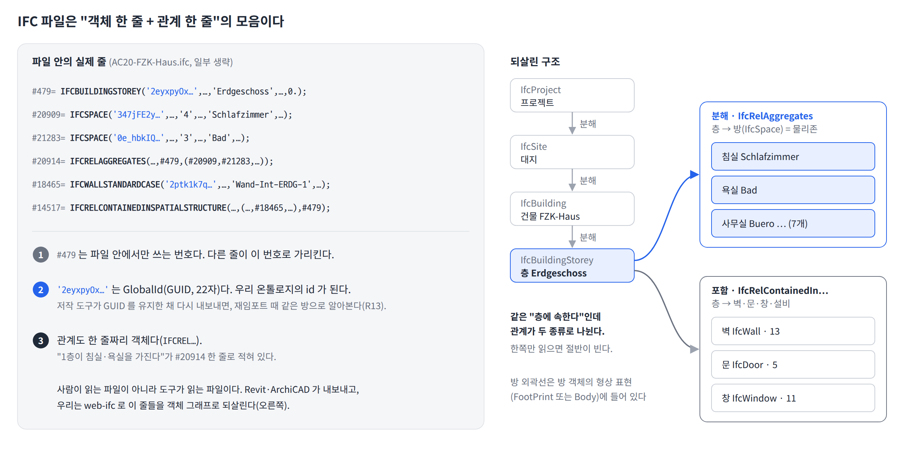

*그림 1. AC20-FZK-Haus 파일의 실제 줄(왼쪽)과 거기서 되살린 구조(오른쪽)*

- `#479` 같은 번호는 파일 안에서만 쓰는 주소다. 다른 줄이 이 번호로 가리킨다.
- `'2eyxpyOx…'`는 GlobalId다. 저작 도구가 GUID를 유지한 채 다시 내보내면, 재임포트 때 같은 방을 같은
  것으로 알아본다(R13).
- 공간은 프로젝트 > 대지 > 건물 > 층 > 방의 계층을 이룬다. **층과 방은 분해 관계
  (`IfcRelAggregates`)로, 층과 벽·문·창은 포함 관계(`IfcRelContainedInSpatialStructure`)로 묶인다.**
  같은 "층에 속한다"인데 관계가 두 종류라서, 한쪽만 읽으면 절반이 비어 있다.

### 1.3 분야별로 파일이 갈린다

**같은 건물이라도 건축 모델과 설비(MEP) 모델은 따로 만들어진다.** 건축 파일에는 층·방·벽이 있고
설비가 없다. 설비 파일에는 설비·덕트·배관·계통·포트가 있고 방이 없거나, 있어도 건축 방의 사본이다.
Revit은 건축용 Room과 설비용 MEP Space를 둘 다 `IfcSpace`로 내보내므로, 설비 파일 하나만 열어도
같은 방이 두 번 나온다(Duplex MEP: 42개 = 같은 방 21 × 2).

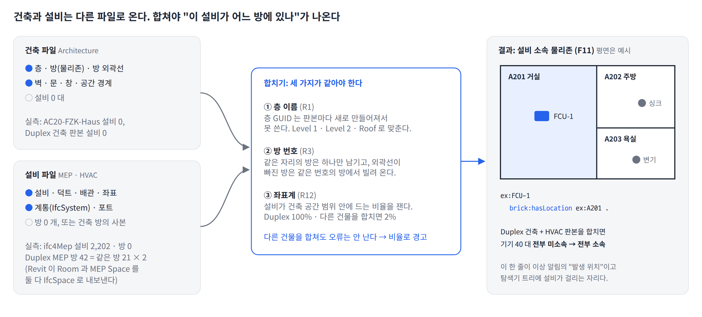

*그림 2. 건축 파일과 설비 파일을 합쳐야 설비의 소속 물리존(F11)이 나온다*

그래서 "BIM 있어요"가 "설비도 있어요"를 뜻하지 않는다. 공개 BIM 네 개를 확인했더니 두 개에는
설비가 0개였고, 나머지 두 개의 설비는 타월디스펜서·거울·소화기함이었다. 합치는 조건은 3.2에서 다룬다.

### 1.4 방의 외곽선은 어디에 있나

물리존의 바닥 외곽선은 방 객체의 형상 표현에 들어 있다. **어느 표현에 넣는지가 저작 도구마다 다르다.**

| 표현 | 누가 내나 | 우리가 읽나 |
|---|---|---|
| `FootPrint`(바닥 윤곽선을 따로 둔 것) | ArchiCAD | 읽는다 |
| `Body/SweptSolid`(바닥 단면을 위로 밀어 올린 입체) | Revit | 읽는다. 단면이 곧 바닥 외곽선이다 |
| `Body/Brep`, `SurfaceModel`(면의 모음) | 일부 | 읽지 않는다 |
| 형상 표현 없음 | COBie 교환 판본 | 읽을 것이 없다 |

좌표도 그대로 믿을 수 없다. 객체의 위치는 부모 객체 기준의 상대 좌표로 적혀 있어서, 배치 사슬
(`IfcLocalPlacement`)을 끝까지 따라가야 절대 좌표가 나온다. 따라가지 않으면 방이 전부 원점에 겹친다.
길이 단위도 파일마다 달라서(미터·밀리미터·피트) 파일이 선언한 단위(`IfcUnitAssignment`)로 환산한다.

### 1.5 속성, 역할, 포트, 계통

**속성(Pset).** 객체에 붙는 값의 묶음이다. 표준 이름(`Pset_WallCommon.LoadBearing` 등)이 있지만,
실측한 Revit 파일은 전부 `PSet_Revit_*` 같은 비표준 이름으로 내보냈다.

**역할.** 설비가 소스인지, 싱크인지, 도관인지는 IFC 클래스 계층이 이미 말해 준다. 요소가 있으면 반드시
이 중 하나에 속하므로, 포트·계통이 비어 있어도 역할은 안다. 그리고 **설비의 대부분은 기기가 아니라
도관이다.**

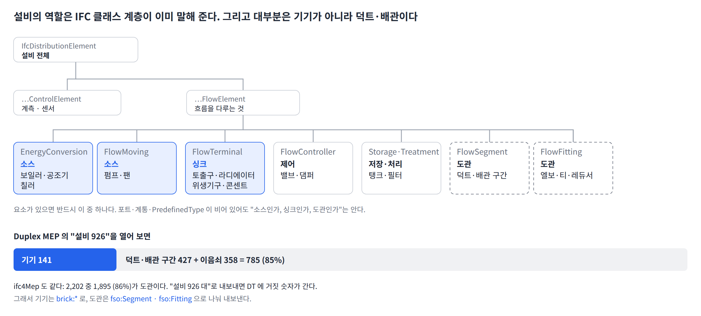

*그림 3. IFC 클래스 계층이 곧 역할 분류다. Duplex MEP의 설비 926개 중 785개(85%)가 도관이다*

**포트와 흐름 방향.** 포트마다 `FlowDirection`이 있다. 한쪽이 SOURCE, 다른 쪽이 SINK이면 흐름의 방향을
안다. 양쪽 다 `SOURCEANDSINK`이면 이어진 것만 알고 방향은 모른다.

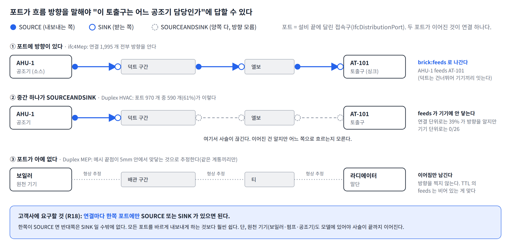

*그림 4. 포트가 방향을 말하는 경우, 중간이 SOURCEANDSINK인 경우, 포트가 아예 없는 경우*

**계통.** `IfcSystem`이 설비를 계통으로 묶는다. Revit 파일은 `IfcSystem` 대신 `System Name` 속성만
남기기도 한다.

**IFC 버전.** IFC4는 `IfcAirTerminal`처럼 구체 클래스로 설비 종류를 말한다. IFC2x3은 전부
`IfcFlowTerminal` 같은 추상 클래스라서, 표준 필드만으로는 설비 종류를 알 수 없다.

### 1.6 우리가 내보내는 것

**기하와 의미를 두 파일로 따로 내보내고, 같은 id(IfcGlobalId) 하나로 잇는다.** GeoJSON이 물리존
외곽선과 설비 좌표를, Brick TTL이 공간 계층·설비 소속·흐름 연결을 담는다. TTL에는 좌표를 넣지 않는다.

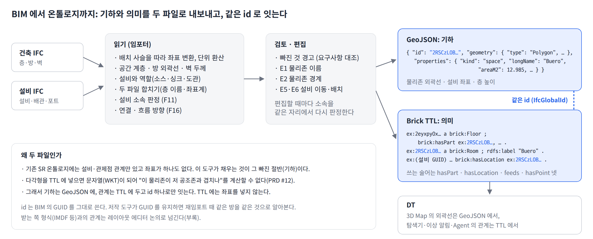

*그림 5. 임포트 → 검토·편집 → GeoJSON(기하)과 Brick TTL(의미)*

TTL이 쓰는 술어는 `brick:hasPart`, `brick:hasLocation`, `brick:feeds`, `brick:hasPoint` 넷이다. 기존 SR
온톨로지가 쓰는 술어가 이 넷뿐이라서, DT 쪽 파서(`ieum-pipeline`의 `ttl.go`)가 읽을 수 있게 맞췄다.
기하와 의미를 나눈 이유와 받는 쪽 형식에 관한 메모는 부록 C에 있다.

---

## 2. DT가 온톨로지에 묻는 것: 피처 F1~F16

피처를 먼저 정하는 이유는 이것이 BIM 요구사항을 결정하기 때문이다. DT의 화면이 무엇을 묻는지를
적으면, 온톨로지가 들고 있어야 할 관계가 따라 나온다. 그 관계를 BIM이 주는지가 3장의 답이 된다.

### DT가 온톨로지에 묻는 질문

| 소비처 | 질문 | 답하는 데 필요한 관계 |
|---|---|---|
| 이상 알림 | 이 설비는 어디서 났는가 | 설비 → 물리존 |
| 탐색기 트리 | 건물이 어떤 구조인가 | 사이트 → 건물 → 층 → 물리존 |
| 3D Map | 이 공간을 어떻게 그리는가 | 물리존의 외곽선과 높이 |
| 계통도 | 이 공조기가 담당하는 공간은 어디인가 | 설비 → 계통 → 공조존 |
| AI Agent | 회의실 온도가 몇 도인가 | 공간 이름 → 설비 → 관제점 |
| 로봇 관제 | 이 경로로 지나갈 수 있는가 | 벽·문·창의 통과 가능 여부 |

### 피처 목록

각 피처에 출처를 함께 적는다. **출처가 건축 BIM이 아닌 것이 절반이다.**

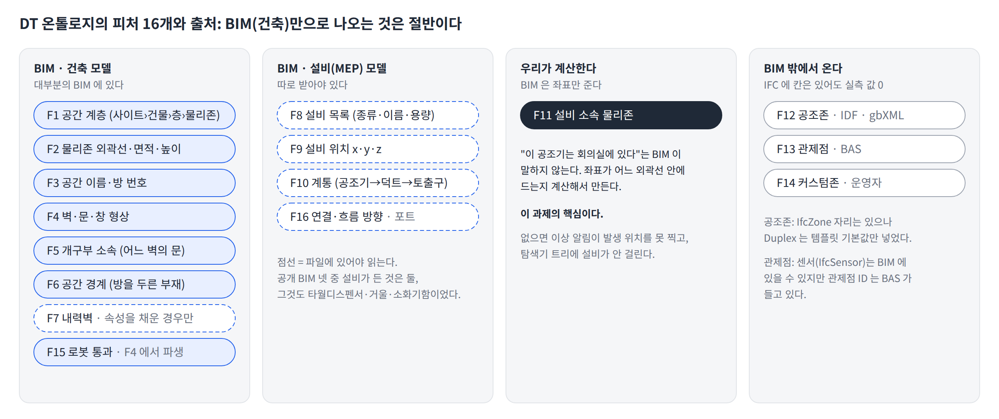

*그림 6. 피처 16개를 출처별로 나눈 것*

| # | 피처 | 관계·속성 | 출처 |
|---|---|---|---|
| F1 | 공간 계층 | `brick:hasPart` (사이트 > 건물 > 층 > 물리존) | BIM |
| F2 | 물리존 기하 | 외곽선 다각형, 면적, 층 높이 | BIM |
| F3 | 공간 이름 | `rdfs:label`, 방 번호 | BIM |
| F4 | 벽·문·창 형상 | 위치, 두께, 개구부 치수 | BIM |
| F5 | 개구부 소속 | 어느 벽에 난 문인가 | BIM |
| F6 | 공간 경계 | 이 물리존을 둘러싼 부재는 무엇인가 | BIM |
| F7 | 내력벽 | `loadBearing` | BIM (속성을 기입한 경우에만) |
| F8 | 설비 목록 | 종류, 이름, 용량 | BIM (MEP를 포함한 경우에만) |
| F9 | 설비 위치 | x·y·z, 설치면 | BIM (MEP를 포함한 경우에만) |
| F10 | 계통 | 공조기 → 덕트 → 토출구 | BIM (MEP를 포함한 경우에만) |
| F11 | 설비 소속 물리존 | `brick:hasLocation` | **계산으로 만든다** |
| F12 | 공조존 | `brick:Zone`, 담당 관계 | IDF 또는 gbXML. IFC에도 자리(`IfcZone`)는 있으나 실측 값이 없다 |
| F13 | 관제점 | `brick:hasPoint` | BAS. 센서 장치 자체는 BIM에 있을 수 있다 |
| F14 | 커스텀존 | 운영자가 지정하는 다각형 | 사용자 |
| F15 | 로봇 통과 여부 | 문은 통과, 창문과 벽은 불가 | F4에서 파생 |
| F16 | 설비 연결(상류·하류) | `brick:feeds` | BIM (포트에 흐름 방향이 있는 경우에만). 없으면 규칙으로 정하고 사람이 확정한다 |

**F11이 이 과제의 핵심이다.** BIM은 설비의 좌표를 주고 물리존의 외곽선을 주지만, "이 공조기가
회의실에 있다"는 말은 하지 않는다. 그 관계는 좌표가 어느 외곽선 안에 드는지를 계산해서 만든다.
F11이 없으면 이상 알림이 발생 위치를 표시하지 못하고, 탐색기 트리에 설비가 걸리지 않는다.

**F12와 F13은 지금 BIM에서 나오지 않는다.** 다만 "IFC에 없다"가 아니라 **"IFC에 자리는 있는데 실제
파일이 비어 있다"**이다. 공조존은 `IfcZone`·`IfcSpatialZone`이나 Revit의 `VentilationZoneName` 칸에
담을 수 있는데, 실측 파일은 그 칸에 템플릿 기본값만 넣었다. 관제점은 센서 장치(`IfcSensor`)까지는
BIM에 있지만 관제점 ID는 BAS가 들고 있다. 그래서 지금은 IDF·BAS에서 받아야 하고, 고객사에 요구하면
일부를 BIM 쪽으로 당길 수 있다(4.2의 R20·R21).

---

## 3. BIM이 실제로 주는 것: 실측

### 3.1 규격, 임포터, 실제 파일

세 가지를 구분해서 적는다. 규격이 담을 수 있는 것, 우리 임포터가 읽는 것, 실제 파일에 들어 있는 것이
서로 다르기 때문이다. 실측 열은 따로 적지 않으면 AC20-FZK-Haus의 값이다.

| 피처 | IFC4 규격 | 지금 임포터 | 실측 |
|---|---|---|---|
| F1 공간 계층 | `IfcBuildingStorey`, `IfcSpace` | 읽는다 | 층 2, 물리존 7 |
| F2 물리존 기하 | `FootPrint` 또는 `Body` 표현 | `FootPrint`와 `Body/SweptSolid`를 읽는다 | 7개 전부 추출, Buero 12.985㎡ |
| F3 공간 이름 | `Name`, `LongName` | 읽는다 | Schlafzimmer, Bad, Buero 등 7개 |
| F4 벽·문·창 | `IfcWall`, `IfcDoor`, `IfcWindow` | 종류·이름을 읽는다. **위치(좌표)는 읽지 않는다** | 벽 13, 문 5, 창 11 |
| F4 벽 두께 | `IfcMaterialLayerSetUsage` | 읽는다 | 13장 전부. 내벽 0.24m · 외벽 0.3m |
| F4 개구부 치수 | `OverallHeight`, `OverallWidth` | 읽는다 | 16개 전부. 문 2.01 x 0.885m |
| F5 개구부 소속 | `IfcRelVoidsElement` + `IfcRelFillsElement` | 읽는다 | 16개 전부 벽에 이어짐 |
| F6 공간 경계 | `IfcRelSpaceBoundary` | 읽는다 | 물리존 7개에 걸린 경계 66면(파일 전체 81건) |
| F15 로봇 통과 | F4에서 파생 | 개구부 종류에서 파생한다(`passable`). 방-문-방 연결은 아직 | 문 5개만 통과 가능 |
| 길이 단위 | `IfcUnitAssignment` | 읽어서 미터로 환산한다 | 미터 · 밀리미터 · 피트를 확인 |
| F7 내력벽 | `Pset_WallCommon.LoadBearing` | 읽는다 | **0 / 13. 속성 자체가 없음** |
| F8 설비 | `IfcDistributionElement` 하위 | 읽는다 | **0** |
| F9 설비 위치 | `ObjectPlacement` | 읽는다 | 해당 없음 |
| F10 계통 | `IfcSystem` + `IfcRelAssignsToGroup` | 읽는다 | **0** |
| F11 설비 소속 | 규격에 없다 | 계산해서 만든다 | 해당 없음 |
| F12 공조존 | `IfcZone`, `IfcSpatialZone`(IFC4). **자리는 있다** | 읽지 않는다 | 없음. Duplex는 칸만 있고 값이 템플릿 기본값이다 |
| F13 관제점 | 센서는 `IfcSensor`. 관제점 ID는 **IFC에 없다** | 센서를 설비로 읽는다 | ifc4Mep 센서 7개, 설비와 잇는 관계 0 |

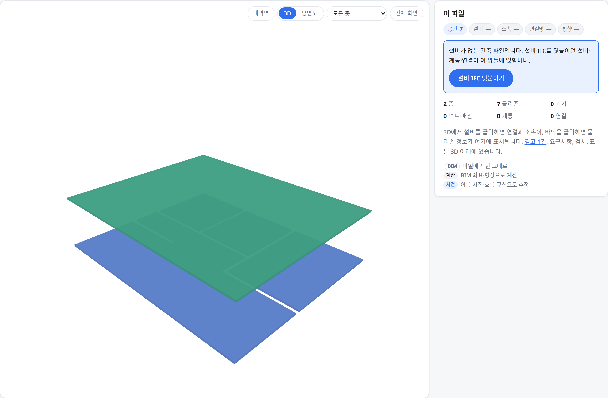

*그림 7. AC20-FZK-Haus를 연 3D 화면. 두 층의 물리존 외곽선이 제자리에 놓인다*

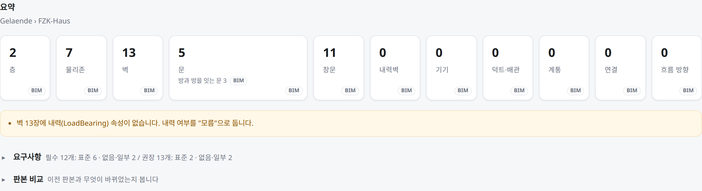

*그림 8. 같은 파일의 임포트 검토 화면. 무엇이 만들어졌는지 숫자로 먼저 보이고, 빠진 것은 경고로 뜬다*

정리하면 이렇다.

- **공간 골격은 BIM으로 충분히 만들어진다.** 층, 물리존, 외곽선, 면적, 이름이 전부 나온다. 좌표 변환까지
  포함해 실제 모델로 확인했다.
- **벽 두께, 개구부 치수, 공간 경계까지 읽는다.** 특히 `IfcRelSpaceBoundary`는 물리존을 둘러싼 부재를
  BIM이 직접 알려 주므로, 벽을 고칠 때 영향받는 물리존을 기하 연산 없이 찾을 수 있다.
- **설비는 파일에 들어 있어야 읽을 수 있는데, 실제로는 대부분 없다.** 이것이 가장 큰 제약이다.

### 3.2 건축 모델과 설비 모델은 따로 온다

공개 샘플을 여러 곳에서 모아 확인했더니, 설비는 **건축 모델과 다른 파일에 들어 있었다.** 같은
프로젝트라도 분야마다 파일이 갈린다. 파일 이름은 부록 A의 짧은 이름을 쓴다.

| 모델 | 출처 | 스키마 | 물리존 | 설비 | 계통 | 포트 |
|---|---|---|---|---|---|---|
| AC20-FZK-Haus | web-ifc 테스트 모델 | IFC4 | 7 | 0 | 0 | 0 |
| C20-Institute | web-ifc 테스트 모델 | IFC4 | 82 | 0 | 0 | 0 |
| Office_A | web-ifc 테스트 모델 | IFC2x3 | 99 | 31 | 0 | 0 |
| dental_clinic | web-ifc 테스트 모델 | IFC2x3 | 269 | 102 | 0 | 0 |
| **ifc4Mep** | opensourceBIM/TestFiles | **IFC4** | 0 | **2,202** | **37** | **4,232** |
| Duplex COBie | NIBS · DURAARK | IFC2x3 | 22 | 133 | **10** | 0 |
| Duplex HVAC | NIBS · DURAARK | IFC2x3 | 1 | 498 | 0 | **970** |
| Duplex MEP | NIBS · DURAARK | IFC2x3 | 42 (**같은 방 21 × 2**) | 926 | 0 | 0 |

여기서 네 가지를 읽을 수 있다.

첫째, **건축 모델에는 설비가 없고 설비 모델에는 물리존이 없다.** 위 표에서 두 값이 동시에 큰 행이
하나도 없다(Duplex MEP의 42개는 건축 방의 사본이다). 설비 소속 물리존(F11)을 만들려면 두 파일을 합쳐야
하고, 합치려면 두 파일이 같은 좌표계를 써야 한다. 공유 좌표를 요구사항에 넣는 이유가 이것이다.

둘째, **계통이 든 파일은 드물고 종류가 둘이다.** ifc4Mep은 `IfcDistributionSystem`으로 37개를 담았고,
Duplex는 **COBie 판본에만** 10개가 있었다. COBie는 시설관리 인수용 규격이라 계통과 자산 정보를 함께
담는다. 우리 용도와 목적이 같으므로, 고객사에 요구할 때 "IFC에 MEP를 포함"만 적지 말고 **계통 정보를
함께 요구하는 편이 확실하다.**

셋째, **포트가 있으면 연결 관계를 알 수 있다.** ifc4Mep은 포트 4,232개와 `IfcRelConnectsPorts`
2,024건을 담았다. 어느 덕트가 어느 토출구에 붙는지가 파일에 그대로 있다. 계통이 없어도 포트만 있으면
연결을 되살릴 수 있다. 다만 **포트가 있다고 흐름 방향까지 아는 것은 아니다**(3.4).

넷째, **길이 단위가 파일마다 다르다.** 확인한 네 파일 중 둘은 미터가 아니었다.

| 모델 | 선언된 길이 단위 |
|---|---|
| AC20-FZK-Haus | METRE |
| ifc4Mep | METRE |
| Duplex HVAC | **MILLIMETRE** |
| Duplex MEP-1 | **FOOT** (환산 단위) |

선언된 단위(`IfcUnitAssignment`)를 읽지 않으면 밀리미터 모델의 좌표가 1,000배로, 피트 모델의 좌표가
3.28배로 들어온다. **오류가 나지 않고 숫자가 그럴듯해서 눈으로 보기 전에는 모른다.** 임포터는 이 단위를
읽어 미터로 환산하고, 같은 건물의 밀리미터 판본과 피트 판본이 같은 층 높이를 주는지로 교차 확인한다.

#### 합치기: 층 이름, 방 번호, 좌표계

Duplex의 건축 판본과 설비 판본을 합쳐 보았다.

**층은 GUID가 아니라 이름으로 맞춰야 한다.** 같은 건물인데 층 GlobalId가 판본마다 다르다(건축
`1xS3BCk…`, 설비 `0o8nNAb…`). 이름(Level 1·Level 2·Roof)과 높이(0·3.1·6.0m)는 같았다. 좌표계도 같았다.
설비 498대가 전부 건축 모델의 공간 범위 안에 들었다.

| 합친 것 | 합치기 전 | 합친 뒤 |
|---|---|---|
| 건축 + HVAC | 물리존 1, **기기 40대 전부 미소속** | 물리존 21, **기기 40대 전부 소속** |
| 건축 + MEP | 물리존 42 (**같은 방이 두 번**) | 물리존 21, BIM이 말한 소속 167건 보존 |
| FZK-Haus + ifc4Mep (다른 건물) | 해당 없음 | 설비 2%만 겹쳐 **"좌표계가 다르다" 경고** |

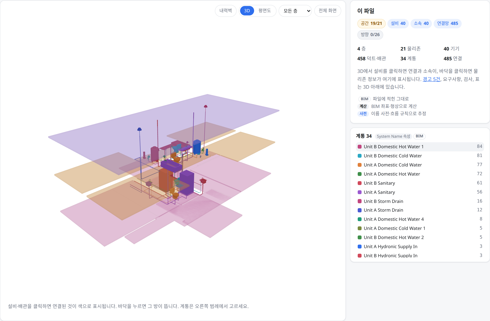

*그림 9. Duplex 건축 판본에 HVAC 판본을 덧붙인 3D 화면. 설비가 건축의 방 안에 놓인다*

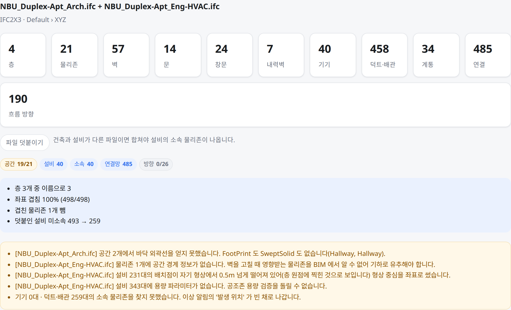

*그림 10. 같은 합치기의 결과. 층 3개를 이름으로 맞췄고, 설비 좌표의 100%가 건축 공간 범위 안에 든다*

셋째 줄이 요구사항 "건축과 설비가 같은 좌표계"(R12)의 근거다. 다른 건물을 합쳐도 **오류가 나지
않는다.** 층 높이가 0인 층끼리는 짝까지 지어진다. 좌표가 겹치는지를 따로 재지 않으면, 설비 2,202대가
전부 미소속으로 나오는 결과만 보고 원인을 알 수 없다.

합치면서 알게 된 것이 둘 있다.

- **Revit 설비 판본에는 방이 두 벌 들어 있다.** "MEP Space" 21개와 건축 Room의 사본 21개다. 설비 판본
  하나만 열어도 온톨로지에 같은 방이 두 번 나간다. 합칠 때 같은 자리의 방은 하나만 남기고(안쪽 점이 이미
  있는 방에 드는지로 판단한다), 빈자리를 채우는 방은 받는다. 건축 판본의 복도 두 개는 외곽선이
  없었는데(SurfaceModel), 같은 방 번호의 외곽선을 설비 판본에서 빌려 온다.
- **Revit IFC2x3의 덕트 구간은 배치점이 층 원점이다.** Duplex HVAC의 덕트 구간 231개가 전부 (0, 0)에
  있었다. 형상은 제자리에 있다. 이대로 판정하면 **원점이 든 방 하나에 덕트가 전부 몰린다.** Duplex는
  원점이 건물 밖이라 "미소속"으로 끝났을 뿐이다. 그래서 배치점이 자기 형상에서 0.5m 넘게 떨어져 있으면
  형상 중심을 좌표로 쓰고, 몇 대를 고쳤는지 경고로 남긴다.

### 3.3 설비 소속(F11)은 얼마나 맞나

Duplex MEP 판본은 설비 167대를 `IfcSpace`에 직접 매달아 두었다. 설계자가 적은 소속이므로 정답지가 된다.
그 값을 가리고 좌표로만 판정해서 비교했다.

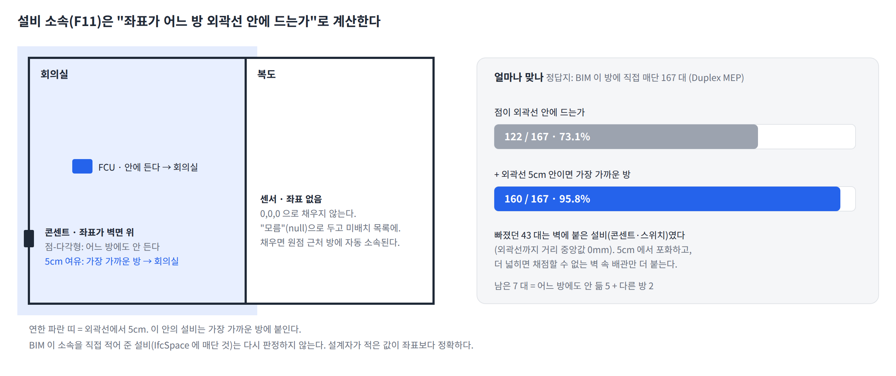

*그림 11. 좌표가 외곽선 안에 드는지로 판정하고, 외곽선 5cm 안의 설비는 가장 가까운 방에 붙인다*

| 판정 | 맞음 | 어느 방에도 안 듦 | 다른 방 |
|---|---|---|---|
| 점이 외곽선 안에 드는가 | 122 (**73.1%**) | 43 | 2 |
| + 외곽선 5cm 안이면 가장 가까운 방 | 160 (**95.8%**) | 5 | 2 |

**빠진 43대는 벽에 붙은 설비다.** 콘센트·스위치의 좌표가 정확히 벽면, 곧 방 외곽선 위에 있어서
점-다각형 판정에서 떨어진다(외곽선까지 거리의 중앙값 0mm). 여유를 2cm·5cm·10cm·30cm로 바꿔 가며 재 보면
5cm에서 더 늘지 않고, 30cm까지 넓혀도 "다른 방"은 2대 그대로다. 5cm로 두는 이유는 그 이상 넓히면 정답지가
없는 벽 속 배관만 더 붙기 때문이다. 그 배관이 어느 쪽 방인지는 맞았는지 잴 방법이 없다.

같은 이유로 **합칠 때 BIM이 말한 소속은 다시 판정하지 않는다.** 겹쳐서 뺀 방을 가리키면 같은 자리의 남은
방으로 옮겨 적는다. 좌표로 다시 판정하면 말단 105대 중 41대의 소속을 잃는다.

좌표가 없는 설비는 `0,0,0`으로 채우지 않는다. "모른다"가 "원점에 있다"로 바뀌어 원점 근처 물리존에
자동으로 소속되기 때문이다. 좌표가 없는 설비는 미배치 목록으로 남기고, 사람이 배치한다(E6).

### 3.4 연결과 흐름 방향(F16)

설비가 이어져 있다는 것과 **어느 쪽으로 흐르는가**는 다른 문제다(그림 4). 실제로 세어 보면 이렇다.

| 모델 | 포트 | 연결 | 흐름 방향을 아는 연결 | 방향을 아는 비율 |
|---|---|---|---|---|
| ifc4Mep (IFC4) | 4,232 | **1,995** | **1,995** | 100% |
| Duplex HVAC (IFC2x3) | 970 | 485 | **190** | 39% |
| Duplex MEP (IFC2x3) | 0 | 0 | 0 | 해당 없음 |

Duplex HVAC에서 나머지 61%가 빠지는 이유는 Revit이 피팅과 덕트의 포트를 `SOURCEANDSINK`로 내보내기
때문이다. **이어져 있다는 것만 알고 흐름은 모른다.** 그래서 요구사항에는 "포트를 넣어 달라"가 아니라
"포트에 흐름 방향을 넣어 달라"를 적는다.

**다만 모든 포트에 방향이 있을 필요는 없다. 연결마다 한쪽만 있으면 된다.** 한쪽이 SOURCE이면 반대쪽은
SINK일 수밖에 없기 때문이다. 저작 도구가 모든 포트를 제대로 내보내게 만드는 것보다 이쪽이 훨씬 쉬우므로,
협의에서는 완화된 쪽을 먼저 제시한다(근거: Lilis 2025, `docs/research.md`).

**방향을 아는 길이 포트만은 아니다.** 요소의 역할(소스·싱크)을 알면 소스에서 싱크로 경로를 찾아 그 경로에
방향을 줄 수 있고, 역할은 IFC 클래스 계층에서 추가 입력 없이 나온다(그림 3). 그런데 **우리 파일 두 개에서는
이 방법이 통하지 않았다.** 소스와 싱크가 같은 연결망 조각에 들어 있는 경우가 0이었다(MEP 34조각, HVAC
8조각). 보일러·펌프가 배관망과 기하적으로 닿아 있지 않기 때문이다. 그러니 `brick:feeds`가 비는 이유는
"포트가 없어서"가 아니라 **"포트도 없고 소스·싱크가 한 망에 있지도 않아서"**다. 측정표는
`docs/ifc-coverage.md`에 있다.

포트를 요소에 매다는 관계는 스키마마다 다르다. IFC2x3은 `IfcRelConnectsPortToElement`, IFC4는
`IfcRelNests`를 쓴다. **한쪽만 읽으면 다른 버전 파일에서 연결이 0이 된다.** ifc4Mep은
`IfcRelConnectsPortToElement`가 92건뿐이고 나머지가 전부 `IfcRelNests`에 있다.

#### 포트가 없으면 형상으로 추정한다

Duplex MEP 판본(원본과 Solibri 최적화본 모두)은 포트도 `IfcSystem`도 0이다. 그런데 요소 811개에 Revit의
`System Name` 속성이 남아 있고, 배관 끝과 피팅 끝의 메시 꼭짓점이 5mm 안에서 맞닿는다. 계통이 같은
것끼리만 이으면 연결 690개가 나오고, 계통별 연결망이 아래처럼 갈라진다.

| 계통 | 이어진 요소 |
|---|---|
| Unit A/B Hydronic Supply In | 154 · 151 |
| Unit A/B Domestic Cold Water | 69 · 70 |
| Unit A/B Domestic Hot Water | 61 · 67 |

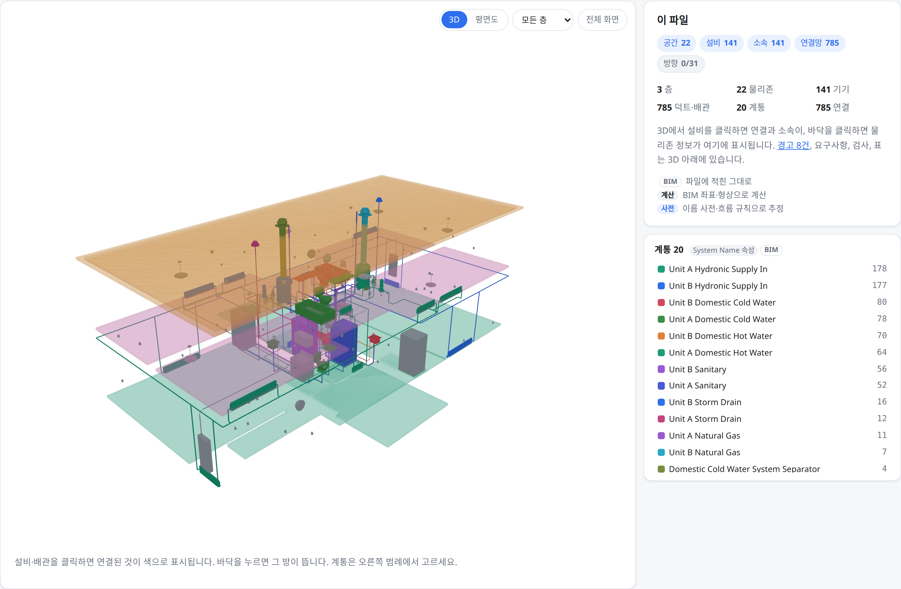

*그림 12. Duplex MEP를 연 3D 화면. 계통별로 색을 나눴다. 포트가 없어 방향은 모른다*

**이어 주지 못한 것은 이유를 갈라서 말한다.** 연결이 하나도 없는 설비를 "연결 없음" 하나로 묶으면 고객사에
할 말을 정할 수 없다. 같은 계통의 상대가 50mm 안에 있으면 판정 오차 문제이고(**"기준을 조정하겠다"**),
주변에 아무것도 없으면 접합 부재가 모델에 없는 것이다(**"다시 그려 달라"**). Duplex MEP의 224대를 나눠
보면 121대가 전자, 103대가 후자다. 이 구분이 4.4의 1안·2안 판단으로 이어진다.

**추정이 얼마나 맞는지도 쟀다.** ifc4Mep은 포트가 완전해서 정답지가 되므로, 거기서 포트를 무시하고 형상
추정만 돌려 비교했다. 기본값 5mm에서 **정밀도 79.5% · 재현율 75.8%**다. 오차를 1mm로 좁히면 정밀도가
88.6%로 오르지만 재현율이 47%로 떨어지고, 50mm로 넓히면 재현율이 94.3%까지 오르지만 정밀도가 55.1%로
낮아진다. **온톨로지는 틀린 관계가 들어가는 쪽이 빠지는 쪽보다 나쁘므로 5mm를 유지한다.** 50mm에서도
못 찾는 113개는 접합 부재가 아예 없는 것이라 알고리즘으로 메울 수 없다. 자세한 표는
`docs/ifc-coverage.md` §4.1에 있다.

**추정은 추정으로 남긴다.** 연결마다 출처(`port` / `geometry`)를 함께 저장하고, 형상으로 추정한 연결은
방향이 없으므로 `brick:feeds`로 내보내지 않는다. 방향을 붙여서 내보내면, 온톨로지를 읽는 쪽이 BIM이 말한
것과 우리가 추정한 것을 구별할 수 없다. 포트가 없는 BIM에서 TTL의 `feeds` 절이 통째로 비는 것이 맞고,
**그 빈자리가 고객사에 포트를 요구하는 근거다.**

#### DT가 받는 것은 연결이 아니라 기기로 센다

덕트·배관은 Brick이 아니라 `fso:`로 나가서 DT 쪽 파서가 엔티티로 읽지 않는다. 그런데 흐름은 대부분
덕트에서 출발한다. 공조기 → 덕트까지만 적으면 DT는 토출구에 닿지 못한다. 그래서 기기마다 **덕트·배관을
건너뛴 하류 기기**를 함께 적는다. Brick은 원래 덕트를 모델링하지 않고 "공조기 feeds VAV"처럼 기기끼리
잇는 것이 관례라서 Brick에도 맞다. 건너뛸 때는 포트가 방향을 말한 연결만 따라가므로, 이어 붙인 결과도
추정이 아니다.

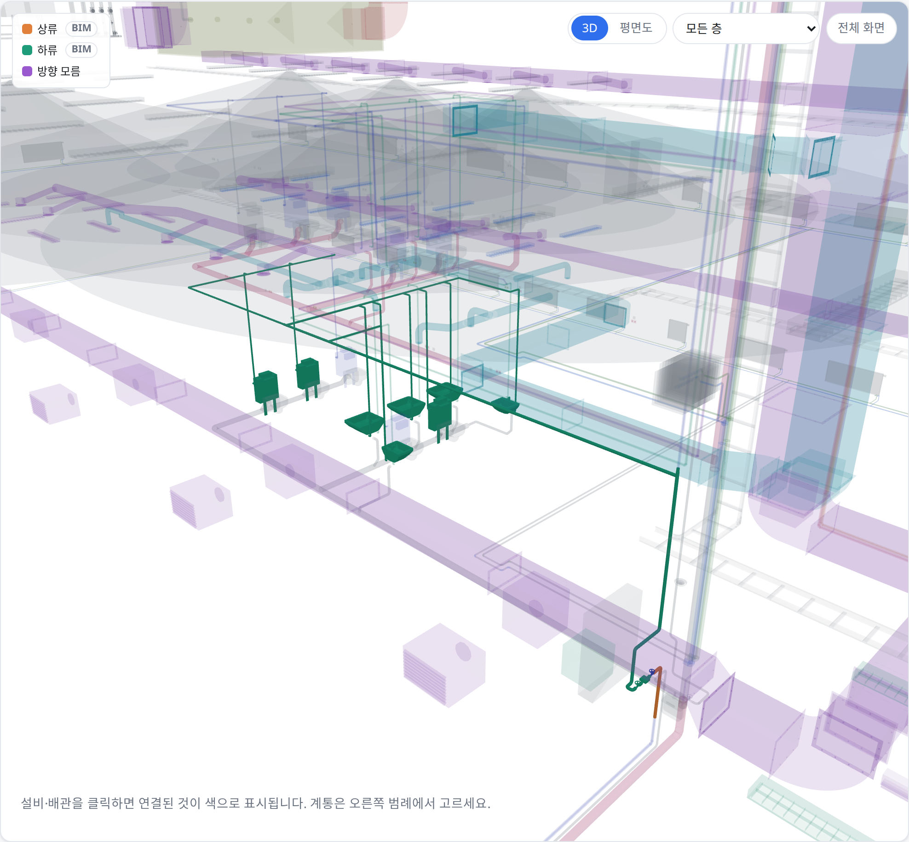

*그림 13. ifc4Mep에서 냉수 밸브 하나를 고르면 포트가 말한 방향을 따라 하류 108개가 칠해진다*

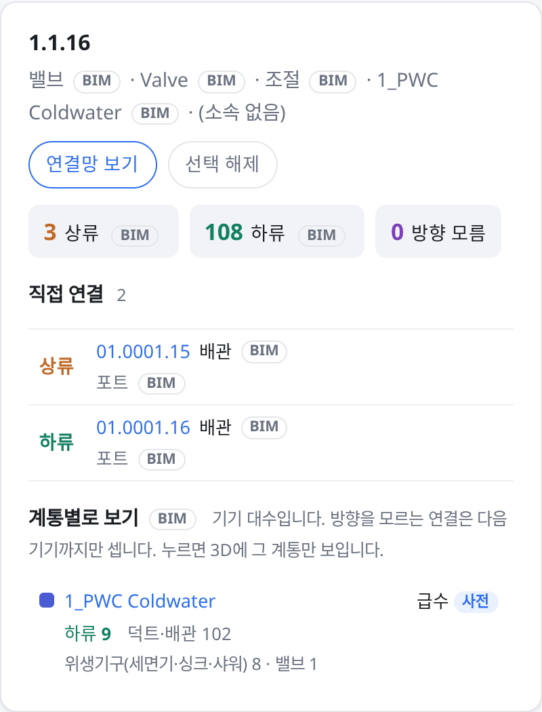

*그림 14. 같은 밸브의 상류·하류 패널. 연결마다 출처(BIM 포트)가 표시된다*

그래서 흐름 방향을 **연결이 아니라 기기로** 센다. 다른 기기와 덕트·배관으로 이어진 기기 중, 흐름 방향으로
이어진(공급하거나 공급받는) 기기의 비율이다.

| 파일 | 연결 단위 방향 | **기기 단위 방향** | 이유 |
|---|---|---|---|
| ifc4Mep | 1,995/1,995 (100%) | **37/103** | 나머지 66대는 난방·오수처럼 원천 기기(보일러·펌프)가 모델에 없는 망에 형제로만 매달려 있다 |
| Duplex HVAC | 190/485 (39%) | **0/26** | 기기에서 출발한 방향 사슬이 전부 중간의 `SOURCEANDSINK`에서 끊긴다 |
| Duplex MEP | 0/785 | **0/31** | 포트가 없다. 형상 추정에는 방향이 없다 |

**연결 단위로 말하면 DT가 받는 것을 크게 부풀리게 된다.** Duplex HVAC는 "39%"로 보이지만, DT에서 "이
토출구는 어느 공조기 담당인가"에 답할 수 있는 기기가 하나도 없다. 요구사항 R18의 근거가 이 표다. 포트에
방향을 넣되, **원천 기기에서 말단까지 사슬이 끊기지 않아야** 한다.

#### Proxy 로 들어온 설비도 읽는다

Revit 은 IFC 클래스를 지정하지 않은 패밀리를 `IfcBuildingElementProxy` 로 내보낸다. 성수 기계
파일에서는 FCU 120대, 공조기 8대, 지열 히트펌프 12대, 디퓨저 752개, 댐퍼 609개가 전부 Proxy 였다. IFC 설비
계층만 보면 이것들이 통째로 빠지고, 방향 사슬도 그 자리에서 끊긴다.

그래서 Proxy 중 **포트로 배관망에 붙어 있는 것**과 **이름이 설비 종류 사전에 있는 것**(포트 없는 CCTV
등)은 설비로 읽는다. 둘 다 아닌 Proxy(휠스톱, 캐노피)는 건축 부재라 읽지 않는다. 종류는 IFC 가 말하지 않으므로
Revit 패밀리 이름(`FCU3:FCU3`, `라인디퓨저:2slot`)에서 사전으로 읽고, 그 종류로 Brick 클래스를 붙인다
(`brick:Fan_Coil_Unit`, `brick:Air_Diffuser` …). 같은 파일에서 포트만으로 방향을 아는 기기가 이 한 가지로
413/1,361 에서 **1,903/2,929(65%)** 로 늘었다. Proxy 를 읽는 것은 우회로이고, 고객사에는 여전히 IFC 클래스로
내보내 달라고 요청한다(R24).

#### 규칙 방향: 계통 종류와 설비 종류로 정하고, 사람이 확정한 것만 내보낸다

포트가 `SOURCEANDSINK` 뿐인 연결에도 방향을 정할 근거가 두 가지 있다. 계통 종류가 매체와 방향을 말하고
(급기는 원천에서 나가고, 환기·배기는 원천으로 들어온다. Revit 은 이것을 `IfcSystem` 의 ObjectType 에 `급기`,
`순환 공기` 처럼 적는다), 설비 종류가 원천을 말한다(공기 계통에서는 공조기·FCU·전열교환기·팬, 물 계통에서는
히트펌프·보일러·냉동기). 원천에서 덕트·배관을 따라 거리를 재고 가까운 쪽에서 먼 쪽으로 방향을 준다. 선행
연구가 말한 "역할로부터 경로 탐색으로 방향을 유도한다"와 같은 방법이다.

실제 파일에서 틀리는 자리가 셋 있어서 규칙을 좁혔다.

- **Revit 은 급기 계통을 가지마다 따로 만든다**(성수 기계 파일 급기 계통 753개). 가지 계통 안에는 원천이 없어서,
  원천을 계통 밖에서도 찾는다. 말단과, 그 매체를 받기만 하는 기기(물 계통의 FCU)는 지나가지 않는다.
- **원천에서 바깥 루버로 가는 가지는 루버 종류가 방향을 정한다.** 외기(OA) 루버 쪽은 원천으로 들어오고
  배기(EA) 루버 쪽은 원천에서 나간다. 계통 종류 하나로 모든 가지를 같은 쪽으로 돌리면 한쪽이 뒤집힌다.
- **덕트 유형 이름과 계통이 방향을 다르게 말하면 정하지 않는다.** `RA_순환공기` 덕트가 급기 계통에 들어가
  있는 식이다. 어느 쪽이 맞는지 모르므로 충돌로 세어 둔다(성수 기계 파일 227개).

규칙이 맞는지는 **포트가 이미 방향을 말한 연결에 같은 규칙을 대 보고** 잰다.

| 파일 | 규칙으로 방향을 준 연결 | 포트 방향과 대 본 연결 | 일치 | 기기 단위 방향(포트 → 포트+규칙) |
|---|---|---|---|---|
| 성수 기계 | 5,457 | 9,219 | **83.8%**(급기 84.0% · 환기 90.5% · 배기 75.0%) | 1,903/2,929 → **2,759/2,929** |
| ifc4Mep | 0(포트가 전부 방향을 말한다) | 36 | 88.9% | 37/103 → 37/103 |
| Duplex MEP | 328 | 0(포트 없음) | 잴 수 없음 | 0/31 → 23/31 |

**규칙 방향은 BIM 이 말한 방향과 따로 둔다.** 연결의 포트 방향(`directed`)은 그대로 두고 규칙 방향은 별도
값으로 들고 다닌다. 화면에서는 "규칙 방향(추정)"으로 구별해 보이고, 상류·하류 숫자도 포트 기준과 규칙 포함을
나눠 보인다. **사람이 계통 단위로 확인해 "확정"한 것만 `brick:feeds` 로 나간다.** 확정 버튼 옆에는 그 계통에서
규칙이 포트와 몇 % 맞았는지를 근거로 보여 준다. 일치율 16%는 틀리고, 그 16%가 어느 계통에 있는지를 사람이
보고 고르는 것이 에디터의 일이다. 순환수 환수·급탕 계통은 원천을 찾지 못해 아직 규칙이 닿지 않는다.

### 3.5 등급: "이 BIM으로는 여기까지 나옵니다"

고객사 파일을 받았을 때 **"이 BIM으로는 여기까지 나옵니다"를 한 줄로 말하기 위한 표**다. 위 등급은 아래
등급을 전제로 한다. 0+와 4+는 옆으로 붙는 확장이라서 번호 사이에 끼워 넣었다.

#### 한눈에 보기

등급마다 온톨로지에 무엇이 새로 생기고, 그 덕분에 DT에서 무엇이 가능해지는지를 적는다.

| 등급 | 이름 | 온톨로지에 새로 생기는 것 | DT에서 가능해지는 것 |
|---|---|---|---|
| 0 | 공간 골격 | 층, 방 외곽선, 벽·문·창 | 3D 지도, 탐색기 트리 |
| 0+ | 공간 의미 | 방 종류, 방 높이, 방-문-방 연결 | "회의실"로 찾기, 복층 표현, 로봇 경로 |
| 1 | 설비 목록 | 설비와 그 좌표 | 3D에 설비를 표시한다 |
| 2 | 설비 소속 | "이 설비는 회의실에 있다" | 이상 알림의 **발생 위치**, 탐색기 트리의 설비 |
| 3 | 계통·연결망 | "이 설비들은 같은 배관에 붙어 있다"(방향은 모른다) | 계통별로 묶어 보기 |
| 4 | 흐름 방향 | "공조기에서 이 토출구로 흐른다" | **"이 토출구는 어느 공조기 담당인가"**, 상류·하류 추적 |
| 4+ | 담당 공간(근사) | "이 공조기가 담당하는 방" | 계통도의 담당 공간(포트가 없을 때의 근사) |
| 5 | 운영 | 공조존, 관제점 | 계통도, 실시간 값. BIM 밖(IDF·BAS)에서 온다 |

짧게 말하면, **등급 0~2는 "어디에 무엇이 있는가", 등급 3·4는 "무엇이 무엇과 이어져 있는가", 등급 5는
BIM이 아닌 곳에서 받아야 하는 것**이다. 고객사에 필수로 요구하는 범위는 0·1·2이다(4장).

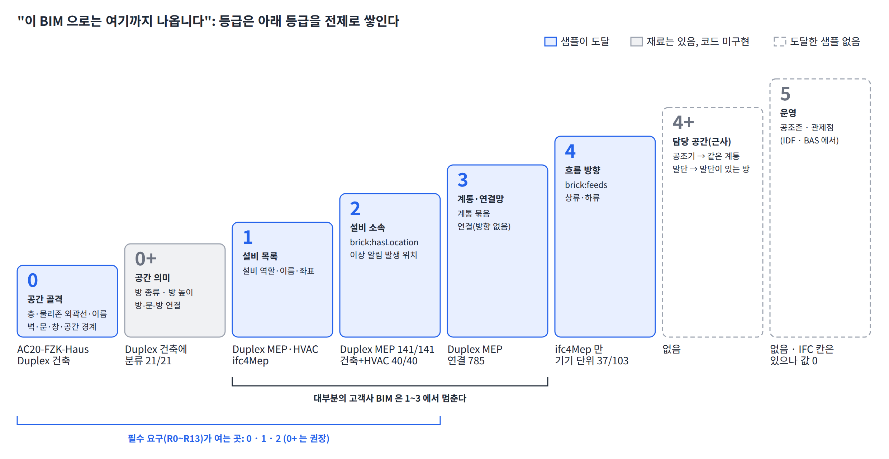

*그림 15. 등급 0~5와 각 등급에 도달한 샘플*

| 등급 | 온톨로지에 나오는 것 | 필요한 IFC | 도달한 샘플 |
|---|---|---|---|
| **0. 공간 골격** | F1~F7. 층, 물리존 외곽선, 이름, 벽·문·창, 공간 경계 | `IfcBuildingStorey`, `IfcSpace`(FootPrint 또는 SweptSolid), 벽·개구부, 배치 사슬, 단위 선언 | AC20-FZK-Haus, Duplex 건축 |
| **0+. 공간 의미** | 방 종류, 방 높이, 방-문-방 연결 | 방 분류(OmniClass 또는 `PredefinedType`), 공간 수량 `Height`, 문이 걸린 `IfcRelSpaceBoundary` | 재료는 샘플에 있다(3.6). **코드가 아직 읽지 않는다** |
| **1. 설비 목록** | + F8·F9. 설비 역할·이름·좌표 | `IfcDistributionElement` + 형상 위에 놓인 배치점 | Duplex MEP·HVAC, ifc4Mep |
| **2. 설비 소속** | + F11. `brick:hasLocation` | `IfcSpace`가 같은 파일에 있거나, 다른 파일이면 **같은 좌표계와 같은 층 이름** | Duplex MEP(기기 141/141), Duplex 건축+HVAC(기기 40/40) |
| **3. 계통·연결망** | + F10·F16(방향 없음) | `IfcSystem` 또는 Revit `System Name`, 맞닿는 솔리드 | Duplex MEP(연결 785) |
| **4. 흐름 방향** | + F16(방향 있음). `brick:feeds` | 포트 + SOURCE/SINK, 원천 기기에서 말단까지 끊기지 않는 사슬 | **ifc4Mep만.** 연결 1,995/1,995, 기기 단위 37/103 |
| **4+. 담당 공간(근사)** | 공조기 → 같은 계통의 말단 → 말단이 있는 방 | `IfcSystem`이 공조기와 말단을 **같이** 묶을 것 + 등급 2 | **없다.** ifc4Mep은 계통 2/37이 조건을 갖췄는데 방이 없고, Duplex는 방이 있는데 계통이 기기와 말단을 따로 묶었다(0/34) |
| **5. 운영** | + F12·F13. 공조존, 관제점 | IDF·gbXML·BAS. IFC에 자리(`IfcZone`, `IfcRelFlowControlElements`)는 있으나 **실측 값 0** | 없다 |

**대부분의 고객사 BIM은 1~3등급에서 멈출 것이다.** 4등급은 포트를 의식하고 내보낸 파일에서만 나왔고,
4+와 5등급에는 지금 샘플 중 어느 것도 닿지 못했다. 4+는 BIM이 조금만 더 주면 되는 자리라서(계통에 공조기를
같이 넣는 것) 요구사항으로 당길 가치가 있다.

에디터의 파일 목록은 파일마다 이 등급을 미리 재서 보여 준다. 앱이 파일을 열 때 쓰는 임포터를 그대로 쓰므로,
목록의 숫자와 열었을 때의 숫자가 같다.

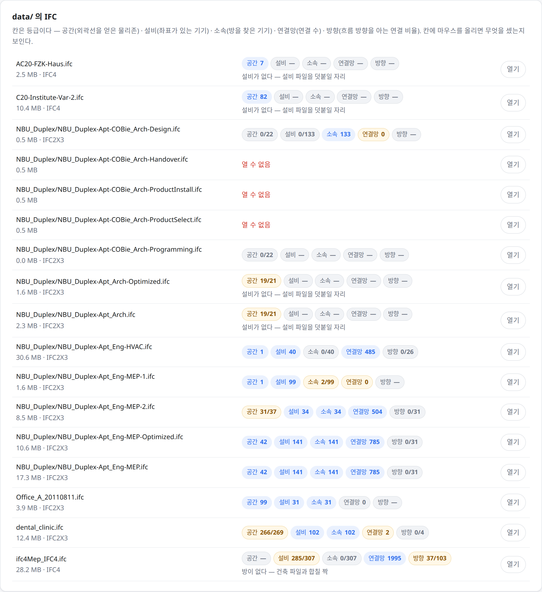

*그림 16. 파일 목록의 등급 칩. 공간(외곽선을 얻은 물리존) · 설비(좌표가 있는 기기) · 소속(방을 찾은 기기) ·
연결망(연결 수) · 방향(흐름 방향을 아는 기기 비율). Duplex COBie 판본 셋은 파일 구문 오류로 열리지 않는다(R0)*

### 3.6 넓힐 수 있는데 아직 하지 않은 것

IFC에 자리가 있는지, 실제 파일이 채웠는지, 우리 코드가 읽는지를 따로 적는다. 마지막 열이 중요하다.
**기존 온톨로지가 쓰는 술어가 `feeds`·`hasLocation`·`hasPart`·`hasPoint` 넷뿐이라서**(5장), 클래스로
나가는 확장은 부담이 없지만 새 술어가 필요한 확장은 `ieum-pipeline`과 먼저 맞춰야 한다.

| 확장 | DT가 쓰는 곳 | IFC의 자리 | 실측 | 지금 | 어디로 나가나 |
|---|---|---|---|---|---|
| 방 종류 | Agent의 "회의실", 탐색기 | `IfcSpace.PredefinedType`, OmniClass Table 13 속성 | `PredefinedType` 0/4 파일. OmniClass Duplex 건축 **21/21**, AC20 0/7 | 방 이름 사전으로 Brick 방 하위 클래스(`brick:Office`, `brick:Restroom` …). 성수 건축 159/934. 표준 필드(OmniClass)는 아직 읽지 않는다 | TTL 클래스. 술어가 늘지 않는다 |
| 방 높이 | 3D Map(복층·층고) | `Qto_SpaceBaseQuantities.Height` | AC20 **7/7**(2.5m·4m) | 층 높이만 | GeoJSON |
| 방-문-방 연결 | 로봇 경로, 피난 | 문이 걸린 `IfcRelSpaceBoundary` | 두 방을 잇는 문 AC20 3/5, Duplex 건축 **9/14**. COBie 판본은 경계가 없어 0 | 읽지 않는다 | **새 술어가 필요하다.** 정해야 한다 |
| 벽·문·창 위치 | 3D Map, 로봇 | `ObjectPlacement` + 형상 | 확인한 파일 전부 있다 | **내보내지 않는다**(두께·치수만). 벽 형상은 3D에서 내력벽을 보이는 데만 쓴다 | GeoJSON |
| 설비 종류 → Brick 클래스 | 이상 알림 분류, Agent | IFC4 구체 클래스·`PredefinedType`. IFC2x3은 `ObjectType` 문자열뿐 | `PredefinedType` 말단 기준 0%. ifc4Mep은 구체 클래스가 있다 | Revit 패밀리 이름 사전(25종)과 IFC4 클래스로 Brick 클래스. 사전에 없으면 `ex:FlowTerminal` 등 | TTL 클래스 |
| 유체 종류 | 계통도(냉수·온수·급수·오수) | Revit `System Type` 속성, `IfcSystem` 의 ObjectType | Duplex MEP 811/926, 성수 기계 계통 1,037개 전부 | 계통 종류(급기·환기·배기·순환수 공급/환수·급탕·급수)를 읽어 규칙 방향에 쓴다. TTL 로는 아직 내보내지 않는다 | TTL 계통 클래스 |
| 자산 정보 | 자산 관리, 유지보수 | COBie 속성(시리얼·보증·수명) | Duplex MEP **926/926** | 읽지 않는다 | 온톨로지 밖(자산 대장)이거나 새 술어. 정해야 한다 |
| 담당 공간(근사) | 계통도 "이 공조기가 담당하는 방" | `IfcSystem`(기기+말단) + F11 | 조건을 갖춘 파일 0 | 하지 않는다 | 추정이라 `brick:feeds`로 내면 안 된다. 표기를 정해야 한다 |
| 공조존 | 계통도, 용량 검증(Z-03) | `IfcZone`, `IfcSpatialZone`, `VentilationZoneName` | 자리는 있다. **값은 0**(템플릿 기본값, `IfcZone`은 세대 구분) | 읽지 않는다 | `brick:Zone` |
| 센서가 재는 설비 | `brick:hasPoint`의 주인 | `IfcRelFlowControlElements` | ifc4Mep 센서 7, 관계 **0** | 센서를 설비로 읽는다 | `brick:hasPoint` |
| 지도 좌표 | 3D 스캔·GIS 정합 | `IfcMapConversion`(LoGeoRef 50) | **0/4.** 위경도(`IfcSite`, LoGeoRef 20)만 있다 | 읽지 않는다 | GeoJSON 변환 |

### 3.7 값의 출처: BIM이 준 것, 계산한 것, 사전으로 정한 것

하나의 온톨로지 안에도 BIM이 직접 말한 값과 우리가 만든 값이 섞여 있다. 3.3과 3.4에서 본 것처럼 설비 소속은
좌표로 계산하고, Proxy 설비의 종류와 규칙 방향은 사전으로 정한다. **TTL에는 출처가 따라가지 않으므로, 받는
쪽은 둘을 구별할 수 없다.** 그래서 만드는 쪽에서라도 구별해야 한다. 에디터는 화면에 올리는 값마다 아래 셋
중 하나를 표시로 붙인다.

| 출처 | 뜻 | 무엇이 틀리면 같이 틀리나 | 해당하는 값 |
|---|---|---|---|
| BIM | 파일에 적힌 그대로다 | BIM 파일 | 층·방·외곽선, 설비 목록·좌표·형상, 계통, 포트로 이은 연결과 포트가 말한 방향, BIM이 직접 말한 소속 |
| 계산 | BIM의 좌표와 형상만으로 계산했다. 바깥 지식은 들어가지 않지만 BIM이 직접 말한 것은 아니다 | 계산 규칙(벽면 여유 5cm, 맞닿음 판정 등) | 좌표로 판정한 소속(F11), 형상이 맞닿아서 추정한 연결, 배치점 대신 형상 중심을 쓴 좌표, 건축·설비 파일 합치기, 포트가 있어서 설비로 받은 Proxy |
| 사전 | 이름 사전과 흐름 규칙으로 정했다. 도메인 지식이 들어간 값이다 | 사전 | 설비·방·계통 종류, Brick 클래스, 규칙 방향, 관제점 후보, 이름만으로 설비로 받은 Proxy |

성수 기계 파일을 예로 들면 다음과 같다. 기기 3,472대 중 1,820대는 BIM이 설비 클래스로 준 것이다. 나머지
1,652대는 Proxy이고, 그중 1,578대는 포트가 있어서 받았고(계산) 74대는 이름이 사전에 있어서 받았다(사전).
연결 19,515개는 전부 포트로 이었고(BIM), 그중 8,702개는 포트가 방향을 말했다(BIM). 규칙으로 방향을 준
연결은 5,457개다(사전). 3D에서는 포트가 말한 상류·하류를 진한 색으로, 규칙으로 정한 상류·하류를 옅은
색으로 칠한다.

**파일 목록의 등급 칩도 계산과 사전이 들어간 값이다.** 등급은 앱과 같은 임포터로 재므로 Proxy를 설비로 받은
뒤의 숫자가 나온다. 성수 기계 파일의 방향 칸은 1,903/2,929이지만, BIM이 설비 클래스로 준 기기만 세면
413/1,361이다(3.4). 고객사에 "이 BIM으로는 여기까지 나옵니다"라고 말할 때는 이 차이를 같이 말해야 한다.

내보내기에서는 둘을 다르게 다룬다. 사전으로 정한 Brick 클래스는 BIM이 말한 클래스와 같은 모양으로 TTL에
나간다. 클래스가 틀려도 관계는 그대로 남기 때문이다. 반면 규칙 방향은 `brick:feeds` 관계 자체를 만들기 때문에
사람이 계통 단위로 확정한 것만 나간다(3.4).

---

## 4. 고객사 BIM 요구사항

필수와 권장을 가르는 기준은 DT가 첫날 쓰는 화면이다. **필수는 등급 0·1·2를 여는 것이다.** 탐색기 트리
(공간 계층), 3D Map(외곽선), 이상 알림의 발생 위치(설비 소속)가 이 세 등급에 걸려 있다. 등급 3 이상을 여는
것은 권장이고, 없으면 무엇이 안 되는지를 보여 주며 협의한다. 등급 5의 본체(관제점 ID, 실시간 값)는 IFC 밖의
정보라 요구사항에 넣지 않는다. 다만 IFC에 자리가 있는 공조존·센서 관계(R20·R21)는 권장으로 둔다.

각 요구에는 확인할 IFC 엔티티·속성을 함께 적고, 우리 샘플이 통과했는지를 옆에 둔다. 고객사와 우리가 같은
기준으로 통과 여부를 판정하기 위해서다. 확인할 자리가 IFC 속성이면 IDS로 옮길 수 있고, 기하이면 우리가
파일을 열어 확인해야 한다(4.6).

### 4.1 필수 (등급 0·1·2)

| # | 요구 | 확인하는 자리 | 등급 | 실측 | 없으면 |
|---|---|---|---|---|---|
| R0 | 파일이 STEP 구문 검사를 통과할 것 | 파서가 연다(web-ifc) | 전제 | **Duplex COBie 판본 5개 중 3개가 열리지 않는다.** 문자열 속 피트·인치 표기 `'Atherton 6'8" Smooth'`의 작은따옴표가 `''`로 이스케이프되지 않았다 | 파일 전체를 읽지 못한다. 일부만 읽는 방법은 없다 |
| R1 | 층이 있고, 층 이름이 **DT 층 표기와 같고 분야별 파일끼리도 같을 것** | `IfcBuildingStorey.Name` | 0·2 | Duplex 건축·MEP·HVAC 이름 일치(층 GUID는 다름) | 층을 손으로 맞춰야 하고, 건축·설비 파일을 합칠 수 없다 |
| R2 | 모든 층에 `IfcSpace`가 있고, 바닥 외곽선이 **FootPrint 또는 Body/SweptSolid**일 것 | `IfcShapeRepresentation`의 식별자·종류 | 0 | AC20 7/7, Duplex 건축 19/21(나머지 2개 SurfaceModel), COBie 0/22 | 물리존이 생기지 않는다. Brep·SurfaceModel은 우리가 읽지 못한다 |
| R3 | 공간 이름과 방 번호, **방 번호는 분야별 파일끼리 같게** | `IfcSpace.Name`·`LongName` | 0·2 | 전부 있음. Duplex A201은 양쪽 다 A201 | 표시할 이름이 없다. 합칠 때 외곽선을 빌려 올 수 없다 |
| R4 | 벽·슬래브·문·창, 벽 재료층, 개구부 관계 | `IfcWall`·`IfcSlab`·`IfcDoor`·`IfcWindow`, `IfcMaterialLayerSetUsage`, `IfcRelVoidsElement`·`IfcRelFillsElement` | 0 | AC20 벽 두께 13/13, 개구부 소속 16/16 | 3D Map을 그리지 못한다(슬래브는 아직 우리가 읽지 않는다) |
| R5 | 공간 경계 | `IfcRelSpaceBoundary` | 0 | AC20 81건(물리존에 걸린 것 66), Duplex 건축 265건, COBie 0 | 벽을 고칠 때 영향받는 방을 모르고, 방-문-방 연결을 만들지 못한다 |
| R6 | 길이 단위 선언 | `IfcUnitAssignment` | 0 | 확인한 파일 전부. 미터·밀리미터·피트가 섞여 있었다 | 좌표가 1,000배나 3.28배로 들어온다. 오류는 나지 않는다 |
| R7 | 3D 스캔과 같은 원점·북방향 | `IfcMapConversion`(LoGeoRef 50) 또는 합의한 기준점 | 0 | **0/4**(위경도만 있다) | 오류 없이 통째로 어긋난다. **협의의 첫 항목이다** |
| R8 | 형상 정확도 LOD 300 이상 | IDS로는 확인할 수 없다. 3D로 연다 | 0 | 해당 없음 | 벽 두께와 위치가 개략이라 스캔과 맞지 않는다 |
| R9 | MEP 포함 | `IfcDistributionElement` 하위 | 1 | 건축 파일 0, 설비 파일에만 있다 | 설비가 0이다 |
| R10 | 형식 IFC4 (ADD2 TC1 이상) | 파일 헤더 `FILE_SCHEMA` | 1 | ifc4Mep만. Duplex는 전부 IFC2x3 | **설비 종류를 표준 필드로 알 수 없다.** IFC2x3은 전부 `IfcFlowTerminal` 같은 추상 클래스다 |
| R11 | 설비마다 좌표, **배치점이 자기 형상 위에** | `ObjectPlacement` | 1 | ifc4Mep 2,174/2,202. Duplex HVAC 덕트 231개가 층 원점 | 미배치 목록으로 빠진다. 원점에 찍히면 원점이 든 방에 몰린다(지금은 형상 중심으로 보정한다) |
| R12 | 건축과 설비가 **같은 좌표계** | 우리가 잰다(설비가 건축 공간 범위에 드는 비율) | 2 | Duplex 100%. 다른 건물을 합치면 2% | 설비 소속이 오류 없이 틀린다 |
| R13 | GUID 유지 설정 | 재내보내기 전후의 `GlobalId` | 해당 없음 | 재내보내기 샘플이 없어 재지 못했다 | 재임포트 때 같은 공간을 같은 것으로 알아보지 못한다 |

### 4.2 권장 (등급 0+·3·4·4+·5)

| # | 요구 | 확인하는 자리 | 등급 | 실측 | 없으면 |
|---|---|---|---|---|---|
| R14 | 방 분류 | `IfcSpace.PredefinedType` 또는 OmniClass Table 13 | 0+ | Duplex 21/21(OmniClass), AC20 0 | 모든 방이 `brick:Room` 하나로 나간다 |
| R15 | 방 높이 | `Qto_SpaceBaseQuantities.Height` | 0+ | AC20 7/7 | 층 높이로 대신한다. 복층을 모른다 |
| R16 | 모든 MEP 요소에 솔리드가 있고, **이어진 요소끼리 맞닿거나 겹칠 것** | 형상. 우리가 연다 | 3 | Duplex MEP 연결망 34조각, 103대가 접합 부재 없음 | 포트가 없을 때 연결을 형상으로도 되살리지 못한다 |
| R17 | 계통 묶음, **계통 이름은 분야별 파일끼리 같게** | `IfcSystem`(없으면 Revit `System Name`으로 대신) | 3 | ifc4Mep 37, Duplex COBie 10, Duplex 일반 판본 0(속성으로 대신) | 어느 설비가 어느 계통인지 모른다 |
| R18 | 포트, **연결마다 한쪽에는** 흐름 방향 SOURCE 또는 SINK. **원천 기기(보일러·펌프·공조기)도 모델에 있을 것** | `IfcDistributionPort.FlowDirection` | 4 | 연결 단위 ifc4Mep 100%·Duplex HVAC 39%. **기기 단위 37/103·0/26** | `brick:feeds`가 기기에 닿지 않는다 |
| R19 | 계통에 **공조기와 말단을 같이** 묶을 것 | `IfcRelAssignsToGroup`의 구성 | 4+ | ifc4Mep 2/37, Duplex 0/34 | 포트가 없을 때 "이 공조기가 담당하는 방"을 근사할 방법이 없다 |
| R20 | 공조존을 실제 값으로 | `IfcZone`·`IfcSpatialZone` 또는 `VentilationZoneName` | 5 | 자리 있음, 값 0 | IDF에서 받거나 사람이 만든다(PRD #11) |
| R21 | 센서가 재는 설비 | `IfcRelFlowControlElements` | 5 | 0 | 관제점의 주인을 사람이 잇는다 |
| R22 | 용량 파라미터 (**LOD 400**) | 표준 Pset 이름이면 IDS로 확인한다 | 해당 없음 | Duplex HVAC 155/498(비표준 `Flow`), ifc4Mep 0 | 용량 검증(Z-03)을 돌리지 못한다. LOD 300에서는 기대하지 말고 설비 대장을 따로 받는다 |
| R23 | 벽의 Structural 속성 | `Pset_WallCommon.LoadBearing` | 해당 없음 | AC20 0/13 | 내력벽 편집 제한이 걸리지 않는다 |
| R24 | `IfcBuildingElementProxy`를 쓰지 말 것 | 클래스 | 해당 없음 | ifc4Mep 49, 성수 기계 1,658(FCU·공조기·히트펌프·디퓨저) | 종류를 이름으로 추정해야 하고, 이름이 사전에 없으면 역할도 종류도 모른다 |

**R18은 완화된 형태로 먼저 제시한다.** "모든 포트에 SOURCE/SINK"는 저작 도구가 잘 지원하지 않는다
(Duplex HVAC의 61%가 `SOURCEANDSINK`). "연결마다 한쪽만"은 훨씬 쉽고 그것으로 충분하다. 한쪽이 SOURCE이면
반대쪽은 SINK일 수밖에 없다(Lilis 2025).

**R17의 계통 이름**은 파일을 합칠 때 필요하다. Duplex의 MEP-1은 `Unit A Hydronic Supply In`, MEP-2는
`Hydronic Supply Unit A`로 같은 계통을 다르게 적었다. 규칙을 추측해 맞추면 다른 계통을 하나로 묶을 위험이
있어서 코드로는 맞추지 않는다.

**표준 Pset 이름으로 요구하면 고객사에 Revit 설정을 바꾸라고 요청하는 셈이다.** 실측한 Revit 파일은 전부
`PSet_Revit_*`로 내보냈다. IDS로 옮길 때 이 점을 함께 전달한다(`docs/research.md` §4).

### 4.3 없어도 되는 것

마감, 가구, 구조 해석, 상세 접합, 렌더 재질은 DT가 쓰지 않는다. 요구 목록에 넣으면 협의만 길어진다.

### 4.4 빠졌을 때의 대응: 다시 요청(1안)과 에디터 보완(2안)

주간보고 W39에서 BIM에 유실된 정보가 있을 때 두 방안이 나왔다. 1안은 무엇이 빠졌는지 알려 주고 고객사가
BIM을 고쳐 다시 올리게 하는 것이고, 2안은 BIM으로 1차 생성한 뒤 부족한 부분을 레이아웃 에디터로 고치는
것이다. **둘 중 하나를 고르지 않고, 빠진 것의 종류로 가른다.** 경계는 "계산으로 되살릴 수 있는가"이다.

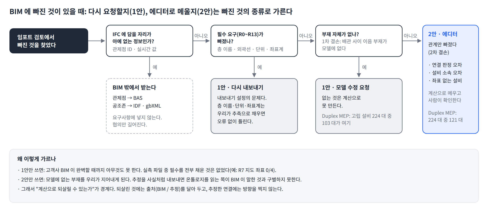

*그림 17. 빠진 것의 종류에 따라 1안과 2안을 가르는 흐름*

| 빠진 것 | 예 | 대응 |
|---|---|---|
| IFC에 담을 자리가 없는 정보 | 관제점 ID, 실시간 값 | BIM 밖(BAS·IDF)에서 받는다. 요구사항에 넣지 않는다 |
| 필수 요구(R0~R13) | 층 이름, 외곽선, 단위, 좌표계 | **1안.** 내보내기 설정의 문제다. 우리가 추측으로 채우면 오류 없이 틀린다 |
| 부재 자체(1차 결손) | 배관 사이 이음 부재가 모델에 없음 | **1안.** 없는 것은 계산으로 만들 수 없다. Duplex MEP의 고립 설비 224대 중 103대 |
| 관계만(2차 결손) | 연결 판정 오차, 설비 소속 오차, 좌표 없는 설비 | **2안.** 계산으로 메우고 사람이 에디터에서 확인한다. Duplex MEP의 224대 중 121대 |

1안만 쓰면 고객사 BIM이 완벽해질 때까지 아무것도 할 수 없다. 실측 파일 중 필수 요구를 전부 채운 것은
없었다(R7 지도 좌표는 0/4). 2안만 쓰면 모델에 없는 부재를 우리가 지어내게 된다. 추정을 사실처럼 내보내면
온톨로지를 읽는 쪽이 BIM이 말한 것과 구별하지 못한다. 그래서 계산으로 되살린 것에는 출처(BIM / 추정)를
함께 저장하고, 추정한 연결에는 방향을 붙이지 않는다.

### 4.5 PRD #6 요구사항 ①~⑦과의 대응

PRD #6의 "BIM 내보내기 요구사항(고객사 전달용)" ①~⑦을 위의 R 번호로 옮기면 다음과 같다. PRD는 규격이 담을
수 있는 것을 기준으로 적었고, 이 문서는 실제 파일에 들어 있던 것을 기준으로 필수와 권장을 나눴다. 그래서
두 항목의 등급이 다르다.

| PRD #6 | 이 문서 | 차이 |
|---|---|---|
| ① Space 요소로 모델링(Room 아님) | R2, R3 | IFC에서는 Room과 Space가 둘 다 `IfcSpace`로 나온다. ①은 gbXML 내보내기에 필요한 설정이고, IFC 쪽에서는 방 번호를 분야별 파일끼리 같게 하는 것(R3)이 대응한다 |
| ② 설비 용량 파라미터 기입 | R22 | **권장.** 용량은 LOD 400 수준의 정보다. 실측 Revit 파일은 비표준 속성 이름으로 일부만 채웠다 |
| ③ Air Terminal이 System에 연결 | R17, R19 | 권장. R19는 "공조기와 말단을 같은 계통에"까지 요구한다 |
| ④ 공유 좌표 | R7, R12 | 필수. R12는 건축·설비 파일끼리 같은 좌표계를 요구한다 |
| ⑤ Level 이름을 DT 층 표기와 일치 | R1 | 필수. 분야별 파일끼리도 같아야 한다 |
| ⑥ 형식 IFC4 (MEP 포함) | R9, R10 | 필수. IFC2x3에서는 설비 종류를 표준 필드로 알 수 없다 |
| ⑦ 벽에 Structural 속성 기입 | R23 | **권장.** 실측 샘플은 전부 비어 있었다 |
| (PRD에 없음) | R0, R2, R4~R6, R8, R11, R13 | PRD에 추가할지 협의가 필요하다 |

PRD 1.6의 "파일별 제공 가능 정보" 표에서 IFC의 내력벽·설계 풍량이 ◎로 적혀 있는 것도 같은 차이에서 온다.
규격에 자리가 있다는 것과 고객사 파일에 값이 있다는 것은 다르다.

PRD 5장은 MVD로 IFC4 Reference View를 권한다. Reference View에 공간 경계(R5)·계통(R17)·포트(R18)가
담기는지는 아직 확인하지 않았다.

### 4.6 요구사항을 파일로 확인하는 방법

필수와 권장의 설비 쪽을 담은 IFC4 파일이 `src/lib/ifc/fixtures/mep.ifc`에 있다. 설비마다 좌표가 있고,
용량 파라미터가 붙고, `IfcSystem`으로 묶이고, 포트로 연결된다. 빠진 경우도 일부러 넣어 두었다. 용량이 없는
토출구가 하나 있고, 좌표가 없는 센서가 하나 있다. 문서로 설명하는 대신 이 파일을 우리 임포터에 넣어 보면
무엇이 되고 무엇이 안 되는지 그대로 보인다.

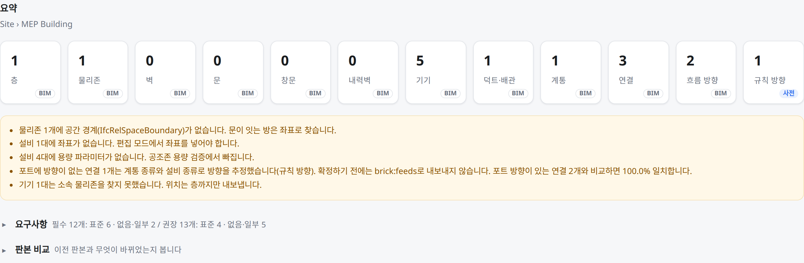

*그림 18. `mep.ifc`를 연 검토 화면. 좌표가 없는 센서와 용량이 없는 설비를 경고로 알려 준다*

다음 단계는 확인할 자리가 IFC 속성인 요구(R1·R3·R6·R10·R14·R15·R17·R18·R20~R24)를
`docs/requirements.ids`로 옮기는 것이다. 기하로만 확인할 수 있는 R2·R7·R8·R11·R12·R16은 IDS로 쓸 수 없고
우리가 파일을 열어 확인해야 한다.

---

## 5. BIM이 못 주는 것과 채우는 곳

| 피처 | 출처 | 비고 |
|---|---|---|
| F12 공조존 | IDF 또는 gbXML | 없으면 설비 담당 지정으로 수동 생성한다(PRD #11). BIM이 `IfcZone`에 실제 공조존을 담아 주면 여기서 받을 수 있다 |
| F13 관제점 | BAS | 설비 ID와 관제점 ID를 잇는 작업이 따로 필요하다. 센서가 어느 설비를 재는지(`IfcRelFlowControlElements`)는 BIM에 담을 자리가 있으나 실측 0이다 |
| F14 커스텀존 | 운영자 | 물리존 위에 다각형으로 지정한다 |
| F11 설비 소속 물리존 | 계산 | 좌표와 외곽선으로 판정한다. 편집·합치기 때마다 다시 계산해야 한다. 설비 파일에 방이 없으면 건축 파일과 합쳐야 한다 |
| 좌표 정합 | 3D 스캔 대조 | BIM의 공유 좌표가 스캔과 맞는지 임포트 단계에서 확인한다 |

기존 SR 온톨로지는 설비와 관제점만 있고 기하가 없다. 술어가 `feeds`, `hasLocation`, `hasPart`, `hasPoint`
넷뿐이며 좌표가 하나도 들어 있지 않다. BIM이 채우는 것이 정확히 그 빠진 절반이므로, 둘을 합칠 때 어느 쪽 ID를
기준으로 삼을지를 먼저 정해야 한다. PRD 1.7은 "물리존·설비·공조존 ID는 온톨로지 ID를 그대로 사용한다"고
적었고, BIM에서 온 것의 ID(GUID)와 기존 온톨로지 ID를 어떻게 맞출지는 아직 정하지 않았다.

---

## 6. 편집 기능

편집은 3D 모델을 고치는 일이 아니라 **온톨로지를 고치는 일**이다. 차이는 한 번의 편집이 무엇을 무효로
만드는가에 있다. 벽을 하나 옮기면 물리존 경계가 바뀌고, 경계가 바뀌면 그 안에 있던 설비의 소속이 바뀌고,
소속이 바뀌면 이상 알림의 발생 위치와 탐색기 트리가 같이 바뀐다. 편집기가 할 일은 그 연쇄를 빠뜨리지 않고
다시 계산하는 것이다.

### 6.1 무엇을 고칠 수 있어야 하나

| # | 편집 | 바뀌는 피처 | 다시 계산해야 하는 것 | PRD |
|---|---|---|---|---|
| E1 | 물리존 이름 수정 | F3 | 없다 | #9 |
| E2 | 물리존 경계 수정 | F2 | F11 설비 소속, 면적 | #9, #12 ① |
| E3 | 물리존 생성·삭제·분할·병합 | F1, F2 | F11 설비 소속, 공간 계층 | #9, #12 ① |
| E4 | 벽·문·창 추가·삭제·이동 | F4, F5 | F2 물리존 경계, F15 로봇 통과 | #10 |
| E5 | 설비 이동 | F9 | F11 설비 소속 | #13 |
| E6 | 미배치 설비 배치 | F9 | F11 설비 소속 | #13 |
| E7 | 설비 추가·삭제·이름 수정 | F8 | F10 계통, F13 관제점 연결 | #13 |
| E8 | 계통 연결 수정 | F10 | 공조존 담당 관계 | #14 |
| E9 | 공조존 경계·담당 수정 | F12 | 계통도, serviceSpace(설비가 담당하는 공간) | #11 |
| E10 | 커스텀존 지정 | F14 | Agent 질의 대상 | #9 |
| E11 | 관제점 ID 수정 | F13 | 없다 | 주간보고 W39 추가 요구. PRD 번호 없음 |

**E2와 E5가 편집기의 성격을 보여 준다.** 둘 다 화면에서는 똑같이 보이지만, 온톨로지에서는
`brick:hasLocation` 한 줄이 바뀐다. 그 한 줄이 이상 알림의 발생 위치다. 편집기가 3D 모델 편집기와 다른
지점이 여기다.

**E11은 BIM과 무관하다.** 관제점은 BAS에서 오고, 설비의 관제점이 교체되는 일이 실제로 생긴다. 그래서 BIM을
다시 받지 않고도 ID를 고칠 수 있어야 한다.

### 6.2 편집기가 갖춰야 할 성질

| 성질 | 이유 | PRD |
|---|---|---|
| 편집 전후의 차이를 보여 준다 | 무엇이 바뀌는지 모르고 반영하면 되돌릴 근거가 없다 | #16, #21 |
| 부분 반영을 만들지 않는다 | 기하만 바뀌고 의미가 안 바뀌면 두 파일이 어긋난다 | #17, #20 |
| 되돌릴 수 있다 | 재계산이 잘못되면 이전 판으로 돌아가야 한다 | #19 |
| 재임포트와 편집분을 구분한다 | BIM을 다시 받을 때 손으로 고친 것을 덮어쓰면 안 된다 | #6 (임포트 출처 구분) |
| 한 층을 한 사람만 편집한다 | 같은 층을 둘이 고치면 재계산 결과가 갈린다 | #2 (편집 잠금) |

마지막 둘은 편집 결과를 어디에 저장하는지가 정해져야 구현할 수 있다(PRD 1.7의 데이터 교환 방식). 앞의 셋은
저장 위치와 무관하므로 먼저 만든다.

### 6.3 지금 만든 범위

E1, E2, E5, E6을 만들었다. 넷 다 같은 구조로 되어 있다. 값을 고치고, 설비 소속을 다시 판정하고, 무엇이
바뀌었는지를 돌려준다.

E2가 그중 가장 넓게 영향을 준다. 물리존의 꼭짓점 하나를 옮기면 넓이가 다시 계산되고, 경계 밖으로 밀려난
설비의 `brick:hasLocation`이 바뀐다. `mep.ifc`에서 확인한 모습은 이렇다.

```
사무실의 오른쪽 두 꼭짓점 x 를 10 에서 5 로

  사무실  80.0㎡ → 40.0㎡
  AT-101-02  사무실 → (소속 없음)      좌표 (7,4) 가 경계 밖으로 나갔다
  LIGHT-101-01  사무실 그대로           BIM 이 소속을 말해 둔 설비다
```

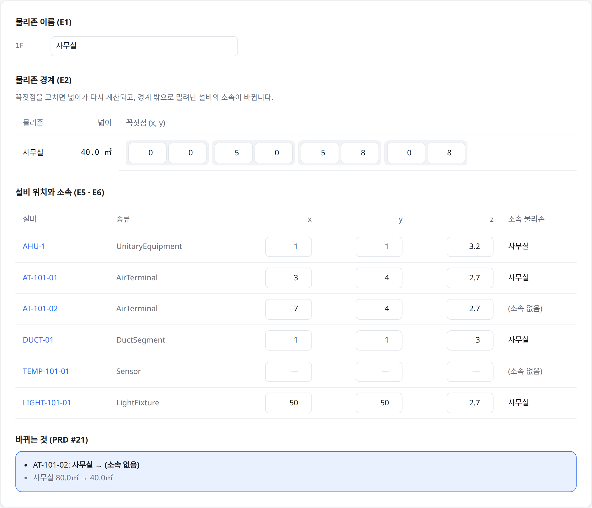

*그림 19. 같은 편집을 화면에서 한 결과. 넓이와 설비 소속이 함께 바뀌고, 바뀐 것이 리포트(PRD #21)에 남는다*

마지막 줄이 이 설계의 요점이다. BIM이 소속을 명시한 설비는 좌표가 경계 밖이어도 소속을 유지한다. 설계자가
정한 값이 좌표 판정보다 정확하기 때문이다.

다각형이 자기 자신과 교차하면 알리되 막지는 않는다. 꼭짓점을 끌다 보면 잠깐 교차했다가 풀리는 일이 흔해서,
그때마다 조작을 되돌리면 편집을 할 수 없다.

---

## 7. 지금 상태와 남은 일

| 구분 | 상태 |
|---|---|
| 공간 골격 임포트(F1, F2, F3) | 된다. 실제 모델로 확인했다 |
| 설비 임포트(F8, F9, F10) | 된다. 실제 IFC4 MEP 모델(설비 2,202 · 계통 37)로 확인했다 |
| 설비 소속 판정(F11) | 된다. BIM이 말한 소속 167건 대비 95.8%가 맞는다(벽면 여유 5cm) |
| 설비 연결(F16) | 된다. 포트에서 읽고, 포트가 없으면 형상으로 추정하되 방향은 비워 둔다. 추정의 정밀도 79.5% · 재현율 75.8% |
| 기기와 도관 구분 | 된다. IFC 클래스 계층에서 역할을 읽어 기기와 덕트·배관을 따로 센다. 도관은 Brick이 아니라 `fso:Segment`·`fso:Fitting`으로 나간다 |
| 내보내기 | 된다. 기하는 GeoJSON, 의미는 Brick TTL로 나간다. 방향을 아는 연결만 `brick:feeds`로, 기기에는 덕트를 건너뛴 하류 기기까지 나간다. DT 쪽 파서로 실제로 읽히는지 확인한다(부록 C) |
| 길이 단위 변환 | 된다. 미터·밀리미터·피트를 확인했다 |
| 벽 두께, 개구부 치수, 공간 경계(F4, F5, F6) | 된다. **벽·문·창의 위치는 내보내지 않는다.** 벽 형상은 3D에서 내력벽을 켜고 끄는 데만 읽는다(성수 건축 벽 1,291개 중 내력 351 · 비내력 913 · 모름 27). 3D Map과 로봇 경로가 위치를 기다린다 |
| 파일 목록의 등급 칩 | 된다. 앱과 같은 임포터로 파일마다 공간·설비·소속·연결망·방향을 재서 목록에 보여 준다. 열 수 없는 파일은 이유와 함께 "열 수 없음"으로 표시한다 |
| 3D로 확인 | 된다. 설비·배관을 실제 형상으로 그리고, 계통별로 색을 나누고, 고른 설비의 상류·하류를 칠한다 |
| 건축 모델과 설비 모델 합치기 | 된다. 층은 이름으로 맞추고, 좌표계가 어긋나면 경고한다. Duplex 건축+HVAC에서 기기 40대 전부 소속 |
| 로봇 통과 여부(F15) | 개구부 하나의 통과 여부까지 된다. 방-문-방 연결 그래프는 아직이다(공간 경계에 재료는 있다) |
| Proxy 설비와 종류 사전 | 된다. 포트가 있거나 이름이 사전에 있는 Proxy 를 설비로 읽고, 설비 25종·방 14종·계통 8종을 이름으로 가른다 |
| 규칙 방향 | 된다. 계통 종류와 설비 종류로 방향을 정하고, 포트 방향과의 일치율을 계통별로 보인다. 사람이 확정한 계통만 `brick:feeds` 로 나간다. 순환수 환수·급탕은 원천을 못 찾는다 |
| 값의 출처 표시 | 된다. 화면의 값마다 BIM·계산·사전 중 무엇인지 붙이고, 3D에서 규칙 방향을 옅은 색으로 가른다(3.7) |
| 관제점 후보(F13) | 감지기·CCTV 를 종류와 소속 방까지 보인다. 관제점 ID 를 잇는 일(BAS)은 아직이다 |
| 편집 | E1, E2, E5, E6과 규칙 방향 확정만 있다 |
| 공조존(F12) | 착수하지 않았다. IDF에서 받는 것이 기본이다. IFC의 자리(`IfcZone`)는 실측 파일이 비워 두어서 읽을 것이 없다 |
| IDS 요구사항 파일 | 없다. 4.6의 속성 요구부터 옮긴다 |

---

## 부록 A. 실측 샘플 파일

본문은 오른쪽의 짧은 이름을 쓴다. 공개 파일은 `npm run fetch:sample`로 `data/`에 받는다(저장소에는 커밋하지 않는다). 성수 파일은 받을 곳이 없어서 개발 PC와 55에만 있다.

| 짧은 이름 | 파일 | 스키마 | 출처 · 비고 |
|---|---|---|---|
| AC20-FZK-Haus | `AC20-FZK-Haus.ifc` | IFC4 | web-ifc 테스트 모델. ArchiCAD 출력 |
| C20-Institute | `C20-Institute-Var-2.ifc` | IFC4 | web-ifc 테스트 모델 |
| Office_A | `Office_A_20110811.ifc` | IFC2x3 | web-ifc 테스트 모델. 설비는 위생·안전 기구 |
| dental_clinic | `dental_clinic.ifc` | IFC2x3 | web-ifc 테스트 모델. 설비는 위생·안전 기구 |
| ifc4Mep | `ifc4Mep_IFC4.ifc` | IFC4 | opensourceBIM/TestFiles. 설비만 있고 방이 없다. 포트가 완전해서 연결 추정의 정답지로 쓴다 |
| Duplex 건축 | `NBU_Duplex/NBU_Duplex-Apt_Arch.ifc` (`…_Arch-Optimized.ifc`도 같다) | IFC2x3 | NIBS · DURAARK. Revit 출력 |
| Duplex HVAC | `NBU_Duplex/NBU_Duplex-Apt_Eng-HVAC.ifc` | IFC2x3 | 포트 970, 단위 밀리미터 |
| Duplex MEP | `NBU_Duplex/NBU_Duplex-Apt_Eng-MEP.ifc` (Solibri 최적화본 `…_Eng-MEP-Optimized.ifc`도 수치가 같다) | IFC2x3 | 설비 926, 포트 0, 설비 167대가 방에 직접 매달려 있어 소속 판정의 정답지로 쓴다 |
| Duplex MEP-1 · MEP-2 | `NBU_Duplex/NBU_Duplex-Apt_Eng-MEP-1.ifc`, `…-MEP-2.ifc` | IFC2x3 | 같은 모델의 다른 설계 단계 판본(GUID가 6개만 겹친다). MEP-1은 단위가 피트이고 배관이 없다 |
| Duplex COBie | `NBU_Duplex/NBU_Duplex-Apt-COBie_Arch-*.ifc` 5개 | IFC2x3 | 시설관리 인수용. 계통 10, 형상 표현 없음. 3개는 구문 오류로 열리지 않는다(R0) |
| 성수 건축 | `성수/Factorial_건축.ifc` (84MB) | IFC2x3 | 고객사 실측 파일. Revit 2024 한국어판 출력. 19개 층, 물리존 934개 |
| 성수 기계 | `성수/Factorial_기계.ifc` (203MB) | IFC2x3 | 고객사 실측 파일. 방이 없어서 성수 건축과 합쳐야 소속이 나온다. 계통 1,037, 덕트·배관 15,864, `IfcBuildingElementProxy` 1,658개 |

## 부록 B. 수치를 다시 재는 방법

```bash
npm run fetch:sample   # 실측 샘플을 data/ 로 받는다
npm run check:sample   # 개수와 넓이, 확장 여지, 형상 추정 정확도를 기준값과 대조한다
npm test               # 임포트와 내보내기 규칙을 확인한다
```

이 문서의 수치는 `npm run check:sample`에 기준값으로 들어 있다. 코드를 고쳐 값이 바뀌면 이 명령이 실패하므로
바로 알 수 있다. 파일별 상세 표는 `docs/ifc-coverage.md`에 있다.

설비가 든 모델인지 세어 보려면 다음과 같이 한다.

```bash
grep -oE "^#[0-9]+= *IFC[A-Z0-9]+" 모델.ifc | sed -E 's/.*= *//' | sort | uniq -c | sort -rn | head -30
```

기존 SR 온톨로지의 클래스와 술어를 세는 방법은 다음과 같다.

```bash
F=~/git/dt/ieum-pipeline/data/ontology/SR_Building_ontology_260723.ttl
grep -oE '\ba\s+(brick|ex):[A-Za-z_]+' $F | awk '{print $2}' | sort | uniq -c | sort -rn | head
grep -oE '\b(brick|rdfs):[a-z][A-Za-z_]*' $F | sort -u
```

그림은 `docs/figures/`에 있다. 개념도는 SVG가 원본이고 `node scripts/figures/render.mjs`로 PNG를 만든다. 앱
화면은 `npm run dev`를 띄운 뒤 `node scripts/figures/capture.mjs`로 다시 찍는다.

## 부록 C. 레이아웃 에디터 참고

온톨로지 저장 형식(IMDF·Brick 등)은 지금 논의 범위가 아니다. 레이아웃 에디터가 형식을 정할 때 참고할 사실만
적어 둔다.

**기하와 의미를 나눈 이유.** 다각형을 Brick TTL에 넣으면 WKT 문자열이 된다. 그러면 "이 물리존이 저 공조존과
겹치는가"를 물을 수 없다. 이 교집합 연산이 PRD #12 ②(물리존-공조존 매핑)의 본체다. 반대로 IMDF에는
`feeds`·`hasPoint`를 담을 자리가 없다. 그래서 이 도구는 기하를 GeoJSON에, 관계를 TTL에 두고 id(IfcGlobalId)
하나로만 잇는다. TTL에 좌표가 들어가면 이 구분이 깨지므로 테스트(`export.test.ts`)가 막고 있다.

**DT 쪽 파서(`ieum-pipeline`의 `ttl.go`)가 실제로 읽는 범위.** Turtle 문법으로 맞아도 이 파서의 부분 문법
밖이면 조용히 버려진다. `check:sample`이 옆 저장소의 `ttl.go`를 복사해 빌드하고 우리 출력을 읽혀 본다
(저장소가 없으면 건너뛴다). 알고 있는 사항은 셋이다.

- `ttl.go`는 `ex:X a 클래스`로 시작하는 블록만 읽는다. 그래서 `brick:feeds`는 주어의 블록 안에 적는다. 블록
  밖에 독립 문장으로 적으면 흐름 연결이 전부 버려진다(ifc4Mep 1,995개가 0개로 읽힌다).
- 덕트·배관(`fso:`)은 엔티티로 읽히지 않는다. 기기 블록에 덕트를 건너뛴 하류 기기를 함께 적는 이유다(3.4).
- GUID의 `$`는 Turtle 규칙상 `\$`로 써야 하는데 `ttl.go`는 이스케이프를 풀지 않는다. 그래서 DT 쪽 키에
  역슬래시가 남아 GeoJSON의 id와 이어지지 않는다. GUID는 64자 알파벳을 쓰므로 22자 중 `$`가 하나라도 들어갈
  확률이 약 30%다. 우리 쪽에서는 피할 수 없고, `ttl.go`가 키의 `\X`를 `X`로 풀어야 한다. `check:sample`이
  이 어긋남을 기준값으로 고정해 두어서, 저쪽이 고치면 바로 드러난다.
