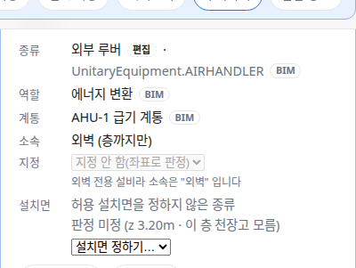

OE-EQP-15 외벽 전용 설비(외부 루버·외기 센서)를 소속 판정에서 빼, 허용 거리 안에 물리존이 있어도 방에 붙이지 않는다

Refs #179 · #399
Branch: fix/OE-EQP-15-exterior-space
Ticket: docs/prd/features/E12-EQP/OE-EQP-15.md · docs/prd/features/E11-MAP/OE-MAP-01.md

## 요약

#399 가 OE-EQP-15 에 "소속 판정(OE-MAP-01)의 1단계에서 판정 제외되므로, 소속 허용 거리 안에 물리존이 있어도 그 물리존에 붙지 않는다" 를 더했습니다. OE-MAP-01 의 수용 기준에도 "외벽 전용 설비는 [소속 허용 거리] 안에 물리존이 있어도 소속이 '외벽' 이다" 가 있습니다.
지금은 외벽 전용 설비도 좌표로 판정해, 성수 외부 루버 59대 중 26대가 외곽선 가까운 방에 붙어 TTL 에서 그 방에 있는 것(`hasLocation`)으로 나갔습니다. 이것을 판정에서 빼게 고쳤습니다.

## 구현한 것

- **판정 1단계**: 종류가 외벽 전용인 설비(외부 루버, 사전의 `mount: 'exterior'` 인 외기 온도·습도 센서)는 소속을 판정하지 않고 비워 둡니다. 외곽선 안·허용 거리 안이어도 방에 붙지 않습니다. 화면의 소속은 지금처럼 "외벽 (층까지만)" 입니다.
- **소속 지정 칸**: 외벽 전용 설비는 막고 "외벽 전용 설비라 소속은 "외벽" 입니다" 를 보입니다(OE-MAP-01 "1단계의 미배치·외벽 설비는 지정 칸이 비활성").
- **종류를 바꿀 때**: 외벽 전용 종류가 되거나 아니게 되면 소속을 다시 판정합니다. 되돌리기(Ctrl+Z)와 편집 파일 불러오기도 같습니다. 그 밖의 종류 변경은 소속에 닿지 않습니다.
- 1단계가 BIM 명시 소속(3단계)보다 앞이라, BIM 이 외부 루버를 방에 담았어도 소속은 "외벽" 입니다. 가진 BIM 에는 그런 루버가 없습니다.

**성수 건축 + 기계**: 외벽 설비(외부 루버) 59대 중 방에 붙은 것이 26대에서 0대가 됩니다. 완전성 검사 "기기마다 소속 방" 은 이미 외벽 설비를 세지 않아 숫자가 그대로입니다(4047/4618).

## 수용 기준 대조

| 기준 | 결과 |
|---|---|
| 외벽 전용 설비는 [소속 허용 거리] 안에 물리존이 있어도 소속이 "외벽" 이다 (OE-MAP-01) | **이 PR** |
| 외벽 설비는 속성 패널의 소속 지정 칸이 비활성이고 막힌 이유가 보인다 (OE-MAP-01) | **이 PR** |
| 외벽에 붙는 설비는 완전성 검사 "방 없는 설비" 에서 제외한다 (OE-EQP-15) | 지금과 같음(#179) |

## 화면

mep.ifc 의 AHU-1 을 외부 루버로 바꾼 패널입니다. 사무실 안 좌표인데 소속이 "외벽 (층까지만)" 이고 지정 칸이 막혀 있습니다.

## 확인 방법

1. `src/lib/ifc/fixtures/mep.ifc` 를 엽니다 → [편집] → 설비 목록에서 AHU-1 을 고릅니다(소속 사무실)
2. 종류를 "외부 루버" 로 바꿉니다 → 목록·패널의 소속이 "외벽 (층까지만)", 지정 칸 아래 "외벽 전용 설비라 소속은 "외벽" 입니다"
3. Ctrl+Z → 소속이 사무실로 돌아옵니다

## 테스트

새 테스트는 **이번 수정 전에는 없던 동작**을 확인합니다.
- `src/lib/exterior-assign.test.ts` (새 파일, 3) — 외부 루버·외기 온도 센서는 허용 거리 안·외곽선 안이어도 방이 없고 지정이 막힘, 다른 종류는 지금처럼 붙음, 종류를 바꾸면 소속이 따라가고 되돌리면 돌아옴
- `e2e/exterior-space.spec.ts` (새 파일) — 위 확인 방법 1~3

기존 테스트를 고친 것: `src/lib/outer-wall.test.ts` 둘
- "안쪽 면을 누르면 안쪽 면에 붙어 그 방에 속한다" → 외부 루버는 안쪽 면에 붙여도 방에 속하지 않는다
- "설비 하나를 붙인 것을 되돌리면 붙기 전 자리·소속으로 돌아온다" → 붙기 전 소속도 없음

두 시험은 외부 루버를 방 안 좌표에 둔 이 repo 의 시험이고(OE-OBJ-04), 바뀐 OE-EQP-15·OE-MAP-01 과 어긋나 고쳤습니다.

결과: `npm test` 879 통과 · `npx vue-tsc --noEmit` 통과 · e2e 전체 186 통과 · `check:sample` 100 통과 · 4 건너뜀 · `check:seongsu` 25 통과

## 남은 것

- 사람이 외벽에 붙인 다른 종류(외벽 판정이 된 벽에 붙인 설비)는 완전성 검사에서는 외벽 설비로 빠지지만, 소속 판정은 벽을 봐야 해서 지금처럼 좌표로 정합니다. 벽 정보를 판정에 넘기는 일과 같이 맞출 예정입니다.
