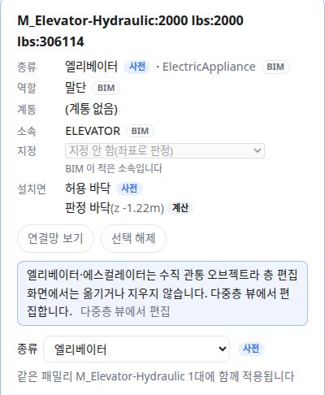

OE-EQP-07 엘리베이터·에스컬레이터는 층 편집 화면에서 옮기거나 지우지 못하게 하고 다중층 뷰를 안내하며, 에스컬레이터를 이름 사전에 더한다

Closes #171
Branch: feature/OE-EQP-07-vertical-lock
Ticket: docs/prd/features/E12-EQP/OE-EQP-07.md

## 요약

엘리베이터·에스컬레이터는 수직 관통 오브젝트라(OE-OBJ-14) 층 편집 화면에서는 고르고 보기만 하게 했습니다. 끌기·방향키·좌표 칸·지우기가 막히고, 패널에 [다중층 뷰에서 편집] 안내가 보입니다.
다중층 뷰(E18)는 아직 없어서 그 버튼은 누를 수 없게 두었습니다. 이름 사전에 에스컬레이터가 없어 성수의 에스컬레이터 6대가 "종류 모름" 이었으므로 같이 더했습니다.

## 구현한 것

- **잠금**: 종류가 엘리베이터·에스컬레이터인 설비는 편집 모드에서 이렇게 막힙니다. 천장 편집 모드에서 모드 밖 설비를 막던 것과 같은 길입니다.
  - 3D 에서 잡히지 않습니다(끌어도 그대로)
  - 방향키, 좌표 칸, 벽에 붙이기, 이름 고치기, 지우기(Delete · 패널 · 여러 개 지우기)가 막히고 이유가 보입니다
  - 패널에 "엘리베이터·에스컬레이터는 수직 관통 오브젝트라 층 편집 화면에서는 옮기거나 지우지 않습니다. 다중층 뷰에서 편집합니다." 와 [다중층 뷰에서 편집](비활성)
- **종류는 고칠 수 있습니다.** 이름 사전이 잘못 읽은 설비가 잠긴 채 남지 않게, 잠겨도 종류 칸은 보입니다. 다른 종류로 바꾸면 바로 풀립니다.
- **에스컬레이터 종류**: 이름에 `escalator`·`에스컬레이터` 가 있으면 에스컬레이터(`brick:Escalator`)입니다. 엘리베이터처럼 이름으로만 읽습니다.
- 고친 버그: 종류를 바꿔도 고른 설비는 같은 객체라 패널의 잠금 판정이 다시 계산되지 않았습니다. 모델이 바뀌면 다시 계산합니다.

**실제 BIM 에서 잠기는 설비**

| | 엘리베이터 | 에스컬레이터 |
|---|---|---|
| 병원 건축 | 1 (`M_Elevator-Hydraulic`) | 0 |
| Office_A | 3 (`M_Elevator-Hydraulic` 1 · `M_Elevator Door-Center` 2) | 0 |
| 성수 건축 | 0 | 6 (`Escalator_(AUS)`, 이번에 종류를 얻음) |

Office_A 의 엘리베이터 문 2개는 지금 이름 사전이 엘리베이터로 읽은 것이고, 이번에 바꾸지 않았습니다.

## 수용 기준 대조

| 기준 | 결과 |
|---|---|
| 층 편집 화면에서 EL·ES 의 이동·삭제 핸들이 비활성이고 [다중층 뷰에서 편집] 안내가 보인다 | **이 PR** — 버튼은 다중층 뷰(OE-ML-01)가 생기면 그 화면을 엽니다 |

## 화면

병원 건축의 엘리베이터를 고른 패널입니다. 좌표·지우기 칸 대신 안내와 [다중층 뷰에서 편집](비활성)이 보이고, 종류 칸은 남습니다.

## 확인 방법

1. `src/lib/ifc/fixtures/mep.ifc` 를 엽니다 → [편집] → 설비 목록에서 AHU-1 을 고릅니다
2. 종류를 "엘리베이터" 로 바꿉니다 → 안내와 [다중층 뷰에서 편집](비활성), 좌표 칸과 지우기가 사라집니다
3. 3D 에서 AHU-1 을 끌어 봅니다 → 움직이지 않습니다. Delete → 지워지지 않습니다
4. 종류를 "공조기" 로 되돌립니다 → 안내가 사라지고 좌표 칸이 돌아옵니다
5. `data/NBU_MedicalClinic/NBU_MedicalClinic_Arch.ifc` 에서 `Elevator` 를 검색해 고르면 위 화면과 같습니다

## 테스트

새 테스트는 **이번 수정 전에는 없던 동작**을 확인합니다.
- `e2e/vertical-device.spec.ts` (새 파일) — 위 확인 방법 1~4

기존 테스트를 고친 것:
- `src/lib/kinds.test.ts` — `Escalator_(AUS)` 를 "모르는 이름" 목록에서 "에스컬레이터" 로 옮겼습니다
- `scripts/check-sample.test.ts` — 성수의 소속 검사 4041/4612 → 4047/4618. 에스컬레이터 6대가 기기로 세지고 6대 다 방에 듭니다

결과: `npm test` 858 통과 · `npx vue-tsc --noEmit` 통과 · e2e 전체 179 통과 · `check:sample` 98 통과 · 4 건너뜀 · `check:seongsu` 25 통과

## 남은 것

- 다중층 뷰(OE-ML-01)와 그 안의 EL·ES 이동·삭제(OE-ML-07·09)
- 계단·샤프트(OE-OBJ-14·OE-ML-02): 지금은 물리존(계단실·승강로)으로만 있고 별도 오브젝트가 아닙니다
