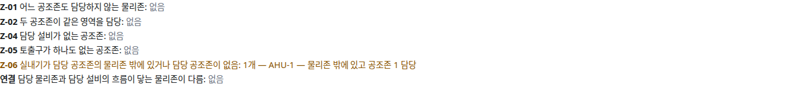

OE-EQP-08 실내기를 옮긴 뒤 담당 공조존 밖이거나 담당 공조존이 없으면 Z-06 으로 알리고 다시 지정하라고 안내한다

Closes #172
Branch: feature/OE-EQP-08-indoor-unit
Ticket: docs/prd/features/E12-EQP/OE-EQP-08.md

> 설비 패널 담당 공조존 PR(OE-ZON-01) 다음에 merge 해 주세요. 안내가 그 칸("담당 공조존")을 가리킵니다.

## 요약

시스템에어컨 실내기(DVM 실내기)를 옮긴 뒤 담당 공조존을 다시 지정하지 않으면 Z-06 경고가 뜨도록 했습니다.
Z-06 이 담당 공조존이 "비어 있는" 실내기와 "물리존 밖" 으로 옮긴 실내기도 잡고, 옮긴 직후에는 다시 지정하라는 안내가 보입니다. 배관 끝점 추종은 공조기와 같은 장치로 이미 됩니다.

## 구현한 것

- **Z-06 판정 넓히기**: 실내기·FCU 를 대상으로 셋을 잡습니다.
  - 담당 공조존의 물리존 밖에 있음(지금과 같음): "AHU-1 — 사무실 에 있고 공조존 1 담당"
  - 어느 물리존에도 들지 않음(건물 밖으로 옮김 등): "AHU-1 — 물리존 밖에 있고 공조존 1 담당"
  - 담당 공조존이 없음: "AHU-1 — 담당 공조존 없음". 공조존을 하나도 만들지 않은 층은 세지 않습니다(Z-01 과 같은 까닭)
- 규칙 문구: "실내기가 담당 공조존의 물리존 밖에 있거나 담당 공조존이 없음"
- **옮긴 직후 안내**: 실내기·FCU 를 옮긴 결과가 Z-06 이면 "실내기를 옮겼습니다. 담당 공조존을 다시 지정하세요(Z-06: …). 설비 패널의 "담당 공조존" 에서 고릅니다." 가 보입니다. 막지는 않습니다.
- 허용 설치면(천장·바닥·벽)은 설치면 표(`mount.ts`)에 이미 있어 그대로입니다.

## 수용 기준 대조

| 기준 | 결과 |
|---|---|
| 실내기를 옮기면 연결 배관 끝점이 같이 움직인다 | 끝점 추종(OE-PIP-12)에서 반영. 실내기로 시험을 더했습니다 |
| 담당 공조존이 비거나 불일치하면 Z-06 경고가 뜬다 | **이 PR** |

## 화면

mep.ifc 의 AHU-1 을 실내기로 바꾸고 공조존 1 의 담당으로 정한 뒤, 사무실 밖(x 11)으로 옮긴 모습입니다.

## 확인 방법

1. `src/lib/ifc/fixtures/mep.ifc` 를 엽니다 → [편집] → 설비 목록에서 AHU-1 을 고릅니다
2. 종류를 "시스템에어컨 실내기" 로 바꿉니다(픽스처에 실내기가 없어서입니다)
3. 패널 "담당 공조존" 의 [흐름이 닿는 물리존으로 새 공조존 (사무실)] → 공조존 검증 Z-06 "없음"
4. AHU-1 의 x 를 11 로 고칩니다 → 위 안내, Z-06 "1개 — AHU-1 — 물리존 밖에 있고 공조존 1 담당"

## 테스트

새 테스트는 **이번 수정 전에는 없던 동작**을 확인합니다.
- `src/lib/hvac-zone.test.ts` (+1) — 공조존이 없는 층은 세지 않음, 담당 공조존 없음, 담당으로 정한 뒤 물리존 밖 불일치, 창고로 옮기면 없어짐, 어느 물리존에도 들지 않는 자리면 다시 불일치
- `src/lib/follow.test.ts` (+1) — 실내기를 옮기면 이음쇠가 같이 가고 구간은 가까운 끝만 늘어남
- `e2e/hvac-zone.spec.ts` (+1) — 위 확인 방법 1~4

기존 테스트는 고치지 않았습니다.

결과: `npm test` 876 통과 · `npx vue-tsc --noEmit` 통과 · e2e 전체 185 통과 · `check:sample` 98 통과 · 4 건너뜀 · `check:seongsu` 25 통과

## 남은 것

- 없음. 실내기를 옮길 때 담당 공조존을 자동으로 바꾸지는 않습니다(사람이 다시 지정합니다).
