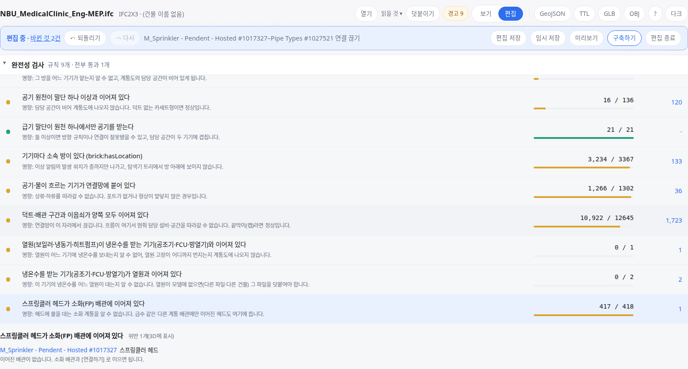

OE-EQP-11 스프링클러 헤드가 소화(FP) 배관에 이어졌는지 완전성 검사에서 보고, 이어지지 않은 헤드를 위반으로 보인다

Closes #409
Branch: feature/OE-EQP-11-sprinkler-fp
Ticket: docs/prd/features/E12-EQP/OE-EQP-11.md

## 요약

#405 로 스프링클러 헤드의 소화(FP) 배관 연결이 필수 검사가 되어, 완전성 검사에 규칙을 하나 더했습니다.
소화 배관에 이어지지 않았거나 다른 계통 배관에만 이어진 헤드가 위반 목록에 이름과 이유로 보입니다.

## 구현한 것

- 완전성 검사(검토·편집 화면의 "완전성 검사" 표)에 **"스프링클러 헤드가 소화(FP) 배관에 이어져 있다"** 를 아홉 번째 규칙으로 더했습니다.
- 판정 기준은 아래와 같습니다.
  - 헤드에 직접 이어진 배관·이음쇠·기기 중 하나라도 계통 종류가 "소화"(#389 의 `fire_protection`, Flow Type FP)이면 통과입니다.
  - 급수처럼 다른 계통의 배관에만 이어진 헤드는 위반입니다.
  - 헤드 자신이 소화 계통에 들어 있어도, 배관에 이어지지 않았으면 위반입니다. 물을 받는 것은 배관이기 때문입니다.
  - 계통이 없는 배관에만 이어진 헤드도 위반입니다. 그 배관이 소화 배관인지 알 수 없기 때문입니다.
  - 해제 보정한 BIM 연결(#384)은 이어진 것으로 세지 않습니다.
- 위반한 헤드를 펼치면 이유가 한 줄로 보입니다.
  - "이어진 배관이 없습니다. 소화 배관과 [연결하기] 로 이으면 됩니다."
  - "소화가 아닌 계통(급수)의 배관에만 이어져 있습니다."
  - "이어진 배관 n개가 계통이 없어 소화 배관인지 알 수 없습니다. 그 배관을 소화 계통에 넣으면 됩니다."
- 검사 대상은 **종류가 "스프링클러 헤드" 인 설비**입니다. BIM 이 `IfcFireSuppressionTerminal`(SPRINKLER)로 준 설비와 사람이 종류를 고른 설비가 해당합니다.
  이름으로는 종류를 정하지 않습니다(이름 사전의 콘센트·위생기구와 같은 방식). 그래서 Revit 이 `IfcFlowTerminal` 로 내보낸 병원 MEP 의 헤드 418대는
  사람이 패밀리 종류를 고른 뒤에 검사 대상이 됩니다.
- 결과는 화면에만 있습니다. TTL·GeoJSON·편집 파일에 새로 남는 것은 없습니다.

## 수용 기준 대조

| 기준 | 결과 |
|---|---|
| 스프링클러 헤드를 천장이 아닌 설치면에 놓을 수 없다 | 이미 반영(#369 천장 편집 모드, #373 의 `mount.test.ts` "스프링클러 헤드는 천장 전용이다") |
| 소화(FP) 배관에 연결되지 않은 스프링클러 헤드는 생성 전 검증(OE-GEN-03)에서 위반으로 나오고, 어느 헤드인지 보인다 | **이 PR** — 완전성 검사의 위반 목록에 헤드 이름과 이유가 보입니다. 생성 전 검증(OE-GEN-03)은 완전성 검사 규칙(OE-BIM-18)을 그대로 담을 예정이라, 그 티켓이 개발되면 이 규칙도 같이 포함됩니다 |
| 다른 Flow Type 배관(예: 급수 DCW)에만 연결된 헤드도 위반이다 | **이 PR** |

## 화면

병원 MEP 에서 스프링클러 패밀리의 종류를 고르고 헤드 하나의 연결을 끊은 화면입니다. 418대 중 417대가 통과하고, 끊은 헤드가 위반 목록에 이유와 함께 보입니다.

## 확인 방법

1. `data/NBU_MedicalClinic/NBU_MedicalClinic_Eng-MEP.ifc` 를 엽니다
2. 검토 화면의 "완전성 검사" 에 "스프링클러 헤드가 소화(FP) 배관에 이어져 있다" 줄이 있고, "이 파일에는 검사할 대상이 없습니다" 로 보입니다(헤드의 종류가 아직 모름)
3. [편집] → 설비 목록 검색에 `Sprinkler - Pendent` → 첫 헤드를 고르고 종류에서 "스프링클러 헤드" 를 고릅니다("418대에 함께 적용됩니다")
4. 완전성 검사의 그 줄이 `418 / 418` 입니다
5. `T` 로 천장 편집 모드에 들어가 같은 헤드를 고르고, 직접 연결의 [연결 끊기] 를 누릅니다
6. 그 줄이 `417 / 418`, 위반 1 입니다. 줄을 누르면 헤드 이름과 "이어진 배관이 없습니다 …" 가 보입니다. Ctrl+Z 로 `418 / 418` 로 돌아옵니다

## 테스트

새 테스트는 **이번 수정 전에는 없던 동작**을 확인합니다.
- `src/lib/checks.test.ts` (+2)
  - 소화 배관에 이어진 헤드는 통과, 급수 배관에만 이어진 헤드·소화 계통에 들었지만 배관이 없는 헤드·계통 없는 배관에만 이어진 헤드는 위반, 이유 문구 셋
  - 헤드가 없는 파일은 대상 0
- `scripts/check-sample.test.ts` 병원 건축 + MEP — 패밀리 종류를 "스프링클러 헤드" 로 정하면 418대, 검사 `418/418`(2026-10-09 실측)

기존 테스트를 고친 것(규칙이 하나 늘어 피할 수 없었습니다)
- `e2e/smoke.spec.ts` "완전성 검사는 규칙마다 …" — 규칙 수 8 → 9
- `scripts/check-sample.test.ts` 검사표 셋(병원 HVAC·병원 MEP·성수)에 새 규칙 줄(`0/0`)을 더함

속도: 병원 MEP(연결 13,608개)에서 완전성 검사 한 번이 헤드 없을 때 9.6ms, 헤드 418대일 때 12.0ms 입니다. 편집할 때마다 다시 계산해도 됩니다.

결과: `npm test` 821 통과 · `npx vue-tsc --noEmit` 통과 · e2e(`smoke`·`connect-candidates`) 21 통과 · `check:sample` 97 통과 · 4 건너뜀 · `check:seongsu` 25 통과

## 남은 것

- 생성 전 검증(OE-GEN-03) 자체는 아직 개발 전입니다. 그 티켓에서 완전성 검사 결과를 생성 리포트에 담을 예정입니다.
- 위반 헤드에 [연결 후보 확인](#388)을 붙이지 않았습니다. 지금의 연결 후보는 "흐르는 기기가 연결망에 붙어 있다" 규칙에만 있습니다. 필요하면 같은 후보 목록을 붙일 예정입니다.
