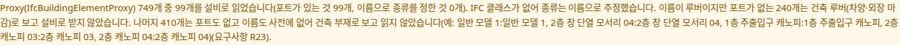

OE-EXT-05 포트가 없는 Proxy 는 이름이 루버여도 설비로 받지 않고, 받지 않은 건축 루버 수를 임포트 경고와 요구사항 R23 에 보인다

Closes #236
Branch: feature/OE-EXT-05-architectural-louvers
Ticket: docs/prd/features/E17-EXT/OE-EXT-05.md

## 요약

성수 건축 파일의 루버 Proxy 240개(알루미늄·옥상·캐노피 루버)를 설비로 받지 않게 했습니다. 차양·외장 마감재인데 이름이 "루버" 라서 이름 사전이 외부 루버 설비로 받고 있었습니다.
포트가 있거나 IFC 클래스가 루버인 설비 루버는 그대로 들어오며, 가진 다른 BIM 의 설비 수는 바뀌지 않습니다.

## 구현한 것

- BIM 파일을 불러올 때 `IfcBuildingElementProxy` 를 설비로 받는 기준(OE-BIM-13)에서 한 가지를 바꿨습니다. 포트가 없고 이름으로만 "외부 루버" 가 되는 Proxy 는 설비로 받지 않습니다.
  - 포트가 있는 Proxy 루버는 그대로 받습니다(덕트에 붙은 외기·배기 루버)
  - `IfcAirTerminal`(LOUVRE)로 들어온 루버는 Proxy 가 아니어서 영향이 없습니다
  - 이름 사전에 제외 낱말을 더하지 않았습니다. 다른 종류(CCTV 등)는 지금처럼 이름으로 받습니다
- 받지 않은 수를 두 곳에 보입니다.
  - 검토 화면의 경고: "이름이 루버이지만 포트가 없는 240개는 건축 루버(차양·외장 마감)로 보고 설비로 받지 않았습니다"
  - 요구사항 보고서 R23(Proxy) 줄의 설명
- 받지 않은 건축 루버는 추가 공간 오브젝트로도 만들지 않습니다. 모델·TTL·GeoJSON 어디에도 들어가지 않습니다.
- 건축+기계를 합칠 때는 두 파일의 수를 더합니다.
- BIM→DT 문서(`docs/bim-to-dt-ontology.md`) 3.8·R23 줄과 성수 화면 시험 목록(`docs/seongsu-test.md`)의 숫자를 지금 값으로 바꿨습니다.

## 수용 기준 대조

| 기준 | 결과 |
|---|---|
| 성수 건축 루버 240개가 설비 목록에 없다 | **이 PR** — 성수 건축의 기기 1,439 → 1,199대, 외부 루버 종류 240 → 0대(2026-10-09 실측) |
| 다른 BIM 의 설비 수가 줄지 않는다(포트가 있거나 IFC 클래스가 루버인 설비 루버는 그대로 들어온다) | **이 PR** — `check:sample` 의 BIM 전부 기존 값 그대로. 성수 기계의 외부 루버 59대(포트 있음)도 그대로 |
| 임포트 리포트에 설비로 받지 않은 건축 Proxy 수가 보인다 | **이 PR** — 경고와 요구사항 R23 |

### 성수 건축+기계에서 바뀐 숫자

| | 전 | 후 |
|---|---|---|
| 기기 | 4,911 | 4,671 |
| 외벽 설비(OE-EQP-15, 소속 검사에서 빠짐) | 299(전부 외부 루버) | 59(기계 파일의 외부 루버) |
| 소속 방이 없는 외부 루버 | 203 | 33 |
| 완전성 검사 "기기마다 소속 방" | 4,041/4,612 | 4,041/4,612(그대로) |
| 완전성 검사 "공기·물이 흐르는 기기가 연결망에 붙어 있다" | 2,991/3,632 | 2,943/3,392 |
| 요구사항 R23(Proxy 로 들어온 설비) | 1,991대 | 1,751대 |

"기기마다 소속 방" 은 그대로입니다. 외벽 설비는 원래 분모에서 빼고 있었고, 빠진 240개가 전부 외벽 설비였기 때문입니다(4,911 − 299 = 4,671 − 59).

## 화면

성수 건축 파일을 열었을 때의 경고입니다. Proxy 749개 중 포트가 있는 99개를 설비로 받고, 건축 루버 240개와 건축 부재 410개는 받지 않았다고 보입니다.

## 확인 방법

1. `data/성수/Factorial_건축.ifc` 를 엽니다
2. 검토 화면 아래 경고 목록에 "Proxy(IfcBuildingElementProxy) 749개 중 99개를 설비로 읽었습니다 … 이름이 루버이지만 포트가 없는 240개는 건축 루버(차양·외장 마감)로 보고 설비로 받지 않았습니다" 가 있습니다
3. 설비 목록 검색에 `루버` → 건축 루버가 나오지 않습니다
4. 기계 파일을 덧붙이면 요약의 기기가 4,671대이고, 외부 루버는 기계 파일의 59대입니다

## 테스트

새 테스트는 **이번 수정 전에는 없던 동작**을 확인합니다.
- `src/lib/ifc/proxy-report.test.ts` (+1) — 포트 없는 루버 Proxy 둘(`알루미늄 루버`·`Roof Louver`)을 받지 않고 `louvers: 2`, 경고·R23 문구, 휠스톱은 그대로 건축 부재 쪽

기존 테스트를 고친 것(숫자가 바뀌어 피할 수 없었습니다)
- `src/lib/ifc/import.test.ts` · `src/lib/ifc/proxy-report.test.ts` · `scripts/check-sample.test.ts` 의 Proxy 수 비교에 새 칸 `louvers: 0`
- `scripts/check-sample.test.ts` 성수 건축+기계 — "연결망에 붙어 있다" 2991/3632 → 2943/3392, 주석의 외벽 설비 수
- `e2e-seongsu/seongsu.spec.ts` — 열린 뒤 기기 수 4911 → 4671

결과: `npm test` 828 통과 · `npx vue-tsc --noEmit` 통과 · e2e 전체 168 통과 · `check:sample` 97 통과 · 4 건너뜀 · `check:seongsu` 25 통과 · `e2e:seongsu` 는 기기 수를 보는 B 까지 통과

`e2e:seongsu` 의 E(설비 편집)는 이 PR 과 상관없이 main 에서도 멈춥니다. 성수 FCU 가 천장 설비라 천장 편집 모드(#369) 이후 바닥 쪽에서 위치 칸이 잠기기 때문입니다. 다른 PR 에서 고칠 예정입니다.

## 남은 것

- OE-EQP-15 수용 기준과 PRD 1.8 등급 2 줄의 성수 숫자가 바뀌었습니다. 아래와 같이 PM 께 요청드립니다.

## PM 확인 (`needs-pm`)

이슈 #236 에 코멘트로 올리고 `needs-pm` 라벨을 답니다.

> ## 성수 루버 숫자 갱신 — 요청드립니다
>
> **요약**
> - 본 PR 로 성수 건축 파일의 루버 Proxy 240개를 설비로 받지 않습니다(OE-EXT-05).
> - 티켓 본문의 "걸러진 루버가 OE-EQP-15 의 외벽 부착 설비(성수 루버 203대)와 겹치면 OE-EQP-15 수용 기준과 PRD 1.8 등급 2 분모를 같이 고친다" 에 해당합니다. 203대 중 170대가 이번에 걸러진 건축 루버였습니다.
>
> | | 지금 PRD 문구 | 실측(2026-10-09) |
> |---|---|---|
> | [OE-EQP-15](https://github.sec.samsung.net/IoT-Solution/bim-to-dt-ontology/blob/main/docs/prd/features/E12-EQP/OE-EQP-15.md) 수용 기준 | 성수 루버 203대가 완전성 위반에서 제외되고 등급 2 분모에서 빠진다 | 외부 루버는 기계 파일의 59대이고, 그중 소속 방이 없는 것은 33대 |
> | [PRD 1.8](https://github.sec.samsung.net/IoT-Solution/bim-to-dt-ontology/blob/main/docs/prd/PRD_011.md#18-bim-수용-기준선과-등급) 등급 2 성수 값 | 87.9% (루버 203 제외) · 미제외 84% | 87.6%(외벽 설비 59 제외, 4,041/4,612) · 미제외 87.1% |
>
> 위 두 문구를 실측 값으로 고쳐 주시도록 요청드립니다.
> 확인 부탁드립니다.
> 문구 수정과 관계없이 본 PR 은 Merge 하겠습니다.
