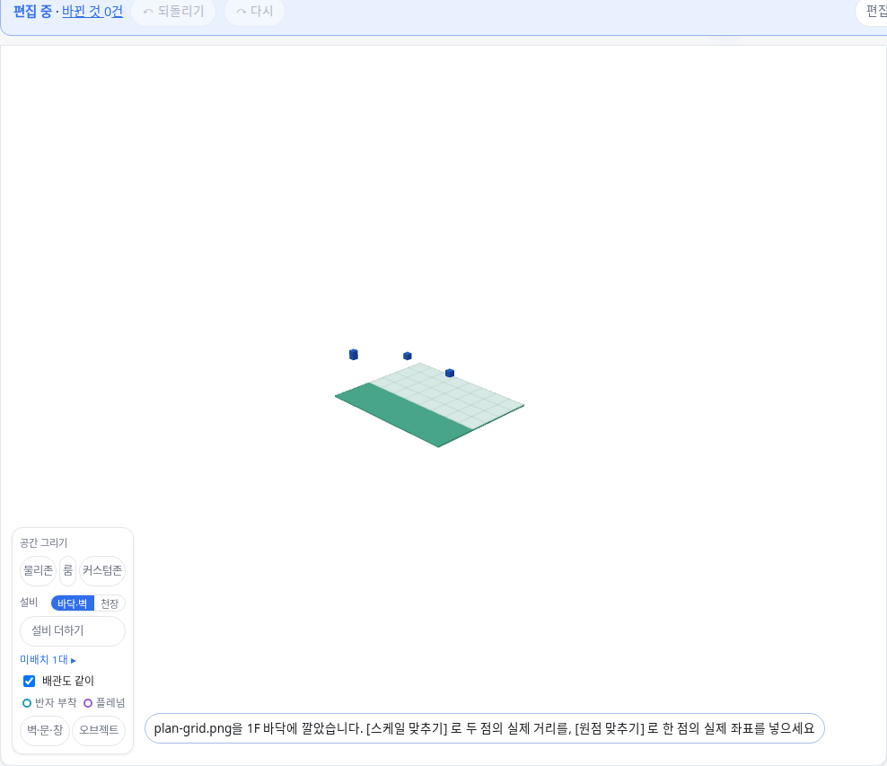
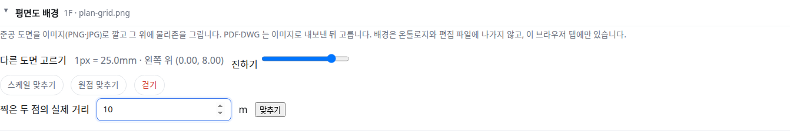

OE-MAN-02 준공 도면 이미지를 층 바닥에 깔고, 두 점의 실제 거리로 스케일을, 한 점의 실제 좌표로 원점을 맞춘다

Closes #118
Branch: feature/OE-MAN-02-plan-background
Ticket: docs/prd/features/E07-MAN/OE-MAN-02.md

## 요약

편집 화면에 "평면도 배경" 을 넣었습니다. 도면 이미지(PNG·JPG)를 고르면 고른 층 바닥에 반투명으로 깔리고, 그 위에서 물리존을 그립니다.
[스케일 맞추기] 로 길이를 아는 두 점을 찍어 실제 거리를 넣고, [원점 맞추기] 로 좌표를 아는 한 점을 찍어 실제 좌표를 넣습니다. 배경은 온톨로지와 편집 파일에 나가지 않습니다.

## 구현한 것

- **"평면도 배경" 접이**: 고른 층(층 하나만 보는 중이면 그 층)마다 배경 하나입니다.
  - [도면 이미지 고르기]: PNG·JPG. 처음에는 이미지 너비를 그 층 물리존 범위의 너비에 맞추고, 왼쪽 위를 범위의 왼쪽 위에 둡니다. 물리존이 없으면 1px = 1cm, 원점 (0, 0) 입니다
  - 지금 값: "1px = 25.0mm · 왼쪽 위 (0.00, 8.00)"
  - 진하기(0.1~1), [걷기]
- **스케일 맞추기**: 도면에서 두 점을 찍고 실제 거리(m)를 넣습니다. 첫 점을 그 자리에 두고 이미지를 늘이거나 줄입니다. 0 이하·같은 점은 막습니다.
- **원점 맞추기**: 도면에서 한 점을 찍고 그 점의 실제 좌표(x, y)를 넣습니다. 이미지를 그만큼 옮깁니다. 스케일은 그대로입니다.
- **3D**: 물리존 판 바로 위에 깔아, 판 색이 비치고 설비는 가리지 않습니다. 누를 수 없어서 물리존을 그리는 바닥 클릭은 그대로 바닥에 찍힙니다.
- **어디에 남나**: 이 브라우저 탭에만 있습니다. 온톨로지(TTL·GeoJSON)·편집 파일·임시 저장본에 나가지 않고, "바뀐 것" 에도 세지 않습니다. 다시 열면 다시 깝니다.
- PDF·DWG 는 고를 수 없습니다. 이미지로 내보낸 뒤 고르라고 안내합니다. 아래 PM 확인을 봐 주세요.

## 수용 기준 대조

| 기준 | 결과 |
|---|---|
| 두 점을 찍어 거리를 입력하면 이미지 스케일이 맞고, 원점을 찍어 좌표계에 맞출 수 있다 | **이 PR** |
| 준공 도면(PDF·DWG)을 배경 이미지로 깐다 (요구사항) | 이미지(PNG·JPG)만. 아래 PM 확인 |
| 배경 이미지는 온톨로지에 나가지 않는다 (요구사항) | **이 PR** |

## 화면

400×200px 격자 도면을 mep.ifc 1F 에 깐 모습입니다. 사무실(10m) 너비에 맞춰 1px = 25mm 로 놓였고, 판 위에 비칩니다.

스케일 맞추기에서 두 점을 찍은 뒤 실제 거리를 넣는 칸입니다.

## 확인 방법

1. `src/lib/ifc/fixtures/mep.ifc` 를 엽니다 → [편집] → "평면도 배경" 을 펼칩니다
2. [도면 이미지 고르기] 로 `e2e/fixtures/plan-grid.png` → "1px = 25.0mm · 왼쪽 위 (0.00, 8.00)", 3D 바닥에 격자가 보입니다
3. [스케일 맞추기] → 바닥에 (0, 4)·(5, 4) 를 찍고 10 을 넣어 [맞추기] → "1px = 50.0mm · 왼쪽 위 (0.00, 12.00)"
4. [원점 맞추기] → (4, 6) 을 찍고 x 0, y 0 → "왼쪽 위 (-4.00, 6.00)"
5. 편집 막대가 "바뀐 것 0건" 그대로입니다. [걷기] → 배경이 사라집니다

## 테스트

새 테스트는 **이번 수정 전에는 없던 동작**을 확인합니다.
- `src/lib/background.test.ts` (새 파일, 3) — 처음 놓는 자리(건물 너비에 맞춤 · 범위를 모를 때), 두 점 스케일(첫 점 고정, 0·같은 점·NaN 막음), 한 점 원점
- `e2e/background.spec.ts` (새 파일) — 위 확인 방법 1~5. 깐 귀퉁이를 3D 에서 읽어 견줍니다
- `e2e/fixtures/plan-grid.png` (새 파일) — 400×200px 격자 이미지

기존 테스트는 고치지 않았습니다.

결과: `npm test` 874 통과 · `npx vue-tsc --noEmit` 통과 · e2e 전체 184 통과 · `check:sample` 98 통과 · 4 건너뜀

## 남은 것

- 배경을 다시 열 때 되살리기(지금은 탭을 닫으면 사라집니다)
- 회전 맞추기(도면이 건물 축과 기울어 있을 때). 지금은 스케일·원점만 맞춥니다
- 평면도 탭(SVG)에도 깔기. 지금은 3D 바닥에만 깝니다

## PM 확인 (`needs-pm`)

이슈 #118 에 코멘트로 올리고 `needs-pm` 라벨을 답니다.

> ## 평면도 배경으로 받는 파일 형식 — 판단이 필요합니다
>
> **요약**
> - 준공 도면을 배경으로 깔고 스케일·원점을 맞추는 기능을 본 PR 로 개발했습니다.
> - 요구사항은 "준공 도면(PDF·DWG)" 인데, 이번에는 이미지(PNG·JPG)만 받게 했습니다. 브라우저에서 PDF 를 그리려면 PDF 라이브러리를, DWG 를 그리려면 변환 서버나 상용 라이브러리를 들여야 합니다. 둘 다 이미지로 내보내면 같은 기능을 그대로 쓸 수 있습니다.
>
> **확인 대상**
> 1. 이미지만 받고, PDF·DWG 는 이미지로 내보내 쓰게 안내한다 (개발 권장, 지금 구현과 같음. 즉, 도면을 한 번 이미지로 저장하는 손이 듦.)
> 2. PDF 는 바로 받는다 (PDF 첫 페이지를 이미지로 그려 깝니다. PDF 라이브러리를 번들에 넣습니다.)
> 3. PDF·DWG 모두 바로 받는다 (DWG 변환이 필요해 범위가 커집니다. 별도 이슈로 진행합니다.)
>
> 확인 부탁드립니다.
> 1번인 경우에는 본 PR 을 Merge 하고,
> 2번인 경우에는 본 PR 에 PDF 읽기를 추가 작업하겠습니다.
> 3번인 경우에는 본 PR 은 Merge 하고, DWG 는 후속 이슈로 작업하겠습니다.
