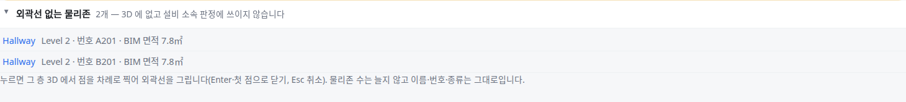
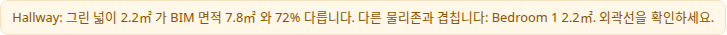

OE-MAN-03 검토 화면에 외곽선 없는 물리존 목록을 두고, BIM 면적을 읽어 그린 외곽선과 다르거나 다른 물리존과 겹치면 알린다

Closes #119
Branch: feature/OE-MAN-03-outline-fill
Ticket: docs/prd/features/E07-MAN/OE-MAN-03.md

## 요약

외곽선 없는 물리존에 외곽선을 그리는 기능은 편집의 물리존 표([3D에서 그리기])로 이미 있었습니다. 수용 기준과 비교하고, 요구사항 중 없던 것 셋을 더했습니다.
검토 화면의 "외곽선 없는 물리존" 목록, BIM 면적 읽기, 그린 뒤 경고(BIM 면적과 다름·겹침·자기교차)입니다.

## 구현한 것

- **검토 화면 목록**: "외곽선 없는 물리존 N개 — 3D 에 없고 설비 소속 판정에 쓰이지 않습니다". 항목마다 이름·층·번호·BIM 면적이 보이고, 누르면 편집 모드로 들어가 그 층 3D 에서 그리기가 시작됩니다.
- **BIM 면적**: 파일을 열 때 방마다 BIM 이 적은 바닥 면적을 읽습니다.
  - 읽는 순서: ① `NetFloorArea` ② `GrossFloorArea` ③ `GSA BIM Area` ④ Revit 치수 세트의 `Area`
  - 단위는 파일의 넓이 단위(`AREAUNIT`)를 따릅니다
  - 화면에만 쓰이고 TTL·GeoJSON 에는 나가지 않습니다(`ex:areaM2` 는 지금처럼 외곽선으로 잰 넓이)
- **그린 뒤 경고(막지 않음)**: 아래 경우에 경고 칸에 알립니다.
  - 그린 넓이가 BIM 면적과 20% 넘게 다르면: "그린 넓이 40.0㎡ 가 BIM 면적 80.0㎡ 와 50% 다릅니다."
  - 다른 물리존과 0.05㎡ 넘게 겹치면: "다른 물리존과 겹칩니다: 창고 16.0㎡."
  - 외곽선이 스스로 교차하면
- **리포트**: 물리존이 없던 소속은 "(소속 없음)" 대신 "(1F 층까지만)" 으로 적습니다. 외곽선을 그려 소속이 생긴 설비는 "AHU-1: (1F 층까지만) → 사무실" 로 남습니다. TTL 이 그 설비의 위치를 층으로 적는 것과 같은 말입니다.
- 결정과 이유는 ADR-0025 에 적었습니다(ADR-0025 확인 부탁드립니다).

가진 BIM 의 BIM 면적(2026-10-09 실측)

| 파일 | 읽은 자리 | 외곽선 없는 방 |
|---|---|---|
| AC20 · Institute | `NetFloorArea` | 0 · 0 |
| Duplex 건축 | Revit `Area` | 2(Hallway, 각 7.8㎡) — MEP 와 합치면 외곽선을 빌려와 0 |
| 병원 건축 | Revit `Area` | 3 |
| 성수 건축 | 없음 | 55 |

## 수용 기준 대조

| 기준 | 결과 |
|---|---|
| 외곽선 없는 물리존을 목록에서 골라 그리면 같은 id 의 물리존에 외곽선이 생기고, 물리존 수는 늘지 않는다 | 그리기는 이미 반영(`edit.test.ts` "외곽선이 없던 물리존에 …"). 검토 화면 목록은 **이 PR**, 시험을 더함 |
| 이름·번호·종류는 그리기 전과 같다 | 이미 반영 — 시험을 더함 |
| 그린 외곽선 안에 있던 설비가 그 물리존에 소속되고, 편집 리포트에 "(층) → 물리존" 으로 남는다 | 소속은 이미 반영. 리포트 문구 "(1F 층까지만) → 사무실" 은 **이 PR** |
| 판본 합치기로 외곽선을 빌려올 수 있는 방은 목록에 나오지 않는다 | 이미 반영(K8) — Duplex 건축+MEP 실측 시험을 더함(2 → 0) |
| 저장한 편집 파일을 다시 불러오면 같은 외곽선이 들어간다. GUID 가 바뀐 판본에도 식별 정보로 다시 붙는다 | 이미 반영 — 시험을 더함(GUID 를 전부 바꾼 판본) |

## 화면

Duplex 건축을 열었을 때의 검토 화면 목록입니다. Level 2 의 Hallway 둘이 번호와 BIM 면적과 함께 보입니다.

목록에서 Hallway 를 눌러 작게 그린 뒤의 경고입니다. BIM 면적과 다르고 Bedroom 1 과 겹친다고 알립니다. 막지는 않습니다.

## 확인 방법

1. `data/NBU_Duplex/NBU_Duplex-Apt_Arch.ifc` 를 엽니다
2. 검토 화면의 "외곽선 없는 물리존 2개" 를 펼치면 Hallway 둘(Level 2, 번호 A201·B201, BIM 면적 7.8㎡)이 보입니다
3. 첫 Hallway 를 누릅니다 → 편집 모드로 들어가고 Level 2 3D 에서 그리기가 시작됩니다
4. 바닥에 점을 넷 찍고 Enter → 목록이 1개가 되고, 물리존 수는 그대로입니다. 넓이가 BIM 면적과 다르면 경고가 뜹니다
5. Ctrl+Z → 목록이 2개로 돌아옵니다
6. `src/lib/ifc/fixtures/mep.ifc` 에서 AHU-1 의 x 를 50 으로 → 리포트가 "AHU-1: 사무실 → (1F 층까지만)" 입니다

## 테스트

새 테스트는 **이번 수정 전에는 없던 동작**을 확인합니다.
- `src/lib/outline-fill.test.ts` (3)
  - 목록에 있고, 그리면 같은 id·물리존 수 그대로·이름·번호·종류 그대로, 설비 소속, 목록에서 빠짐
  - BIM 면적과 20% 넘게 다름·다른 물리존과 겹침 경고, 맞닿기는 겹침 아님
  - 편집 파일 다시 불러오기, GUID 를 전부 바꾼 판본에도 다시 붙음
- `scripts/check-sample.test.ts` (+1) — Duplex 건축의 외곽선 없는 방 둘(BIM 면적 7.8㎡)이 MEP 와 합치면 빌려와 목록에서 빠짐
- `e2e/outline-fill.spec.ts` — 검토 화면 목록에서 골라 그리기, 목록 2 → 1, 물리존 수 그대로, BIM 면적 경고, Ctrl+Z

기존 테스트는 고치지 않았습니다.

결과: `npm test` 836 통과 · `npx vue-tsc --noEmit` 통과 · e2e 전체 170 통과 · `check:sample` 98 통과 · 4 건너뜀

## 남은 것

- 요구사항 3의 "점은 벽선·다른 물리존 꼭짓점에 스냅" 은 지금 그리기 도구의 스냅을 그대로 씁니다. 평면도에서 그리기는 이 PR 에 넣지 않았습니다(3D 에서 그림).
- 요구사항 7의 "다시 받은 BIM 에 그 방의 외곽선이 생겨도 사람이 채운 외곽선을 유지하고, 둘이 다르면 알린다" 중 유지는 이미 됩니다(편집 파일의 외곽선이 덮음). 둘이 다를 때 알리는 것은 넣지 않았습니다.
- 레이어 패널의 목록은 두지 않았습니다. 검토 화면 목록과 편집의 물리존 표에서 고릅니다.

## PM 확인 (`needs-pm`)

이슈 #119 에 코멘트로 올리고 `needs-pm` 라벨을 답니다.

> ## 그린 넓이와 BIM 면적 차이의 경고 기준 — 판단이 필요합니다
>
> **요약**
> - 티켓의 "그린 넓이가 BIM 면적과 ±20% 넘게 다르면 경고 (기준값은 결정 필요)" 를 ±20% 그대로 개발했습니다(본 PR). 경고만 하고 막지 않습니다.
> - BIM 이 직접 그린 외곽선끼리 견줘도 Duplex 건축은 19개 중 6개가 ±20% 밖입니다(병원 건축 266개 중 7개, Office 0개). Revit 의 면적과 방 외곽선의 기준선이 다른 경우가 있습니다.
> - 성수 건축은 BIM 면적 속성이 없어 이 경고가 나오지 않습니다.
>
> **확인 대상**
> 1. ±20% 를 경고 기준으로 확정한다 (개발 권장, 지금 구현과 같음.)
> 2. 기준을 넓힌다(예: ±30%) (경고가 줄지만, 잘못 그린 외곽선도 덜 걸립니다.)
>
> 확인 부탁드립니다.
> 1번인 경우에는 본 PR 을 Merge 하고,
> 2번인 경우에도 본 PR 은 Merge 하고, 기준값만 바꾸는 작업을 신규 작업건으로 진행하겠습니다.
