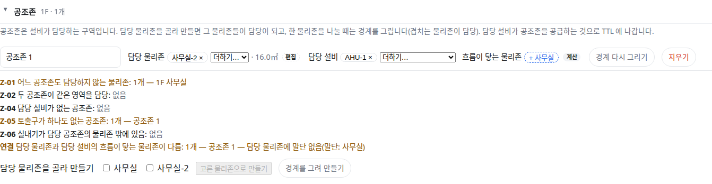

OE-MAP-02 담당 설비에서 확정된 흐름으로 닿는 말단의 물리존을 공조존 담당 후보로 보이고, 담당과 다르면 경고한다

Closes #159
Branch: feature/OE-MAP-02-flow-candidates
Ticket: docs/prd/features/E11-MAP/OE-MAP-02.md

> 공조존 경계 PR(OE-ZON-04) 위에 쌓은 PR 입니다. 그 PR 다음에 merge 해 주세요.

## 요약

공조존 한 줄에 "흐름이 닿는 물리존" 을 보입니다. 담당 설비에서 흐름 방향을 따라 닿는 디퓨저·그릴이 놓인 물리존이고, 담당에 없는 방은 [+ 방] 으로 바로 더합니다.
담당 물리존과 다르면 검증 목록의 `연결` 줄에 경고가 뜹니다. 후보는 담당을 대신 정하지 않습니다.

## 구현한 것

- **흐름이 닿는 물리존(후보)**: 담당 설비가 있는 공조존마다 계산합니다.
  - 방향은 TTL 로 내보낼 때와 같습니다(포트 · 사람이 정한 방향 · 확정한 규칙). 확정 전 규칙 방향으로만 닿는 방은 넣지 않습니다
  - 공조기·FCU 는 급기 하류와 환기·배기 상류의 말단을, VAV 는 하류의 말단을 셉니다. 다른 공조기에 닿으면 멈춥니다
  - 디퓨저를 담당 설비로 고르면 그 디퓨저의 방입니다
  - 공조존과 같은 층의 방만 보입니다. 담당 물리존이면 "✓", 아니면 [+ 방] 버튼입니다
  - 연결이나 방향이 없는 설비는 이 기준을 쓰지 않습니다. 그래서 후보 칸이 아예 없을 수 있습니다
- **`연결` 경고**: 공조존 검증 목록(Z-01~06) 아래에 둡니다. 경고만 하고 막지 않습니다.
  - 담당 물리존 어디에도 담당 설비의 말단이 없음: "공조존 1 — 담당 물리존에 말단 없음(말단: 사무실)"
  - 말단이 있는 방이 담당에서 빠짐: "공조존 1 — 담당에서 빠짐: 창고". 같은 설비가 공급하는 다른 공조존이 그 방을 담당하면 경고하지 않습니다
- 범위를 정한 이유는 ADR-0028 에 적었습니다(ADR-0028 확인 부탁드립니다).

**병원(건축+HVAC)에서 잰 값**: VAV 115대마다 VAV 가 놓인 방 하나로 공조존을 만들었습니다.
- 확정된 흐름이 닿는 방: 1개 64 · 2개 28 · 3개 12 · 4개 8 · 6개 2 · 0개 1
- `연결` 경고 67건(말단 없음 30 · 담당에서 빠짐 37). VAV 는 복도 천장에 있고 말단은 옆 방에 있는 경우가 많아서, VAV 자리만으로 담당을 정하면 이만큼 어긋납니다
- 검증 한 번에 24ms

## 수용 기준 대조

| 기준 | 결과 |
|---|---|
| 물리존을 분할하면 두 조각 모두 원래 공조존의 담당 물리존이 된다 | 공조존 검증 PR(OE-ZON-05)에서 반영 |
| 공조존 도구에서 담당 설비를 고르면, 그 설비에서 확정된 흐름으로 닿는 말단이 있는 물리존이 담당 후보로 보인다 | **이 PR** |
| 지정한 담당 물리존에 그 공조존 설비의 말단이 하나도 없거나, 말단이 있는 물리존이 담당에서 빠져 있으면 검증 경고가 보인다 | **이 PR** — `연결` 줄 |

## 화면

사무실을 x=2 에서 나눠 공조기 AHU-1 이 든 왼쪽 조각(사무실-2)으로 공조존을 만들고 AHU-1 을 담당 설비로 고른 모습입니다.
AHU-1 의 디퓨저는 사무실에 있어 "+ 사무실" 이 후보로 보이고, `연결` 줄에 "담당 물리존에 말단 없음(말단: 사무실)" 이 뜹니다.

## 확인 방법

1. `src/lib/ifc/fixtures/mep.ifc` 를 엽니다 → [편집]
2. 3D 에서 사무실 바닥을 눌러 [나누기] → (2, 0.5)·(2, 7.5) 를 찍습니다 → 사무실-2(16㎡)가 생깁니다
3. "공조존" 을 펼쳐 "사무실-2" 를 체크하고 [고른 물리존으로 만들기] → 담당 설비에 "AHU-1 · 공조기"
4. "흐름이 닿는 물리존 + 사무실" 과, `연결` 줄의 "공조존 1 — 담당 물리존에 말단 없음(말단: 사무실)" 이 보입니다
5. [+ 사무실] → "사무실 ✓" 가 되고 `연결` 줄이 "없음" 이 됩니다

## 테스트

새 테스트는 **이번 수정 전에는 없던 동작**을 확인합니다.
- `src/lib/hvac-zone.test.ts` (+2)
  - 확정 전 규칙 방향으로만 닿는 디퓨저(AT-101-02 를 창고로 옮김)의 방은 후보가 아님. 확정하면 후보가 되고 "담당에서 빠짐: 창고"
  - 같은 공조기가 창고 공조존도 공급하면 경고 없음, 그 공조존의 담당 설비를 비우면 다시 경고, 후보를 더하면 경고 없음
  - 담당에 말단이 없으면 "말단 없음", 디퓨저를 담당 설비로 고르면 그 방, 흐름이 없는 설비(조명)는 기준 밖
- `e2e/hvac-zone.spec.ts` (+1) — 위 확인 방법 1~5

기존 테스트는 고치지 않았습니다.

결과: `npm test` 850 통과 · `npx vue-tsc --noEmit` 통과 · e2e 전체 175 통과 · `check:sample` 98 통과 · 4 건너뜀

## 남은 것

- 공조존을 만들기 전에 설비부터 고르는 길(설비 패널에서 담당 공조존 고르기, OE-ZON-01)
- Z-03 용량 초과와 그 입력값(OE-ZON-06)
- 검증 결과를 생성 전 검증(OE-GEN-03)·반영 결과 리포트(OE-SYNC-04)에 담는 것
