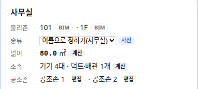

OE-MAP-03 물리존 패널이 담당 공조존을 모두 보이게 하고(N:M), 서비스 영역이 공조존 기준인 것과 어떤 편집 뒤에도 소속이 다시 계산되는 것을 시험한다

Closes #160
Closes #162
Closes #163
Branch: feature/OE-MAP-03-05-06
Ticket: docs/prd/features/E11-MAP/OE-MAP-03.md · docs/prd/features/E11-MAP/OE-MAP-05.md · docs/prd/features/E11-MAP/OE-MAP-06.md

> 공조존 PR 들(OE-ZON-01·02 · OE-ZON-05 · OE-MAP-02 · OE-EQP-08) 다음에 merge 해 주세요. 같은 시험 파일에 더합니다.

## 요약

매핑 티켓 셋을 지금 구현에 대 보았습니다.
- OE-MAP-03(N:M): 담당 관계는 이미 N:M 인데, 물리존 패널이 공조존을 하나만 보였습니다. 고쳤습니다.
- OE-MAP-05(서비스 영역은 공조존 기준): 이미 맞습니다. 시험을 더했습니다.
- OE-MAP-06(편집 함수 안에서 재계산): 이미 맞습니다. 무작위 편집 시험에 불변식을 더했습니다.

## 구현한 것

- **물리존 패널의 공조존(OE-MAP-03)**: 한 물리존을 담당하는 공조존을 모두 보입니다("공조존 1 · 공조존 2"). 공조존마다 출처를 붙입니다(공조존 도구로 만든 것은 "편집", IDF 공조존은 "IDF"). 지금까지는 마지막 공조존 하나만, 출처는 늘 "IDF" 로 보였습니다.
- **서비스 영역(OE-MAP-05)**: 계통도의 서비스 영역은 TTL 에서 설비 `brick:feeds` 공조존, 공조존 `brick:hasPart` 물리존입니다. 둘 다 id 로 이어 물리존 이름을 바꿔도 그대로입니다.
- **재계산(OE-MAP-06)**: 소속은 옮기기·경계·나누기·합치기·종류 바꾸기 같은 편집 함수 안에서 다시 판정합니다. 무작위 편집 시험이 편집한 모델과 저장·불러온 모델의 모든 설비를 그 자리에서 다시 판정해 저장된 소속과 같은지 봅니다(BIM 명시 소속·사람 지정·외벽 설비 포함).

## 수용 기준 대조

| 기준 | 결과 |
|---|---|
| 물리존 하나에 공조존 둘을 담당으로 지정할 수 있고, 두 공조존 모두의 담당 물리존으로 보인다 (MAP-03) | **이 PR** — 물리존 패널, 공조존 목록, TTL |
| 공조존 하나에 물리존 여럿을 담당으로 지정할 수 있다 (MAP-03) | 수동 공조존 PR(OE-ZON-01·02)에서 반영. 시험을 더했습니다 |
| 물리존 공간명을 바꿔도 계통도 서비스 영역의 공조존이 바뀌지 않는다 (MAP-05) | **이 PR** 로 검증 |
| 어떤 편집 뒤에도 좌표로 계산한 소속과 저장된 소속이 같아야 한다 (MAP-06) | **이 PR** 로 검증 — 픽스처 씨앗 200개, 실제 BIM(Duplex 건축+HVAC·MEP, 병원 건축+HVAC) 씨앗 10개씩 |

## 화면

사무실을 공조존 둘이 담당할 때의 물리존 패널입니다.

## 확인 방법

1. `src/lib/ifc/fixtures/mep.ifc` 를 엽니다 → [편집] → "공조존" 에서 "사무실" 로 [고른 물리존으로 만들기] 를 두 번 합니다
2. 3D 에서 사무실 바닥을 누릅니다 → 패널의 공조존이 "공조존 1 편집 · 공조존 2 편집"

## 테스트

새 테스트는 **이번 수정 전에는 없던 동작**을 확인합니다.
- `src/lib/hvac-zone.test.ts` (+2)
  - 물리존 하나를 공조존 둘이, 공조존 하나가 물리존 둘을 담당하고 TTL 에서 두 공조존이 그 물리존을 품음
  - 물리존 이름을 바꿔도 공조기의 `feeds` 와 공조존 블록이 같음
- `src/lib/edit-fuzz.test.ts` (+1) — 씨앗 200개 × 편집 25개 뒤, 편집한 모델·불러온 모델의 모든 설비 소속 = 다시 판정한 소속
- `scripts/check-sample.test.ts` — 실제 BIM 무작위 편집 시험에 같은 검사를 더함
- `e2e/hvac-zone.spec.ts` (+1) — 위 확인 방법

결과: `npm test` 882 통과 · `npx vue-tsc --noEmit` 통과 · e2e 전체 187 통과 · `check:sample` 100 통과 · 4 건너뜀

## 남은 것

- OE-MAP-06 의 나머지 재계산 대상(규칙 방향·면적·문이 잇는 방)은 편집 함수 안에서 하고 있고 무작위 편집 시험의 "불러오기·되돌리기가 화면과 같다" 로 간접 확인합니다. 소속처럼 하나씩 견주는 불변식은 아직 없습니다.
