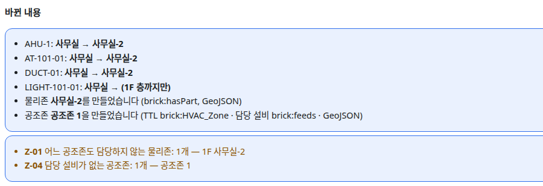

OE-MAP-04 담당 없는 물리존(Z-01)을 비롯한 공조존 검증 경고를 바뀐 내용 리포트에 싣는다

Closes #161
Branch: feature/OE-MAP-04-report-z01
Ticket: docs/prd/features/E11-MAP/OE-MAP-04.md

> 공조존 검증 PR(OE-ZON-05) 다음에 merge 해 주세요. 그 PR 의 검증 결과를 씁니다.

## 요약

OE-MAP-04 는 "어느 공조존도 담당하지 않는 물리존이 생기면 Z-01 경고를 띄우고 반영 결과 리포트(OE-SYNC-04)에 적는다" 입니다. 경고는 공조존 도구에 이미 있고, 리포트에는 없었습니다.
[반영하기] 는 D10 이 열려 있어 아직 없으므로, 반영 전 리포트 자리인 "바뀐 내용" 아래에 공조존 검증 경고를 실었습니다. 반영은 막지 않습니다.

## 구현한 것

- **"바뀐 내용" 아래의 공조존 검증**: 경고가 있는 규칙만 한 줄씩 보입니다(Z-01 · Z-02 · Z-04 · Z-05 · Z-06 · `연결`). 이름은 다섯까지, 나머지는 "외 n개" 입니다.
  - 예: "Z-01 어느 공조존도 담당하지 않는 물리존: 1개 — 1F 사무실-2"
  - 공조존을 하나도 만들지 않았으면 싣지 않습니다. 그때 Z-01 은 물리존 전부라 리포트가 그것으로 덮입니다(공조존 도구의 "공조존이 아직 없는 층" 과 같은 까닭입니다).
- [미리보기] 를 누르면 이 리포트로 갑니다. 구축하기(TTL·GeoJSON 내보내기)를 막지 않습니다.
- OE-ZON-05 의 "결과는 … 반영 결과 리포트(OE-SYNC-04)에 든다" 도 같은 자리로 채웁니다.

## 수용 기준 대조

| 기준 | 결과 |
|---|---|
| 담당 없는 물리존이 생긴 반영의 리포트에 Z-01 항목이 있다 | **이 PR** — [반영하기] 가 생기면(D10) 그 리포트로 옮깁니다 |

## 화면

공조존 1 이 사무실을 담당하는 상태에서 사무실을 나누고, 나뉜 조각(사무실-2)을 공조존 1 의 담당에서 뺀 뒤의 "바뀐 내용" 입니다.

## 확인 방법

1. `src/lib/ifc/fixtures/mep.ifc` 를 엽니다 → [편집]. 아직 공조존이 없어 리포트에 공조존 검증이 없습니다
2. "공조존" 에서 "사무실" 로 공조존 1 을 만듭니다 → 리포트에 "Z-04 담당 설비가 없는 공조존: 1개 — 공조존 1", Z-01 은 없음
3. 3D 에서 사무실을 x=5 에서 나눕니다 → 두 조각 모두 공조존 1 의 담당
4. 공조존 1 의 "사무실-2 ×" → 리포트에 "Z-01 어느 공조존도 담당하지 않는 물리존: 1개 — 1F 사무실-2"

## 테스트

새 테스트는 **이번 수정 전에는 없던 동작**을 확인합니다.
- `e2e/hvac-zone.spec.ts` (+1) — 위 확인 방법 1~4

기존 테스트는 고치지 않았습니다.

결과: `npm test` 882 통과 · `npx vue-tsc --noEmit` 통과 · e2e 전체 188 통과

## 남은 것

- [반영하기](D10)와 반영 결과 리포트(OE-SYNC-04)가 생기면 이 경고를 그 리포트로 옮깁니다.
