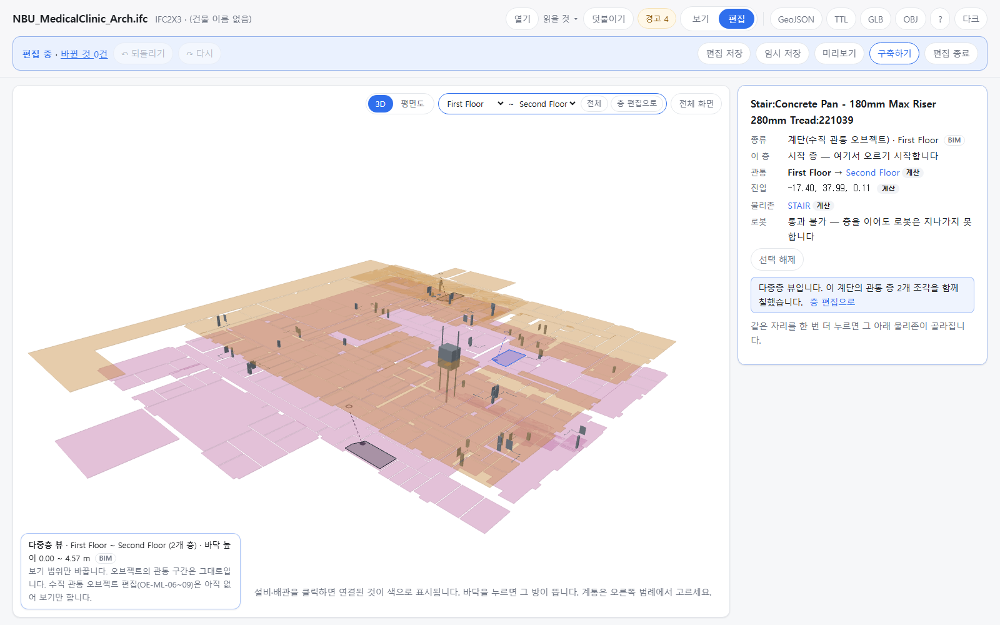

OE-ML-01 다중층 뷰를 연다 — 층 범위를 골라 여러 층을 함께 보고, 계단은 모든 층 조각이 한 오브젝트로 칠해지며, 지금은 보기만 한다

Refs #237
Branch: feature/OE-ML-01-multistorey-view
Ticket: docs/prd/features/E18-ML/OE-ML-01.md · docs/prd/features/E02-OBJ/OE-OBJ-14.md

> OE-ML-05 계단 조각 PR 다음에 merge 해 주세요. 그 PR 의 계단 패널·3D 그리기를 고칩니다.

## 요약

다중층 뷰의 보기 부분입니다(ADR-0032 순서 ④). 층 범위(시작~끝 또는 전체)를 골라 그 층들을 3D 에 함께 그리고, 계단처럼 여러 층을 지나는 오브젝트는 고르면 모든 층 조각과 진입→종료 점선이 같이 칠해집니다.
수직 관통 오브젝트 편집(OE-ML-06~09)이 아직 없어서 다중층 뷰에서는 보기만 하고, [층 편집으로] 돌아가 편집합니다.

## 구현한 것

- **들어가는 길**(같은 이름 [다중층 뷰에서 편집])
  - ① 3D 위 층 고르는 칸 옆 버튼 — 지금 보는 층과 바로 위층(맨 위층이면 아래층)으로 엽니다. "모든 층" 을 보던 중이면 전체입니다.
  - ② 계단 패널의 버튼 — 그 계단의 관통 층으로 열고, 고른 계단을 그대로 둡니다. OE-ML-05 에서 누를 수 없던 버튼입니다.
  - ③ 배관 그리기 중 전환은 층간 배관(OE-PIP-15)과 같이 합니다.
  - 엘리베이터·에스컬레이터 설비 패널의 버튼(OE-EQP-07)은 아직 누를 수 없습니다. 둘을 수직 관통 오브젝트로 읽지 않아(OE-ML-02 2b·2c) 관통 층을 모르기 때문입니다.
- **보기 범위**: 층 고르는 칸 자리에 시작 층 ~ 끝 층 두 칸, [전체], [층 편집으로] 가 뜹니다. 거꾸로 골라도 그 사이 층입니다. 왼쪽 아래에 "다중층 뷰 · First Floor ~ Second Floor (2개 층) · 바닥 높이 0.00 ~ 4.57 m" 를 보입니다.
  - 보기 범위는 오브젝트의 관통 구간과 따로입니다. 범위를 바꿔도 모델은 그대로입니다(시험: 범위를 전체로 넓혀도 계단의 관통 층이 First Floor → Second Floor).
- **함께 칠하기**: 다중층 뷰에서 계단 조각 하나를 누르면 그 계단의 모든 층 조각이 파랗게 칠해집니다. 패널은 "이 계단의 관통 층 2개 조각을 함께 칠했습니다" 입니다.
- **진입 → 종료 점선**: 같은 계단의 시작 층 진입 지점과 끝 층 종료 지점을 실제 높이로 잇는 점선입니다. 양 끝 층이 다 보일 때만 그립니다(한 층만 보면 없습니다).
- **보기만**: 다중층 뷰에서는 3D 끌기·손잡이, 편집 단축키(Delete·방향키 등), 도구 상자를 끕니다. 편집 키를 누르면 "다중층 뷰는 아직 보기만 합니다 …" 를 알리고 아무것도 바꾸지 않습니다. 평면도는 층 하나를 그리므로 다중층 뷰에서는 고를 수 없습니다.
- **나가기**: [층 편집으로] 를 누르면 들어오기 전에 보던 층으로 돌아갑니다. 고른 계단 조각이 그 층에 있으면 남습니다.
- **어디에 남나**: 화면 상태뿐입니다. 저장·내보내기와 관계없습니다. 다중층 세션·확정(OE-WF-03)은 ADR-0032 대로 편집 이력으로 대신하는데, 지금 다중층 뷰에서는 편집하지 않으니 이력도 생기지 않습니다.

## 수용 기준 대조

| 기준 | 결과 |
|---|---|
| 세 경로 모두에서 다중층 뷰가 열리고, ②는 해당 오브젝트의 관통 층이 선택되어 있다 | 일부 **이 PR** — ①·②(`e2e/multi-view.spec.ts`). ③ 은 OE-PIP-15 |
| ③은 선택한 층 범위로 이동하며 현재 층·선택 대상·작성 중 경로를 유지한다 … | 남음 — OE-PIP-15 |
| 세 경로로 연 다중층 편집 모드에서 같은 배관 그리기·편집 도구로 층간 배관과 층별 분기를 작성·수정할 수 있고 … | 남음 — OE-PIP-15·OE-ML-12~14 |
| 연결 관리·상세 패널과 해제 보정·취소 동작 / 해제된 라이저·분기 연결 / 화면 전환만으로 활성화되지 않는다 | 남음 — 라이저(OE-ML-12)가 생긴 뒤. 화면 전환은 지금도 모델을 바꾸지 않습니다 |
| 공간/설비 편집 모드에 맞는 대상만 직접 편집 · 샤프트 연동 | 남음 — OE-ML-06~09·17 |
| 보기 범위를 변경해도 실제 관통·운행 구간은 유지되고, 적용 전 화면 밖 영향 층을 확인할 수 있다 | 앞 절반 **이 PR**. 영향 층 확인은 편집이 생긴 뒤 |
| 여러 층에 걸친 완료 작업의 되돌리기·저장 복원 / R2 잠금 / 층 작업과 다중층 작업의 ID | 남음 — 편집 뒤. ID 는 ADR-0032 대로 편집 이력으로 대신 |

## 화면

병원 건축, 1층에서 [다중층 뷰에서 편집] 을 누르고 계단 하나를 고른 화면입니다. 1층(분홍)·2층(주황) 판이 함께 보이고, 고른 계단의 1층 형상과 2층 종료 지점, 둘을 잇는 점선이 파랗습니다. 나머지 두 계단은 짙은 회색과 점선입니다. 위에 보기 범위 칸, 왼쪽 아래에 범위·높이와 "보기만 합니다" 가 보입니다.

## 확인 방법

1. `data/NBU_MedicalClinic/NBU_MedicalClinic_Arch.ifc` 를 엽니다 → 층을 "First Floor만" → [편집]
2. 3D 위 [다중층 뷰에서 편집] → 범위 칸이 First Floor ~ Second Floor, 왼쪽 아래 "다중층 뷰 · First Floor ~ Second Floor (2개 층) · 바닥 높이 0.00 ~ 4.57 m". 도구 상자가 없고 [평면도] 는 누를 수 없습니다
3. 계단 하나를 누릅니다 → 1층 형상·2층 종료 지점·점선이 같이 파랗고, 패널에 "관통 층 2개 조각을 함께 칠했습니다"
4. Delete → "다중층 뷰는 아직 보기만 합니다" 알림, [되돌리기] 는 비활성 그대로
5. [전체] → "(4개 층)". 패널의 관통은 그대로 First Floor → Second Floor
6. [층 편집으로] → 다시 "First Floor만", 도구 상자가 돌아옵니다
7. 계단 패널의 [다중층 뷰에서 편집] → 그 계단의 관통 층(First Floor ~ Second Floor)으로 열립니다

## 테스트

새 테스트는 **이번 수정 전에는 없던 동작**을 확인합니다.
- `e2e/multi-view.spec.ts` (새 파일) — 위 확인 방법 1~7. 3D 에 그린 조각 수(한 층 3 → 두 층 6 → 2층만 3), 진입·종료·점선 수(3·3·3), 칠한 조각(같은 계단의 2개), 편집 키 막음, 범위와 관통 구간이 따로인 것, 돌아온 층·도구 상자

기존 테스트를 고친 것:
- `e2e/vertical-parts.spec.ts` — 계단 패널의 [다중층 뷰에서 편집] 이 이제 눌립니다(비활성 → 활성). 3D 표시 수에 점선 수(`rise`, 한 층만 볼 때 0)를 더했습니다.

결과: `npm test` 898 통과 · `npx vue-tsc --noEmit` 통과 · e2e 전체 189 통과 · 1 건너뜀. 임포터·규칙 숫자는 건드리지 않았습니다.

## 남은 것

- 다중층 뷰 안의 편집 — 수직 관통 오브젝트 생성·이동·구간 변경·삭제(OE-ML-06~09), 라이저·층별 분기(OE-ML-12~14), 진입 경로 ③(OE-PIP-15)
- ML-19 의 모호 후보(동률·다대일 겹침)를 다중층 뷰에서 보이고 확인하는 것(ADR-0032 "결과")
- 엘리베이터·에스컬레이터 오브젝트(OE-ML-02 2b·2c)가 생기면 그 패널의 [다중층 뷰에서 편집] 도 엽니다
