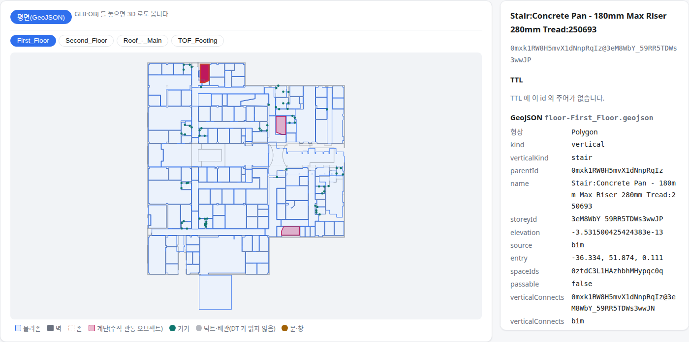
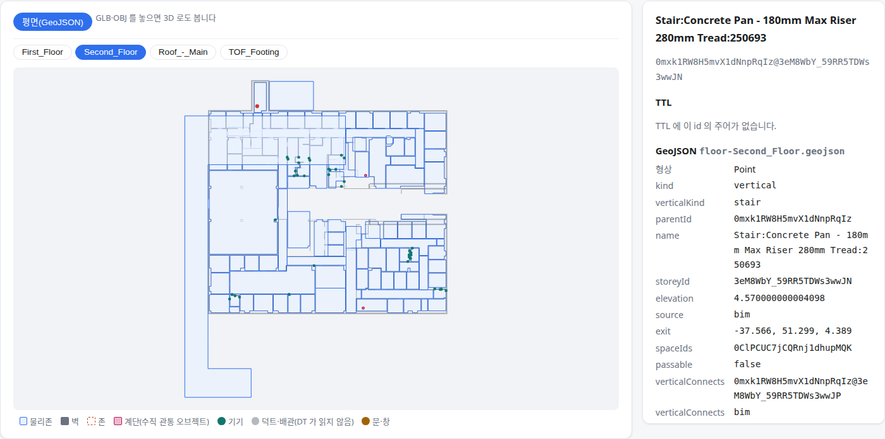

OE-ML-02 BIM 계단을 층별 조각을 가진 수직 관통 오브젝트로 읽어 GeoJSON 에 내고, 계단이 이은 물리존을 층간 연결의 근거로 먼저 쓴다

Refs #238
Branch: feature/OE-ML-02-stair-objects
Ticket: docs/prd/features/E18-ML/OE-ML-02.md · docs/prd/features/E02-OBJ/OE-OBJ-14.md · docs/prd/features/E18-ML/OE-ML-19.md

> OE-ML-19 겹침 후보 PR(ADR-0032) 다음에 merge 해 주세요. 그 PR 의 `vertical.ts`·병원 기준선·로봇 GeoJSON 문서를 고칩니다.

## 요약

BIM 의 계단(IfcStair)을 물리존과 따로 수직 관통 오브젝트로 읽게 했습니다. 오브젝트는 지나는 층마다 조각 하나를 갖고, 조각에는 그 층의 형상과 진입(오르기 시작하는 자리)·종료(다다르는 자리) 지점이 있습니다.
OE-ML-19 의 "명시된 오브젝트의 연관 공간을 우선" 에 따라, 계단이 이은 두 물리존을 층간 연결의 첫 근거(출처 `bim`)로 쓰고 겹침 추정에서 뺍니다. 엘리베이터·에스컬레이터는 다음 PR 입니다.

## 구현한 것

- **계단 읽기**(`src/lib/ifc/import.ts`, `src/lib/vertical-object.ts`): 형상을 읽는 임포트(화면에서 파일을 열 때)에서 IfcStair 마다 오브젝트 하나를 만듭니다.
  - 계단판(IfcStairFlight)·참(IfcSlab) 형상만 잽니다. 난간은 위 끝을 1m 쯤 올려 위층을 잘못 고르게 하므로 뺍니다. 하위 부재가 없는 계단(FZK·Institute)은 계단 자신의 형상입니다.
  - 끝 층은 "시작 층보다 1m 넘게 높고, 위 끝 + 0.3m 이하인 층 중 가장 높은 층" 입니다. 가진 파일의 계단 50개는 난간을 빼면 위 끝이 위층 바닥보다 0~0.17m 낮았습니다(병원 4.52m / 2층 4.57m).
  - 다른 층에 닿지 않는 계단(한 층 안의 몇 계단)은 만들지 않고, 임포트 경고에 수를 적습니다. 예: "계단 35개 중 3개는 다른 층에 닿지 않아 … 만들지 않았습니다"(성수)
  - 사이 층을 지나는 계단은 사이 층에 형상만 있는 조각을 둡니다(성수 B5F → B5'F → B4F 계단 2개).
- **어디에 남나**: 조각은 모델의 층(`Storey.verticalParts`)에 있고 BIM 을 다시 열면 다시 만들어집니다. 편집 파일에는 아직 들어가지 않습니다(사람이 고치는 것은 OE-ML-06~09). 연관 물리존 id 는 저장하지 않고 진입·종료 지점이 드는 물리존을 그때 짚습니다. 물리존을 나누거나 지워도 없는 id 를 가리키지 않게 하려는 것입니다.
- **GeoJSON**: 조각마다 feature 하나(`kind: "vertical"`, id `<계단 GlobalId>@<층 id>`)를 그 층 파일에 냅니다. 속성은 `verticalKind`·`parentId`·`source`·`entry`·`exit`·`spaceIds`(연관 물리존)·`passable: false`(계단은 로봇이 지나가지 못합니다, OE-ML-04)·`verticalConnects`(같은 계단의 아래·위층 조각)입니다. TTL 에는 넣지 않았습니다.
- **층간 연결**(`src/lib/vertical.ts`): 계단이 시작 층 진입 지점의 물리존과 끝 층 종료 지점의 물리존을 이으면 그 연결을 씁니다(`verticalConnectsSource: "bim"`). 그 두 물리존은 겹침 추정에서 빠집니다. 계단실이 아닌 물리존(거실의 나선 계단, 복도의 계단)도 잇습니다.
- **합치기**: 건축+설비 파일을 합칠 때 덧붙인 판본에만 있는 계단 조각을 받습니다. 같은 계단이 두 판본에 다 있으면 바탕 것만 둡니다.
- **내보낸 파일 뷰어**: 계단 조각을 분홍색으로 그리고 범례에 "계단(수직 관통 오브젝트)" 를 더했습니다.
- 설계 결정은 ADR-0033 에 적었습니다(ADR-0033 확인 부탁드립니다). 오브젝트 목록을 모델에 따로 두지 않고 층별 조각으로 둔 까닭, 난간을 뺀 까닭, 연관 물리존을 저장하지 않는 까닭입니다.
- `exterior.ts` 의 볼록 껍질 함수를 `polygon.ts` 로 옮겨 같이 씁니다(동작은 그대로입니다).

## 수용 기준 대조

| 기준 | 결과 |
|---|---|
| 별도 오브젝트와 연관 물리존을 구분하고 부모 ID·층 ID·층별 형상·연결 지점을 저장 및 GeoJSON 출력에서 확인할 수 있다 | **이 PR**(계단) — `vertical.test.ts` "GeoJSON 에 층마다 조각 feature 를 내고 …", `check:sample` 병원 |
| 서로 다른 1층 진입점과 2층 종료점을 갖는 계단·ES를 생성·저장 복원할 수 있다 | 일부 — BIM 계단은 이 PR(`vertical-object.test.ts` "시작 층에 형상·진입 지점, 끝 층에 종료 지점 …"). 사람이 만드는 것은 OE-ML-06, ES 는 다음 PR |
| 샤프트·EL 승강로의 공통 축과 계단·ES의 층별 형상을 구분하여 표시한다 | 남음 — EL·샤프트 오브젝트가 아직 없고, 편집기 화면 표시는 OE-ML-05 |
| GeoJSON의 층간 연결 대상 ID가 실제 출력된 객체를 참조하며 원본 공간과 중복 출력되지 않는다 | **이 PR** — `check:sample` 병원: `verticalConnects`·`spaceIds` 가 가리키는 id 가 전부 내보낸 feature 이고 feature id 가 겹치지 않음 |
| 재임포트 후 원본 정보와 사용자 보정이 구분되고 동일 객체가 중복 생성되지 않는다 | 일부 — id 가 계단 GlobalId 라 다시 열어도 같은 오브젝트입니다. 사용자 보정은 OE-ML-06~09 다음 |

OE-ML-19 쪽으로는 "명시 연결·단절·사용자 보정은 면적 겹침 추정으로 덮어써지지 않는다" 의 명시 연결 부분이 이 PR 입니다(`vertical.test.ts` "계단이 이은 물리존은 그 연결(출처 bim)을 쓰고 …"). 단절·보정은 사람이 고치는 기능이 생긴 뒤입니다.

## 화면

병원 건축 GeoJSON 을 내보낸 파일 뷰어에 놓은 1층입니다. 분홍색이 계단 세 개의 1층 조각이고, 고른 계단은 진입 지점과 연관 물리존(1층 계단실 1CS3), 2층 조각을 가리킵니다.

같은 계단의 2층 조각입니다. 형상 없이 종료 지점(점)이고, 연관 물리존은 2층 계단실 2CS3 입니다.

## 확인 방법

1. `data/NBU_MedicalClinic/NBU_MedicalClinic_Arch.ifc` 를 엽니다 → [기하 내보내기 (GeoJSON)] 로 층 파일 4개를 받습니다
2. `viewer.html` 에 층 파일 4개를 놓고 First_Floor 를 봅니다 → 분홍색 계단 3개. 왼쪽 위 계단(…`Tread:250693`)을 누르면 `entry` · `spaceIds`(1CS3 의 id) · `verticalConnects`(2층 조각 id) · `passable: false`
3. Second_Floor 로 가서 같은 계단의 점을 누릅니다 → `exit` · `spaceIds`(2CS3 의 id) · `verticalConnects`(1층 조각 id)
4. 1층 계단실 1CS3 을 누릅니다 → `verticalConnects` 가 2CS3 의 id, `verticalConnectsSource` 가 `bim`
5. `data/성수/Factorial_건축.ifc` 를 열면 임포트 경고에 "계단 35개 중 3개는 다른 층에 닿지 않아 …" 가 보입니다

## 테스트

새 테스트는 **이번 수정 전에는 없던 동작**을 확인합니다.
- `src/lib/vertical-object.test.ts` (6) — 시작 층 형상·진입 지점 / 끝 층 종료 지점 · 층을 잇지 않는 계단은 만들지 않음 · 난간이 섞여도 위층을 넘겨짚지 않음 · 사이 층 조각 · 연관 물리존을 그때 짚고 물리존을 지우면 낡은 id 가 안 남음 · 합치기
- `src/lib/vertical.test.ts` (+3) — 계단이 이은 연결이 겹침 추정을 덮음(출처 `bim`) · 계단실이 아닌 물리존도 이음 · GeoJSON 조각 feature
- `scripts/check-sample.test.ts` — 병원 계단 3개(1층 진입·2층 종료), 조각 feature 6개 `passable: false`, 층간 연결·연관 물리존이 가리키는 id 가 전부 실제 feature, 계단을 빼고 겹침만으로 재도 같은 짝(두 근거 대조)
- `scripts/seongsu.test.ts` (+1) — 계단 35개 중 32개가 오브젝트, 사이 층을 지나는 계단 2개, 계단이 이은 짝 26개가 겹침만의 24개를 모두 품음

기존 테스트를 고친 것:
- `check-sample.test.ts` 병원 기준선 `HOSPITAL_VERTICAL` 의 출처를 `calc` → `bim` 으로 바꿨습니다. 짝은 그대로입니다.
- `check-sample.test.ts` "S2·S4·S7: 건축+MEP 합친 모델" — 이 시험은 GeoJSON feature id 가 전부 22자 IfcGlobalId 인지 봅니다. 계단 조각 id 는 OE-ML-02 대로 "부모 id@층 id" 라 22자가 아닙니다. 계단 조각은 부모 id 가 22자 GlobalId 이고 조각 id 가 `부모 id@층 id` 인지를 보게 바꿨습니다. PRD 부록 C 의 S2 는 물리존·설비·공조존의 id 를 말하므로 그 기준은 그대로입니다. Duplex 의 feature 수에 계단 조각 4개(계단 2개 × 1·2층)를 더했습니다.

가진 BIM 에서 잰 값(계단 → 오브젝트, 계단이 이은 물리존 짝):

| | 계단 | 오브젝트 | 계단이 이은 짝 | 겹침만으로 잇던 짝 |
|---|---|---|---|---|
| 병원 건축 · dental | 3 | 3 | 3 | 3 (같은 짝) |
| Office_A | 2 | 2 | 2 | 2 (같은 짝) |
| 성수 건축 | 35 | 32 | 26 | 24 (모두 포함, B5F↔B4F · B1F 로비↔1F 계단실이 더해짐) |
| FZK | 1 | 1 | 1 (거실↔갤러리) | 0 |
| Institute | 4 | 4 | 4 (층마다 복도) | 0 |
| Duplex 건축 | 2 | 2 | 0 (2층 복도에 외곽선이 없어 종료 지점이 물리존에 들지 않음) | 0 |

결과: `npm test` 897 통과 · `npx vue-tsc --noEmit` 통과 · e2e 전체 188 통과 · `check:sample` 101 통과(4 건너뜀). 전체 실행에서 S2 하나가 실패해(아래) 고친 뒤 그 시험과 병원 시험만 다시 돌려 통과했습니다.

## 남은 것

- 엘리베이터·에스컬레이터 오브젝트 — 다음 PR 입니다. 샘플에 IfcTransportElement 가 없어 이름 사전 설비에서 만듭니다. 엘리베이터는 정차 층(OE-ML-10, #181)이 정해져야 층별 통과 속성을 냅니다.
- 편집기 화면(층 편집)에 계단 조각을 그리고 읽기 전용으로 두는 것 — OE-ML-05 입니다.
- 사람이 계단을 만들거나 고친 것(편집 파일에 저장, 원본과 보정 구분) — OE-ML-06~09 입니다.
- TTL 출력 — 수신 측과 클래스를 정할 때까지 내지 않습니다(ADR-0008 과 같은 까닭).
