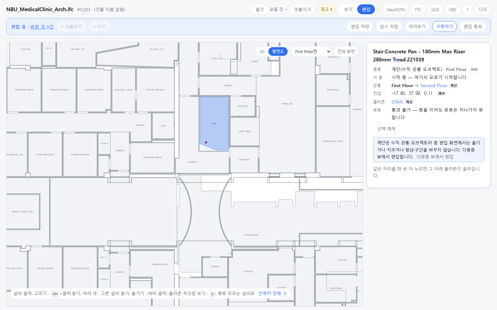
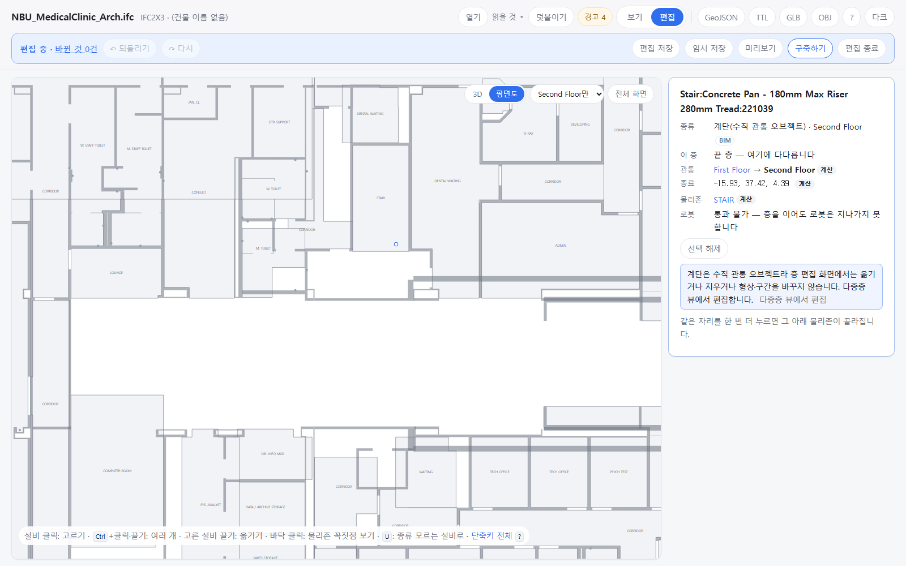
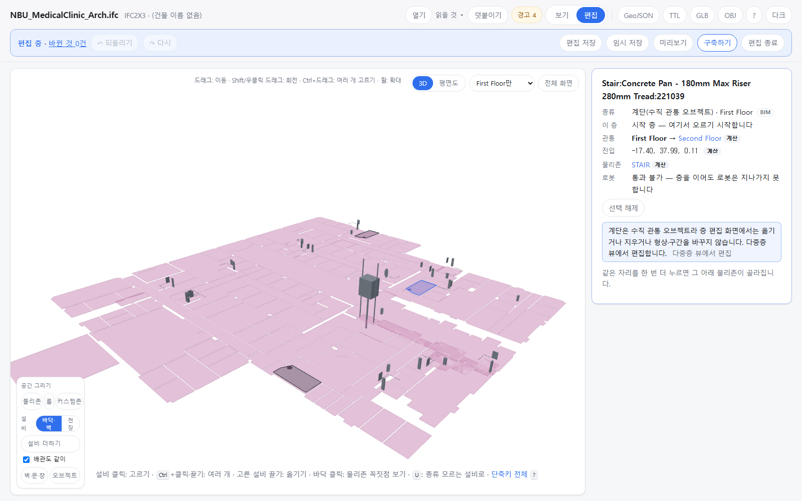

OE-ML-05 층 편집 화면에 계단 조각의 그 층 형상과 진입·종료 지점을 그리고, 고르면 읽기 전용 패널과 [다중층 뷰에서 편집] 안내를 보인다

Refs #OE-ML-05 이슈(옮길 때 번호를 넣습니다)
Branch: feature/OE-ML-05-vertical-read-only
Ticket: docs/prd/features/E18-ML/OE-ML-05.md · docs/prd/features/E02-OBJ/OE-OBJ-14.md

> OE-ML-02 계단 오브젝트 PR(ADR-0033) 다음에 merge 해 주세요. 그 PR 이 만든 층별 조각(`Storey.verticalParts`)을 화면에 그립니다.

## 요약

OE-ML-02 로 BIM 계단이 층별 조각을 가진 수직 관통 오브젝트가 됐지만, 지금까지는 내보낸 파일 뷰어에서만 보였습니다. 이제 층 편집 화면(3D·평면도)에 그 층의 조각을 그리고, 누르면 오른쪽 패널에 읽기 전용 정보가 뜹니다.
옮기기·지우기는 데이터를 바꾸지 않고 "다중층 뷰에서 편집합니다" 를 안내합니다. 엘리베이터·에스컬레이터 설비의 잠금(OE-EQP-07)과 같은 모양입니다.

## 구현한 것

- **그리기**
  - 평면도: 시작 층·사이 층 조각은 형상(분홍, 내보낸 파일 뷰어와 같은 색), 진입 지점은 채운 원, 종료 지점은 빈 원입니다. 끝 층 조각은 형상이 없어 종료 지점만 보입니다.
  - 3D: 같은 것을 층 바닥 0.22m 위에 그립니다. 3D 는 층 판이 층마다 색(분홍도 있습니다)이라 계단은 짙은 회색으로 그렸습니다. 고른 조각은 두 화면 모두 액센트 파랑입니다.
  - 층별 보기를 따릅니다. 고른 층의 조각만 보입니다.
- **고르기**: 바닥을 누르면 계단 조각이 룸·물리존보다 먼저 골라집니다. **고른 조각을 한 번 더 누르면 그 아래 물리존(계단실)이 골라집니다** — 계단 형상이 계단실을 거의 덮어서, 이 길이 없으면 계단실 경계를 고치려면 목록에서 찾아야 합니다. 3D 의 끝 층 조각(지점만 있음)은 지점 둘레 0.6m 를 누르면 골라집니다.
- **패널**(읽기 전용): 종류(계단, BIM) · 이 층의 자리(시작 층 / 지나는 층 / 끝 층) · 관통 층(First Floor → Second Floor, 다른 층 이름을 누르면 그 층으로 가서 같은 계단의 그 층 조각을 고릅니다) · 진입·종료 지점 좌표 · 연관 물리존(누르면 그 물리존을 고릅니다) · 로봇 통과 불가.
- **잠금**: 편집 모드에서 패널에 "계단은 수직 관통 오브젝트라 층 편집 화면에서는 옮기거나 지우거나 형상·구간을 바꾸지 않습니다. 다중층 뷰에서 편집합니다." 와 [다중층 뷰에서 편집](비활성 — 다중층 뷰 OE-ML-01 이 아직 없습니다)이 보입니다. Delete·방향키는 같은 말을 알리고 아무것도 바꾸지 않습니다(되돌리기 이력도 생기지 않습니다). 조각은 처음부터 끌 수 있는 손잡이가 없어 3D·평면도에서 끌면 시점만 움직입니다.
- **어디에 남나**: 화면 표시뿐입니다. 고른 상태는 브라우저에만 있고 모델·편집 파일·내보내기는 바뀌지 않습니다.
- 마우스를 올리면 설명 풍선에 "계단 · 수직 관통 오브젝트 / 층 편집 화면에서는 보기만 합니다" 가 뜹니다.

## 수용 기준 대조

| 기준 | 결과 |
|---|---|
| 층 편집 화면에서 EL·ES·계단·샤프트를 끌거나 삭제·크기/구간을 바꾸려 해도 데이터는 변경되지 않고 다중층 편집 안내가 보인다 | 계단은 **이 PR**(`e2e/vertical-parts.spec.ts`). EL·ES 설비는 OE-EQP-07 에서 이미 반영(`e2e/vertical-device.spec.ts`). 샤프트는 오브젝트가 아직 없습니다 |
| 같은 부모 오브젝트의 층별 형상과 진입/종료 위치가 해당 층에 표시된다 | **이 PR** — 병원 1층 형상 3 · 진입 3, 2층 종료 3 |
| 같은 층 분기 배관 작성은 가능하고 다른 층 경로의 형상 변경은 다중층 화면으로 안내된다 | 남음 — 층간 배관(OE-PIP-15·OE-ML-13)이 아직 없습니다 |

## 화면

병원 건축 1층 평면도, 편집 모드에서 계단을 고른 화면입니다. 계단 형상(파랑)과 진입 지점(점), 패널의 관통 층·진입 지점·연관 물리존(STAIR), 잠금 안내가 보입니다.

패널에서 Second Floor 를 누른 화면입니다. 2층으로 가서 같은 계단의 끝 층 조각(종료 지점, 빈 원)이 골라지고 패널이 "끝 층" 입니다.

3D 의 1층입니다. 계단 세 개가 짙은 회색, 고른 계단이 파랑입니다.

## 확인 방법

1. `data/NBU_MedicalClinic/NBU_MedicalClinic_Arch.ifc` 를 엽니다 → 층을 "First Floor만" 으로, [평면도] 를 누릅니다 → 분홍 계단 3개와 진입 지점 3개
2. 계단 하나를 누릅니다 → 패널: 이 층 "시작 층", 관통 "First Floor → Second Floor", 진입 좌표, 물리존 STAIR
3. [편집] → 패널에 잠금 안내와 [다중층 뷰에서 편집](비활성). Delete·방향키를 눌러도 "수직 관통 오브젝트라 …" 알림만 뜨고 [되돌리기] 는 비활성 그대로
4. 같은 계단을 한 번 더 누릅니다 → 계단실 STAIR 가 골라집니다
5. 계단을 다시 고르고 패널의 Second Floor 를 누릅니다 → 2층 평면도, 종료 지점이 골라지고 패널이 "끝 층"
6. [3D] 로 바꿔도 같은 계단이 보이고 눌러 고를 수 있습니다

## 테스트

새 테스트는 **이번 수정 전에는 없던 동작**을 확인합니다.
- `src/lib/vertical-object.test.ts` (+1) — 조각 id 로 오브젝트와 그 층의 자리(시작·사이·끝)를 찾는다(`findPart`). 층 순서가 높이 순이 아니어도 높이로 셉니다
- `e2e/vertical-parts.spec.ts` (새 파일) — 병원 건축: 1층 형상 3·진입 3·종료 0, 패널 내용, 편집 모드 잠금, Delete·방향키가 형상·좌표·되돌리기 이력을 바꾸지 않음, 다시 누르면 계단실, 관통 층으로 2층 이동(형상 0·종료 3·끝 층), 3D 에서 고르기·끌기·다시 누르기

결과: `npm test` 898 통과 · `npx vue-tsc --noEmit` 통과 · e2e 187 통과 · 2 실패 · 1 건너뜀. 임포터·규칙 숫자는 건드리지 않아 `check:sample` 은 돌리지 않았습니다.

실패 2개(`edit-3d.spec.ts` "편집 모드에서 바닥을 누르면 물리존이 골라지고 …", `edit-structure.spec.ts` "설비를 바닥에 더하고 …")는 이 PR 을 빼고 돌려도 같게 실패합니다. 1280×720 화면에서 왼쪽 아래 [공간 그리기] 도구 상자가 fixture 바닥을 덮어 바닥 클릭이 상자에 맞습니다(이 PC 글꼴에서 [바닥·벽] 단추가 두 줄로 꺾여 상자가 높아짐). 이 PR 다음의 "test: 편집 도구 상자 …" PR 이 고칩니다.

## 남은 것

- [다중층 뷰에서 편집] 은 다중층 뷰(OE-ML-01)가 생기면 그 화면을 열고 이 계단의 관통 층을 고릅니다(진입 경로 ②).
- 에스컬레이터·엘리베이터 오브젝트(OE-ML-02 2b·2c)가 생기면 같은 그리기·패널을 탑니다. 지금 EL·ES 는 설비로만 있고 잠금은 OE-EQP-07 입니다.
- 층간 배관의 같은 층 분기 예외(수용 기준 셋째 줄)는 OE-PIP-15 와 같이 합니다.
