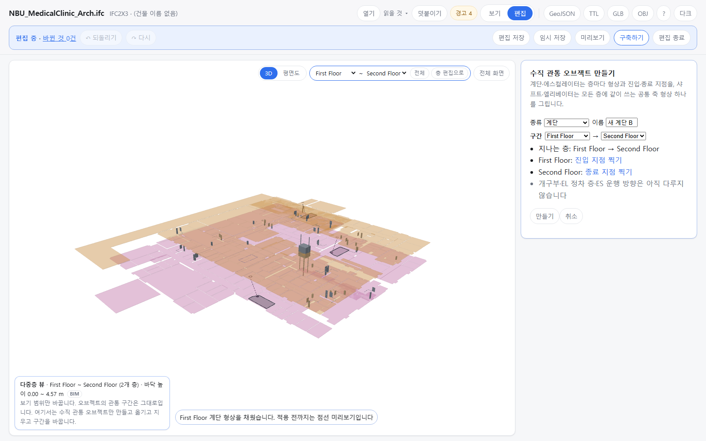

OE-ML-06 다중층 뷰에서 수직 관통 오브젝트를 만든다 — 계단·ES 는 층마다 형상·지점을, 샤프트·EL 은 모든 층에 같은 공통 축 하나를 그리고, 취소하면 남는 것이 없다

Refs OE-ML-06 이슈(번호는 옮길 때 넣습니다)
Branch: feature/OE-ML-06-vertical-create
Ticket: docs/prd/features/E18-ML/OE-ML-06.md · docs/prd/features/E18-ML/OE-ML-02.md · docs/prd/features/E18-ML/OE-ML-07.md

> OE-ML-08 구간 바꾸기 PR 다음에 merge 해 주세요. 그 PR 의 "층마다 채우기" 를 그대로 쓰고, 구간 계획을 종류별 규칙으로 넓힙니다.

## 요약

다중층 뷰에서 계단·에스컬레이터·엘리베이터·샤프트를 새로 만들 수 있게 했습니다. 종류·이름·시작/끝 층을 정하면 층마다 채울 것이 보이고, 사람이 그 층 바닥에 그리거나 찍어 채우면 [만들기] 가 켜집니다.
OE-ML-02 대로 둘을 가릅니다. 계단·ES 는 층마다 형상과 진입·종료 지점이 다르고, 샤프트·EL 승강로는 형상 하나가 모든 층의 공통 축입니다.

## 구현한 것

- **들어가기**: 다중층 뷰(편집 모드) 왼쪽 아래 안내 상자의 [수직 관통 오브젝트 만들기]. 오른쪽 패널에 "수직 관통 오브젝트 만들기" 칸이 뜹니다.
  - 종류(계단·에스컬레이터·엘리베이터·샤프트), 이름(기본 "새 계단" 처럼 종류를 따라 바뀜), 구간(시작 층 → 끝 층)
  - 지나는 층, 층마다 채울 것과 [형상 그리기]·[진입 지점 찍기]·[종료 지점 찍기](OE-ML-08 PR 과 같은 도구), 잇는 물리존
  - 같은 층 구간·거꾸로 된 구간·층 높이를 모르는 층이면 이유를 보이고 [만들기] 가 꺼집니다. 이름이 비어도 꺼집니다
- **종류별 규칙**
  - 계단·에스컬레이터: 시작 층 형상+진입 지점, 사이 층 형상, 끝 층 종료 지점(BIM 계단과 같은 모양, ADR-0033)
  - 샤프트·엘리베이터: 형상을 한 번 그리면 구간의 모든 층에 같은 형상을 둡니다. 아래층을 베끼는 것이 아니라 축의 정의라 OE-ML-08 의 "임의 복제 금지" 와 부딪히지 않습니다. 진입·종료 지점은 두지 않아 물리존을 잇지 않습니다(EL 정차 층은 OE-ML-10 · #181 답 뒤)
- **공통 축 유지**(OE-ML-07): 샤프트·엘리베이터는 한 층만 고치는 손잡이·칸이 없고 "모든 층이 같은 공통 축이라 한 층만 고치지 않습니다. 전체 이동으로 옮깁니다." 를 보입니다. 전체 이동·구간 바꾸기는 축째로 됩니다
- **취소**: 계획·채우기는 모델을 바꾸지 않습니다. 채운 것은 점선 미리보기로만 보이고, [취소] 하면 남는 것이 없습니다(되돌리기 이력도 없음)
- **만들기**: 이력 하나. id 는 에디터가 짓는 `U_…`, 출처 `edit`. 만든 조각이 바로 골라집니다
- **어디에 남나**
  - 리포트: "샤프트 PS-9를 만들었습니다(모든 층, GeoJSON)"
  - 편집 파일: `verticals: [{ id, created: { kind, name }, parts }]`. 불러오면 같은 오브젝트가 생깁니다
  - GeoJSON: 층마다 feature(`verticalKind` 가 종류, `source: "edit"`, `passable: false`). 계단·ES 는 진입·종료 지점이 든 물리존을 `verticalConnects`(출처 `edit`)로 잇습니다
  - TTL: 수직 관통 오브젝트는 아직 TTL 에 나가지 않습니다(ADR-0033)
- 구간 계획을 종류별 규칙으로 일반화했습니다(`planFor`). OE-ML-08 구간 바꾸기도 같은 길을 타서, 샤프트·EL 의 구간을 늘리면 새 층에 축이 따라갑니다
- ADR-0034 에 만들기와 공통 축 규칙을 더했습니다(확인 부탁드립니다)

## 수용 기준 대조

| 기준 | 결과 |
|---|---|
| 샤프트·EL은 공통 수직 축으로, 계단·ES는 서로 다른 층별 형상·연결 지점으로 생성할 수 있다 | 일부 **이 PR** — 둘 다 만듭니다. EL 의 정차 층·ES 의 운행 방향은 OE-ML-10·11 |
| 선택한 층·형상과 실제 슬래브 교차에 따라 개구부가 확정되거나 초안으로 표시되고 초안은 면적에 반영되지 않는다 | 남음 — OE-ML-03(슬래브 형상) |
| 층 높이 누락·잘못된 구간·유효하지 않은 필수 형상이 있으면 완료할 수 없고 사유가 표시된다 | **이 PR**(태그는 `~`: 개구부 확인 정보 부족 시 초안 생성 경로가 없음) |
| 생성 취소 후 새 임시 객체가 남지 않으며 완료 후 저장·되돌리기에서 여러 층의 관련 객체와 면적이 함께 복원된다 | 일부 **이 PR** — 취소·되돌리기·저장 복원. 면적은 개구부가 생긴 뒤 |

## 화면

다중층 뷰에서 계단을 만드는 중입니다. 1층 형상을 그렸고(점선 미리보기), 남은 "First Floor: 진입 지점 찍기", "Second Floor: 종료 지점 찍기" 가 보이며 [만들기] 는 아직 꺼져 있습니다.

## 확인 방법

1. `data/NBU_MedicalClinic/NBU_MedicalClinic_Arch.ifc` → [편집] → "First Floor만" → 3D 위 [다중층 뷰에서 편집]
2. 왼쪽 아래 [수직 관통 오브젝트 만들기] → 종류 "샤프트" → 이름 "새 샤프트", 지나는 층 First Floor → Second Floor, "First Floor: 형상 그리기"
3. 끝 층을 First Floor 로 → "같은 층을 시작·끝 층으로 둘 수 없습니다 …"
4. 끝 층을 Second Floor 로 되돌리고 [형상 그리기] → 1층 바닥에 네 점 → Enter → "다 채웠습니다", 점선 미리보기. [취소] → 아무것도 남지 않음
5. 다시 열어 이름 "PS-9", 형상을 그리고 [만들기] → 패널 PS-9, 관통 First Floor → Second Floor, 공통 축 안내, 손잡이 없음, 리포트 "샤프트 PS-9를 만들었습니다"
6. Ctrl+Z → 두 조각이 함께 사라집니다

## 테스트

새 테스트는 **이번 수정 전에는 없던 동작**을 확인합니다.
- `src/lib/vertical-edit.test.ts` (+4) — 계단: 층별로 채워야 만들고 이름·채울 것이 남으면 거절, 계획·거절은 모델을 안 바꿈, 진입·종료 물리존을 이음(출처 edit), 같은 id 거절 · 층 높이를 모르거나 구간이 잘못되면 거절 · 샤프트: 형상 하나가 세 층의 축, 한 층 고치기 거절, 통째 이동은 축째, 물리존을 잇지 않음, GeoJSON `shaft`·`edit`·`passable: false` · 되돌리기 한 번, 편집 파일로 새 모델에 얹으면 같음(`created`)
- `e2e/vertical-edit.spec.ts` (+1) — 위 확인 방법 1~6(병원 건축)

결과: `npm test` 930 통과 · `npx vue-tsc --noEmit` 통과 · e2e 전체 193 통과 · 1 건너뜀 · `npm run ac:coverage` OE-ML-06 다 잼 0 · 일부 3 / 4

## 남은 것

- 개구부(OE-ML-03) — 슬래브 형상을 아직 읽지 않습니다
- EL 정차 층(OE-ML-10, #181)·ES 운행 방향(OE-ML-11). 지금 만든 EL·ES 는 정차·방향 없이 형상만입니다
- PRD 의 "계단·샤프트는 공간 편집 모드, EL·ES 는 설비 편집 모드에서 생성" — 이 repo 에는 공간/설비 편집 모드 구분이 아직 없어 다중층 뷰 한 곳에서 만듭니다
- 꼭짓점 더하기·빼기
