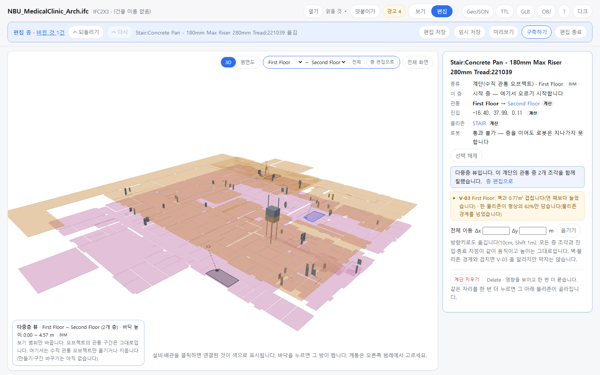
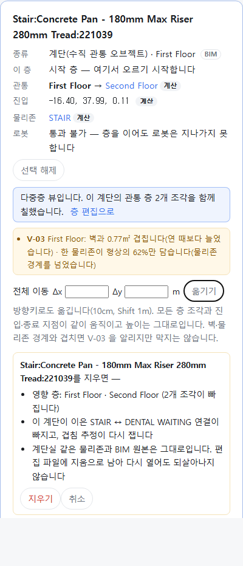

OE-ML-07·09 다중층 뷰에서 수직 관통 오브젝트를 통째로 옮기고 지운다 — 모든 층 조각이 같이 가고, V-03 을 알리며, 지우기는 영향을 보이고 묻고, 편집 파일로 다시 얹힌다

Refs OE-ML-07 · OE-ML-09 이슈(번호는 옮길 때 넣습니다)
Branch: feature/OE-ML-07-09-vertical-move-delete
Ticket: docs/prd/features/E18-ML/OE-ML-07.md · docs/prd/features/E18-ML/OE-ML-09.md · docs/prd/features/E18-ML/OE-ML-01.md

> OE-ML-01 다중층 뷰(보기) PR 다음에 merge 해 주세요. 그 PR 의 다중층 뷰에 편집을 더합니다.

## 요약

다중층 뷰에서 고른 계단을 옮기고 지울 수 있게 했습니다. 옮기면 1층·2층 조각과 진입·종료 지점이 같은 거리만큼 같이 가고, 벽·물리존 경계와 새로 겹치면 V-03 을 알립니다(막지는 않습니다).
지우기는 영향 층·빠지는 연결을 보이고 한 번 더 묻습니다. 여러 층에 걸친 변경이 되돌리기 한 번이고, 편집 파일에 남아 같은 BIM 을 다시 열어도 그대로입니다.

## 구현한 것

- **전체 이동**(OE-ML-07): 다중층 뷰에서 계단을 고르면 패널에 "전체 이동 Δx Δy m [옮기기]" 가 뜹니다. 방향키로도 옮깁니다(10cm, Shift 1m).
  - 모든 층 조각의 형상과 진입·종료 지점에 같은 x·y 를 더합니다. 높이는 그대로라 층 사이 상대 위치가 같습니다.
  - 연관 물리존·층간 연결은 저장하지 않고 그때 짚으므로(ADR-0033) 옮긴 자리의 물리존으로 바뀝니다. 예: 병원 계단을 x 로 1m 옮기면 2층 종료 지점이 DENTAL WAITING 에 들어, 이 계단이 잇는 짝이 STAIR ↔ DENTAL WAITING 이 됩니다.
  - 숫자가 아닌 칸은 적용하지 않고 알립니다.
- **V-03 다중층 이동 충돌 경고**: 층마다 조각 형상이 연 때보다 벽과 0.1㎡ 넘게 더 겹치거나, 한 물리존이 형상의 90% 미만을 담으면 그 층을 노란 상자로 보입니다. 예: "V-03 First Floor: 벽과 0.77㎡ 겹칩니다(연 때보다 늘었습니다) · 한 물리존이 형상의 62%만 담습니다(물리존 경계를 넘었습니다)". 옮기기는 막지 않습니다.
  - 연 때와 견주는 까닭: 가진 BIM 의 계단은 원래 자리에서도 계단판 끝이 벽 두께에 들어 0~0.26㎡ 겹칩니다. 절대값으로 가르면 옮기지 않아도 경고가 뜹니다(실측은 ADR-0034).
- **삭제**(OE-ML-09): Delete 또는 [계단 지우기] → 확인 상자에 영향 층(First Floor · Second Floor, 2개 조각), 빠지는 연결(STAIR ↔ STAIR, 겹침 추정이 다시 잽니다), "물리존과 BIM 원본은 그대로, 편집 파일에 지움으로 남아 다시 열어도 되살아나지 않습니다" 를 보이고 [지우기]·[취소] 를 받습니다. 취소하면 아무것도 바뀌지 않습니다.
- **되돌리기**: 옮기기·지우기 한 번이 이력 하나입니다. 모든 층의 조각을 한 번에 떠 두고 되돌립니다(Ctrl+Z · Ctrl+Shift+Z 가 다중층 뷰에서도 됩니다).
- **어디에 남나**
  - 화면: "바뀐 내용" 리포트에 "계단 … 을 1.00, 0.00 m 옮겼습니다(모든 층, GeoJSON)" / "… 을 지웠습니다(모든 층, GeoJSON)"
  - 편집 파일: `verticals: [{ id, move: [dx, dy] }, { id, removed: true }]` — 연 때와 견준 이동량·지움만입니다. 층별 임시 저장본에서는 건물 조각에 듭니다(여러 층에 걸친 편집). 불러오면 같은 GUID 의 계단에 이동량을 다시 더하거나 다시 지웁니다. 못 찾으면 "찾지 못함" 에 셉니다.
  - GeoJSON: 옮긴 조각은 `edited: true`(source 는 처음 온 곳 `bim` 그대로). 지운 계단은 나가지 않고, 그 계단을 가리키는 참조도 남지 않습니다. `docs/geojson-robot.md` 에 `edited` 를 적었습니다.
  - TTL: 계단은 아직 TTL 에 나가지 않아(ADR-0033) 바뀌지 않습니다.
- **다중층 뷰에서 다른 편집은 막습니다**: 수직 관통 오브젝트의 방향키·Delete 와 되돌리기·다시 하기 말고의 편집 키는 "다중층 뷰에서는 수직 관통 오브젝트만 옮기거나 지웁니다. 다른 편집은 [층 편집으로] 돌아가 합니다." 를 알립니다. 도구 상자·3D 끌기는 OE-ML-01 PR 처럼 꺼져 있습니다.
- **3D 누르기**: 여러 층을 함께 보면 위층 계단 지점 너머로 아래층 설비가 보입니다. 설비를 늘 먼저 고르던 것을, 광선이 먼저 닿는 쪽(계단 조각과 설비의 거리)을 고르게 바꿨습니다(추가 공간 오브젝트와 같은 규칙).
- 고친 버그: 같은 BIM 을 다시 열면 고른 계단 조각(같은 GUID)이 골라진 채 남아, 그 계단을 누르면 "고른 조각을 다시 누르기" 로 쳐서 아래 계단실이 골라졌습니다. 파일을 열면 고른 계단과 다중층 뷰를 풉니다.
- 설계 결정은 ADR-0034 에 적었습니다(ADR-0034 확인 부탁드립니다).

## 수용 기준 대조

OE-ML-07

| 기준 | 결과 |
|---|---|
| 다중층 화면의 전체 이동 후 모든 층별 형상·연결 지점이 같은 이동량만큼 이동하고 상대 위치가 유지된다 | **이 PR** — `vertical-edit.test.ts` "모든 층 조각의 형상·진입·종료 지점에 같은 이동량 …", `e2e/vertical-edit.spec.ts`(진입·종료 모두 +1.00, 높이 그대로) |
| 계단·ES의 층별 형상·크기·진입/종료 위치를 수정할 수 있고 샤프트·EL 공통 축은 유지된다 | 남음 — 층별 형상 고치기는 다음 PR. 샤프트·EL 오브젝트는 아직 없습니다 |
| 이동·크기 수정 후 개구부와 면적이 갱신되며 … 재확인이 필요하다 | 남음 — 개구부(OE-ML-03)는 슬래브 형상을 아직 읽지 않습니다 |
| 충돌 위치·층과 V-03 경고가 표시되고, 유효하지 않은 형상은 적용되지 않는다 | **이 PR** — V-03 층·사유(벽·경계), 숫자 아닌 이동량은 적용 안 함 |
| 되돌리기·저장 복원 후 형상·개구부·면적·연결·배관 연동 결과가 함께 복원된다 | **이 PR**(형상·연결) — 개구부·배관 연동은 데이터가 없습니다 |

OE-ML-09

| 기준 | 결과 |
|---|---|
| 삭제 확인에서 영향 층과 관련 정보가 표시되고 취소 후 변경이 없다 | **이 PR** — 영향 층·조각 수·빠지는 연결. 취소 후 되돌리기 비활성·조각 수 그대로 |
| 삭제 후 해당 오브젝트의 층별 표현과 유효 참조는 제거되지만 원본 BIM 기록과 연관 물리존은 유지된다 | **이 PR** — `vertical-edit.test.ts` "지운 계단을 가리키는 GeoJSON 참조가 남지 않는다 …" |
| 원본·공유 개구부는 유지되고 해당 작업만의 편집 개구부와 면적만 갱신된다 | 남음 — OE-ML-03 |
| 샤프트 삭제 후 내부 배관·연결은 남고 소속만 해제된다 | 남음 — 샤프트 오브젝트가 아직 없습니다 |
| Ctrl+Z·저장 복원 후 모든 관련 상태가 일치하며 삭제 보정된 객체가 재임포트만으로 자동 활성화되지 않는다 | **이 PR** — e2e: 지우기 → Ctrl+Z 로 두 층 조각이 돌아오고, 편집 파일을 다시 연 BIM 에 얹으면 지운 계단이 없습니다 |

## 화면

다중층 뷰에서 병원 계단 하나를 x 로 1m 옮긴 화면입니다. 1층 형상과 2층 종료 지점, 둘을 잇는 점선이 같이 옮겨졌고, 패널에 V-03(1층 벽 0.77㎡, 경계 62%)과 이동 칸이 보입니다.

같은 계단에서 Delete 를 누른 패널입니다. 영향 층·빠지는 연결·남는 것을 보이고 [지우기]·[취소] 를 받습니다.

## 확인 방법

1. `data/NBU_MedicalClinic/NBU_MedicalClinic_Arch.ifc` 를 엽니다 → 층 "First Floor만" → [편집] → 3D 에서 계단(짙은 회색) 하나를 누릅니다 → 패널의 [다중층 뷰에서 편집]
2. 패널의 Δx 에 1 → [옮기기] → 진입 x 가 1.00 커지고, Second Floor 를 눌러 보면 종료 x 도 1.00 커졌습니다. 패널에 V-03 First Floor, 리포트에 "1.00, 0.00 m 옮겼습니다"
3. 방향키 → 10cm 더 갑니다. Ctrl+Z 두 번 → 처음 자리, V-03 사라짐, "바뀐 것 0건"
4. Delete → 확인 상자(영향 층 2개 · STAIR ↔ STAIR). [취소] → 그대로. 다시 Delete → [지우기] → 3D 의 조각 6 → 4
5. Ctrl+Z → 두 층 조각이 함께 돌아옵니다. Ctrl+Shift+Z → 다시 지워집니다
6. 다른 계단을 Δx 0.5 옮기고 [층 편집으로] → Ctrl+S 로 편집 파일 저장 → 같은 BIM 을 다시 열고 편집 파일을 불러옵니다 → "편집 2개를 적용했습니다", 지운 계단은 없고 옮긴 계단은 옮긴 자리입니다

## 테스트

새 테스트는 **이번 수정 전에는 없던 동작**을 확인합니다.
- `src/lib/vertical-edit.test.ts` (새 파일, 10) — 전체 이동(같은 이동량·높이 그대로·`edited`·GeoJSON `edited`) · 옮긴 자리의 물리존이 연관 물리존 · 0·NaN·없는 id 는 적용 안 함 · V-03(연 때 자리 없음, 1.5m 옮기면 1층 벽·경계, 되돌아오면 없음) · 지우기 영향·물리존 유지 · 지운 뒤 GeoJSON 참조가 실제 feature 만 가리키고 계단실이 `calc` 로 다시 이어짐 · 스냅샷 하나로 되돌리기 · 편집 파일 이동량·지움 → 새 모델에 얹으면 같음, 제자리로 돌리면 적을 것 없음 · 층별 임시 저장본의 건물 조각 · 못 찾은 GUID 세기
- `e2e/vertical-edit.spec.ts` (새 파일) — 위 확인 방법 1~6. 다중층 뷰에서 위층 바닥·설비에 가려진 조각은 건너뛰고 보이는 조각을 고릅니다

기존 테스트를 고친 것:
- `e2e/multi-view.spec.ts` — 다중층 뷰에서 계단을 고른 채 Delete 는 이제 지우기 확인을 엽니다. 막힘을 보는 키를 Insert(꼭짓점 넣기)로 바꾸고 알림 문구를 맞췄습니다. 제목의 "보기만 하고" 를 "다른 편집은 막고" 로 바꿨습니다.

결과: `npm test` 908 통과 · `npx vue-tsc --noEmit` 통과 · e2e 전체 190 통과 · 1 건너뜀 · `check:sample` 78 통과 · 27 건너뜀(이 PC 에 없는 성수·Office·dental·Institute)

## 남은 것

- 수직 관통 오브젝트 만들기(OE-ML-06), 시작·종료 층 바꾸기(OE-ML-08), 층별 형상·크기·진입/종료 위치 고치기(OE-ML-07 후반)
- 개구부·면적(OE-ML-03 — 슬래브 형상부터), EL 정차 층(OE-ML-10, #181), ES 운행 구간(OE-ML-11), 샤프트 배관 소속(OE-ML-17)
- 이동 전 미리보기(옮길 자리의 영향 층·연결을 적용 전에) — 지금은 적용 뒤에 V-03 과 패널로 보이고 되돌립니다
