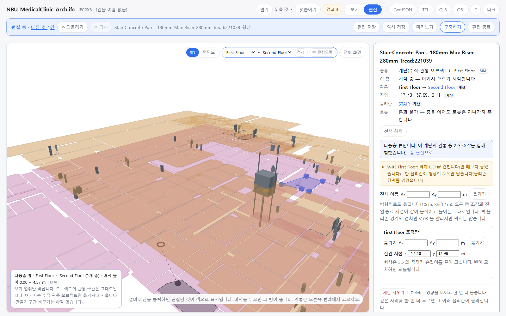

OE-ML-07 다중층 뷰에서 계단의 한 층 조각만 고친다 — 꼭짓점 손잡이로 형상·크기, 그 층만 옮기기, 진입·종료 지점 좌표, 편집 파일에 층별 모양으로 남는다

Refs OE-ML-07 이슈(번호는 옮길 때 넣습니다)
Branch: feature/OE-ML-07-vertical-parts
Ticket: docs/prd/features/E18-ML/OE-ML-07.md · docs/prd/features/E18-ML/OE-ML-02.md

> OE-ML-07·09 전체 이동·삭제 PR(ADR-0034) 다음에 merge 해 주세요. 그 PR 의 다중층 편집과 편집 파일 칸을 넓힙니다.

## 요약

OE-ML-07 의 "계단·ES 는 층별 형상·크기·진입/종료 위치를 수정할 수 있다" 를 했습니다. 다중층 뷰에서 고른 계단 조각에 3D 꼭짓점 손잡이가 뜨고, 패널에서 그 층 조각만 옮기거나 진입·종료 지점 좌표를 바꿉니다. 다른 층 조각은 그대로입니다.
층별로 고친 계단은 편집 파일에 모든 층 조각의 끝 모양을 적어, 같은 BIM 을 다시 열고 불러오면 같은 모양입니다.

## 구현한 것

- **꼭짓점 손잡이**: 다중층 뷰 + 편집 모드에서 계단 조각을 고르면 그 층 형상에 파란 손잡이가 뜹니다. 끌면 그 꼭짓점만 옮겨 형상·크기가 바뀝니다. 변이 서로 교차하는 자리면 "변이 서로 교차하는 형상이라 꼭짓점을 원래 자리로 되돌렸습니다." 를 알리고 되돌립니다.
  - 다중층 뷰는 편집 모드를 꺼 둔 채 손잡이만 끌게 했습니다(`viewer.setHandleEdit`). 편집 모드를 켜면 고른 설비도 끌리기 때문입니다.
- **패널 "First Floor 조각만"**: 그 층 조각만 옮기기(Δx·Δy, 형상과 그 층의 진입·종료 지점이 같이 갑니다), 진입 지점·종료 지점 x·y 칸(높이는 그대로). 숫자가 아니면 적용하지 않고 칸을 되돌립니다. 끝 층처럼 형상이 없는 조각은 "이 층은 형상 없이 지점만 있습니다".
- 옮긴 형상·지점으로 V-03(ADR-0034)과 연관 물리존이 다시 계산됩니다. 예: 2층 종료 지점을 복도로 옮기면 이 계단이 잇는 짝이 계단실 ↔ 복도가 됩니다.
- **다중층 뷰에서 설비는 보기만**: 설비를 표·3D 에서 골라도 패널에 "다중층 뷰에서는 수직 관통 오브젝트만 옮기거나 지웁니다 …" 가 뜨고 좌표·지우기 칸이 없습니다. 이전 PR 에서는 3D 끌기만 막혀 있어 패널 칸으로는 고칠 수 있었습니다.
- **어디에 남나**
  - 되돌리기: 꼭짓점 하나·조각 옮기기·지점 하나가 각각 이력 하나입니다(모든 층 조각을 떠 둔 스냅샷).
  - 리포트: "계단 … 의 층별 모양을 고쳤습니다(First Floor · Second Floor, GeoJSON)" — 연 때와 달라진 층을 적습니다.
  - 편집 파일: 모든 층 조각이 연 때 조각에 같은 이동량을 더한 모양이면 지금처럼 `move` 하나, 아니면 `parts: [{ storeyId, footprint, entry, exit }]`(모든 층의 끝 모양). 불러올 때 연 때와 다른 조각에만 `edited` 를 답니다. 층 id 는 지문으로도 찾습니다.
  - GeoJSON: 고친 조각은 `edited: true`(이전 PR 과 같음).
- ADR-0034 에 층별 고치기와 편집 파일 `parts` 를 더했습니다(확인 부탁드립니다).

## 수용 기준 대조 (OE-ML-07)

| 기준 | 결과 |
|---|---|
| 다중층 화면의 전체 이동 후 … 상대 위치가 유지된다 | 이전 PR |
| 계단·ES의 층별 형상·크기·진입/종료 위치를 수정할 수 있고 샤프트·EL 공통 축은 유지된다 | **이 PR**(계단) — ES·샤프트·EL 오브젝트는 아직 없습니다 |
| 이동·크기 수정 후 개구부와 면적이 갱신되며 … | 남음 — OE-ML-03(슬래브 형상) |
| 충돌 위치·층과 V-03 경고가 표시되고, 유효하지 않은 형상은 적용되지 않는다 | **이 PR** — 교차하는 형상 거절, 숫자 아닌 좌표 거절. V-03 은 이전 PR |
| 되돌리기·저장 복원 후 형상·개구부·면적·연결·배관 연동 결과가 함께 복원된다 | **이 PR**(층별 형상·지점·연결) — 개구부·배관 연동은 데이터가 없습니다 |

## 화면

다중층 뷰에서 1층 계단 조각의 꼭짓점 하나를 바깥으로 끈 화면입니다. 파란 손잡이, 커진 형상으로 생긴 V-03(벽 0.31㎡ · 81%), 패널의 "First Floor 조각만" 칸(옮기기·진입 지점 x·y)이 보입니다.

## 확인 방법

1. `data/NBU_MedicalClinic/NBU_MedicalClinic_Arch.ifc` → "First Floor만" → [편집] → 3D 에서 계단을 누르고 패널의 [다중층 뷰에서 편집]
2. 계단 형상의 파란 손잡이 하나를 바깥으로 조금 끕니다 → 형상이 커지고 "바뀐 것 1건", 리포트 "층별 모양을 고쳤습니다(First Floor, GeoJSON)"
3. 손잡이를 맞은편 너머로 크게 끕니다 → "변이 서로 교차하는 형상이라 …" 알림, 손잡이가 제자리
4. "First Floor 조각만" 의 Δy 0.5 → [옮기기] → 진입 y 가 0.50 커집니다. 관통의 Second Floor 를 누르면 2층 종료 지점은 그대로입니다
5. 2층 조각에서 종료 지점 x 를 0.8 크게 넣고 Enter → 종료 x 만 바뀌고 높이는 그대로, 리포트에 "(First Floor · Second Floor, GeoJSON)"
6. 검색에 Mirror → 거울을 고르면 패널에 다중층 뷰 안내, 좌표·지우기 칸 없음
7. [층 편집으로] → Ctrl+S → 같은 BIM 을 다시 열고 편집 파일 불러오기 → "편집 1개를 적용했습니다", 그 계단의 2층 종료 지점이 고친 자리

## 테스트

새 테스트는 **이번 수정 전에는 없던 동작**을 확인합니다.
- `src/lib/vertical-edit.test.ts` (+4) — 한 층 조각만 옮기기(다른 층 그대로) · 꼭짓점으로 형상 바꾸기와 교차 거절 · 진입·종료 지점 x·y(높이 그대로, 지점 없는 조각 거절, 바뀐 연관 물리존) · 전체 이동 → 층별 고치기 순서에서 편집 파일이 `move` 대신 `parts` 를 적고 새 모델에 얹으면 같음, 한 층만 고친 계단은 그 층만 `reshaped`
- `e2e/vertical-edit.spec.ts` (+1) — 위 확인 방법 1~7

결과: `npm test` 912 통과 · `npx vue-tsc --noEmit` 통과 · e2e 전체 191 통과 · 1 건너뜀

## 남은 것

- 수직 관통 오브젝트 만들기(OE-ML-06)·구간 바꾸기(OE-ML-08)
- 꼭짓점 더하기·빼기(지금은 있는 꼭짓점만 옮깁니다)
- 개구부·면적(OE-ML-03)
