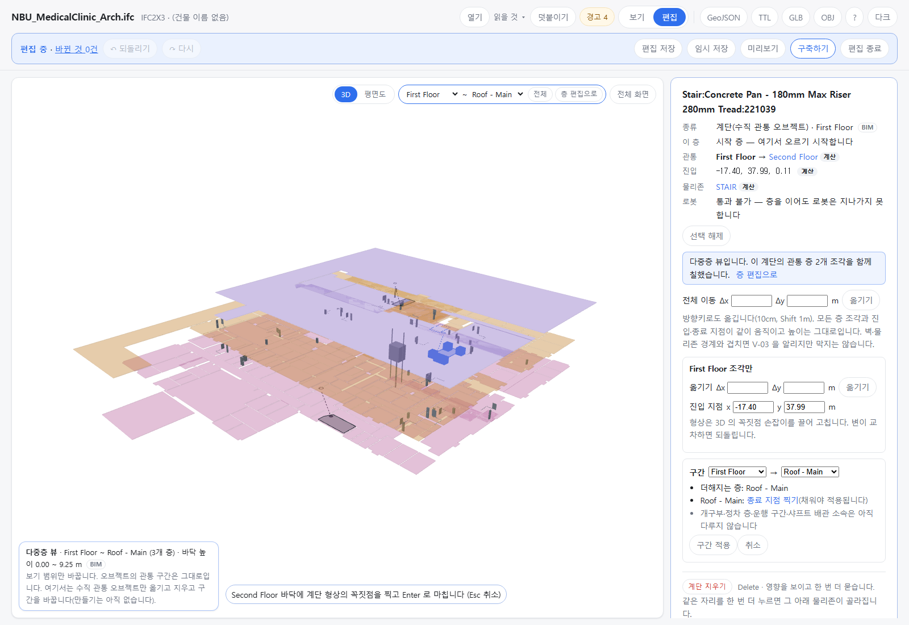

OE-ML-08 다중층 뷰에서 계단의 시작·끝 층을 바꾼다 — 더해지고 빠지는 층과 채울 것을 먼저 보이고, 빈 층은 사람이 그 층에 그리거나 찍어야 적용한다

Refs OE-ML-08 이슈(번호는 옮길 때 넣습니다)
Branch: feature/OE-ML-08-vertical-range
Ticket: docs/prd/features/E18-ML/OE-ML-08.md

> test: 수용 기준 태그 PR 다음에 merge 해 주세요. 그 PR 의 태그 규칙을 따르고, OE-ML-07 층별 고치기 PR 의 편집 파일 `parts` 를 넓힙니다.

## 요약

계단의 구간(시작 층 → 끝 층)을 바꿀 수 있게 했습니다. 보기 범위(다중층 뷰)와 따로인 데이터입니다. 구간을 고르면 적용 전에 더해지는 층·빠지는 층·층마다 채울 것·바뀌는 연결이 보입니다.
PRD 의 "층별 형상이 필요한 계단·ES 에 형상을 임의 복제하여 완료하지 않는다" 에 따라, 빈 층은 아래·위층에서 베끼지 않습니다. 사람이 그 층 바닥에 그리거나 찍어야 [구간 적용] 이 켜집니다.

## 구현한 것

- **패널 "구간"**(다중층 뷰 + 편집 모드, 계단을 고르면): 시작 층 → 끝 층 두 칸. 지금과 다르게 고르면 아래가 뜹니다.
  - 더해지는 층 · 빠지는 층("그 층 조각을 걷습니다")
  - 층마다 채울 것과 그 자리의 [형상 그리기]·[진입 지점 찍기]·[종료 지점 찍기]. 층의 자리마다 있어야 할 것은 이렇습니다(ADR-0033).
    - 시작 층: 형상 + 진입 지점
    - 사이 층: 형상
    - 끝 층: 종료 지점
  - 적용하면 잇는 물리존. 예: STAIR ↔ (지붕층에 찍은 자리의 물리존)
  - "개구부·정차 층·운행 구간·샤프트 배관 소속은 아직 다루지 않습니다"
  - 같은 층을 양 끝으로 고르거나 시작 층이 끝 층보다 위면 이유를 보이고 적용하지 못합니다.
- **채우기**: [형상 그리기] 는 그 층 바닥 높이의 그리기 도구입니다(꼭짓점을 찍고 Enter). [… 지점 찍기] 는 한 번 누르면 끝납니다. 그린 것·찍은 것은 적용 전까지 점선 미리보기로만 보이고, 모델·되돌리기 이력은 그대로입니다. 변이 엇갈리는 형상은 채운 것으로 치지 않습니다.
- **보기 범위**: 고른 구간이 보기 범위 밖이면 보기 범위를 그만큼 넓힙니다. 채울 층이 화면에 보여야 그릴 수 있어서입니다.
- **적용**: 구간 밖이 된 층의 조각을 걷고, 자리가 바뀌어 쓰지 않게 된 것을 지웁니다(사이 층이 된 시작 층의 진입 지점, 끝 층이 된 사이 층의 형상). 바꾼 조각에는 `edited` 를 답니다. 사람이 찍은 지점의 높이는 그 층 바닥입니다. 적용 한 번이 되돌리기 한 번입니다.
- **편집 파일**: 층별 고치기와 같은 `parts`(모든 층 조각의 끝 모양)입니다. 불러올 때 없던 층의 조각은 만들고, 적힌 층 밖의 조각은 걷습니다.
- ADR-0034 에 구간 바꾸기 규칙을 더했습니다(확인 부탁드립니다).

## 수용 기준 대조

| 기준 | 결과 |
|---|---|
| 축소 적용 전 제외 층·정차 층·운행 구간·연결·배관 소속 영향을 확인할 수 있다 | 일부 **이 PR** — 제외 층·연결. 정차 층·운행 구간·배관 소속은 EL·ES·샤프트 오브젝트가 아직 없습니다 |
| 확대 후 새 층의 유효한 표현과 개구부 확정/초안 상태가 표시되며 초안은 면적에서 차감되지 않는다 | 일부 **이 PR** — 새 층의 표현(사람이 채운 형상·지점). 개구부는 OE-ML-03 |
| 축소 후 해당 작업만의 편집 개구부는 제거되고 원본·공유 개구부와 배관은 유지된다 | 남음 — OE-ML-03 |
| ES 운행 구간이 새 범위 밖이면 조정하기 전 완료할 수 없고, EL의 제외 정차 층은 적용 후 목록에서 제거된다 | 남음 — ES·EL 오브젝트(OE-ML-02 2b·2c) |
| 되돌리기 후 구간·정차/운행 정보·개구부·면적·연결·소속이 함께 복원된다 | 일부 **이 PR** — 구간·조각·연결. 나머지는 데이터가 없습니다 |

## 화면

병원 계단의 끝 층을 Roof - Main 으로 고르고 2층 형상을 그린 화면입니다. 보기 범위가 지붕층까지 넓어졌고, 패널에 "더해지는 층: Roof - Main", 남은 "Roof - Main: 종료 지점 찍기" 가 보입니다. [구간 적용] 은 아직 꺼져 있습니다. 그린 2층 형상은 점선 미리보기입니다.

## 확인 방법

1. `data/NBU_MedicalClinic/NBU_MedicalClinic_Arch.ifc` → "First Floor만" → [편집] → 3D 에서 계단을 누르고 패널의 [다중층 뷰에서 편집]
2. 구간 끝 층을 First Floor 로 → "같은 층을 시작·끝 층으로 둘 수 없습니다 …", [구간 적용] 꺼짐
3. 끝 층을 Roof - Main 으로 → 더해지는 층 Roof - Main, "Second Floor: 형상 그리기", "Roof - Main: 종료 지점 찍기", 보기 범위 First Floor ~ Roof - Main
4. [형상 그리기] → 2층 바닥에 네 점 → Enter → 점선 미리보기, "바뀐 것 0건" 그대로
5. [종료 지점 찍기] → 지붕층 바닥 한 번 → [구간 적용] 켜짐 → 누르면 관통이 First Floor → Second Floor → Roof - Main, 리포트 "층별 모양을 고쳤습니다(Second Floor · Roof - Main, GeoJSON)"
6. Ctrl+Z → First Floor → Second Floor 로 돌아오고, Ctrl+Shift+Z → 다시 Roof - Main 까지

## 테스트

새 테스트는 **이번 수정 전에는 없던 동작**을 확인합니다.
- `src/lib/vertical-edit.test.ts` (+5) — 같은 층·거꾸로 거절 · 늘리면 사이 층 형상·새 끝 층 종료 지점을 채워야 하고 베끼지 않음, 엇갈린 형상은 채운 것이 아님, 채우면 적용·연결이 새 층 물리존 · 줄이면 빠진 층 조각을 걷고 새 끝 층은 종료 지점을 다시 받음(형상은 지움) · 시작 층을 올리면 진입 지점을 받아야 함 · 되돌리기 한 번 · 편집 파일로 새로 연 BIM 에 얹으면 없던 층 조각이 생기고 줄인 것도 얹힘
- `e2e/vertical-edit.spec.ts` (+1) — 위 확인 방법 1~6, 미리보기 점선 수(1 → 2 → 적용 뒤 0)

기존 테스트를 고친 것:
- `e2e/vertical-parts.spec.ts` · `e2e/multi-view.spec.ts` — 3D 표시 수에 미리보기 칸(`preview`)이 생겨 `toEqual` → `toMatchObject`
- `e2e/vertical-edit.spec.ts` — 계단 조각을 눌러 고르는 반복문이 패널이 그려지기 전에 확인해 넘어가던 것(두 곳)을 잠깐 기다리게 했습니다. 이 PR 에서 한 번 실패해 찾았습니다

결과: `npm test` 926 통과 · `npx vue-tsc --noEmit` 통과 · e2e 전체 192 통과 · 1 건너뜀 · `npm run ac:coverage` OE-ML-08 다 잼 0 · 일부 3 / 5

## 남은 것

- 수직 관통 오브젝트 만들기(OE-ML-06) — 이 PR 의 "층마다 채우기" 를 그대로 쓸 수 있습니다
- 개구부(OE-ML-03), ES 운행 구간(OE-ML-11)·EL 정차 층(OE-ML-10), 샤프트 배관 소속(OE-ML-17)
- 적용 전 미리보기는 지금 그린 것만입니다. 빠질 층 조각을 흐리게 보이는 것은 하지 않았습니다
