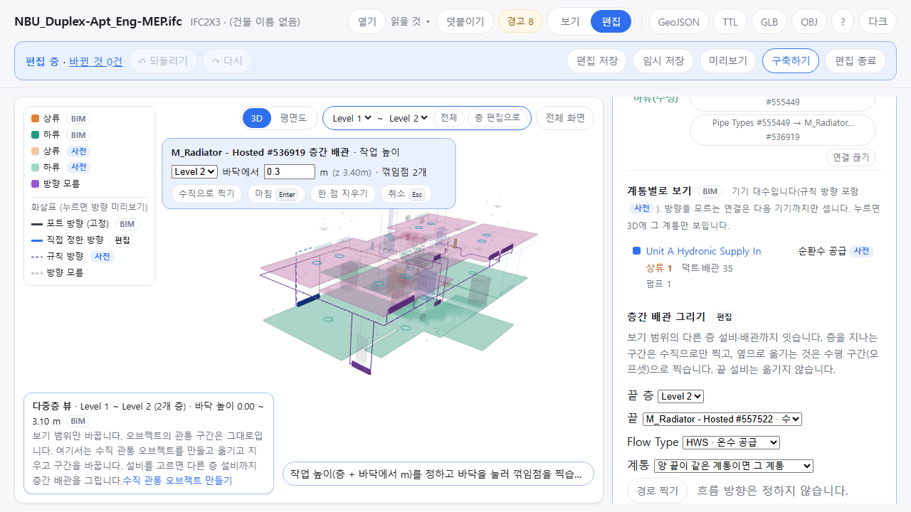
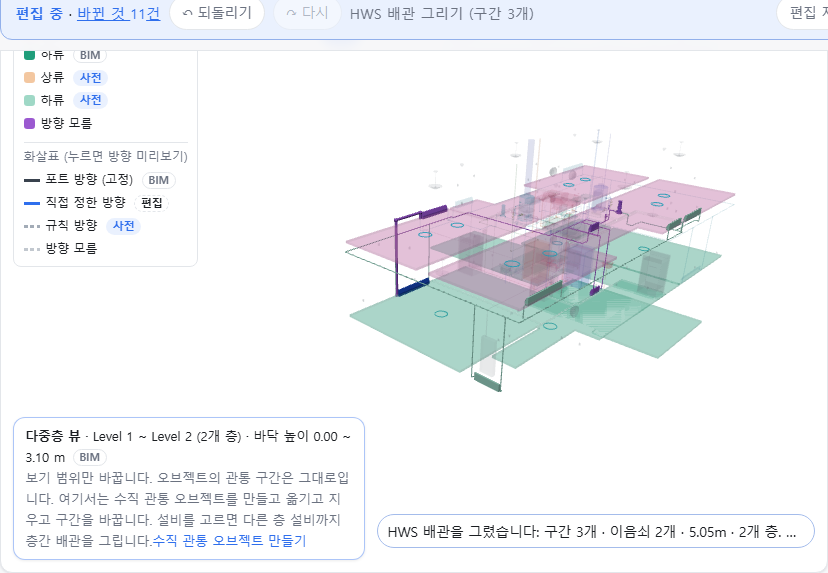

OE-ML-12·14·18 다중층 뷰에서 다른 층 설비까지 층간 배관을 그린다 — 꺾임점마다 층 + 바닥에서 높이를 정하고, 층을 지나는 구간은 수직 하나로 두며, 범위 밖이면 그리던 점을 둔 채 막는다

Refs #196 (OE-PIP-15) · OE-ML-12·14·18 이슈(번호는 옮길 때 넣습니다)
Branch: feature/OE-ML-12-cross-storey-pipe
Ticket: docs/prd/features/E18-ML/OE-ML-12.md · docs/prd/features/E18-ML/OE-ML-14.md · docs/prd/features/E18-ML/OE-ML-18.md · docs/prd/features/E13-PIP/OE-PIP-15.md

> OE-ML-06 만들기 PR 다음에 merge 해 주세요. 다중층 뷰의 미리보기 점선(`setVerticalParts` 의 preview)과 안내 상자 문구를 같이 고칩니다.

## 요약

다중층 뷰에서 설비를 고르면 "층간 배관 그리기" 칸이 나옵니다. 끝 층·끝 대상·Flow Type·계통을 고르고 꺾임점을 찍으면 다른 층 설비까지 배관을 잇습니다(라이저·오프셋).
별도 라이저 도구 없이 OE-PIP-11 의 배관 그리기를 그대로 씁니다. 꺾임점 높이는 "2층 바닥에서 0.3m" 처럼 층 상대 높이로 받고 공통 z 로 바꿔 저장합니다(OE-ML-18).

## 구현한 것

- **층간 배관 그리기 칸**(다중층 뷰 + 편집 모드, 좌표 있는 설비를 고르면)
  - 끝 층: 보기 범위의 층. 기본은 시작 설비의 층이 아닌 첫 층입니다
  - 끝: 끝 층의 설비·이음쇠, 수평 거리가 가까운 순 40개(라이저는 위아래로 가니 높이 차는 재지 않습니다). 구간 중간에 잇는 것은 분기(OE-ML-13)라 구간은 뺐습니다
  - Flow Type·계통: OE-PIP-11 과 같습니다
  - [경로 찍기]
- **그리는 중 막대**: 작업 높이(층 + 바닥에서 m)와 바꾼 공통 z, 꺾임점 수, [수직으로 찍기]·[마침]·[한 점 지우기]·[취소]
  - 바닥을 누르면 작업 높이에 꺾임점이 찍힙니다
  - [수직으로 찍기] 는 마지막 점(처음에는 시작 설비) 바로 위·아래, 작업 높이에 찍습니다. 라이저의 수직 구간입니다
  - 찍은 경로는 3D 점선 미리보기로만 보이고 모델은 그대로입니다
  - 다중층 뷰에서는 막대를 한 줄 내려 위의 보기 범위 칸을 가리지 않습니다(그리다가 범위를 넓힙니다)
- **막는 것**(이유를 보이고 그리던 점은 둡니다)
  - 끝 대상의 층이 보기 범위 밖: "…의 층(Level 2)이 보기 범위 밖입니다. 보기 범위를 넓힌 뒤 완료합니다." 범위를 넓히고 Enter 로 이어서 마칩니다
  - 꺾임점이 범위의 맨 아래층 바닥보다 낮거나 범위 바로 위층 바닥 이상
  - 층 바닥을 비스듬히 지나는 구간: 층을 지나는 구간은 수직(x·y 차 1cm 안)이어야 하고, 옆으로 옮기는 것은 수평 구간(오프셋)으로 찍습니다. 자동으로 경로를 채우거나 끝 설비를 옮기지 않습니다
  - 층 바닥 높이를 모르거나 두 층의 바닥 높이가 같음: 층 이름·순번으로 짐작하지 않습니다
  - 길이 0 인 구간
- **만들어지는 것**: OE-PIP-11 과 같은 구간·이음쇠 사슬, `manual` 연결, 방향 없음
  - 층을 지나는 수직 구간은 자르지 않고 구간 하나로, 아래 끝이 든 층에 둡니다. 가진 BIM 다섯 파일이 모두 그렇습니다(병원 설비 5,952 구간 중 406 이 층 바닥을 지나는 구간 하나)
  - 이음쇠는 그 높이가 든 층입니다. 그래서 위층 층 편집 화면에는 라이저 구간 대신 꺾인 자리의 이음쇠가 보입니다
- **어디에 남나**
  - 모델·편집 파일·GeoJSON 에는 공통 z 만 있습니다. 편집 파일은 OE-PIP-11 과 같은 더한 설비 줄이고 층 id 가 줄마다 다릅니다
  - GeoJSON: 구간마다 LineString(예: `[[0.42,-14.79,0.02],[0.42,-14.79,3.4]]`)과 `flowType`
  - TTL: 그린 구간·이음쇠와 연결. 방향을 정하지 않아 `feeds` 는 늘지 않습니다
- 되돌리기 한 번에 층간 배관 전체가 빠집니다
- `MULTI_VIEW_ONLY` 안내를 "다중층 뷰에서는 수직 관통 오브젝트와 층간 배관만 다룹니다" 로 바꿨습니다
- ADR-0035 에 적었습니다(확인 부탁드립니다). ADR-0031 의 "한 층 안에서만 그린다" 한 줄을 대체합니다

## 수용 기준 대조

OE-ML-12 라이저 생성

| 기준 | 결과 |
|---|---|
| 공통 배관 그리기에서 시작·종료 연결 대상과 층 범위·Flow Type·계통을 선택하고 수직 구간을 작성할 수 있다 | **이 PR** |
| x·y가 다른 연결 대상은 사용자가 지정한 수평 구간이나 오프셋을 통해 연결되고 대상 설비의 위치는 바뀌지 않는다 | **이 PR** |
| 연결 대상이나 경로가 선택한 층 범위 밖이면 범위 조정을 안내하고 그대로 완료하지 않는다 | **이 PR** |
| 유효한 경로를 완료하면 수동 배관과 연결이 생성되며 수동 확정 방향은 미지정 상태로 시작한다 | **이 PR** |
| 취소 후 임시 객체가 남지 않고, 완료된 배관은 실행 취소·저장 복원 및 화면 전환 후 동일한 ID와 상태를 유지한다 | 일부 **이 PR** — 취소·되돌리기·편집 파일. 화면 전환([다중층 편집에서 계속])은 OE-PIP-15 |
| 보기 범위 변경만으로 작성·완료된 경로가 변경되지 않고, 필요한 층을 범위에 포함시킨 뒤 작성을 계속할 수 있다 | **이 PR** |
| 층 높이가 없거나 상대 높이를 공통 z로 변환할 수 없으면 해당 구간의 완료 불가 사유가 표시된다 | **이 PR** |

OE-ML-14 층간 오프셋

| 기준 | 결과 |
|---|---|
| 공통 배관 그리기에서 오프셋을 지정하면 두 수직 구간과 하나의 수평 구간이 사용자 지정 높이로 그려진다 | **이 PR** |
| 배관 편집으로 오프셋 위치·높이를 바꾸면 형상이 갱신되고, 형상만 수정한 경우 연결 대상과 확정 방향이 유지된다 | 남음 — 다중층 뷰의 꺾임점 편집 |
| 유효하지 않은 좌표나 길이 0인 경로는 정상 배관으로 완료되지 않는다 | **이 PR** |
| 되돌리기·저장 복원 후 오프셋 형상과 연결 상태가 함께 복원된다 | 일부 **이 PR** — 그리기의 되돌리기·저장 복원. 편집 뒤는 위 줄과 같이 |
| 오프셋 수정 전 관련 층별 분기·샤프트 소속 영향을 확인할 수 있고, 이탈·연결 불일치는 수정 후 표시된다 | 남음 — 분기(OE-ML-13)·샤프트 소속(OE-ML-17) |
| 위치만 겹친 다른 배관이나 샤프트에 자동 병합·소속되지 않는다 | 일부 **이 PR** — 경로가 다른 설비 자리를 지나도 잇지 않고 계통도 그대로입니다. 샤프트 소속은 OE-ML-17 |

OE-ML-18 좌표 조건

| 기준 | 결과 |
|---|---|
| 층 상대 높이와 공통 z를 구분하여 변환하고 수직·수평 구간 및 오프셋의 높이가 두 화면에서 일치한다 | **이 PR** — 모델에 공통 z 하나라 두 화면이 같은 값을 읽습니다 |
| 이미 공통 z인 경로는 층 기준 높이가 중복 가산되지 않는다 | **이 PR** |
| 층 높이·단위·변환이 미확인인 경로는 형상 미반영/작성 불가 사유가 표시되고 층 이름으로 좌표가 추정되지 않는다 | **이 PR** — 높이 모름·같은 높이 두 층 |
| 보기의 층 간격·축척 변경 후 저장 좌표·길이·연결은 유지된다 | 해당 없음 — 다중층 뷰에 층 간격·축척 설정이 없습니다 |
| 형상 미반영 연결의 명시된 의미 정보는 OE-PIP-13 기준으로 보존되고 비활성 관계는 유효 출력에서 제외된다 | 남음 — 좌표 없는 원본 연결(OE-PIP-13 미반영 목록)을 층간으로 다루는 일 |

OE-PIP-15 층간 배관 작성·편집: 다중층 뷰에서 같은 배관 그리기를 쓰고 별도 라이저 버튼이 없음(1), 서로 다른 층 설비를 잇는 배관(2)을 일부 **이 PR** 로 재고, 나머지(분기·오프셋 편집·[다중층 편집에서 계속]·세션 확정)는 남습니다.

## 화면

Duplex 설비에서 1층 라디에이터 #536919 의 층간 배관을 그리는 중입니다. 막대에 작업 높이 "Level 2 · 바닥에서 0.3m (z 3.40m) · 꺾임점 2개" 가 보이고, 위의 보기 범위 칸은 가리지 않습니다. 오른쪽 패널이 층간 배관 그리기 칸(끝 층 Level 2, 끝 #557522, HWS)입니다.

마친 뒤입니다. 라디에이터에서 2층 바닥 위 0.3m 까지 수직 구간, 2층에서 옆으로 1.39m, 2층 라디에이터로 내려가는 구간(구간 3개 · 이음쇠 2개 · 5.05m · 2개 층).

## 확인 방법

1. `data/NBU_Duplex/NBU_Duplex-Apt_Eng-MEP.ifc` → "Level 1만" → [편집] → [다중층 뷰에서 편집](Level 1 ~ Level 2)
2. 검색에 `536919` → 라디에이터 #536919 를 누릅니다 → 패널 "층간 배관 그리기", 끝 층 Level 2
3. 끝 "M_Radiator - Hosted #557522 · 수평 1.4m", Flow Type HWS → [경로 찍기]
4. 막대에서 작업 층 Level 2, 바닥에서 0.3 → "(z 3.40m)" → [수직으로 찍기] → "꺾임점 1개"
5. 3D 에서 2층 라디에이터 바로 위를 누릅니다 → "꺾임점 2개", 점선 미리보기
6. 위의 보기 범위 끝 층을 Level 1 로 → Enter → "…의 층(Level 2)이 보기 범위 밖입니다. 보기 범위를 넓힌 뒤 완료합니다.", 꺾임점은 2개 그대로
7. 끝 층을 Level 2 로 되돌리고 Enter → "HWS 배관을 그렸습니다: 구간 3개 · 이음쇠 2개 · 5.05m · 2개 층"
8. Ctrl+Z → 다섯 조각이 함께 빠집니다
9. 다시 [경로 찍기] → 작업 층만 Level 2 로 바꾸고 2층 라디에이터 자리를 바로 누르고 Enter → "1번째 구간이 층 바닥을 비스듬히 지납니다 …" → Esc → 남는 것이 없습니다

## 테스트

새 테스트는 **이번 수정 전에는 없던 동작**을 확인합니다.
- `src/lib/cross-storey-pipe.test.ts` (새 파일, 9) — mep.ifc 에 2층(4m)·3층(8m)과 2층 설비 AT-201 을 얹어
  - 층 상대 높이에는 층 바닥을 더하고 공통 z 는 그대로 · 공통 z 가 든 층(바닥 ≤ z < 위층 바닥, 바닥 1mm 안은 그 층)
  - 1층 공조기 → 수직 → 2층 수평 → 2층 설비: 경로·층(수직 구간은 1층, 이음쇠는 2층)·`manual` 무방향 연결·길이·GeoJSON LineString
  - 공통 z 로 준 경로와 층 상대 높이로 준 경로가 같음 · 끝 설비 자리 그대로
  - 범위 밖 끝 대상 · 범위 밖 꺾임점 · 비스듬히 층을 지남 · 길이 0 · 층 편집 화면에서 다른 층 → 거절, 모델 그대로
  - 층 높이 모름 · 두 층 바닥 높이 같음 → 이유
  - 경로가 다른 설비 자리를 지나도 그 설비와 잇지 않고 계통도 그대로
  - 편집 파일로 새로 연 모델에 얹으면 TTL·GeoJSON·층이 같음, 되돌리기 한 번이면 그리기 전과 같음
- `e2e/riser.spec.ts` (새 파일, 1) — 위 확인 방법 1~9(Duplex 설비)

기존 테스트를 고친 것:
- `e2e/multi-view.spec.ts` · `e2e/vertical-edit.spec.ts` — 다중층 뷰의 편집 막음 안내 문구가 바뀌어 기대 문구만 고쳤습니다

결과: `npm test` 939 통과 · `npx vue-tsc --noEmit` 통과 · e2e 전체 194 통과 · 1 건너뜀 · `npm run ac:coverage` OE-ML-12 다 잼 6 · 일부 1 / 7, OE-ML-14 2 · 2 / 6, OE-ML-18 3 · 0 / 5, OE-PIP-15 0 · 2 / 8

## 남은 것

- 층별 분기(OE-ML-13): 층간 배관 중간에 잇고 분기점(tee)을 만들거나 다시 쓰기
- 오프셋 고치기(OE-ML-14 의 편집 절반): 다중층 뷰에서 꺾임점의 위치·높이 옮기기. 지금은 층 편집 화면에서 x·y 만 됩니다
- [다중층 편집에서 계속](OE-PIP-15 · OE-ML-01 ③): 층 편집 화면에서 그리던 배관을 들고 다중층 뷰로 가기
- 샤프트 소속(OE-ML-17)·Flow Type 색(OE-ML-15)·경로 추적(OE-ML-16)
- 위층 층 편집 화면에는 라이저 구간이 없습니다(BIM 과 같이 아래 끝 층의 구간). 층 편집 화면에 "지나가는 층간 구간" 을 흐리게 보일지는 화면을 보고 정하면 좋겠습니다
