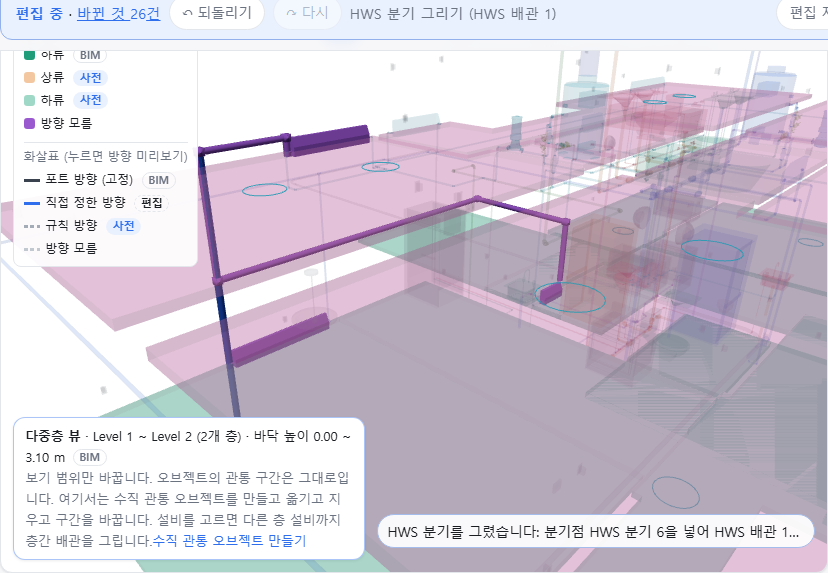

OE-ML-13 다중층 뷰에서 층간 배관 중간에 분기점을 넣어 그 층 설비까지 분기를 그린다 — 구간을 둘로 나누고, 끝 5cm 안이면 맞는 이음쇠를 다시 쓰며, 계통·매체가 다르면 잇지 않는다

Refs #196 (OE-PIP-15) · OE-ML-13 이슈(번호는 옮길 때 넣습니다)
Branch: feature/OE-ML-13-branch-tee
Ticket: docs/prd/features/E18-ML/OE-ML-13.md · docs/prd/features/E13-PIP/OE-PIP-15.md

> OE-ML-12·14·18 층간 배관 PR 다음에 merge 해 주세요. 그 PR 의 패널 칸·작업 높이 막대를 그대로 쓰고, 끝 후보 순서를 바꿉니다.

## 요약

다중층 뷰에서 덕트·배관 구간을 고르면 층간 배관 칸이 "분기 그리기" 가 됩니다. 첫 점으로 구간 위의 분기 자리를 찍고 꺾임점을 찍어 그 층의 설비까지 잇습니다.
분기 자리에는 분기점(이음쇠)이 생기고 구간이 둘로 나뉩니다. 구간 끝 가까이면 새로 만들지 않고 끝의 이음쇠를 다시 씁니다(OE-ML-13 "중복 생성 금지").

## 구현한 것

- **분기 그리기 칸**(다중층 뷰 + 편집 모드, 구간을 고르면): 끝 층·끝·Flow Type·계통은 층간 배관과 같고, 버튼이 [분기 그리기] 입니다
- **분기 자리(첫 점)**
  - 구간 위를 누릅니다. 선에서 0.3m 안이면 선 위로 내립니다
  - 라이저처럼 높이가 변하는 구간은 작업 높이(층 + 바닥에서 m)를 정하고 [이 높이에서 분기] 를 누릅니다. 그 높이가 구간 밖이면 구간의 높이 범위를 알려 줍니다
  - 그다음은 층간 배관과 같이 꺾임점·[수직으로 찍기]·Enter 입니다. 막대에 "분기 자리 + 꺾임점 n개" 가 보입니다
- **분기점**
  - 새로 넣을 때: 분기 자리에 이음쇠(`HWS 분기 6` 처럼)를 넣고, 고른 구간은 분기점까지 줄이며, 분기점에서 옛 끝까지 새 구간을 둡니다. 분기점·새 구간은 주 배관의 계통에 들고, 그 높이가 든 층의 것입니다
  - 구간 끝 5cm 안: 끝에 이어진 이음쇠의 Flow Type·계통이 같으면 그 이음쇠를 분기점으로 다시 씁니다. 이음쇠가 아니거나 다르거나 해제 보정한 연결 너머면 거절합니다
- **잇지 않는 것**(이유를 보이고 그리던 점은 둡니다): 구간 위가 아닌 자리, 매체가 다름(공기 덕트에 CHWS), Flow Type 이 다름(SA 덕트에 RA), 사람이 고른 계통이 주 배관과 다름, 분기 자리·끝 대상의 층이 보기 범위 밖
- **나눈 끝의 옛 연결**: BIM 포트 연결이면 지우지 않고 해제 보정합니다(사유 "분기점 넣기: SA 덕트 1을 SA 분기 6에서 나눔"). 사람이 이은 연결이면 지웁니다. 새 연결은 모두 `manual`, 방향 없음입니다
- **되돌리기 한 번**에 분기점·뒤 구간·분기가 빠지고 줄인 구간·옛 연결이 돌아옵니다
- **어디에 남나**: 편집 파일은 더한 설비 줄(분기점·뒤 구간·분기)과 줄인 구간의 끝 이동(`ends`), 연결 줄입니다. GeoJSON 은 줄인 구간과 새 구간의 LineString 이 분기점에서 만납니다. TTL 에는 분기점이 이음쇠로 나가고 `feeds` 는 늘지 않습니다
- 끝 후보를 "설비 먼저, 그다음 이음쇠, 각각 수평 거리 순 60개" 로 바꿨습니다. Duplex 1층은 이음쇠까지 섞은 40개에 6m 떨어진 라디에이터가 들지 않았습니다
- ADR-0036 에 적었습니다(확인 부탁드립니다)

## 수용 기준 대조

| 기준 | 결과 |
|---|---|
| 다중층 화면에서 기존 층간 배관과 해당 층의 설비·배관 사이에 수평 분기를 작성하고 완료할 수 있다 | **이 PR** — 끝은 설비·이음쇠. 다른 배관 구간의 중간을 끝으로 고르는 것은 없습니다 |
| 완료 시 지정한 위치·높이에 분기점이 생성되며, 같은 연결 대상 배관에서 위치·매체·Flow Type·계통이 적합한 유효 기존 분기점을 사용하면 중복 생성되지 않는다 | **이 PR** |
| 클릭·형상 교차만으로 연결이 생성되지 않고, 계통·매체가 충돌하면 OE-PIP-11의 검토 안내가 표시된다 | **이 PR**(태그는 `~`: 검토 안내는 거절 사유 한 줄입니다) |
| 작성 취소 후 새 임시 배관·연결·분기점은 남지 않으며 기존 객체와 연결은 유지된다 | **이 PR**(거절되면 넣어 보던 분기점도 걷습니다) |
| 생성된 분기를 공통 배관 편집으로 수정할 수 있고, 층 편집 화면에서도 같은 분기점과 연결 상태를 확인하고 배관을 이어 그릴 수 있다 | 일부 **이 PR** — 층 편집 화면에 같은 분기점이 보이고, 분기점은 이음쇠라 꼭짓점 옮기기가 됩니다. 층 편집 화면에서 이어 그리기는 OE-PIP-15 |
| 되돌리기·저장 복원 후 분기점·배관·연결 상태가 함께 복원된다 | **이 PR** |
| 같은 좌표의 다른 계통 배관이나 사용자가 연결 해제한 BIM 배관 연결이 분기 생성으로 자동 병합·복원되지 않는다 | **이 PR** |
| 분기 관계 변경 후 규칙 재계산이 갱신되고 원본·수동 확정 방향은 유지된다 | 남음(시험) — 분기 뒤 규칙을 다시 돌리지만, 확정 방향이 있는 배관에서 재는 시험이 없습니다 |

## 화면

Duplex 설비에서 그린 HWS 라이저(1층 라디에이터 → 2층)의 1층 1.5m 자리에 분기점을 넣고, 옆으로 두 번 꺾어 1층 라디에이터 #557620 으로 내려간 분기입니다. 아래 진한 파랑이 분기점까지 줄어든 라이저 앞 구간, 그 위 보라가 나눠 생긴 뒤 구간입니다.

## 확인 방법

1. `data/NBU_Duplex/NBU_Duplex-Apt_Eng-MEP.ifc` → "Level 1만" → [편집] → [다중층 뷰에서 편집]
2. OE-ML-12 PR 의 확인 방법 2~5, 7 로 HWS 라이저를 그립니다(라디에이터 #536919 → 2층 #557522)
3. 검색 `HWS 배관 1` → 그 구간을 누릅니다 → 패널 "분기 그리기"
4. 끝 층 Level 1, 끝 "M_Radiator - Hosted #557620" → [분기 그리기] → 막대 "첫 점은 분기 자리"
5. 작업 층 Level 1, 바닥에서 1.5 → [이 높이에서 분기] → "분기 자리 + 꺾임점 0개"
6. 3D 에서 (0.42, -8.81)·(2.57, -8.81) 근처를 차례로 누르고 Enter → "HWS 분기를 그렸습니다: 분기점 HWS 분기 6을 넣어 HWS 배관 1을 나눴습니다 · 구간 3개"
7. [층 편집으로] → 1층 설비 목록에 `HWS 분기 6`
8. Ctrl+Z → 분기점·뒤 구간·분기가 빠지고 라이저가 하나로 돌아옵니다

## 테스트

새 테스트는 **이번 수정 전에는 없던 동작**을 확인합니다.
- `src/lib/branch-pipe.test.ts` (새 파일, 6) — 그린 SA 라이저(mep.ifc + 2·3층)에서
  - 2층 바닥 + 1m 자리에 분기점: 위치·층·앞 구간 줄어듦·뒤 구간·연결(옛 연결 지움)·분기 경로·`manual` 무방향
  - 끝 5cm 안이면 끝 이음쇠를 다시 씀(새로 생긴 것은 분기 조각 셋뿐)
  - 끝 이음쇠가 다른 Flow Type·다른 계통이거나 해제 보정한 연결 너머면 거절, 해제 보정 목록 그대로
  - 구간 위가 아닌 자리 · 다른 매체 · 다른 Flow Type · 분기 자리 범위 밖 · 없는 끝 → 거절, 모델 그대로
  - 나눈 끝이 BIM 포트 연결이면 해제 보정(사유)
  - 되돌리기 한 번이면 분기 전과 같음, 편집 파일로 새로 연 모델에 얹으면 TTL·GeoJSON 이 같음
- `e2e/riser.spec.ts` (+1) — 위 확인 방법 1~8

기존 테스트는 고치지 않았습니다.

결과: `npm test` 945 통과 · `npx vue-tsc --noEmit` 통과 · e2e 전체 195 통과 · 1 건너뜀 · `npm run ac:coverage` OE-ML-13 다 잼 4 · 일부 3 / 8

## 남은 것

- 층 편집 화면에서 분기 이어 그리기·[다중층 편집에서 계속](OE-PIP-15)
- 완료된 분기점의 높이 고치기(OE-ML-14 의 편집 절반과 같이)
- 끝 대상으로 다른 배관 구간의 중간 고르기(끝 쪽에도 분기점 넣기)
- 확정 방향이 있는 배관을 나눴을 때 방향 유지 시험(OE-ML-13 #8)
