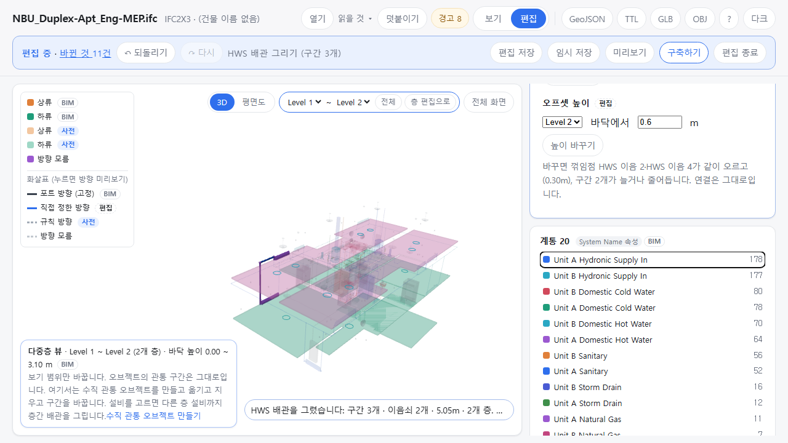

OE-ML-14 다중층 뷰에서 층간 배관의 오프셋 높이를 바꾼다 — 수평 구간과 양 끝 꺾임점이 같이 움직이고 이어진 구간은 늘거나 주며, 바꾸기 전에 움직일 것을 보인다

Refs #196 (OE-PIP-15) · OE-ML-14 이슈(번호는 옮길 때 넣습니다)
Branch: feature/OE-ML-14-offset-height
Ticket: docs/prd/features/E18-ML/OE-ML-14.md

> OE-ML-13 층별 분기 PR 다음에 merge 해 주세요. 그 PR 의 분기 그리기 칸 아래에 붙고, ADR-0035 에 한 줄을 더합니다.

## 요약

다중층 뷰에서 수평 구간(오프셋)을 고르면 "오프셋 높이" 칸이 나옵니다. 층 + 바닥에서 m 으로 새 높이를 넣으면, 바꾸기 전에 같이 움직일 꺾임점과 늘거나 줄 구간 수를 보이고 [높이 바꾸기] 로 적용합니다.
형상만 바뀌고 연결 대상·방향은 그대로입니다(OE-ML-14 "형상만 수정하면 양 끝 연결 대상과 확정 방향을 유지").

## 구현한 것

- **오프셋 높이 칸**(다중층 뷰 + 편집 모드, 수평 구간을 고르면): 층·바닥에서 m(지금 높이로 채워짐)·[높이 바꾸기]
  - 바꾸기 전에 보입니다: "바꾸면 꺾임점 HWS 이음 2·HWS 이음 4가 같이 오르고(0.30m), 구간 2개가 늘거나 줄어듭니다. 연결은 그대로입니다." 분기점이 끼어 있으면 그 이름도 보입니다
  - 적용하면 오프셋 구간과 양 끝 꺾임점이 같이 움직이고, 꺾임점에 이어진 다른 구간(라이저의 수직 구간·분기)은 그 끝만 늘거나 줍니다(끝점 추종과 같은 장치)
- **막는 것**(이유를 보이고 [높이 바꾸기] 를 끕니다)
  - 수평이 아닌 구간 · 끝이 설비에 바로 붙은 구간(옮기면 설비와 떨어짐) · 꺾임점에 이음쇠가 바로 물린 것
  - 늘일 구간이 길이 0 이 되거나 뒤집히는 높이: "HWS 배관 5이(가) 길이 0 이 되거나 뒤집힙니다. 높이를 HWS 배관 5의 다른 끝(3.12m) 너머로 옮기지 않습니다."
  - 늘인 구간이 층 바닥을 비스듬히 지나게 되는 높이(층을 지나는 구간은 수직, ADR-0035)
  - 꺾임점의 층이 바뀌는 높이(그 층 안에서 바꿉니다)
- **되돌리기 한 번**에 움직인 구간·꺾임점이 모두 제자리로 갑니다. 편집 파일에는 그린 배관이면 더한 설비 줄의 좌표, BIM 배관이면 옮긴 좌표·끝 이동으로 남습니다
- 고친 것 둘
  - 다중층 뷰에서 다른 층의 설비를 고르면 층 편집 화면처럼 "그 층으로 가기 전에 저장할까요" 를 물었습니다. 다중층 뷰에서는 층을 따라가지 않게 했습니다
  - 높이 칸이 다시 그려질 때 치던 값이 덮이지 않게 `v-keep-typing` 을 달았습니다(층간 배관 막대의 작업 높이 칸도)
- ADR-0035 에 오프셋 높이 규칙을 더했습니다(확인 부탁드립니다)

## 수용 기준 대조

| 기준 | 결과 |
|---|---|
| 공통 배관 그리기에서 오프셋을 지정하면 두 수직 구간과 하나의 수평 구간이 사용자 지정 높이로 그려진다 | 이미 반영(OE-ML-12·14·18 층간 배관 PR) |
| 배관 편집으로 오프셋 위치·높이를 바꾸면 형상이 갱신되고, 형상만 수정한 경우 연결 대상과 확정 방향이 유지된다 | 일부 **이 PR** — 높이. 위치(x·y)는 남음 |
| 유효하지 않은 좌표나 길이 0인 경로는 정상 배관으로 완료되지 않는다 | 이미 반영(그리기) · **이 PR**(높이 바꾸기의 길이 0·뒤집힘) |
| 되돌리기·저장 복원 후 오프셋 형상과 연결 상태가 함께 복원된다 | **이 PR** |
| 오프셋 수정 전 관련 층별 분기·샤프트 소속 영향을 확인할 수 있고, 이탈·연결 불일치는 수정 후 표시된다 | 일부 **이 PR** — 움직일 꺾임점·분기점·늘거나 줄 구간. 샤프트 소속은 OE-ML-17 |
| 위치만 겹친 다른 배관이나 샤프트에 자동 병합·소속되지 않는다 | 이미 반영(층간 배관 PR, 일부) |

## 화면

Duplex 설비에서 그린 HWS 라이저의 2층 오프셋(HWS 배관 3, 2층 바닥 + 0.3m)을 고르고 0.6m 를 넣은 화면입니다. 오른쪽 패널에 움직일 꺾임점 둘과 늘거나 줄 구간 2개가 보입니다.

## 확인 방법

1. OE-ML-12 PR 의 확인 방법 1~5, 7 로 HWS 라이저를 그립니다(Duplex 설비)
2. 검색 `HWS 배관 3` → 그 구간을 누릅니다 → 패널 "오프셋 높이" 에 Level 2 · 0.3
3. 0.6 을 넣고 Tab → "바꾸면 꺾임점 HWS 이음 2·HWS 이음 4가 같이 오르고(0.30m), 구간 2개가 늘거나 줄어듭니다"
4. [높이 바꾸기] → "HWS 배관 3의 높이를 올렸습니다(0.30m): 꺾임점 2개가 같이 움직이고 구간 2개가 늘거나 줄었습니다"
5. 0 을 넣고 Tab → "HWS 배관 5이(가) 길이 0 이 되거나 뒤집힙니다 …", [높이 바꾸기] 꺼짐
6. Ctrl+Z → 칸이 0.3 으로 돌아옵니다

## 테스트

새 테스트는 **이번 수정 전에는 없던 동작**을 확인합니다.
- `src/lib/offset-edit.test.ts` (새 파일, 3) — 그린 SA 라이저(mep.ifc + 2·3층)에서
  - 바꾸기 전 계획(꺾임점 둘·늘이는 구간 둘·분기점 없음·Δz 0.5) · 적용 뒤 세 구간 경로·꺾임점 자리 · 연결 그대로
  - 되돌리기 한 번이면 바꾸기 전과 같음 · 편집 파일로 새로 연 모델에 얹으면 TTL·GeoJSON 이 같음
  - 수직 구간 · 라이저가 뒤집히는 높이 · 마지막 구간이 3층 바닥을 비스듬히 지나는 높이 · 그대로인 높이 · 공조기에 바로 붙은 수평 구간 → 거절, 모델 그대로
- `e2e/riser.spec.ts` (+1) — 위 확인 방법 1~6. 라이저 그리기를 `drawRiser` 로 묶었습니다

기존 테스트는 고치지 않았습니다.

결과: `npm test` 948 통과 · `npx vue-tsc --noEmit` 통과 · e2e 전체 196 통과 · 1 건너뜀 · `npm run ac:coverage` OE-ML-14 다 잼 3 · 일부 3 / 6

## 남은 것

- 오프셋의 x·y 옮기기: 수직 구간까지 같이 옮겨야 해서(수직 구간의 x·y 는 고정) 어디까지 같이 갈지 정해야 합니다
- 층 바닥을 넘는 높이 바꾸기(꺾임점의 층을 바꾸기)
- 샤프트 소속 영향(OE-ML-17)
