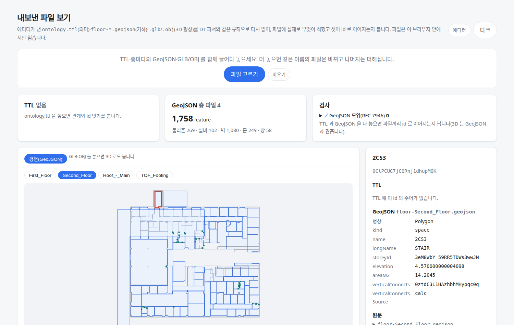

OE-ML-19 층간 겹침 후보는 서로를 최고 후보로 고른 짝만 잇고, 동률·다대일은 내보내지 않으며, 추정 출처를 GeoJSON 에 낸다

Closes #(새 이슈 — sec 으로 옮길 때 "[후속 #350] OE-ML-19 층간 연결 계산 — 상호 후보·모호 후보·출처·병원 기준선" 으로 만든다)
Branch: feature/OE-ML-19-mutual-candidates
Ticket: docs/prd/features/E18-ML/OE-ML-19.md · docs/prd/features/E12-EQP/OE-EQP-16.md

> 로봇 GeoJSON 문서 PR(docs: 로봇 경로가 읽는 GeoJSON 속성)과 OE-PIP-11 PR(ADR 목록 0031 줄) 다음에 merge 해 주세요. 두 파일의 같은 자리를 고칩니다.

## 요약

10-08 에 바뀐 OE-ML-19 겹침 후보 규칙대로 층간 연결을 고쳤습니다. 양쪽 물리존이 서로를 가장 많이 겹친 후보로 고를 때만 잇고, 동률·다대일은 모호 후보로 두어 내보내지 않으며, GeoJSON 에 출처(`calc`)를 같이 냅니다.
E18 다중층을 이 repo 에서 어디까지 하는지와 순서를 ADR-0032 에 적었습니다. 가진 BIM 에서 연결 개수는 바뀌지 않았고(병원 7개 중 6개), 병원은 대상 id·기대 연결·출처를 박은 기준선으로 확인합니다.

## 구현한 것

- **잇는 규칙**(`src/lib/vertical.ts`): 높이로 줄 세운 바로 위층의 같은 종류(계단실·승강로) 물리존이 후보이고, 겹친 면적 ÷ 작은 물리존 면적이 50% 를 넘어야 합니다. 정확히 50% 는 후보가 아닙니다.
  - 전에는 아래층 물리존마다 가장 많이 겹친 위층 물리존 하나를 골랐습니다. 위층 물리존 하나를 아래층 물리존 둘이 고르면 둘 다 이어졌습니다.
  - 이제는 반대쪽도 같은 짝을 골라야 잇습니다. 가장 많이 겹친 후보가 둘 이상(동률)이거나 한쪽만 고른 짝은 모호 후보입니다.
  - 넓이가 0 인 외곽선, 높이가 없는 층, 높이가 같은 두 층(같은 층이 두 번 들어온 것)은 후보에서 뺍니다.
- **모호 후보**는 `verticalConnections()` 가 까닭(`tie`·`not-mutual`)과 함께 돌려주고, GeoJSON 에는 내보내지 않습니다. 아직 화면에 보이지 않습니다. 확인하는 화면은 다중층 뷰에서 만들 예정입니다(아래 "남은 것").
- **출처**: 이어진 계단실·승강로 feature 에 `verticalConnectsSource: "calc"`(바닥 겹침으로 추정)를 `verticalConnects` 와 같이 냅니다. 문의 `connectsSource` 와 같은 낱말입니다(ADR-0008). 사람이 정한 연결(OE-ML-02)이 생기면 그것과 가르는 데 씁니다.
- **어디에 남나**: GeoJSON 의 물리존 feature 에만 남습니다. 모델·편집 파일에는 저장하지 않고 내보낼 때마다 계산합니다(전과 같습니다). TTL 에는 들어가지 않습니다.
- **뷰어**: 내보낸 파일 뷰어의 "고른 것" 칸에서 `verticalConnectsSource` 처럼 긴 속성 이름이 옆 값과 겹쳐 보여서 줄을 바꾸게 했습니다.
- **문서**: `docs/geojson-robot.md` 의 층간 연결 절에 규칙과 새 키를, `docs/bim-to-dt-ontology.md` 의 표에 규칙 한 줄을 고쳤습니다.
- **ADR-0032**: E18 범위(이 repo 에서 할 것 · 대신할 것 · 미룰 것), 진행 순서 다섯 단계, 위 겹침 후보 규칙을 적었습니다(ADR-0032 확인 부탁드립니다). 세션 확정을 편집 이력으로 대신하는 것은 아래 PM 확인입니다.

## 수용 기준 대조

| 기준 | 결과 |
|---|---|
| 수동 생성한 계단·EL·ES·샤프트의 명시된 층별 지점·구간으로 유효한 구조적 연결이 출력되고 참조 대상 ID가 실제 존재한다 | 남음 — 수직 관통 오브젝트(OE-ML-02) 다음 |
| 명시 연결·단절·사용자 보정은 면적 겹침 추정으로 덮어써지지 않으며 충돌 시 재검토로 표시된다 | 남음 — OE-ML-02 다음. 명시 정보가 있는 물리존을 겹침 후보에서 빼는 것으로 정했습니다(ADR-0032) |
| 겹침 비율은 작은 유효 면적을 분모로 계산하고 정확히 50%인 경우는 연결되지 않는다 | **이 PR** — `vertical.test.ts` "정확히 절반이면 잇지 않고 …", "분모는 두 방 중 작은 쪽의 넓이다" |
| 유일하며 상호 일치하는 후보만 추정 연결로 출력하고 동률·다대일 모호 후보는 확인 전 출력되지 않는다 | **이 PR** — `vertical.test.ts` "양쪽이 서로를 최고 후보로 고르면 …", "동률이면 …", "다대일 — …" |
| 무정차/미확인 EL 층과 ES·계단·설비용 샤프트의 구조적 연결이 로봇 통과 가능으로 오인되지 않는다 | 일부 — 물리존에는 `passable` 이 없고, 문서에 "구조로 이어졌다는 뜻이지 지나갈 수 있다는 뜻은 아니다" 를 적었습니다. 층별 통과 속성은 OE-ML-04·10(#181) 다음 |
| 삭제·형상/구간 변경·되돌리기·저장 복원 후 참조와 출처가 일치하고 비활성·재검토 연결은 유효 출력에 없다 | 이미 반영(물리존 부분) — `vertical.test.ts` "모델에 저장하지 않고 내보낼 때 잰다". 수직 관통 오브젝트 부분은 OE-ML-06~09 다음 |
| OE-EQP-16의 병원 7개 중 6개 이상 연결 기준은 대상 ID·기대 연결·출처를 가진 고정 기준선으로 검증하며 모호 후보를 억지로 연결하여 충족하지 않는다 | **이 PR** — `check:sample` "로봇 데이터: … (병원 건축)" 의 `HOSPITAL_VERTICAL` 7줄, 모호 후보 0 |

## 화면

병원 건축 GeoJSON 을 내보낸 파일 뷰어에 놓고 2층 계단실 2CS3 을 고른 화면입니다. `verticalConnects` 가 1층 계단실 1CS3 의 id 이고, 출처가 `calc` 입니다.

## 확인 방법

1. `data/NBU_MedicalClinic/NBU_MedicalClinic_Arch.ifc` 를 엽니다 → [기하 내보내기 (GeoJSON)] 로 층 파일 4개를 받습니다
2. `viewer.html` 에 층 파일 4개를 놓고 Second_Floor 의 2CS3(왼쪽 위 빨간 테두리)을 누릅니다 → `verticalConnects` 가 `0ztdC3L1HAzhbhMHypqc0q`(1층 1CS3), `verticalConnectsSource` 가 `calc`
3. First_Floor 의 승강로 E1 을 누릅니다 → 두 키가 모두 없습니다(2층에 승강로 공간이 BIM 에 없습니다)

## 테스트

새 테스트는 **이번 수정 전에는 없던 동작**을 확인합니다.
- `src/lib/vertical.test.ts` (+6) — 정확히 50% 는 잇지 않음 · 분모는 작은 쪽 · 위층 후보가 둘이어도 서로 고른 짝만 잇고 나머지는 모호 후보 · 동률은 둘 다 잇지 않고 GeoJSON 에 없음 · 다대일은 더 많이 겹친 쪽만 · 넓이 0·높이 없음·같은 높이 층 제외
- `scripts/check-sample.test.ts` — 병원 건축 기준선 `HOSPITAL_VERTICAL`(계단실 6 · 승강로 1 의 GlobalId → 기대 연결, 출처 `calc`, 모호 후보 0)

기존 테스트를 고친 것:
- `vertical.test.ts` "GeoJSON 의 계단실·승강로 feature 에 …" — `verticalConnectsSource: "calc"` 가 있고, 이어지지 않은 물리존에는 없다는 것을 더했습니다.
- `check-sample.test.ts` "로봇 데이터 …" — 개수(7개 중 6개)와 이름으로 보던 것을 위 기준선으로 바꿨습니다.

가진 BIM 에서 잰 값(계단실·승강로 → 이어진 것, 모호 후보)은 고치기 전과 같습니다: 병원 건축 7 → 6, 0 · 성수 건축 32 → 26, 0 · Office_A 5 → 4, 0 · dental 7 → 6, 0 · Duplex 건축 2 → 0, 0.

결과: `npm test` 888 통과 · `npx vue-tsc --noEmit` 통과 · e2e `viewer`·`export` 11 통과 · `check:sample` 100 통과(4 건너뜀, 전과 같음)

## 남은 것

- 모호 후보를 화면에 보이고 사람이 확인해 잇는 것 — 다중층 뷰(ADR-0032 순서 ④)와 명시 연결 저장(OE-ML-02) 다음입니다. 가진 BIM 7개에는 모호 후보가 없습니다.
- 명시 연결 우선·충돌 시 재검토, 수직 관통 오브젝트의 층별 지점으로 잇는 것 — OE-ML-02 다음입니다.
- 층별 로봇 통과 속성 — OE-ML-04, EL 은 OE-ML-10(#181 PM 답 대기) 다음입니다.

## PM 확인 (`needs-pm`)

이슈 #237(OE-ML-01)에 코멘트로 올리고 `needs-pm` 라벨을 답니다.

> ## 다중층 뷰의 세션 확정·작업 ID — 판단이 필요합니다
>
> **요약**
> - OE-ML-01 은 다중층 뷰에 들어가기 전에 층 편집을 별도 작업으로 저장·검증·확정하고, 새 다중층 세션 작업 ID 를 만들도록 요구합니다. 끝날 때도 전체 영향 층을 한 번에 저장·확정합니다.
> - 에디터는 지금 서버 없이 브라우저에서 돌고, 임시 저장본은 층마다 하나입니다(OE-WF-03, 아직 `prd-review`). 확정을 받아 줄 곳과 작업 ID 를 매길 곳이 없습니다.
> - 다중층 뷰의 보기·편집은 지금 구조로 만들 수 있습니다. 여러 층에 걸친 변경을 되돌리기 한 번으로 묶는 것(OE-UI-05)과 편집 파일 저장도 됩니다.
>
> **확인 대상**
> 1. R1 에서는 세션 확정·작업 ID 를 두지 않고, 편집 이력(다중층 작업 하나 = 되돌리기 한 번)과 편집 파일 저장으로 대신합니다 (개발 권장, ADR-0032 와 같음. 즉, 다중층 뷰에 드나들 때 확정 단계가 없고, 서버 확정은 OE-WF-03 이 정해지면 붙입니다.)
> 2. R1 에 세션 확정·작업 ID 를 둡니다 (서버 저장 위치와 확정 절차를 OE-WF-03 에서 먼저 정해야 합니다. 그 전까지 다중층 뷰 작업이 멈춥니다.)
>
> 확인 부탁드립니다.
> 1번인 경우에는 본 PR 을 Merge 하고 다중층 뷰를 이어서 진행하겠습니다.
> 2번인 경우에도 본 PR 은 Merge 하고(층간 겹침 후보 규칙은 이 질문과 상관없습니다), 다중층 뷰는 OE-WF-03 이 정해진 뒤 진행하겠습니다.
