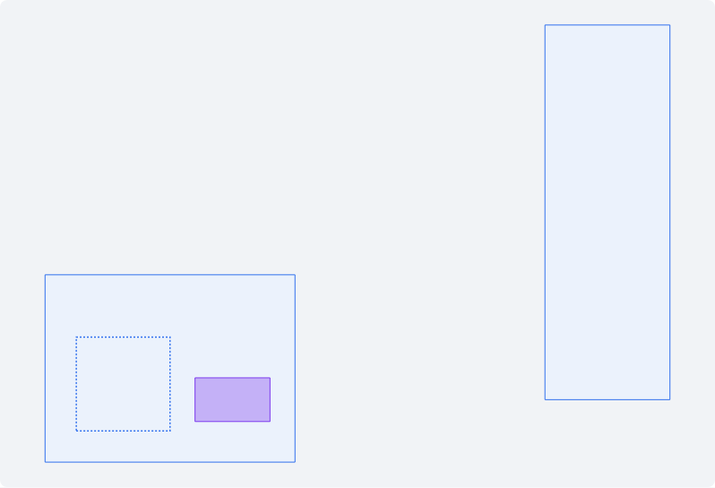

OE-OBJ-03 룸과 추가 공간 오브젝트를 3D Map 용으로 층 GeoJSON 에 내보낸다

Closes #(새 이슈 — sec 으로 옮길 때 "[후속 #45·#51] 룸·추가 공간 오브젝트 내보내기" 로 만든다)
Branch: feature/OE-OBJ-03-09-geojson-export
Ticket: docs/prd/features/E02-OBJ/OE-OBJ-03.md · docs/prd/features/E02-OBJ/OE-OBJ-09.md

## 요약

#45·#51 에서 룸과 추가 공간 오브젝트를 내보내기로 정해 주셔서, 두 가지를 층 GeoJSON 에 feature 로 내보내게 했습니다.
말씀해 주신 쓰임(3D Map 에서 보임, 탐색기·설비 위치로는 쓰지 않음)에 맞춰 TTL 에는 넣지 않았고, 설비 소속은 지금처럼 물리존입니다.

## 구현한 것

- **룸**: 층 GeoJSON 에 `kind: "room"` feature 로 내보냅니다.
  - geometry: 바닥 사각형(Polygon)
  - `spaceId`: 룸이 든 물리존 id
  - `areaM2`: 넓이
- **추가 공간 오브젝트**: `kind: "spaceObject"` feature 로 내보냅니다.
  - geometry: 바닥 사각형(Polygon). 놓은 자리가 가운데입니다
  - `size`: 가로·세로·높이(m), `height`: 높이
  - `item`·`itemName`: 라이브러리 항목 열쇠와 이름(예: `desk` · 책상). 사람이 넣은 모델은 `custom:…` 열쇠와 넣을 때 정한 이름입니다
- 두 feature 모두 `storeyId`·`elevation` 이 있어, 받는 쪽이 층 높이에 세워 그릴 수 있습니다.
- **TTL 에는 넣지 않았습니다.** TTL 은 탐색기 트리와 설비 위치(`brick:hasLocation`)를 만드는 쪽이라, 넣으면 물리존 아래 단계가 탐색기에 생깁니다. 아래 PM 확인 1번입니다.
- 내보낸 파일 뷰어(`viewer.html`)가 두 kind 를 평면에 그립니다(룸은 점선, 오브젝트는 보라색 상자). 받는 쪽 검사("TTL 에 없는 feature")는 두 kind 를 문제로 세지 않습니다.
- 결정과 이유는 ADR-0023 에 적었습니다(ADR-0023 확인 부탁드립니다). ADR-0016 의 "온톨로지로는 아직 내보내지 않는다" 를 이 결정이 바꿉니다.
- BIM→DT 문서(`docs/bim-to-dt-ontology.md`) 부록 C 에 두 kind 를 적었습니다.

## 화면

two-rooms.ifc 의 회의실 안에 룸 하나와 책상 하나를 놓고 내보낸 파일을 뷰어로 연 평면입니다. 왼쪽 아래 회의실 안의 점선이 룸, 보라색 상자가 책상입니다. GeoJSON 요약에는 "룸 1 · 추가 공간 오브젝트 1" 로 보이고 검사 다섯 개가 전부 0 입니다.

## 확인 방법

1. `src/lib/ifc/fixtures/two-rooms.ifc` 를 엽니다 → [편집] → 층 "1F만"
2. [룸 그리기] 로 회의실 안에 룸을 그리고, [오브젝트] → [책상] 으로 회의실 바닥에 책상을 놓습니다
3. [기하 내보내기 (GeoJSON)] 로 받은 `floor-1F.geojson` 에 `"kind": "room"` 과 `"kind": "spaceObject"`(`"itemName": "책상"`) feature 가 있습니다
4. [의미 내보내기 (Brick TTL)] 로 받은 `ontology.ttl` 에는 "룸 1"·"책상 1" 이 없습니다
5. `viewer.html` 에 두 파일을 함께 놓으면 평면에 점선 룸과 보라색 책상이 보이고, 검사가 전부 0 입니다

## 테스트

새 테스트는 **이번 수정 전에는 없던 동작**을 확인합니다.
- `src/lib/export/export.test.ts` (+1) — 룸 feature(사각형·`spaceId`·`areaM2`), 오브젝트 feature(놓은 자리가 가운데인 사각형·`size`·`height`·`item`·`itemName`), 받는 쪽 GeoJSON 검사 통과, TTL 에 두 id 가 없음, 설비 소속이 그대로임
- `e2e/viewer.spec.ts` (+1) — 화면에서 룸을 그리고 책상을 놓아 내보낸 GeoJSON 에 두 kind 가 있고 TTL 에는 없음, 뷰어 평면에 하나씩 그려지고 검사가 전부 0

기존 테스트는 고치지 않았습니다.

결과: `npm test` 823 통과 · `npx vue-tsc --noEmit` 통과 · e2e 전체 166 통과

## 남은 것

- 실제 모양(내장 항목의 조각 모델, 사람이 넣은 glb)은 넘기지 않습니다. 받는 쪽은 바닥 사각형을 `height` 만큼 세운 상자로 그리거나, `item` 으로 같은 모델을 찾아야 합니다. 아래 PM 확인 2번입니다.
- 3D 형상 내보내기(GLB·OBJ)에는 아직 두 가지가 없습니다.

## PM 확인 (`needs-pm`)

새 이슈에 코멘트로 올리고 `needs-pm` 라벨을 답니다.

> ## 룸·추가 공간 오브젝트 내보내기 — 판단이 필요합니다
>
> **요약**
> - #45·#51 답대로 룸과 추가 공간 오브젝트를 층 GeoJSON 에 내보내도록 개발했습니다(본 PR). 설비 소속은 지금처럼 물리존입니다.
> - 답에 적어 주신 쓰임(3D Map 에서 보임, 탐색기 조회·설비 위치 참조는 아님)에 맞춰 TTL 에는 넣지 않았습니다.
>
> **확인 대상 1 — TTL 에 넣을지**
> 1. GeoJSON 에만 내보낸다 (개발 권장, 지금 구현과 같음. 즉, 3D Map 에는 보이고 탐색기 트리에는 나타나지 않음.)
> 2. TTL 에도 넣는다 — 룸은 `brick:Room` 으로 물리존 아래(`brick:isPartOf`), 오브젝트는 새 클래스 (탐색기 트리에 물리존 아래 단계가 생기고, 오브젝트 클래스를 받는 쪽과 새로 맞춰야 합니다.)
>
> **확인 대상 2 — 3D 모델 파일을 넘길지**
> 1. 지금은 넘기지 않는다. 받는 쪽은 바닥 사각형과 높이로 상자를 그리거나, 라이브러리 항목 이름(`itemName`)으로 같은 모델을 갖고 그린다 (개발 권장, 지금 구현과 같음.)
> 2. 3D 형상 내보내기(GLB)에 오브젝트 모양을 함께 넣는다 (사람이 넣은 모델도 그대로 들어가 파일이 커질 수 있습니다.)
>
> 확인 부탁드립니다.
> 둘 다 1번인 경우에는 본 PR 을 Merge 하고,
> 2번이 있는 경우에도 본 PR 은 Merge 하고, 해당 내용은 신규 작업건으로 진행하겠습니다.
