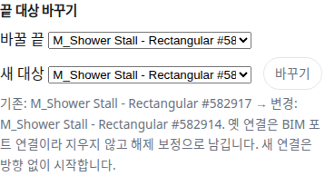

OE-PIP-10 배관 구간 끝의 연결 대상을 바꾸면 기존·변경 대상을 보이고, 옛 BIM 포트 연결은 해제 보정으로 남기며 그 끝을 새 대상으로 늘인다

Refs #191
Branch: feature/OE-PIP-10-retarget
Ticket: docs/prd/features/E13-PIP/OE-PIP-10.md · docs/prd/features/E13-PIP/OE-PIP-01.md

> 구간 삭제 영향 PR(OE-PIP-10) 다음에 merge 해 주세요. 같은 e2e 파일에 테스트를 더합니다.

## 요약

배관 형상 수정(OE-PIP-10)의 "끝점의 연결 대상 변경" 을 넣었습니다. 편집 모드에서 구간을 고르면 패널에 "끝 대상 바꾸기" 가 보입니다.
바꿀 끝과 새 대상을 고르면 기존·변경 대상과 옛 연결을 어떻게 처리하는지 먼저 보이고, [바꾸기] 로 연결과 형상을 함께 고칩니다.

## 구현한 것

- **끝 대상 바꾸기 칸**: 구간에 이어진 것(바꿀 끝, BIM 포트 연결이면 표시)과 새 대상(같은 층의 좌표 있는 설비·배관, 바꿀 끝의 지금 대상에서 가까운 순 30개)을 고릅니다.
- **미리보기**: "기존: A → 변경: B. 옛 연결은 BIM 포트 연결이라 지우지 않고 해제 보정으로 남깁니다. 새 연결은 방향 없이 시작합니다."
- **[바꾸기]**
  - 옛 연결: BIM 포트 연결이면 해제 보정합니다(원본·방향 보존, 사유 "끝 대상 바꾸기: A → B"). 사람이 이었거나 형상으로 이은 연결은 지웁니다
  - 새 연결: `manual`, 방향 없음
  - 형상: 옛 대상에 가까운 끝을 새 대상의 배치점으로 늘입니다(끝점 추종과 같은 장치). 형상이 없는 구간은 연결만 바꿉니다
- **막는 것**: 이음쇠(붙은 구간을 골라 바꿉니다), 이어지지 않은 끝, 같은 대상, 이미 이어진 대상, 해제 보정한 연결이 있는 대상(해제 보정 취소로 되살립니다), 좌표 없는 대상, 다른 층의 대상.
- 되돌리기(Ctrl+Z) 한 번에 연결·해제 보정·형상이 함께 돌아옵니다. 편집 파일에는 해제 보정·새 연결·끝 이동이 각각 지금 있는 줄로 남습니다.

## 수용 기준 대조

| 기준 | 결과 |
|---|---|
| 끝점의 연결 대상 변경 시 기존·변경 대상을 확인할 수 있고 BIM 원본 연결 변경은 해제 보정으로 처리된다 | **이 PR** |
| 해제된 연결은 형상 접촉이나 형상 재계산으로 자동 복원되지 않는다 | **이 PR** — 끝을 옛 대상 쪽으로 다시 옮겨도 연결은 다시 계산하지 않습니다 |
| 되돌리기와 저장·불러오기 후 형상·연결·보정 상태가 함께 복원된다 | **이 PR**(단위 테스트) |
| 꼭짓점 추가·삭제, 다중층 | 남음 |

## 화면

Duplex HVAC 의 배수관 #582951 에서 샤워 #582917 쪽 끝을 0.7m 옆의 샤워 #582914 로 바꾸기 전 미리보기입니다.

## 확인 방법

1. `data/NBU_Duplex/NBU_Duplex-Apt_Eng-HVAC.ifc` 를 엽니다 → [편집] → "설비 위치와 소속" 에서 `582951` 을 검색해 고릅니다
2. "끝 대상 바꾸기" 의 바꿀 끝 "M_Shower Stall - Rectangular #582917 (BIM 포트)", 새 대상 "M_Shower Stall - Rectangular #582914 · 0.7m" → 위 미리보기
3. [바꾸기] → 편집 막대 "… 끝 대상 M_Shower Stall - Rectangular #582917 → M_Shower Stall - Rectangular #582914", 패널에 "해제한 연결 1"
4. Ctrl+Z → 해제한 연결이 사라지고 바꿀 끝 목록에 #582917 (BIM 포트) 가 돌아옵니다

## 테스트

새 테스트는 **이번 수정 전에는 없던 동작**을 확인합니다.
- `src/lib/retarget.test.ts` (새 파일, 4)
  - BIM 포트 연결은 해제 보정(사유 포함)하고 새 대상과 `manual` 로 이음, 바꾼 끝만 새 대상 자리로 늘어남(경로로 확인)
  - 사람이 이은 연결은 해제 보정 없이 지움
  - 이음쇠 · 이어지지 않은 끝 · 같은 대상 · 이미 이어진 대상 · 좌표 없는 대상 · 다른 층은 막고 모델이 그대로
  - 한 번에 되돌리면 바꾸기 전과 같음, 편집 파일을 거쳐도 연결·해제 보정·경로가 같음
- `e2e/pipe-vertex.spec.ts` (+1) — 위 확인 방법 1~4

기존 테스트는 고치지 않았습니다.

결과: `npm test` 871 통과 · `npx vue-tsc --noEmit` 통과 · e2e 전체 183 통과 · `check:sample` 98 통과 · 4 건너뜀

## 남은 것

- 꼭짓점 추가·삭제(PM 과 의미를 맞춘 뒤), 다중층(OE-PIP-15)
- 새 대상 후보를 매체·계통으로 거르기(지금은 거리 순입니다. 연결 후보의 거름(OE-PIP-08)을 붙일 수 있습니다)
