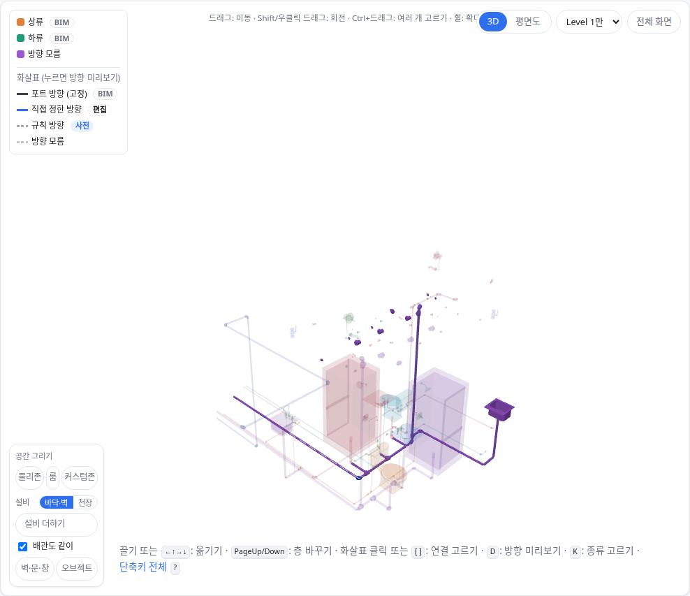
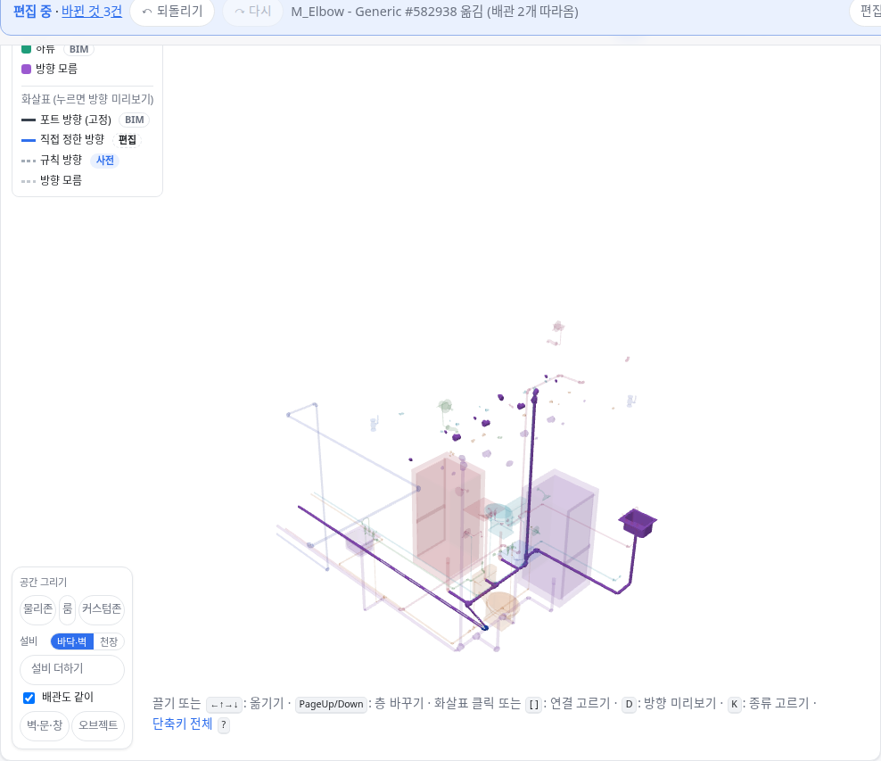

OE-PIP-10 배관의 꺾임 이음쇠를 꼭짓점으로 옮기면 양쪽 구간이 늘어나 따라오고, 설비에 붙은 끝점 이음쇠는 막는다

Refs #191
Branch: feature/OE-PIP-10-vertex-move
Ticket: docs/prd/features/E13-PIP/OE-PIP-10.md

## 요약

배관 형상 수정(OE-PIP-10)의 첫 단계로 꼭짓점 이동을 넣었습니다.
BIM 배관은 곧은 구간과 엘보·티 같은 이음쇠가 각각 설비 하나라서, 이음쇠를 배관의 꼭짓점으로 봅니다. 엘보를 옮기면 양쪽 구간의 엘보 쪽 끝이 늘어나 따라옵니다. 연결 대상과 방향은 바뀌지 않습니다.
꼭짓점 추가·삭제, 구간 삭제, 끝점 연결 대상 바꾸기, 다중층은 같은 모델 위에 다음 PR 로 얹습니다. 그래서 #191 은 닫지 않습니다.

## 구현한 것

- **꺾임 이음쇠 옮기기**: 이음쇠를 3D 에서 끌거나, 방향키나 표의 좌표로 옮기면 붙은 구간의 가까운 끝이 같이 갑니다.
  - 설비를 옮길 때 배관이 따라오는 장치(OE-PIP-12)를 그대로 씁니다. 그래서 고른 패널의 "옮기면 이음쇠 0개가 같이 가고 덕트·배관 2개가 늘어납니다" 미리보기, 되돌리기, 편집 파일이 같습니다
  - 위치만 바뀝니다. 연결 대상, 포트 방향, 확정한 규칙 방향은 그대로입니다
  - [배관도 같이] 를 끄면 이음쇠만 옮겨집니다
  - 티(분기)도 꼭짓점이라 옮길 수 있고, 붙은 구간 셋이 다 늘어납니다
- **끝점 이음쇠는 막음**: 공조기·수전 같은 설비에 바로 붙은 이음쇠는 배관의 끝점이라, 옮기면 설비와 떨어집니다. 옮기려 하면 제자리로 돌아가고 이렇게 알립니다: "M_Transition - Generic #643346은 Lavatory Faucet #643784에 바로 붙은 배관 끝점입니다. 끝점은 Lavatory Faucet #643784를 옮기면 따라옵니다."
- 구간은 통째로 옮기지 않습니다(지금과 같습니다). 구간은 두 꼭짓점 사이의 변이라 꼭짓점을 옮겨 고칩니다.
- 배관을 이렇게 본 이유와 실측은 ADR-0029 에 적었습니다(ADR-0029 확인 부탁드립니다).

**실제 BIM 에서 잰 값**

| | 이음쇠 | 옮길 수 있음 | 끝점이라 막음 | 구간 둘이 늘어남 | 계획 시간 |
|---|---|---|---|---|---|
| Duplex HVAC | 227 | 207 | 20 | 143 | 0.15ms |
| 병원 HVAC | 1,590 | 1,257 | 333 | 1,154 | 0.94ms |
| 성수 기계 | 7,990 | 7,776 | 214 | 5,788 | 9.45ms |

파일마다 꺾임 이음쇠 하나를 0.3m 옮겨 보았고, 셋 다 연결은 그대로였습니다.

## 수용 기준 대조

| 기준 | 결과 |
|---|---|
| 꼭짓점 이동·추가·삭제 후 경로·길이·높이가 갱신되고, 중간점 편집만으로 연결 대상이나 확정 방향이 바뀌지 않는다 | 이동은 **이 PR**. 추가·삭제는 남음 |
| 해제된 연결은 형상 접촉이나 형상 재계산으로 자동 복원되지 않는다 | **이 PR** — 옮겨도 연결을 다시 계산하지 않습니다 |
| 되돌리기와 저장·불러오기 후 형상·연결·보정 상태가 함께 복원된다 | 이동은 **이 PR**(단위 테스트) |
| 끝점의 연결 대상 변경 시 기존·변경 대상을 확인할 수 있다 | 남음 — 지금은 끝점 이음쇠를 막고 사유를 보입니다 |
| 열린 끝·점 부족·길이 0 인 경로는 미완료 또는 검증 위반으로 표시된다 | 남음 |
| 구간 삭제 영향이 표시되고 관련 없는 분기의 연결은 유지된다 | 남음 |
| 다중층 편집 모드에서도 같은 배관 편집 도구로 수정한다 | 남음(OE-PIP-15) |

## 화면

Duplex HVAC 의 엘보 #582938 을 x 로 0.6m 옮기기 전과 뒤입니다(가운데 아래). 양쪽 배관이 엘보를 따라 늘어났고, 편집 막대에 "M_Elbow - Generic #582938 옮김 (배관 2개 따라옴)" 이 남습니다.

## 확인 방법

1. `data/NBU_Duplex/NBU_Duplex-Apt_Eng-HVAC.ifc` 를 엽니다 → [편집] → "설비 위치와 소속" 을 펼칩니다
2. 검색에 `582938` → 엘보를 고릅니다. 패널에 "옮기면 이음쇠 0개가 같이 가고 덕트·배관 2개가 늘어납니다."
3. x 좌표에 0.3 을 더합니다 → 편집 막대에 "옮김 (배관 2개 따라옴)". 3D 에서 양쪽 배관이 늘어납니다
4. Ctrl+Z → 엘보와 배관이 제자리로 돌아옵니다
5. 검색에 `643346` → 수전에 붙은 이음쇠를 고르고 x 를 고칩니다 → "…배관 끝점입니다" 경고, 좌표는 그대로입니다

## 테스트

새 테스트는 **이번 수정 전에는 없던 동작**을 확인합니다.
- `src/lib/follow.test.ts` (+3)
  - 공조기—덕트—엘보—덕트—토출구에서 엘보를 옮기면 양쪽 덕트의 엘보 쪽 끝만 늘어나고 연결은 그대로, 되돌리면 연 때와 같음
  - 옮긴 꼭짓점이 편집 파일을 거쳐도 같음
  - 설비에 바로 붙은 이음쇠는 막는 문구, 구간은 따라올 것이 없음
- `e2e/pipe-vertex.spec.ts` (새 파일) — Duplex HVAC 에서 위 확인 방법 2·3·5

기존 테스트는 고치지 않았습니다. `follow.test.ts` 의 "도관을 직접 옮기면 아무것도 따라오지 않는다" 는 끝점 이음쇠(공조기에 붙은 엘보)라 그대로 통과합니다.

결과: `npm test` 854 통과 · `npx vue-tsc --noEmit` 통과 · e2e 전체 177 통과 · `check:sample` 98 통과 · 4 건너뜀 · `check:seongsu` 25 통과

## 남은 것

- 꼭짓점 추가(구간을 둘로 나눔)·삭제(꺾임 이음쇠를 지우고 양쪽 끝을 맞붙임)
- 구간 삭제와 그 영향 미리보기, 끝점의 연결 대상 바꾸기(OE-PIP-01·06), 열린 끝·길이 0 검증
- 다중층 편집(OE-PIP-15 · OE-ML-12~14)

## PM 확인 (`needs-pm`)

이슈 #191 에 코멘트로 올리고 `needs-pm` 라벨을 답니다.

> ## BIM 배관의 "폴리라인 꼭짓점" — 판단이 필요합니다
>
> **요약**
> - 배관 형상 수정 중 꼭짓점 이동을 본 PR 로 개발했습니다.
> - BIM 의 배관은 곧은 구간과 엘보·티 같은 이음쇠가 각각 하나의 객체입니다. 요구사항의 "배관 폴리라인" 을 분기·설비 사이의 구간·이음쇠 줄로, "꼭짓점" 을 이음쇠로 이해하고 구현했습니다. 가진 BIM 셋에서 이음쇠의 77~95% 가 두 구간 사이의 꺾임점입니다.
> - 설비에 바로 붙은 이음쇠는 배관의 끝점이라 옮기지 못하게 했습니다. 끝점은 설비를 옮기면 따라오고, 연결 대상 바꾸기는 다음 단계입니다.
>
> **확인 대상**
> 1. 꼭짓점 = 이음쇠로 본다 (개발 권장, 지금 구현과 같음. 즉, 엘보를 옮기면 양쪽 배관이 늘어나고 BIM 형상은 늘이기만 함.)
> 2. 배관 한 줄을 꼭짓점 좌표 목록으로 새로 만들어 고친다 (꼭짓점을 이음쇠와 상관없이 찍을 수 있지만, BIM 의 배관 형상을 버리고 다시 그립니다.)
>
> 확인 부탁드립니다.
> 1번인 경우에는 본 PR 을 Merge 하고,
> 2번인 경우에는 본 PR 은 Close 하고, 배관 모델을 새로 설계하여 다시 올리겠습니다.
