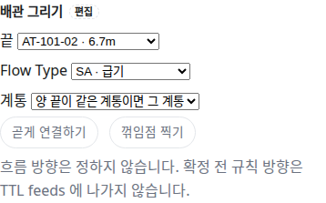
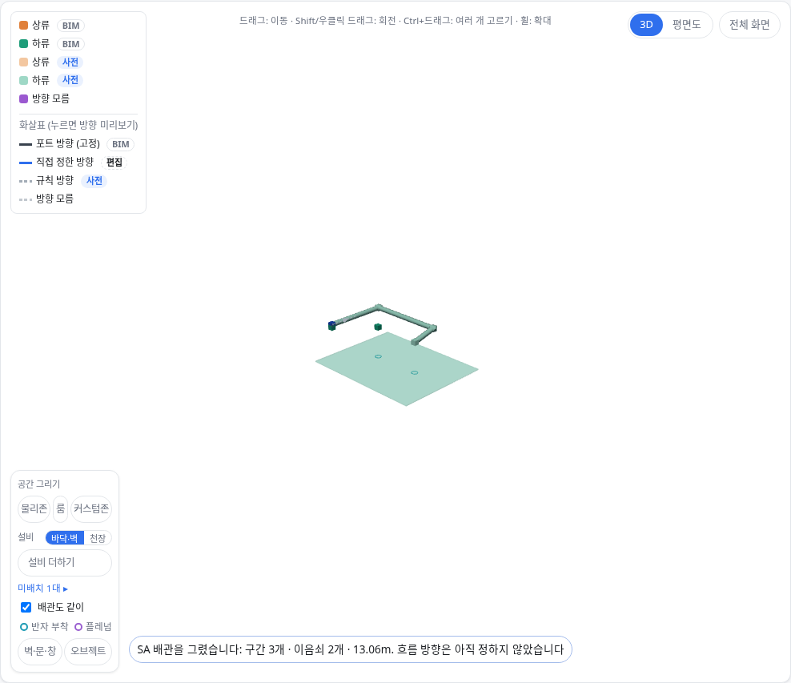

OE-PIP-11 고른 설비에서 끝 대상까지 배관을 곧게 잇거나 꺾임점을 찍어 그리고, Flow Type·계통을 고르며, 방향은 정하지 않는다

Refs #192
Branch: feature/OE-PIP-11-manual-pipe
Ticket: docs/prd/features/E13-PIP/OE-PIP-11.md · docs/prd/features/E02-OBJ/OE-OBJ-12.md

> 배관 경로 PR(OE-PIP-13) 다음에 merge 해 주세요. 그린 배관의 경로가 그 PR 의 `axis`·`segmentPath` 를 씁니다.

## 요약

설비 패널에 "배관 그리기" 칸을 넣었습니다. 끝 대상·Flow Type·계통을 고르고 [곧게 연결하기] 를 누르거나, [꺾임점 찍기] 로 바닥에 꺾일 자리를 찍고 Enter 를 누릅니다.
그린 배관은 BIM 배관과 같은 구간·이음쇠 사슬이라, 꼭짓점 옮기기·끝점 추종·GeoJSON 경로가 그대로 됩니다. 연결은 `manual` 이고 방향은 정하지 않습니다.
다중층(층간 배관)이 남아 #192 는 닫지 않습니다.

## 구현한 것

- **배관 그리기 칸**: 편집 모드에서 좌표가 있는 설비(또는 이음쇠)를 고르면 패널에 보입니다.
  - 끝: 같은 층의 좌표 있는 설비·배관, 가까운 순 40개(이름 · 거리)
  - Flow Type: 범례 19개(SA·RA·EA·OA·CHWS·CHWR·HWS·HWR·CWS·CWR·REF·DHWS·DHWR·DCW·FP·STM·CR·GWS·GWR). 범례에 없는 값으로는 만들지 않습니다
  - 계통: "양 끝이 같은 계통이면 그 계통" · "계통 없음" · 기존 계통. 양 끝 설비의 계통은 바꾸지 않습니다
  - [곧게 연결하기]: 두 설비를 구간 하나로 연결합니다
  - [꺾임점 찍기]: 시작 설비 높이의 수평면에 꺾일 자리를 찍고 Enter. 마지막 변은 끝 대상 높이로 기웁니다. Esc 로 취소하면 아무것도 남지 않습니다
- **만들어지는 것**: 변마다 구간(`SA 덕트 1` · `CHWS 배관 1`), 꺾인 자리마다 이음쇠(`SA 이음 2`). 공기는 `DuctSegment`·`DuctFitting`, 나머지는 `PipeSegment`·`PipeFitting` 입니다. 시작–구간–이음쇠–…–끝을 `manual` 연결로 잇습니다.
- **방향은 정하지 않습니다.** 그린 배관만으로는 TTL `feeds` 가 늘지 않습니다. 규칙 방향은 확정 전까지 화면에만 보입니다.
- **막는 것**: 범례에 없는 Flow Type, 시작과 끝이 같음, 좌표 없는 설비, 길이 0 인 구간(같은 자리를 두 번 찍음), 다른 층의 끝(다중층 뷰의 일), 없는 계통.
- 되돌리기(Ctrl+Z) 한 번에 그린 배관 전체가 연결·계통 자리와 함께 빠집니다. 편집 파일·층별 임시 저장본에도 남습니다(더한 설비 줄의 `conduit`).
- 3D 에는 단면 0.3m(덕트)·0.08m(배관)의 네모 관으로 그립니다. 보여 주기용이라 내보내지 않습니다.
- GeoJSON 의 그린 구간은 경로(`LineString`)와 `flowType` 을 갖습니다.
- 이렇게 둔 이유는 ADR-0031 에 적었습니다(ADR-0031 확인 부탁드립니다).

## 수용 기준 대조

| 기준 | 결과 |
|---|---|
| 다중층 편집 모드에서 같은 배관 그리기 도구로 층간 배관과 층별 분기를 작성할 수 있다 | 남음 — 다중층 뷰(OE-ML-01·OE-PIP-15)가 없습니다. 다른 층의 끝은 막고 그 사유를 보입니다 |
| 양 끝 연결 대상과 Flow Type·계통을 선택하면 배관 형상과 수동 연결이 생성된다 | **이 PR** |
| 같은 계통을 선택한 A·B 사이의 배관은 해당 계통에 속한다. 다른 기존 계통은 자동 병합되지 않고 무관한 매체의 소속은 유지된다 | **이 PR** — 양 끝 설비의 계통은 그대로입니다 |
| 생성 직후 수동 확정 방향은 미지정이고, 미확정 규칙 방향은 TTL feeds 에 출력되지 않는다 | **이 PR** |
| 설비와 연결되지 않은 열린 끝·유효하지 않은 좌표·길이 0 인 경로는 완료할 수 없고 취소 후 임시 객체가 남지 않는다 | **이 PR** — 끝 대상을 고르기 전에는 버튼이 꺼져 있어 열린 끝이 생기지 않습니다 |
| 생성·되돌리기·저장 복원 후 형상·연결·계통·방향 상태가 일치하며 해제 보정은 자동으로 취소되지 않는다 | **이 PR** — 새 구간·이음쇠끼리의 연결만 더하고 해제 보정은 건드리지 않습니다 |

## 화면

AHU-1 을 고른 패널의 배관 그리기 칸입니다.

AHU-1 에서 AT-101-02 까지 꺾임점 (1,6)·(7,6) 을 찍어 그린 SA 덕트입니다(구간 3개 · 이음쇠 2개 · 13.06m).

## 확인 방법

1. `src/lib/ifc/fixtures/mep.ifc` 를 엽니다 → [편집] → 설비 목록에서 AHU-1 을 고릅니다
2. 패널 "배관 그리기" 의 끝에서 "AT-101-02 · 6.7m", Flow Type "SA · 급기" → [곧게 연결하기] → "SA 배관을 그렸습니다: 구간 1개 · 이음쇠 0개 · 6.73m", 설비 목록에 "SA 덕트 1"
3. AHU-1 의 x 를 2 로 고칩니다 → 편집 막대에 "AHU-1 옮김 (배관 1개 따라옴)". 그린 덕트가 늘어납니다
4. Ctrl+Z 두 번 → 공조기가 제자리로, 그린 덕트가 통째로 빠집니다
5. 다시 AHU-1 → 끝 AT-101-02 → [꺾임점 찍기] → 바닥에 한 점 찍고 Enter → "구간 2개 · 이음쇠 1개"
6. [TTL] 을 받아 AHU-1 블록의 `brick:feeds` 가 그리기 전과 같은지 봅니다(방향을 정하지 않았으므로)

## 테스트

새 테스트는 **이번 수정 전에는 없던 동작**을 확인합니다.
- `src/lib/manual-pipe.test.ts` (새 파일, 5)
  - 꼭짓점마다 이음쇠, 변마다 구간, `manual` 연결 사슬, 길이, 경로(LineString)·`flowType`, 양 끝이 같은 계통이면 그 계통
  - 그린 배관만으로는 TTL `feeds` 가 늘지 않음
  - 범례에 없는 Flow Type · 같은 대상 · 좌표 없는 설비 · 길이 0 · 없는 계통은 막고 모델이 그대로
  - 계통 없음을 고르면 계통에 넣지 않고 양 끝 계통은 그대로
  - 편집 파일을 거쳐도 TTL·GeoJSON 이 같음, 한 번 되돌리면 그리기 전과 같음
- `e2e/manual-pipe.spec.ts` (새 파일, 2) — 위 확인 방법 1~5, Flow Type 범례 19개와 좌표 없는 설비가 끝 목록에 없음

기존 테스트는 고치지 않았습니다.

결과: `npm test` 863 통과 · `npx vue-tsc --noEmit` 통과 · e2e 전체 181 통과 · `check:sample` 98 통과 · 4 건너뜀 · `check:seongsu` 25 통과

## 남은 것

- 층간 배관과 층별 분기(OE-PIP-15 · OE-ML-12~14), 다른 배관의 중간(분기점)에 잇기(티 넣기)
- 이 칸에서 새 수동 계통 만들기(지금은 패널의 계통 칸에서 만든 뒤 고릅니다)
- Flow Type 별 색(OE-OBJ-12 · OE-ML-15)

## PM 확인 (`needs-pm`)

이슈 #192 에 코멘트로 올리고 `needs-pm` 라벨을 답니다.

> ## BIM 배관의 Flow Type — 판단이 필요합니다
>
> **요약**
> - 수동 배관 그리기를 본 PR 로 개발했습니다. 그린 배관은 범례의 Flow Type(SA·CHWS 등 19개) 중 하나를 꼭 가집니다.
> - BIM 에서 읽은 배관에는 Flow Type 을 붙이지 않았습니다. BIM 배관은 지금 계통(이름·종류)으로 가릅니다. 계통 이름만으로는 냉수 공급과 환수를 가르지 못하는 경우가 많아, 추정으로 붙이면 틀린 값이 섞입니다.
>
> **확인 대상**
> 1. Flow Type 은 그린 배관에만 둔다 (개발 권장, 지금 구현과 같음. 즉, BIM 배관의 흐름 구분은 계통 종류로 함.)
> 2. BIM 배관에도 Flow Type 을 붙인다 (계통 이름·종류로 추정하고 사람이 고치는 칸을 둡니다. 후속 이슈로 작업합니다.)
>
> 확인 부탁드립니다.
> 1번인 경우에는 본 PR 을 Merge 하고,
> 2번인 경우에는 본 PR 은 Merge 하고, BIM 배관의 Flow Type 은 후속 이슈로 작업하겠습니다.
