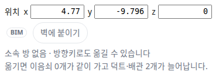
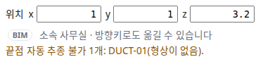

OE-PIP-12 설비를 옮길 때 분기 이음쇠는 두고 따라올 배관을 미리 보이며, 형상이 없어 따라오지 못하는 배관은 사유를 보인다

Closes #193
Branch: feature/OE-PIP-12-follow-branches
Ticket: docs/prd/features/E13-PIP/OE-PIP-12.md

## 요약

설비를 옮기면 붙은 배관이 따라오는 기능(PRD #13)은 이미 있었습니다. 수용 기준과 비교해 빠진 두 가지를 더했습니다.
다른 분기에도 이어진 이음쇠는 옮기지 않고 사유를 보이며, 형상이 없어 끝점을 옮길 수 없는 배관도 사유를 보입니다. 무엇이 따라오는지는 옮기기 전에 고른 설비 패널에서 보입니다.

## 구현한 것

- **분기 이음쇠는 옮기지 않습니다.** 아래 이음쇠는 같이 옮기지 않고, 그 너머의 배관도 따라오지 않습니다. 이 PR 전에는 3단계 안의 이음쇠를 전부 같이 옮겨서, 티(분기)에 걸린 다른 분기의 배관까지 끌려올 수 있었습니다.
  - 셋 이상과 이어진 이음쇠(티·크로스)
  - 옮기는 설비가 아닌 다른 설비에도 바로 붙은 이음쇠
- **끝점 자동 추종 불가 사유를 보입니다.** 아래 배관은 늘이지 않고, 임의 좌표도 만들지 않습니다. 이 PR 전에는 사유 없이 건너뛰었습니다.
  - 형상이 없어 구간의 축을 모르는 덕트·배관(사유 "형상이 없음")
  - 좌표가 없는 덕트·배관·이음쇠(사유 "좌표가 없음")
- **고른 설비 패널의 위치 줄 아래에 미리보기를 둡니다.** [배관도 같이] 가 켜져 있을 때만 보입니다.
  - 따라오는 배관이 있으면: "옮기면 이음쇠 n개가 같이 가고 덕트·배관 n개가 늘어납니다."
  - 분기 이음쇠·추종 불가가 있으면 경고색으로: "다른 분기에도 이어진 이음쇠 n개(이름)는 옮기지 않습니다. 배관 형상을 확인하세요." / "끝점 자동 추종 불가 n개: 이름(형상이 없음)."
- 옮긴 뒤 경고 칸에는 띄우지 않습니다. 방향키를 누를 때마다 같은 경고가 남아 다른 안내(층 완료가 풀렸다는 알림 등)를 가렸기 때문입니다. 패널의 미리보기는 옮긴 뒤에도 그대로 보입니다.
- 결과는 지금처럼 3D·GeoJSON·편집 파일의 좌표와 구간 끝(`ends`)에 남습니다. 새로 남는 값은 없습니다.

가진 BIM 에서 분기 이음쇠가 끌려가던 경우는 없었습니다(2026-10-09 실측, 설비를 옮기면 이음쇠가 같이 가는 경우 Duplex HVAC 20개 · 병원 HVAC 333개 중 0개). 형상이 없는 덕트에 붙은 설비는 `mep.ifc` 에 3대 있습니다.

## 수용 기준 대조

| 기준 | 결과 |
|---|---|
| 설비 이동 후 연결된 배관의 해당 끝점은 연결점을 따라가고 반대쪽 끝점은 유지된다 | 이미 반영(`follow.test.ts` "이음쇠는 같이 옮기고 구간은 가까운 끝만 늘인다") |
| 바로 붙은 이음쇠의 영향이 표시되고, 공유 분기점이나 무관한 설비는 무조건 이동하지 않는다 | **이 PR** — 패널 미리보기, 분기 이음쇠는 옮기지 않음. 무관한 설비는 이미 따라오지 않음 |
| 사용자가 연결 해제한 BIM 배관 연결의 배관 끝점은 추종하지 않는다 | 이미 반영(#384 에서 해제한 연결은 연결 목록에서 빠짐) + 시험을 더함 |
| 필요한 좌표가 없으면 자동 추종 불가 사유가 표시되고 좌표가 임의로 생성되지 않는다 | **이 PR** |
| 이동 후 연결·형상 위반을 확인할 수 있고, 기존 연결 대상과 흐름 방향은 위치 이동만으로 변경되지 않는다 | 위반은 이미 반영(완전성 검사 "덕트·배관 구간과 이음쇠가 양쪽 모두 이어져 있다"). 연결 불변은 시험을 더함 |
| 되돌리기와 저장·불러오기 후 설비·배관·이음쇠 및 보정 상태가 함께 복원된다 | 이미 반영(`follow.test.ts` "되돌리면 …", "편집 파일을 거쳐도 …") |

## 화면

Duplex HVAC 의 대변기(#582915)를 고른 패널입니다. 급수·배수 배관 두 개가 따라온다고 미리 보입니다.

mep.ifc 의 AHU-1 을 고른 패널입니다. 붙은 덕트에 형상이 없어 끝점을 옮길 수 없다는 사유가 경고색으로 보입니다.

## 확인 방법

1. `data/NBU_Duplex/NBU_Duplex-Apt_Eng-HVAC.ifc` 를 엽니다 → [편집] → 설비 목록 검색에 `582915` → 대변기를 고릅니다
2. 위치 줄 아래 "옮기면 이음쇠 0개가 같이 가고 덕트·배관 2개가 늘어납니다." 가 보입니다. 방향키로 옮기면 3D 에서 두 배관의 대변기 쪽 끝이 따라옵니다
3. `src/lib/ifc/fixtures/mep.ifc` 를 엽니다 → [편집] → AHU-1 을 고릅니다
4. "끝점 자동 추종 불가 1개: DUCT-01(형상이 없음)." 이 경고색으로 보입니다. 표에서 AHU-1 의 x 를 3 으로 바꿔도 DUCT-01 좌표는 그대로입니다
5. 왼쪽 도구의 [배관도 같이] 를 끄면 미리보기가 사라집니다

## 테스트

새 테스트는 **이번 수정 전에는 없던 동작**을 확인합니다.
- `src/lib/follow.test.ts` (+4)
  - 다른 분기에도 붙은 이음쇠(티)는 옮기지 않고 그 너머도 따라가지 않음
  - 다른 설비에 바로 붙은 이음쇠는 옮기지 않음
  - 형상이 없는 구간·좌표가 없는 도관은 "자동 추종 불가" 사유로 돌려주고 좌표를 만들지 않음
  - 해제 보정한 BIM 연결의 배관은 따라오지 않음(`releaseConnection` 으로 해제)
  - 기존 시험에 "위치만 바뀌고 연결 대상·방향은 그대로" 를 더함
- `e2e/follow-preview.spec.ts` (2) — mep.ifc 의 추종 불가 사유·덕트 좌표 그대로·[배관도 같이] 를 끄면 숨김, Duplex HVAC 대변기의 미리보기(파일이 없으면 이유를 찍고 건너뜀)

기존 테스트를 고친 것: `follow.test.ts` 의 계획 비교 셋에 새 칸(`held: []`, `blocked: []`)을 더했습니다. 계획에 칸이 늘어 피할 수 없는 수정입니다.

결과: `npm test` 827 통과 · `npx vue-tsc --noEmit` 통과 · e2e 전체 168 통과 · `check:sample` 97 통과 · 4 건너뜀

## 남은 것

- 분기 이음쇠를 옮기지 않은 뒤의 배관 형상 보정은 배관 형상 수정(OE-PIP-10, #191, 아직 개발 전)에서 할 예정입니다.
- 끄는 중(드래그)에는 미리보기를 따로 그리지 않습니다. 놓으면 지금처럼 3D 에서 따라온 배관이 보입니다.
