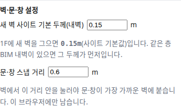

OE-SPC-12 새 벽의 사이트 기본 내벽 두께를 처음부터 0.15m 로 두고, 비우면 0.2m 로 긋는다

Closes #408
Branch: feature/OE-SPC-12-site-wall-default
Ticket: docs/prd/features/E09-SPC/OE-SPC-12.md

## 요약

OE-SPC-12 의 사이트 기본값이 "내벽 150 / 외벽 300mm" 로 정해져, 사이트 기본 내벽 두께 칸의 처음 값을 0.15m 로 두었습니다.
이전(#380)에는 이 칸이 비어 있다가 사람이 넣어야 해서, 설정을 손대지 않은 브라우저에서는 BIM 내벽이 없는 층의 새 벽이 0.2m 로 그어졌습니다.

## 구현한 것

- [벽·문·창] 을 켜면 보이는 "벽·문·창 설정" 의 칸 이름을 "새 벽 사이트 기본 두께(내벽)" 로 바꾸고, 처음 값을 **0.15m** 로 두었습니다.
- 새 벽 두께를 정하는 순서는 그대로입니다: 같은 층 BIM 내벽 두께의 최빈값 → 사이트 기본 내벽 두께 → 0.2m.
- 칸을 비우면 비운 상태가 이 브라우저에 남고, 그때 새 벽은 0.2m 입니다(수용 기준 "둘 다 없으면 0.2m").
- 이전 버전에서 저장된 설정은 이렇게 읽습니다. 이전에는 처음 값이 없어 "비어 있음" 이 "아직 정하지 않음" 이었기 때문입니다.
  - 숫자가 저장되어 있으면 그 숫자를 그대로 씁니다
  - 비어 있으면 0.15m 로 읽습니다
- 값은 이전과 같이 이 브라우저(localStorage)에만 남습니다. TTL·GeoJSON 에는 그은 벽의 두께만 들어갑니다.

## 수용 기준 대조

| 기준 | 결과 |
|---|---|
| BIM 내벽 최빈 두께가 0.24m 인 층에서 새 벽을 그으면 두께 0.24m 로 생긴다 | 이미 반영(#380, `wall-defaults.test.ts`) |
| BIM 벽이 없고 사이트 기본값이 0.15m 인 층에서 새 벽을 그으면 0.15m 로 생긴다 | 이미 반영(#380). 이제 설정을 손대지 않아도 0.15m 입니다(**이 PR**) |
| 둘 다 없으면 0.2m 로 생긴다 | 이미 반영(#380). 칸을 비운 경우로 시험을 더함(**이 PR**) |
| 병원 방 368개의 외곽선이 벽 편집 뒤에도 바뀌지 않는다(회귀) | 이미 반영(`check:sample` 병원 건축) |

## 화면

mep.ifc(벽이 없는 파일)를 열고 [편집] → [벽·문·창] 을 켠 화면입니다. 처음 값 0.15m 가 들어 있고, 1F 에 새 벽을 그으면 0.15m(사이트 기본값)라고 보입니다.

## 확인 방법

1. 처음 쓰는 브라우저(또는 개발자 도구에서 localStorage 의 `oe-element-settings` 를 지운 상태)에서 `src/lib/ifc/fixtures/mep.ifc` 를 엽니다
2. [편집] → [벽·문·창] → "새 벽 사이트 기본 두께(내벽)" 가 `0.15` 이고, 아래에 "1F에 새 벽을 그으면 0.15m(사이트 기본값)" 이 보입니다
3. [벽 긋기] 로 사무실 안에 벽을 그으면 패널의 두께가 0.15 입니다
4. 칸을 비우고 Enter → "0.2m(기본값)". 새로고침해도 비어 있습니다

## 테스트

새 테스트는 **이번 수정 전에는 없던 동작**을 확인합니다.
- `src/lib/wall-defaults.test.ts` (+1) — 사이트 기본 내벽 두께의 처음 값 0.15m, BIM 벽 없는 층의 새 벽 0.15m(사이트 기본값)
- `e2e/wall-defaults.spec.ts` (+1) — 비운 칸이 새로고침 뒤에도 비어 있고 0.2m, 이전 모양으로 저장된 설정(비어 있음 → 0.15m, 0.18 → 0.18)

기존 테스트를 고친 것: `e2e/wall-defaults.spec.ts` 의 첫 시험이 처음 값을 0.2m(기본값)로 보던 것을 0.15m(사이트 기본값)로 바꾸고, 비우면 0.2m 가 되는 단계를 더했습니다. 처음 값이 바뀌어 피할 수 없는 수정입니다.

결과: `npm test` 822 통과 · `npx vue-tsc --noEmit` 통과 · e2e 전체 165 통과

## 남은 것

- 외벽 기본 두께(300mm) 칸은 두지 않았습니다. 아래 PM 확인을 기다립니다.

## PM 확인 (`needs-pm`)

이슈 #408 에 코멘트로 올리고 `needs-pm` 라벨을 답니다.

> ## 사이트 기본값의 외벽 300mm — 판단이 필요합니다
>
> **요약**
> - 사이트 기본 내벽 두께의 처음 값을 0.15m 로 두었습니다(본 PR).
> - 층 편집 화면에서 새로 긋는 벽은 내벽입니다. 외벽 형상은 외벽 에디터([OE-EXT-03](https://github.sec.samsung.net/IoT-Solution/bim-to-dt-ontology/blob/main/docs/prd/features/E17-EXT/OE-EXT-03.md), 아직 개발 전)에서 고치고, 층 편집 화면에서는 잠겨 있습니다(#374).
> - 그래서 외벽 300mm 는 R1 층 편집에서 쓰이는 곳이 없습니다. 같은 설정을 쓰는 [OE-IDF-10](https://github.sec.samsung.net/IoT-Solution/bim-to-dt-ontology/blob/main/docs/prd/features/E04-IDF/OE-IDF-10.md)(IDF 벽 두께, R2)에서 처음 쓰입니다.
>
> **확인 대상**
> 1. 외벽 기본 두께 칸은 쓰는 곳(OE-IDF-10 · OE-EXT-03)이 개발될 때 같이 둔다 (개발 권장, 지금 구현과 같음. 즉, 지금 설정에는 내벽 칸만 보임.)
> 2. 지금 외벽 칸도 두고 300mm 를 넣어 둔다 (쓰이는 곳이 없는 설정이 화면에 먼저 보입니다.)
>
> 확인 부탁드립니다.
> 1번인 경우에는 본 PR 을 Merge 하고,
> 2번인 경우에는 본 PR 에 외벽 칸을 추가 작업하겠습니다.
