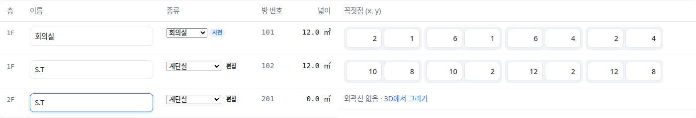

OE-SPC-17 같은 공간명의 방을 한 번에 같은 종류로 정하고, 영문 방 이름 넷을 사전에 더해 성수 방 종류 판정을 31% 에서 33% 로 올린다

Closes #150
Branch: feature/OE-SPC-17-room-kind-by-name
Ticket: docs/prd/features/E09-SPC/OE-SPC-17.md

## 요약

방 종류를 사람이 정할 수 있게 하고, 같은 공간명의 방(모든 층)에 한 번에 붙게 했습니다. 이 PR 전에는 방 종류를 바꾸는 방법이 이름을 고치는 것뿐이었습니다.
이름 사전에는 뜻이 분명한 영문 이름 넷만 더했습니다. 성수 방 종류 판정은 159/508(31.3%)에서 169/508(33.3%)이 됐습니다. 약어(S.T·P.S 등)는 아래 PM 확인을 기다립니다.

## 구현한 것

- **방 종류 고르기**: 편집 모드에서 아래 두 곳의 "종류" 칸이 고르는 상자가 됩니다.
  - 물리존 패널
  - 아래 "물리존 이름·경계" 표
- **같은 공간명은 한 번에**: 고르면 공간명이 같은 방 전부(모든 층)에 붙고, 패널에 "공간명이 같은 방 n개(모든 층)에 함께 적용됩니다" 가 보입니다. 되돌리기는 한 번입니다.
- **출처 표시**: 사람이 정한 종류는 출처가 "편집" 입니다. 이름을 고쳐도 그대로이고, [이름으로 정하기] 를 고르면 이름 사전으로 돌아갑니다. 사전이 읽은 종류는 지금처럼 "사전", OmniClass 로 읽은 종류는 "BIM" 입니다.
- **고를 수 있는 값**: "모름" 을 고르면 사전이 잘못 읽은 종류를 지운 것으로 남습니다(`brick:Room`). 사전이 읽는 값과 같은 종류를 고르면 편집으로 남지 않습니다.
- **어디에 남나**
  - TTL: 방의 Brick 클래스가 바뀝니다
  - 편집 파일: 물리존 줄에 `kind` 로 남습니다
  - 리포트: "공간명 S.T 2개: 방 종류 모름 → 계단실 (Brick 클래스)" 처럼 공간명·바뀌기 전 종류마다 한 줄입니다
- **이름 사전에 더한 것**(성수 건축에서 사전이 모르던 영문 이름): `Air Handling Unit Room`·`MECH.` → 기계실, `CORR.` → 복도, `UPS Room` → 전기실.
  `MECH.` 는 이름이 정확히 그것일 때만 받습니다(`MECH. PENTHOUSE` 처럼 OmniClass 로 읽던 이름은 그대로 BIM 출처).
- 결정과 이유는 ADR-0024 에 적었습니다(ADR-0024 확인 부탁드립니다).

### 가진 BIM 에서 바뀐 방 종류(2026-10-09 실측)

| 파일 | 방 | 종류를 아는 방(전 → 후) |
|---|---|---|
| 성수 건축 | 508 | 159 → **169** |
| AC20 · Institute · dental · Office · Duplex 건축 · 병원 건축 · 병원 HVAC · ifc4Mep | — | 그대로(0·8·173·56·4·173·116·0) |

성수에서 바뀐 방은 11개입니다. 10개는 "모름" 이던 방이 종류를 얻은 것입니다(기계실 8, 전기실 1, 복도 1). 1개(`Toilet CORR.`)는 화장실 → 복도입니다. 이름의 마지막 낱말을 종류로 읽는 기존 규칙(`계단 앞 복도` → 복도)과 같은 판정입니다.

## 수용 기준 대조

| 기준 | 결과 |
|---|---|
| 성수의 방 종류 판정률이 31% 보다 높아진다 | **이 PR** — 31.3% → 33.3%(`check:sample` 의 성수 기준선을 159 → 169 로 올림) |
| 같은 공간명의 방을 한 번에 같은 종류로 바꿀 수 있다 | **이 PR** |

## 화면

two-rooms.ifc 의 복도(1F)와 창고(2F)의 공간명을 `S.T` 로 바꾸고, 복도의 종류를 계단실로 고른 표입니다. 두 층의 S.T 가 함께 계단실이 되고 출처가 "편집" 입니다.

같은 편집의 리포트입니다. 바뀌기 전 종류(모름·창고)마다 한 줄입니다.

## 확인 방법

1. `src/lib/ifc/fixtures/two-rooms.ifc` 를 엽니다 → [편집] → 아래 "물리존 이름·경계" 표를 펼칩니다
2. 102·201 의 이름을 `S.T` 로 바꿉니다. 종류 칸은 102 "모름", 201 "창고"(OmniClass, BIM) 입니다
3. 102 의 종류에서 "계단실" → 102·201 이 함께 계단실, 출처 "편집". 리포트에 두 줄이 생깁니다
4. Ctrl+Z 한 번 → 둘 다 돌아옵니다. Ctrl+Shift+Z 뒤 201 에서 [이름으로 정하기] → 둘 다 사전 판정(모름·창고)으로 돌아옵니다
5. `data/성수/Factorial_건축.ifc` 를 열면 `Air Handling Unit Room` 7개가 기계실(사전)로 보입니다

## 테스트

새 테스트는 **이번 수정 전에는 없던 동작**을 확인합니다.
- `src/lib/space-kind.test.ts` (5)
  - 같은 공간명은 층이 달라도 한 묶음이고, 공간명이 비면 그 방 하나
  - 한 번에 바꾸면 TTL Brick 클래스가 바뀌고 되돌리면 한 번에 돌아옴
  - 사람이 정한 종류는 이름을 고쳐도 그대로이고, [이름으로 정하기] 는 사전으로
  - 사전과 같은 값은 편집으로 남지 않고, "모름" 은 사전이 읽은 것을 지움, 없는 종류는 거절
  - 편집 파일·층별 조각을 거쳐도 같은 종류(만든 물리존 포함)
- `e2e/space-kind.spec.ts` — 표에서 같은 공간명 두 방을 한 번에, 리포트 두 줄, Ctrl+Z 한 번, [이름으로 정하기]
- `scripts/check-sample.test.ts` — 성수 방 종류 기준선 159 → 169

기존 테스트를 고친 것: `e2e/edit-3d.spec.ts` 의 "편집 모드에서 바닥을 누르면 물리존이 골라지고 …" 가 패널의 종류 글자("사무실 사전")를 보던 것을 고른 값("이름으로 정하기(사무실)")으로 바꿨습니다. 편집 모드의 종류 칸이 고르는 상자가 되어 피할 수 없는 수정입니다.

결과: `npm test` 833 통과 · `npx vue-tsc --noEmit` 통과 · e2e 전체 169 통과 · `check:sample` 97 통과 · 4 건너뜀 · `check:seongsu` 25 통과

## 남은 것

- 약어 방 이름(S.T·P.S·O.A·E.A·P.S/A.V)과 판단이 갈리는 영문 이름(Vestibule 등)은 사전에 넣지 않았습니다. 아래 PM 확인을 기다립니다.

## PM 확인 (`needs-pm`)

이슈 #150 에 코멘트로 올리고 `needs-pm` 라벨을 답니다.

> ## 성수 약어 방 이름의 종류 — 판단이 필요합니다
>
> **요약**
> - 같은 공간명의 방을 한 번에 같은 종류로 정하는 기능과, 뜻이 분명한 영문 이름 넷(공조실·기계실·복도·UPS실)의 사전 보강을 본 PR 로 개발했습니다. 성수 방 종류 판정은 31.3% → 33.3% 입니다.
> - 티켓에 "약어 방 이름(S.T·P.S 등)은 사용자가 확인한 뒤 사전에 보강한다" 고 되어 있어, 아래 이름은 사전에 넣지 않았습니다. 뜻을 알려 주시면 사전에 넣겠습니다.
>
> | 성수 공간명 | 방 수 | 개발 추정(확인 필요) |
> |---|---|---|
> | S.T | 95 | 모름 |
> | P.S | 77 | 배관 샤프트(Pipe Shaft) |
> | O.A · E.A | 16 · 15 | 외기·배기 덕트 샤프트 |
> | P.S/A.V | 15 | 배관 샤프트와 AV 공간 |
> | Vestibule-1·-2 등 | 32 | 전실(계단·승강기 앞) |
> | Condenser Unit · Business Facility · Parking · RETAIL 등 | 7 · 7 · 3 · 2 | 실외기실 · 업무시설 · 주차장 · 판매시설 |
>
> 지금 방 종류 목록(화장실·회의실·휴게실·사무실·계단실·승강로·로비·기계실·전기실·통신실·전산실·창고·청소도구실·복도)에는 샤프트·전실·주차장·판매시설이 없습니다.
>
> **확인 대상**
> 1. 위 표의 뜻을 알려 주시면, 지금 방 종류 목록에 맞는 것만 사전에 넣는다 (개발 권장. 즉, 목록에 없는 샤프트·전실 등은 사람이 이 PR 의 일괄 수정으로 정하거나 "모름" 으로 남음.)
> 2. 방 종류 목록에 샤프트·전실·주차장 등을 더하고 사전에도 넣는다 (Brick 1.4 에 해당 클래스가 있는지 확인한 뒤 더할 예정입니다. 없으면 `brick:Room` 으로 내보내고 종류는 따로 적어야 합니다.)
>
> 확인 부탁드립니다.
> 1번인 경우에는 본 PR 을 Merge 하고, 사전 보강은 답에 따라 신규 작업건으로 진행하겠습니다.
> 2번인 경우에도 본 PR 은 Merge 하고, 방 종류 목록 추가를 신규 작업건으로 진행하겠습니다.
