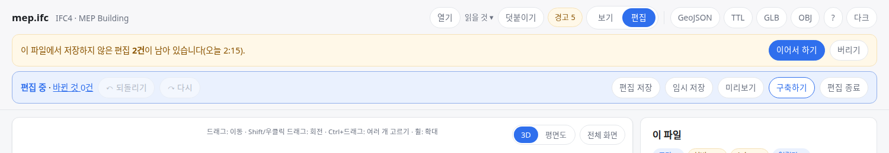

OE-WF-06 임포트 뒤 보정하고 닫았다가 같은 파일을 다시 열어 이어서 하면 내보내는 TTL·GeoJSON 이 닫기 전과 같다는 것을 시험으로 남긴다

Closes #205
Branch: test/OE-WF-06-import-draft
Ticket: docs/prd/features/E14-WF/OE-WF-06.md

## 요약

OE-WF-06 의 수용 기준을 지금 동작과 비교했습니다. 같은 파일을 다시 열면 [이어서 하기] 로 보정이 돌아오는 것은 이미 있어(층별 임시 저장본, ADR-0014), 내보내는 결과가 닫기 전과 같은지 재는 시험을 더했습니다. 코드는 바꾸지 않았습니다.
파일을 다시 고르지 않고 이어서 하려면 임포트 결과 자체를 보관해야 해서, 아래 PM 확인을 붙였습니다.

> 이 시험은 방 종류 고르기(OE-SPC-17 PR)를 씁니다. 그 PR 다음에 merge 해 주세요.

## 수용 기준 대조

| 기준 | 결과 |
|---|---|
| 임포트 뒤 에디터를 닫았다 다시 열면 임포트 결과와 보정 내용이 그대로 있다 | 같은 IFC 를 다시 열면 충족 — **이 PR** 의 시험. 임포트 결과는 같은 파일에서 같은 결과가 나오고(임포터는 같은 입력에 같은 출력), 보정은 층별 임시 저장본에서 [이어서 하기] 로 돌아옵니다. 파일을 다시 고르지 않는 경우는 아래 PM 확인 |

지금 동작
- 편집은 멈추고 잠시 뒤 브라우저에 자동으로 남습니다(층마다 하나, ADR-0014).
- 같은 파일을 다시 열면 "이 파일에서 저장하지 않은 편집 n건이 남아 있습니다" 와 [이어서 하기]·[버리기] 가 뜹니다.
- 55 의 8084 에서는 `data/` 목록에서 파일을 누르면 다시 열립니다. 파일을 따로 갖고 있지 않아도 됩니다.

## 화면

보정한 탭을 닫고 같은 파일을 다시 연 화면입니다. 남은 편집 2건과 [이어서 하기] 가 보입니다.

## 확인 방법

1. `src/lib/ifc/fixtures/mep.ifc` 를 엽니다 → [편집] → AHU-1 의 x 를 50 으로, 물리존 101 의 이름을 "대회의실" 로, 종류를 "창고" 로
2. [의미 내보내기 (Brick TTL)]·[기하 내보내기 (GeoJSON)] 로 내려받아 둡니다
3. 탭을 닫고 새 탭에서 같은 파일을 엽니다 → [이어서 하기]
4. 다시 내려받은 TTL·GeoJSON 이 2번과 같습니다

## 테스트

- `e2e/import-draft.spec.ts` — 보정 셋(설비 옮기기·물리존 이름·방 종류) 뒤 탭을 닫고 같은 파일을 다시 열어 이어서 하면 `ontology.ttl`·`floor-*.geojson` 이 글자 하나까지 같음. 보정이 실제로 들어 있는지도 봄(라벨 "대회의실", `brick:Storage_Room`)
- 기존 `e2e/autosave.spec.ts` 가 남는 것·이어서 하기·버리기를 이미 봅니다

기존 테스트는 고치지 않았습니다.

결과: `npx playwright test e2e/import-draft.spec.ts e2e/autosave.spec.ts` 통과

## 남은 것

- 파일을 다시 고르지 않고 이어서 하는 것은 하지 않았습니다. 아래 PM 확인을 기다립니다.

## PM 확인 (`needs-pm`)

이슈 #205 에 코멘트로 올리고 `needs-pm` 라벨을 답니다.

> ## "닫았다 다시 열면" 의 범위 — 판단이 필요합니다
>
> **요약**
> - 같은 IFC 파일을 다시 열면 임포트 결과와 보정 내용이 그대로 돌아옵니다(본 PR 의 시험). 55 의 8084 에서는 `data/` 목록에서 파일을 누르면 됩니다.
> - 파일을 다시 고르지 않고도 이어서 하려면 임포트 결과를 어딘가에 보관해야 합니다. 실측(2026-10-09)한 크기는 아래와 같습니다.
>
> | 파일 | IFC | 모델(설비·방·연결) | 3D 형상 |
> |---|---|---|---|
> | 병원 건축 | 18MB | 0.8MB | 5.9MB |
> | 성수 건축 | 84MB | 1.5MB | 141MB |
> | 성수 기계 | 203MB | 10.7MB | 162MB |
> | 병원 MEP | 207MB | 9.1MB | 326MB |
>
> 모델만은 브라우저에 둘 수 있지만, 3D 형상까지 두기에는 큽니다. 서버에 둘지(PRD 1.7)는 아직 정해지지 않았습니다.
>
> **확인 대상**
> 1. 같은 파일을 다시 열면(8084 에서는 목록에서 누르면) 이어서 하는 지금 동작으로 충족한 것으로 본다 (개발 권장, 지금 구현과 같음.)
> 2. 파일 없이 이어서 하도록 임포트 결과를 서버에 보관한다 (서버 저장 위치 PRD 1.7 이 정해진 뒤 가능합니다.)
>
> 확인 부탁드립니다.
> 1번인 경우에는 본 PR 을 Merge 하고,
> 2번인 경우에도 본 PR 은 Merge 하고, 보관 작업은 PRD 1.7 결정 뒤 신규 작업건으로 진행하겠습니다.
