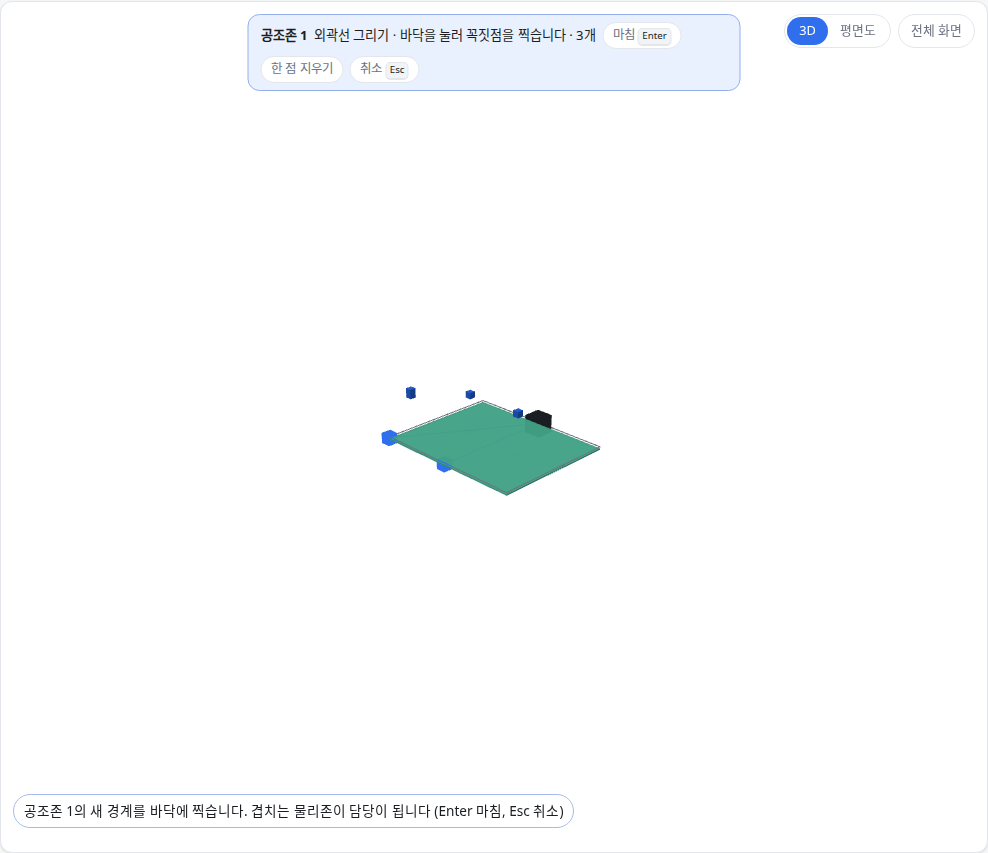

OE-ZON-04 공조존 경계를 다시 그려 고치고, 새 경계와 겹치는 물리존을 담당으로 다시 잰다

Closes #154
Branch: feature/OE-ZON-04-zone-outline
Ticket: docs/prd/features/E10-ZON/OE-ZON-04.md

> 공조존 검증 PR(OE-ZON-05) 위에 쌓은 PR 입니다. 그 PR 다음에 merge 해 주세요.

## 요약

공조존 한 줄에 [경계 다시 그리기] 를 넣었습니다. 새 경계를 찍으면 넓이와 담당 물리존, 담당 몫을 새 경계로 다시 잽니다.
OE-ZON-04 의 다섯 편집(경계 다각형 · 담당 설비 · 담당 물리존 · 생성 · 삭제)이 이 PR 로 모두 갖춰집니다.

## 구현한 것

- **[경계 다시 그리기]**: 공조존 한 줄의 버튼입니다. 바닥에 꼭짓점을 찍고 Enter 로 마칩니다. Esc 로 취소합니다.
  - 새 경계와 0.05㎡ 넘게 겹치는 물리존이 담당이 되고, 몫(%)도 새로 잽니다
  - 물리존을 골라 만든 공조존도 다시 그리면 그린 공조존이 됩니다. 담당 목록을 두면 바닥과 담당이 어긋나기 때문입니다
  - 담당 설비와 이름은 그대로입니다
  - 겹치는 물리존이 없거나 변이 엇갈리면 막고, 공조존은 그대로 둡니다
- 되돌리기(Ctrl+Z)와 리포트("공조존 1 경계")에 듭니다. TTL·GeoJSON·편집 파일에는 새 경계와 새 담당이 남습니다.
- 꼭짓점 손잡이 대신 다시 그리기를 고른 이유는 ADR-0027 에 적었습니다(ADR-0027 확인 부탁드립니다).

## 수용 기준 대조

| 기준 | 결과 |
|---|---|
| 경계 다각형을 고친다 (요구사항) | **이 PR** — 다시 그리기. 아래 PM 확인 |
| 담당 설비 · 담당 물리존을 고친다, 새로 만들거나 지운다 (요구사항) | 수동 공조존 PR(OE-ZON-01·02)·공조존 검증 PR(OE-ZON-05)에서 반영 |
| 공조존을 지우면 그 물리존에 Z-01 경고가 뜬다 | 공조존 검증 PR(OE-ZON-05)에서 반영 |
| 담당 설비를 바꾸면 계통도 서비스 영역이 바뀐다 | 수동 공조존 PR(OE-ZON-01·02)에서 반영(TTL `feeds`) |
| 각 동작 뒤 물리존↔공조존 매핑을 갱신한다 (요구사항) | **이 PR** — 다시 그리면 담당을 새로 잽니다 |

## 화면

사무실(80㎡)을 골라 만든 공조존 1 의 경계를 사무실 왼쪽 반으로 다시 그리는 중입니다.

다시 그린 뒤입니다. 넓이가 40.0㎡ 가 되고 담당이 "사무실 50%" 로 바뀌었습니다.

## 확인 방법

1. `src/lib/ifc/fixtures/mep.ifc` 를 엽니다 → [편집] → "공조존" 을 펼칩니다
2. "사무실" 을 체크하고 [고른 물리존으로 만들기] → "공조존 1 · 사무실 × · 80.0㎡"
3. 공조존 1 의 [경계 다시 그리기] → 바닥에 (0,0)·(5,0)·(5,8)·(0,8) 을 찍고 Enter → "40.0㎡", "사무실 50% ×"
4. Ctrl+Z → "80.0㎡", "사무실 ×" 로 돌아옵니다
5. 다시 [경계 다시 그리기] 로 건물 밖 빈 바닥을 그립니다 → "경계와 겹치는 물리존이 없습니다" 로 막힙니다

## 테스트

새 테스트는 **이번 수정 전에는 없던 동작**을 확인합니다.
- `src/lib/hvac-zone.test.ts` (+2)
  - 골라 만든 공조존을 사무실과 창고에 걸쳐 다시 그리면 그린 공조존이 되고 담당·몫(20%·47%)·넓이·TTL `hasPart` 가 바뀜, 되돌리면 TTL 이 그 전과 같음
  - 겹치는 물리존 없음 · 변 엇갈림은 막고 경계를 두며, 다시 그린 경계가 편집 파일을 거쳐도 같음
- `e2e/hvac-zone.spec.ts` (+1) — [경계 다시 그리기] 로 사무실 반을 그리면 40.0㎡ · 사무실 50%, Ctrl+Z 로 돌아옴

기존 테스트는 고치지 않았습니다.

결과: `npm test` 848 통과 · `npx vue-tsc --noEmit` 통과 · e2e 전체 174 통과 · `check:sample` 98 통과 · 4 건너뜀

## 남은 것

- 담당 설비에서 흐름으로 닿는 말단의 물리존을 후보로 보이고, 다르면 경고(OE-MAP-02)
- Z-03 용량 초과와 그 입력값(OE-ZON-06)
- 설비 패널에서 담당 공조존을 고르는 길(OE-ZON-01)

## PM 확인 (`needs-pm`)

이슈 #154 에 코멘트로 올리고 `needs-pm` 라벨을 답니다.

> ## 공조존 "경계 다각형 편집" 의 방식 — 판단이 필요합니다
>
> **요약**
> - 공조존 경계 고치기를 본 PR 로 개발했습니다.
> - 요구사항 "경계 다각형을 고친다" 를, 경계를 처음부터 다시 그리는 것으로 이해하고 구현했습니다. 다시 그리면 새 경계와 겹치는 물리존이 담당이 됩니다.
> - 물리존처럼 꼭짓점 손잡이를 끌어 고치는 방식은 넣지 않았습니다.
>
> **확인 대상**
> 1. 다시 그리기로 충분하다 (개발 권장, 지금 구현과 같음. 즉, 꼭짓점 하나만 옮기려 해도 경계 전체를 다시 찍음.)
> 2. 물리존처럼 꼭짓점 손잡이로도 고칠 수 있어야 한다 (꼭짓점 하나씩 옮기기 · 넣기 · 지우기. 3D · 평면도 · 키보드 편집을 공조존에도 열어야 합니다.)
>
> 확인 부탁드립니다.
> 1번인 경우에는 본 PR 을 Merge 하고,
> 2번인 경우에는 본 PR 은 Merge 하고, 손잡이 편집은 후속 이슈로 작업하겠습니다.
