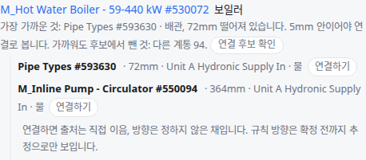

OE-PIP-08 연결 후보의 [잇기] 를 [연결하기] 로 바꿔 연결 도구 용어를 PRD 에 맞춘다

Refs #411
Branch: fix/OE-PIP-08-connect-wording
Ticket: docs/prd/features/E13-PIP/OE-PIP-08.md · docs/prd/features/E13-PIP/OE-PIP-01.md

## 요약

#411 이 연결 도구의 PRD 용어를 "잇기·끊기" 에서 "연결하기·연결 끊기" 로 맞췄습니다(OE-PIP-01·06·08, UI-04, glossary). 설비 패널의 [연결하기]·[연결 끊기] 는 이미 그 말이고, 완전성 검사의 연결 후보 목록에만 [잇기] 가 남아 있어 바꿨습니다.

## 구현한 것

- 연결 후보 목록의 버튼: [잇기] → [연결하기] (OE-PIP-08 "[연결 후보 확인 후 연결하기]")
- 목록 아래 안내: "잇으면 출처는 직접 이음, …" → "연결하면 출처는 직접 이음, 방향은 정하지 않은 채입니다. …"
- 출처 이름 "직접 이음"(`manual`)은 다른 화면·리포트에서도 쓰는 용어라 그대로 두었습니다.
- 수동 배관의 [곧게 잇기] 는 아직 sec 에 올리지 않은 수동 배관 PR(OE-PIP-11)에서 [곧게 연결하기] 로 고쳤습니다.

## 수용 기준 대조

| 기준 | 결과 |
|---|---|
| 실제 연결 누락에는 [연결 후보 확인 후 연결하기]를 제공한다 (OE-PIP-08 요구사항 문구) | **이 PR** — 버튼 이름 |

## 화면

Duplex HVAC 의 보일러 #530072 연결 후보 목록입니다.

## 확인 방법

1. `data/NBU_Duplex/NBU_Duplex-Apt_Eng-HVAC.ifc` 를 엽니다 → "완전성 검사" 의 "공기·물이 흐르는 기기가 연결망에 붙어 있다" 를 누릅니다
2. 보일러 #530072 의 [연결 후보 확인] → 후보마다 [연결하기], 아래 안내가 "연결하면 출처는 직접 이음, …"

## 테스트

기존 테스트를 고친 것: `e2e/connect-candidates.spec.ts` 가 안내 문구를 견주어 "연결하면" 으로 바꿨습니다. 버튼은 `data-testid` 로 누르므로 그대로입니다.

결과: `npm test` 876 통과 · `npx vue-tsc --noEmit` 통과 · e2e 전체 185 통과

## 남은 것

- 없음
