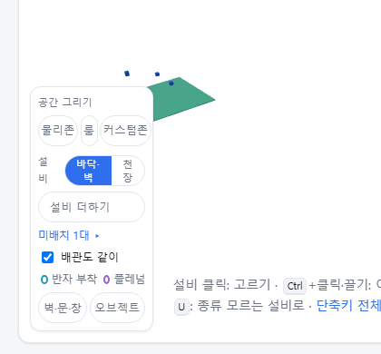
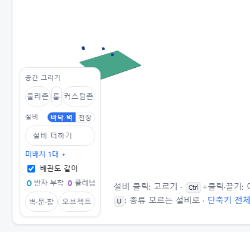

test: 편집 도구 상자의 [바닥·벽 | 천장] 줄과 물리존·룸·커스텀존 줄이 Windows 글꼴에서 꺾이지 않게 해, 3D 바닥을 누르는 e2e 두 개를 다시 돌게 한다

Branch: test/palette-width-windows

## 요약

Windows(Segoe UI·맑은 고딕)에서 3D 왼쪽 아래 편집 도구 상자의 "설비 [바닥·벽 | 천장]" 줄이 두 줄로 꺾여 상자가 17px 높아졌습니다. 작은 fixture(`mep.ifc`)에서는 그 상자가 건물 바닥 모서리를 덮어, 바닥을 누르는 e2e 두 개가 상자를 눌러 실패했습니다.
토글과 줄 간격의 여백만 줄여 한 줄에 넣었습니다. 상자 폭(8.5rem)은 그대로입니다.

## 구현한 것

- `src/styles.css`
  - `.palette-head-row`: 꺾지 않고(`white-space: nowrap`) 간격 0.4 → 0.3rem
  - `.ceiling-toggle button`: 좌우 여백 0.45 → 0.3rem. 토글 폭 87 → 79px
  - `.palette-row`(물리존·룸·커스텀존): 간격 0.15 → 0.06rem, 단추 좌우 여백 0.15 → 0.1rem. 셋의 폭이 125px 로 상자 안쪽(118px)을 넘던 것이 118px
- 결과: `mep.ifc` 편집 모드, 1280×720 에서 상자 높이 270 → 252px, 위 끝 y 425 → 443. 시험이 누르는 바닥 점 (0,0)·(2,2) 는 y 434·435 입니다.
- 화면 표시만 바뀝니다. 모델·내보내기와 관계없습니다.

## 화면

고치기 전입니다. "설비" 와 [바닥·벽 | 천장] 이 두 줄로 꺾이고 상자가 바닥 왼쪽 모서리를 덮습니다.

고친 뒤입니다. 한 줄에 들어가고 상자가 그만큼 낮아졌습니다.

## 확인 방법

1. Windows 에서 창을 1280×720 쯤으로 두고 `src/lib/ifc/fixtures/mep.ifc` 를 엽니다 → [편집]
2. 왼쪽 아래 도구 상자의 "설비" 줄이 한 줄이고, [커스텀존] 단추가 상자 오른쪽 테두리 안에 있습니다

## 테스트

새 테스트는 없습니다. 실패하던 두 시험이 다시 통과합니다.
- `e2e/edit-3d.spec.ts` "편집 모드에서 바닥을 누르면 물리존이 골라지고, 꼭짓점을 끌면 넓이와 소속이 바뀐다" — (0,0) 꼭짓점 끌기가 상자를 눌렀습니다
- `e2e/edit-structure.spec.ts` "설비를 바닥에 더하고, 이름을 고치고, 지우고, Ctrl+Z 로 하나씩 되돌린다" — (2,2) 바닥 누르기가 상자를 눌렀습니다

결과: `npm test` 898 통과 · `npx vue-tsc --noEmit` 통과 · e2e 전체 188 통과(이 브랜치의 OE-ML-05 시험 포함) · 1 건너뜀

## 남은 것

- 상자는 여전히 작은 파일에서 건물 왼쪽 아래 일부를 가립니다. 3D 가 처음 건물을 맞출 때 상자 자리를 비워 두면 근본적으로 풀리지만, 시점 맞추기 전체에 걸리는 일이라 이번에는 하지 않았습니다.
